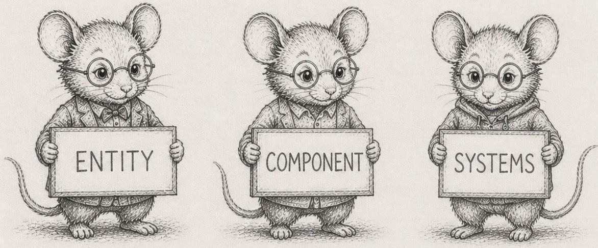
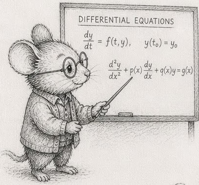
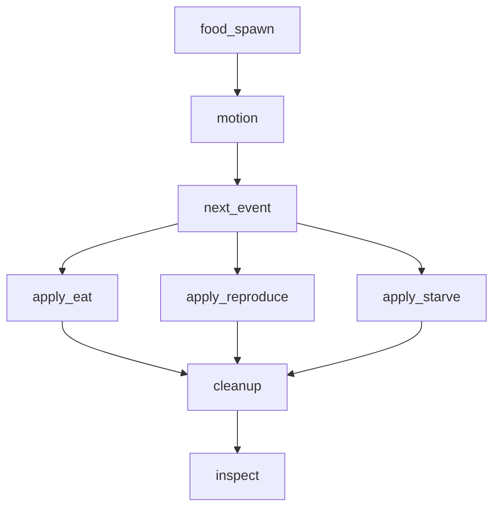

# An Introduction to Programming, using ECS & EBP in Python

**Read it online: [Codeberg](https://root-11.codeberg.page/intro-book-python/) · [GitHub Pages](https://root-11.github.io/intro-book-python/)**

A book that teaches programming from first principles of data-oriented design, entity-component-systems (ECS), and existence-based processing (EBP). Uses Python and `numpy` as the only languages.

The through-line is a small ecosystem simulator built in stages from one hundred wandering creatures to a hundred million streamed ones. Forty-four sections; two-to-three pages of prose plus four-to-twelve compounding exercises each.

This is the **Python edition** — a sister volume to the [Rust edition](https://root-11.codeberg.page/intro-book/) of the same book. Same forty-four sections, same DAG, same simulator. The variation is per-chapter commentary on what Python's defaults push the reader into, and why ECS and EBP win even in a slow language.

Found something wrong, unclear, or worth adding? [Open an issue.](https://codeberg.org/root-11/intro-book-python/issues)

<!-- BOOK_BEGIN -->

<!-- This block is generated by build.py — do not edit by hand. -->

_written by [Bjorn Madsen](mailto:dr.bjorn.madsen@gmail.com)_
_updated: 2026-05-09_

> **Read online:** [Codeberg](https://root-11.codeberg.page/intro-book-python/) · [GitHub Pages](https://root-11.github.io/intro-book-python/)
>
> **Clone source:** `git clone https://codeberg.org/root-11/intro-book-python.git` · `git clone https://github.com/root-11/intro-book-python.git`
>
> **Issues:** [Codeberg](https://codeberg.org/root-11/intro-book-python/issues) · [GitHub](https://github.com/root-11/intro-book-python/issues)

<p align="center"></p>

This book teaches programming from first principles of data-oriented design, entity-component-systems (ECS), and existence-based processing (EBP). It uses Python and `numpy` as the only languages.

The book is structured around forty-three concepts ([the DAG](concepts/dag.md)) and their canonical wording ([the glossary](concepts/glossary.md)). Sections are short — two to three pages of prose followed by four to twelve compounding exercises. Concepts are *named* only after they are *built*: every section earns its vocabulary through working code, not the other way around.

The through-line is a small ecosystem simulator built in stages from one hundred wandering creatures to a hundred million streamed ones. The simulator's specification is at [`code/sim/SPEC`](code/sim/SPEC.md).

This is the **Python edition** — a sister volume to the Rust edition of the same book. Same forty-four sections, same DAG, same simulator. The variation is per-chapter commentary on what Python's defaults push the reader into, and why ECS and EBP win even in a slow language. The thesis the edition carries: **ECS and EBP beat OOP because they process more efficiently (operations grouped over arrays), they extend more cleanly (data-oriented composition over class graphs), and they have smaller memory footprint (typed columns over object graphs).**

What carries this edition is the **evidence**. Every load-bearing claim is backed by a measurement the reader can reproduce on their own laptop in under a minute. The exhibits live in [`code/measurement/`](https://codeberg.org/root-11/intro-book-python/src/branch/main/code/measurement) and run via `uv run code/measurement/<file>.py`.

This is a work in progress. Section ordering is by the DAG; reading order can be linear (front to back) or by following the cross-links wherever they lead.

## Who this book is for

You used Python last week. You wrote a class, put instances in a list, iterated over them. Your code worked, but it was slower than you expected, and you have started wondering whether the standard idioms are the bottleneck.

This book is for people who want to find out. The premise is that they are — and that the architecture this book teaches is what Python is fast in, when Python is fast at all.

Many online books include a playground that runs the code in your browser. This one does not, on purpose: the measurements only mean something when they come from *your* hardware.

## Background

You should be comfortable with high-school algebra and a command line — running a command, changing directories, reading error messages without panic. A laptop with internet is enough; the book uses Python 3.11+, `numpy`, and `uv` for environment management. Everything else is standard library.

You do *not* need prior expertise in numerics, parallel computing, or game development. The book teaches numpy and the simulator together; the language is a vehicle, not the subject.

## A first taste

Before any vocabulary is named, here is what an ECS world looks like in fifteen lines of Python. One hundred creatures, each with a position and a velocity, moving for thirty ticks of simulated time. No classes, no instances, no method calls — four `numpy` arrays indexed in lockstep, and a function (the per-tick update) that advances every creature in one stride.

```python
import numpy as np

n = 100
x  = np.arange(n, dtype=np.float32) * 0.1
y  = np.sin(np.arange(n, dtype=np.float32))
vx = ((np.arange(n) * 7) % 11).astype(np.float32) * 0.01 - 0.05
vy = ((np.arange(n) * 13) % 7).astype(np.float32) * 0.01 - 0.03

for tick in range(30):
    x += vx
    y += vy
    if tick % 10 == 0:
        print(f"tick {tick}: creature 17 at ({x[17]:.2f}, {y[17]:.2f})")
```

Run it locally. Three lines print, the script stops. That is the entire shape of what the rest of the book grows: tables (the four arrays), a tick (the outer loop), a system (the per-tick update). Everything that follows is the discipline that lets this same shape carry a hundred million creatures without falling apart.

The familiar Python shape — a `Creature` class, a list of instances, a `step()` method — works at this size too. It stops working at a million, and the reason is in [§2](book/trunk/02_numbers_and_how_they_fit.md): an order of magnitude more memory per creature, an order of magnitude slower per tick. The book teaches the layout that survives the next zero.

## Running the code

Python has no equivalent of the Rust Playground — there is no browser-hosted runner that reproduces the numbers a chapter quotes. Every measurement and exhibit in this book runs locally, using [`uv`](https://docs.astral.sh/uv/) to manage the Python toolchain and environment. To run anything, you will want a clone of the book's repo:

```sh
git clone https://codeberg.org/root-11/intro-book-python.git
cd intro-book-python
uv run code/measurement/cache_cliffs.py
```

Each `code/measurement/<name>.py` file is one exercise group, runnable in isolation. The numbers it prints are *yours* — they come from your hardware. The exercise asks "how fast does *your* machine run this?", and that question only has a real answer locally.

From the simulator chapters onward (§11+), the exercises stop being self-contained scripts. They build the through-line: a Python program that grows from one hundred wandering creatures to a hundred million streamed ones. That program holds state between runs, which is what `uv run` and the project layout buy you.

## The companion edition

If you already know Python well and want compile-time enforcement of the discipline this book teaches by convention, the [Rust edition](https://root-11.codeberg.page/intro-book/) covers the same forty-four sections in Rust. The architecture is identical; the language differs. Many readers find that watching the borrow checker enforce in Rust what this edition asks for as discipline is a useful calibration in the other direction too.


# Nomenclature

Quick reference for symbols, notation, and abbreviations the book uses. Concept *definitions* live in the [glossary](concepts/glossary.md); this page covers the shorthand only.

## Symbols

| Symbol | Meaning |
|---|---|
| §N | Section number — e.g., §5 refers to section 5. |
| → | Leads to / becomes / transitions to. Appears in section titles (e.g., §29 "10K → 1M") and prose. |
| `[!NOTE]` / `[!TIP]` / `[!WARNING]` | Callout box — content the reader should pay particular attention to. |

## Text formatting

| Form | Meaning |
|---|---|
| `monospace` | Code: types, variable names, function names, file paths. |
| *italic* | First definition of a term, or emphasis. |
| **bold** | A term being highlighted as load-bearing in the current paragraph. |
| `# anti-pattern: bad!` | A code comment that flags the snippet as something the chapter is arguing *against*. The label travels with the code if a reader copy-pastes. |

## Variables you will see across chapters

| Variable | Meaning |
|---|---|
| `i`, `j` | Index into a column. `i` is the index of the row currently under discussion. |
| `t` or `tick` | Tick number — the simulator's step counter. |
| `id` | Stable entity identifier (a small unsigned integer; usually `np.uint32`). |
| `gen` | Generation counter, paired with a slot index to detect stale references (§10). |
| `pos_x`, `pos_y` | Position columns of a creature (`np.float32`). |
| `vel_x`, `vel_y` | Velocity columns of a creature (`np.float32`). |
| `to_remove`, `to_insert` | Buffers of pending mutations applied at end-of-tick (§22). |
| `n_active` | Length of the live prefix of a fixed-capacity column (§21, §24). |

## Python types and their numpy counterparts

This book uses numpy's typed dtypes for hot data. The mapping the reader will see most often:

| Python | numpy | size | range |
|---|---|---|---|
| `int` (CPython, ≤ 2³⁰) | — | 28 bytes | unbounded |
| — | `np.int8`  | 1 byte | -128 to 127 |
| — | `np.uint8` | 1 byte | 0 to 255 |
| — | `np.int32` | 4 bytes | ±2¹ |
| — | `np.uint32` | 4 bytes | 0 to 2³² |
| — | `np.int64` | 8 bytes | ±2⁶³ |
| `float` (CPython) | `np.float64` | 8 bytes (CPython has 24-byte object overhead) | ~15 decimal digits |
| — | `np.float32` | 4 bytes | ~7 decimal digits |
| — | `np.bool_` | 1 byte (in arrays) | True / False |

## Conventions for code blocks

| Form | Convention |
|---|---|
| Plain triple-backtick `python` | A snippet to read; not necessarily complete. |
| Snippet with `# anti-pattern: bad!` first line | A snippet shown as the *wrong* way; the chapter is about the right way. |
| `uv run code/measurement/<file>.py` | A measurement exhibit the reader can run on their machine. The numbers in the chapter were measured the same way. |


# 1 — The machine model

<p align="center"></p>

Most explanations of "how a computer works" use a diagram with a CPU and a single big block called *memory*. The diagram is wrong. Memory is many things at different speeds, and which one your data sits in decides whether your program is fast or slow.

Inside the CPU there is **L1 cache** — small, sometimes only 32 KB per core, but a read from it costs about one nanosecond. Around it sits **L2** — a few hundred KB, around 3-4 ns. Then **L3** — measured in megabytes, around 10 ns. Outside the CPU sits **main memory (RAM)** — gigabytes, around 100 ns per read. The numbers vary by chip; the *ratios* are stable. L1 is roughly a hundred times faster than RAM.

When your code reads `arr[17]`, the CPU does not pull just byte 17. It pulls a whole 64-byte chunk — a *cache line* — and keeps that line in L1. The next read of `arr[18]` is then almost free. Reading sequentially is fast because every line that gets loaded is mostly used before it gets evicted. Reading at random is slow because every read costs a fresh trip to RAM.

A pointer is an address in memory. Following one is one memory read at an address the CPU does not get to predict. If the address is in cache, the read is fast; if not, you wait the full ~100 ns. A program with many objects and many pointers between them is a program with many of those waits.

## Why you have not had to think about this

If you used Python last week, none of the above came up. The interpreter ran your code, the operating system handed it memory, and *it worked*. You felt no cliff at 100 KB or 100 MB. You wrote a `for` loop, the loop ran, and the cost per element was whatever it was.

That experience is real, and it is hiding the machine from you. The cost of one iteration of a Python `for` loop — `PyObject_Add`, the refcount increment, the `PyLong` boxing, the bytecode dispatch — is around 5 nanoseconds per element on this machine. That number is *higher* than an L3 cache miss. So when you iterate over a Python list, the cache hierarchy is invisible to you: you spend so long in the interpreter on every step that whether the next byte was in L1 or had to come from RAM is rounding error.

This is the missing piece of the machine model in Python. The hierarchy is still there; the bottleneck just moved. To *see* the machine, you have to look in places where the interpreter dispatch isn't dominating. Two such places, both measurable on your laptop:

**1. Sum a million int64s, three ways.** [`code/measurement/cache_cliffs.py`](https://github.com/root-11/intro-book-python/blob/main/code/measurement/cache_cliffs.py) walks N from 10K to 100M and times: `sum(lst)` on a Python list, `arr.sum()` on a contiguous numpy array, and `arr[idx].sum()` where `idx` is a shuffled permutation. On this machine:

| N           | Python list | numpy seq | numpy gather | gather/seq |
|------------:|------------:|----------:|-------------:|-----------:|
|      10,000 |    4.85 ns  |  0.54 ns  |   1.47 ns    |    2.7×    |
|     100,000 |    4.60 ns  |  0.18 ns  |   2.88 ns    |   16.4×    |
|   1,000,000 |    4.60 ns  |  0.21 ns  |   3.51 ns    |   17.0×    |
|  10,000,000 |    4.62 ns  |  0.19 ns  |  10.33 ns    |   53.7×    |
| 100,000,000 |    4.60 ns  |  0.16 ns  |  11.80 ns    |   72.2×    |

Read the columns. The Python list is **flat at ~4.6 ns/element across five orders of magnitude**. From inside the interpreter the cache hierarchy does not exist. The numpy sequential column is 25-30× faster and reveals the bandwidth — the inner loop is C, the bytes are typed, the prefetcher works. The numpy gather column is the same data accessed in a shuffled order; once the working set leaves L1 (between 10K and 100K), the per-element cost climbs, and by 100M the gap to sequential is **72×**. That ratio is the L1-to-RAM cost gap on this machine, measured.

**2. Take an exception once vs a million times.** [`code/measurement/try_except.py`](https://github.com/root-11/intro-book-python/blob/main/code/measurement/try_except.py) compares `try/except ZeroDivisionError` against an explicit `if value != 0` check, across hit rates from 0.0001% to 99.9999%. At 50/50 the `try/except` form is 4× slower; at 99.9999% (almost no exceptions raised) the `try/except` form is *faster* than the `if`. The difference is the CPU's branch predictor: a taken branch with high frequency is essentially free; a mispredicted one costs ~10-20 cycles. The lesson is not "use try/except" or "use if" — it is that constant factors are rate-dependent, and even Python inherits this.

**3. Constant factors leak through.** [`code/measurement/string_methods.py`](https://github.com/root-11/intro-book-python/blob/main/code/measurement/string_methods.py) compares `%`-format, f-strings, and `.format` for the same output. On this machine `%`-format is ~20% faster than f-strings, which are ~5% faster than `.format`. None of this matters in a one-off log line. All of it matters in a tight loop. The "modern idiomatic" choice is not automatically the cheap choice.

## What this chapter is asking you to do

The dominant fact about modern CPUs is that arithmetic is virtually free; the cost is *getting the data to the arithmetic*. A program that respects this is fast. A program that ignores it can be a hundred times slower than a program that does the same work, with the same number of additions, in a layout the cache likes.

In Python this fact wears a disguise: the interpreter is so slow that the machine appears to have no cliff. The disguise comes off the moment you leave pure Python — and almost everything this book teaches involves leaving pure Python for typed contiguous columns where the cliff is right where it always was.

This is also what makes "complexity class" misleading on its own. An O(N log N) algorithm that hits the cache hard can outrun a "faster" O(N) algorithm that scatters reads across RAM. Big-O describes how cost grows with N; layout describes the constant factor that gets multiplied in. At the scales this book targets, the constant factor often wins.

## Exercises

These exercises are calibrations. Run them on your machine and write the numbers down — the rest of the book references them.

1. **Look up your cache sizes.** On Linux, `lscpu | grep -i cache` lists L1d, L1i, L2, L3 per core. (On macOS: `sysctl -a | grep cache`.) Write them down. These are the budgets [§27](#27--working-set-vs-cache) will hold you to later.
2. **Run the cache-cliffs exhibit.** `uv run code/measurement/cache_cliffs.py`. Read the output. Note the size at which the numpy gather column starts climbing — that is where you spilled out of L1. Note where it climbs again — L2, L3.
3. **Confirm the interpreter mask.** Modify the exhibit to print `arr.tolist()` sum at every size step alongside the existing measurements. Confirm that the Python list cost is still flat — the cliffs do not appear, even though the data is the same.
4. **Run the try/except exhibit.** `uv run code/measurement/try_except.py`. Note the cross-over: at what hit-rate does `try/except` become faster than `if`? On most machines it lands above 99%.
5. **Run the string-format exhibit.** `uv run code/measurement/string_methods.py`. Note the ranking on your machine. The order can shift across CPython versions — measure, do not memorise.
6. **A linked list of pointers.** Build a chain of 1,000,000 nodes as `class Node: __slots__ = ("value", "next")`, then sum `value` by walking `.next` from the head. Compare against the same sum on a numpy `int64` array of the same length. The ratio you see is roughly the L1-to-RAM ratio for *one* level of indirection in Python — note that this ratio compounds when objects nest deeper.
7. *(stretch)* **Read your `lscpu` output to your benchmarks.** With your cache sizes from exercise 1 and your timings from exercise 2, identify which level of cache each step in the gather column is leaving. The transitions are not always clean — annotate where they are noisy.

> [!NOTE]
> Numbers in this chapter were measured on this author's machine. The shape — flat Python list, staircase numpy, widening gather/seq ratio — is robust across hardware. The exact ratios shift with CPU generation: older or smaller chips (Raspberry Pi 4, 2012-era Intel) show a graded staircase across L1/L2/L3, while modern desktop chips often show one big cliff at the L3-to-RAM boundary. Measure on your own machine; reproduce shapes, not specific numbers.

Reference notes for these exercises in [01_the_machine_model_solutions.md](https://root-11.codeberg.page/intro-book-python/trunk/01_the_machine_model_solutions.html).

## What's next

The cache sizes you wrote down in exercise 1 and the cliffs you found in exercise 2 are the constants behind the whole book. [§2 — Numbers and how they fit](#2--numbers-and-how-they-fit) takes the next step: how big is each unit of data, and how many fit in a cache line?


# 2 — Numbers and how they fit

<p align="center"></p>

A cache line is 64 bytes. That is the unit of memory the CPU loads at a time. Everything you do with data is, in part, a question of how many things fit in 64 bytes.

## What an `int` actually costs

You wrote `x = 1` last week and that was the end of the question. What sat in memory was a `PyLong` object: a header, a refcount, a length, and one or more 32-bit "digit" limbs holding the value. The minimum size, even for `0`, is **28 bytes**. As the value grows past one digit, the object grows by four bytes per additional digit. From [`code/measurement/number_footprint.py`](https://github.com/root-11/intro-book-python/blob/main/code/measurement/number_footprint.py) on this machine:

```
int 0                          28 bytes
int 1                          28 bytes
int 256 (last interned)        28 bytes
int 257                        28 bytes
int 1_000                      28 bytes
int 2**31                      32 bytes
int 2**63                      36 bytes
int 2**127                     44 bytes
float 0.0                      24 bytes
float 3.14                     24 bytes
float 1e300                    24 bytes
```

A `PyFloat` is 24 bytes, fixed. A `PyLong` is at least 28 bytes and grows with magnitude. A `bool` is also a `PyLong`. A `complex` is 32 bytes. The header alone is bigger than the value in every case.

This is the first part of the chapter's question. *Picking the narrowest type that holds your range* — the discipline that defines whether a cache line packs 8 things or 64 things — does not exist in pure Python. There is no `uint8`. There is no `int32`. Every Python `int` is the same costly object regardless of whether it holds the value `0` or `2**63`. You cannot trade range for cache lines, because you cannot pick the range.

> [!NOTE]
> CPython caches small integers in `[-5, 256]` as singletons (the *small-int cache*). A list of zeros does not allocate a million `PyLong(0)` objects — it allocates a million pointers, all to the same one. Once the values escape that range, every value is a fresh allocation. Confirm this with `id(0) == id(0)` (true) versus `id(257) == id(257)` (sometimes true, sometimes not, depending on the parser's caching of literal constants in the same compilation unit — but never reliable). Treat the small-int cache as a CPython implementation detail you cannot lean on.

## What numpy gives you back

`numpy` makes the width budget exist again. `np.int8` is one byte, range -128 to 127. `np.int16` is two bytes, `np.int32` is four, `np.int64` is eight. `np.float32` is four bytes (~7 decimal digits of precision); `np.float64` is eight (~15 digits). The signed/unsigned and integer/float variants compose freely.

A `np.zeros(N, dtype=np.uint8)` is N bytes — flat, contiguous, no per-element header. A cache line packs **64** of them. A `np.zeros(N, dtype=np.int64)` is 8N bytes; one cache line packs **8**. If your loop touches one element per cache line, the int64 version makes 8× as many memory loads as the uint8 version. The width budget is back.

Same exhibit, the data column tells the story at N=1,000,000:

| layout                             | data size | sum (ms) |
|------------------------------------|----------:|---------:|
| Python list of large ints          |  38.25 MB |   2.56   |
| Python list of floats              |  38.38 MB |   4.27   |
| numpy int8                         |   0.95 MB |   0.28   |
| numpy int16                        |   1.91 MB |   0.34   |
| numpy int32                        |   3.81 MB |   0.45   |
| numpy int64                        |   7.63 MB |   0.42   |
| numpy float32                      |   3.81 MB |   0.22   |
| numpy float64                      |   7.63 MB |   0.36   |

The Python-list-vs-numpy ratio at this scale: **40× more bytes** in the list compared to numpy int8, **20×** vs int16, **10×** vs int32, **5×** vs int64. Choosing the narrowest numpy width that holds your range gives you up to 8× *additional* shrink on top of the list-to-numpy step. Sum times collapse from milliseconds to fractions of a millisecond — two orders of magnitude.

Pick the narrowest type that holds your range, and write down why. A 52-card deck's `suits` need 4 values, `ranks` need 13, `locations` need maybe 8 — all fit in `np.uint8`. A creature's `pos` needs about ten kilometres of grid resolved to centimetre precision; that fits in `np.float32`. A timestamp in microseconds for a year-long simulation needs something like 3×10¹³, which does not fit in `np.uint32` (4×10⁹) but fits comfortably in `np.uint64`. Choose, and write the choice down.

## Floats are not real numbers

They look like real numbers but are not. There are only about 4 billion `float32` values; there are only about 18 quintillion `float64` values; that is finite. Operations have edges: `1.0 / 0.0 = inf`, `0.0 / 0.0 = nan`, and `nan != nan` — yes, equality is broken on purpose for `nan`, because there is no reasonable answer. But `==` is also unreliable for *ordinary* floats: `0.1 + 0.2 == 0.3` is `False`, because `0.1` and `0.2` cannot be represented exactly in binary and the rounding error happens to land just past `0.3`. This is why `math.isclose(a, b, rel_tol=1e-9, abs_tol=0.0)` exists — it is the standard library's acknowledgement that `==` is the wrong tool for floats and that comparing them needs a tolerance you choose deliberately. Subtracting two nearly equal floats loses most of their precision (this is *catastrophic cancellation*). Adding a tiny float to a large one quietly drops the tiny one (this is *absorption*). None of this is a problem if you know it is there; all of it is a problem if you assume floats are mathematics.

[`code/measurement/sums.py`](https://github.com/root-11/intro-book-python/blob/main/code/measurement/sums.py) demonstrates the consequences across five pathological datasets — random balanced, large-plus-many-small, alternating signs, tiny increments, and arrays containing NaNs — using six summation algorithms (`sum`, `math.fsum`, Kahan, Neumaier, pairwise, decimal reference). Run it; read the discrepancies. The same input data summed in different orders gives different answers, and the "naive" answer is sometimes off by orders of magnitude. The fix is not "use float64 instead of float32" — it is *picking a summation algorithm aware of the data shape*. `math.fsum` and Neumaier are usually the right defaults for a single-pass sum where you cannot bound the input.

Most of this book uses `np.uint8`, `np.uint16`, `np.uint32`, `np.float32`, and `np.uint64` for time. `int*` and `float64` appear when the range or precision genuinely demands it. The choice is documented at every column declaration.

## Exercises

1. **Per-value cost.** Print `sys.getsizeof(0)`, `sys.getsizeof(2**31)`, `sys.getsizeof(2**127)`, `sys.getsizeof(0.0)`, `sys.getsizeof(True)`. Confirm that even a `bool` costs 28 bytes (`bool` is a subclass of `int`). Now print `np.array([0, 2**31, 0], dtype=np.int64).nbytes`. Three int64s = 24 bytes total, no headers, no per-value pointers.
2. **Cache-line packing.** For each numpy dtype — `int8`, `int16`, `int32`, `int64`, `float32`, `float64` — compute how many fit in a 64-byte cache line. A `np.array(_, dtype=np.int32)` of 16 elements is exactly one line; a `np.array(_, dtype=np.float64)` of 8 elements is exactly one line.
3. **Width and speed.** Sum a `np.ones(100_000_000, dtype=np.int8)`, then a `np.ones(100_000_000, dtype=np.int64)`. The ratio in time should be smaller than the ratio in bytes (8×) because compute is not the bottleneck — memory bandwidth is. Note also that the int8 sum overflows; this is a hint about why the book picks widths *with the maximum value in mind*.
4. **Float weirdness.** Compute `0.0 / 0.0`, `1.0 / 0.0`, `(-1.0) ** 0.5`, `math.sqrt(-1.0)`. Print them. Then `nan = float("nan"); assert nan != nan` — confirm it does not raise.
5. **`==` is the wrong tool.** Print `0.1 + 0.2 == 0.3`. Observe `False`. Print `0.1 + 0.2` to see the rounding error: `0.30000000000000004`. Now use `math.isclose(0.1 + 0.2, 0.3)` and observe `True`. Read [the `math.isclose` docs](https://docs.python.org/3/library/math.html#math.isclose) — note that the default `rel_tol=1e-9` is a *choice* you should be making explicitly when the problem demands a tighter or looser tolerance. The standard library has `isclose` because the language designers know `==` is unreliable here; lean on it.
6. **Catastrophic cancellation.** Compute `np.float32(1e10) - (np.float32(1e10) - np.float32(1.0))`. The result should be `1.0`; on `float32` it usually is not. Repeat with `np.float64` and observe it gets closer (but not always exactly `1.0`).
7. **Run the summation exhibit.** `uv run code/measurement/sums.py`. Read the discrepancies between the algorithms across the five datasets. Note the dataset where the spread is largest. That dataset is the one that decides which summation routine you should reach for in production.
8. **Choose a width.** For each of these columns, write down the dtype you would pick and why: a creature's age in ticks at 30 Hz over a year-long simulation; a card's suit; the pixel count of a 4K screen; the user id in a system with up to 100 million users; an audio sample value in 16-bit PCM.
9. *(stretch)* **The `eps` of a float.** `np.finfo(np.float32).eps` is the smallest `x` such that `1.0 + x != 1.0` in float32. Compute the value, then compute `np.float32(1.0) + np.float32(0.5) * np.finfo(np.float32).eps` — is the result `1.0` or `1.0 + eps/2`? What does this say about a sum of small numbers added one at a time to a large running total?

## What's next

[§3 — The `Vec` is a table](#3--the-vec-is-a-table) takes the next step: now that you know how big the elements are, what does an `np.array` *do* with them, and what shape does the rest of the book expect them to be in?


# 3 — The `Vec` is a table

<p align="center"></p>

A `list` in Python is a header object on the heap that stores three things: a length, a capacity (over-allocated by a small fraction), and a pointer to a contiguous run of `PyObject*` *pointers*. That last word is the lesson. The `list` does not contain your integers; it contains pointers to integer *objects*, each allocated separately on the heap. `lst[i]` reads a pointer from the contiguous run, then dereferences it to find the actual `PyLong` (28 bytes per int, 24 per float) somewhere else in memory.

If you used Python last week, this is the container you reached for, and it is the right shape for *some* problems. It is also the wrong shape for almost everything the trunk of this book teaches, which is "process all the rows of a table." A `list` of N rows-as-tuples is one big jump table sitting in front of N+10N small objects scattered across the heap. Walking it is pointer-chasing, not sequential reading.

A `numpy` array — `np.array(..., dtype=...)` — is the same three-things-on-the-heap shape, but the contiguous run holds *values*, not pointers. Ten million int64s in a numpy array is 80 MB of contiguous bytes; ten million ints in a list is 280 MB of `PyLong` objects plus 80 MB of pointers, scattered. `arr[i]` computes `base + i * 8` and reads — once. No object dereference. No allocation per element.

The trunk of this book uses two containers: `list` for the small bookkeeping (the names of your tables, the schedule of your systems) and `numpy.ndarray` for the rows. There are no `dict`s of objects, no class hierarchies, no `dataclasses` with `__slots__` for the things that need to scale. Not because they don't exist, but because every container that wraps a `PyObject` per row pays the pointer-chase tax on every read, and the rest of the book is about not paying that tax.

## The flip, measured

Take the same data — N rows, K integers per row — and lay it out five ways. The first two are what the official tutorial teaches. The middle two are stdlib-only flips. The fifth is the disciplined endpoint.

| layout                                          | what it is                              |
|-------------------------------------------------|-----------------------------------------|
| 1. `[(i, i+1, …) for i in range(N)]`            | list of tuples — AoS, default           |
| 2. `[[i, i+1, …] for i in range(N)]`            | list of lists — AoS, mutable inner      |
| 3. `tuple([i+k for i in range(N)] for k …)`     | tuple of lists — SoA, stdlib            |
| 4. `tuple(array.array('q', …) for k …)`         | tuple of `array.array` — SoA, stdlib typed |
| 5. `tuple(np.arange(...) for k in range(K))`    | tuple of numpy columns — SoA, typed + C |

[`code/measurement/aos_vs_soa_footprint.py`](https://github.com/root-11/intro-book-python/blob/main/code/measurement/aos_vs_soa_footprint.py) builds each, in a fresh subprocess so RSS readings don't bleed, with N=1,000,000 and K=10. Values past the small-int cache so `PyLong` objects aren't shared singletons across rows. Three numbers per layout: peak RSS, construction time, time to sum column 0.

| layout                              |  RSS    | build  | sum c0 |
|-------------------------------------|--------:|-------:|-------:|
| list of tuples            (AoS)     | 437 MB  | 0.74 s | 24.9 ms |
| list of lists             (AoS)     | 498 MB  | 0.61 s | 26.9 ms |
| tuple of lists            (SoA)     | 383 MB  | 0.46 s |  2.5 ms |
| tuple of `array.array`    (SoA typed) | 77 MB  | 0.66 s | 11.6 ms |
| tuple of numpy int64 cols (SoA numpy) |  94 MB  | 0.09 s |  0.4 ms |

> [!NOTE]
> Measured on this author's machine; reproduce on yours with `uv run code/measurement/aos_vs_soa_footprint.py`. Order-of-magnitude is the durable claim. Numbers will shift with K, N, value range, and CPython version, but the shape — that the AoS-to-SoA flip and the boxed-to-typed flip and the Python-loop-to-C-loop flip are three independent wins — is stable across machines.

The five rows separate three independent decisions that the four-row version conflated.

**The mutable AoS is worse than the immutable AoS.** Replacing the inner tuples with lists costs ~60 MB of additional list-header overhead at this scale. The "list of lists" pattern is the most-taught layout in introductory Python and the most-expensive one in this comparison.

**Step one — AoS → SoA — is the speed flip.** Tuple-of-lists is the same code an intermediate Python programmer might write without ever touching numpy. It saves only ~12% on memory but sums column 0 about **10× faster** than the AoS forms. The win is the access pattern: walking *one* contiguous list of 1M `PyLong` pointers instead of walking 1M tuple objects and dereferencing through each one to reach `row[0]`. Storage is barely better; the loop is dramatically better.

**Step two — boxed list → typed bytes — is the memory flip.** Going from `list[int]` to `array.array('q', …)` shrinks each column from ~38 MB of pointers-and-`PyLong`-objects to ~8 MB of contiguous int64 bytes. The whole structure drops to **~77 MB total**, smaller than numpy in this run (numpy carries ~20 MB of one-off import overhead). But the column-sum *slows down* — 2.5 ms → 11.6 ms — because Python has to *unbox* each `int64` into a temporary `PyLong` before adding it. The unboxing tax buys back about a third of the SoA speed win. **Typed storage saves bytes; it does not save the inner loop.**

**Step three — Python loop → C loop — is the order-of-magnitude move.** `np.sum` walks the same typed bytes that `array.array` stored, but the loop is in C and the interpreter is stepped out of the way. 11.6 ms → 0.4 ms; about **30× speedup** on the same bytes, no further memory saving (and a small import-overhead cost). This is the layout the simulator (§11+) and every system after it depends on.

Read the three steps together: **the SoA flip is the speed move, the typed-storage flip is the memory move, the C-vectorisation flip is the speed move again at a larger scale.** Each is a separate decision; each can be taken without the others. Numpy happens to bundle the second and third into one library, which is why most teaching collapses them into "use numpy." The exhibit shows they are separate wins.

## The Python-default trap, named

The official tutorial is not wrong. It's optimised for *teaching the language*, not for teaching layout. The path it teaches looks like this:

1. Make a class for the row.
2. Put instances in a list.
3. Reach for `dataclass` when the class gets noisy.
4. Reach for `__slots__` when memory pressure shows up.

Each step is a local improvement and a global trap. Step 1 commits you to AoS. Step 2 puts pointers between the rows. Step 3 makes the AoS more ergonomic. Step 4 saves a per-instance `__dict__` but does nothing about the fundamental shape — every row is still its own heap object reached through a pointer. The `__slots__` win is real and small; the SoA win is the same data costing 4-5× less memory, and you don't need a class at all.

There is no such thing as a cost-free abstraction. Every pointer has a cost, and in a `list` of rows that cost multiplies linearly with the row count. The four-step path stacks pointers: an outer list of N row-pointers, each row pointing to K field objects, each field a separately allocated value somewhere else on the heap. `__slots__` removes one layer (the per-instance `__dict__`); the SoA flip removes the rest. The next several phases of this book teach the alternative.

## Exercises

1. **Pointer-chase or value-read.** Print `sys.getsizeof(0)`, `sys.getsizeof(1000)`, `sys.getsizeof(10**100)`. Note that even a small Python int costs 28 bytes. Now print `np.array([0, 1000, 10**18], dtype=np.int64).nbytes`. Three int64s = 24 bytes, and there are no per-element headers.
2. **The interning trap.** Repeat exercise 1 with values 0 and 1, then again with values 257 and 1000. Use `id()` to confirm that `[0] * 1_000_000` shares one `PyLong` object across all positions, but `[1000 + i for i in range(1_000_000)]` does not. The "list of small ints is cheap" intuition only holds inside CPython's small-int cache `[-5, 256]`.
3. **Capacity vs length.** Build `lst = []`. In a loop, append 0..1000 and print `len(lst)` and `sys.getsizeof(lst)` after each step. Observe the over-allocation pattern — `list` grows in chunks, like `Vec::push`, but the chunks are CPython implementation detail (currently `~1.125 ×` growth).
4. **Run the §3 exhibit.** `uv run code/measurement/aos_vs_soa_footprint.py`. Read the output. The sum-c0 column matters: even if you ignore the memory line, the column-sum cost gap between layouts 1 and 4 is two orders of magnitude on the same data.
5. **The dict trap.** Build `d = {i: i*i for i in range(1_000_000)}` and time looking up 100,000 random keys. Build `arr = np.arange(1_000_000) ** 2` and time the same access pattern via `arr[idx]`. Note that you have replaced "look up by integer" with "index by integer," and the structures cost different amounts.
6. **swap-remove vs remove.** Build `lst = list(range(1_000_000))`. Time removing 100 elements from the middle by `lst.pop(500_000)` (slow — every pop shifts ~half the list). Time the equivalent via `lst[i] = lst[-1]; lst.pop()`. Note the orders-of-magnitude difference. This trick will earn its keep at [§21](#21--swap_remove).
7. *(stretch)* **Read your own array.** Use `np.frombuffer(arr.tobytes(), dtype=np.int64)` and confirm that `arr.data.tobytes()` is exactly `arr.size * 8` bytes long. The bytes you would write to disk *are* the bytes already in memory. This is what [§36 — persistence](#36--persistence-is-table-serialization) means by "tables serialise themselves."

## Applied reference

If you want to see this discipline carried through a real piece of code, read [`.archive/simlog/logger.py`](https://github.com/root-11/intro-book-python/blob/main/.archive/simlog/logger.py). It is a 700-line columnar logger that parks dict payloads into pre-allocated numpy columns, with a double-buffered design that lets the simulation write to one buffer while a background thread dumps the other to disk. The book does not require you to read it now. It's the destination this chapter and the next several point at.

## What's next

[§4 — Cost is layout, and you have a budget](#4--cost-is-layout--and-you-have-a-budget) takes the layout reasoning into per-tick territory: how many bytes can you actually move per tick on your machine, and what does that buy you in entities? After that, [§5 — Identity is an integer](#5--identity-is-an-integer) is where the through-line simulator gets its first concrete shape.


# 4 — Cost is layout — and you have a budget

A program runs at some *target rate*. A game runs at 30 Hz or 60 Hz; an audio loop at 48 kHz; a control loop at 1 kHz; a web request handler at "as fast as a human is willing to wait". The target rate sets a *budget* — the time available for one tick of work.

|     Target rate | Budget per tick |
|----------------:|----------------:|
|           30 Hz |          33 ms  |
|           60 Hz |          17 ms  |
|         1000 Hz |           1 ms  |
|       1 000 000 |        1 µs     |

Every operation the program does in one tick spends from that budget. Operations have very different costs. From the numbers you measured in [§1](#1--the-machine-model):

|                   operation | typical cost |
|----------------------------:|-------------:|
|              float multiply |  < 1 ns      |
|                     L1 read |    ~1 ns     |
|                     L3 read |   ~10 ns     |
|     **Python interpreter dispatch** | **~5 ns / element** |
|                    RAM read |  ~100 ns     |
|                  disk read  |  ~100 µs     |
|        network round-trip   |  ~100 ms     |

The bolded row is the one most explanations leave out. Inside a Python `for` loop, every step pays for `PYTHON_NEXT_INSTR`, refcount work, `PyObject` boxing — about 5 ns even when you do nothing. That cost is *higher than an L1 read* and competitive with an L3 read. It is the dominant fact about pure-Python performance, and it does not appear in any C-style cost table.

## Three regimes — and a fourth

A loop is **compute-bound** when its cost is dominated by arithmetic — typically when the data fits in L1 and the inner work is heavy (dot products, transcendentals, integer divides). It is **bandwidth-bound** when its cost is dominated by how fast the memory subsystem can deliver bytes — typically when the working set is bigger than L3 *but* the access pattern is sequential, so the prefetcher can fill lines ahead of demand. It is **latency-bound** when its cost is dominated by individual memory round-trips — typically when the access pattern is random, so the prefetcher cannot help.

Python adds a fourth: **interpreter-bound**. From the §1 cache-cliffs exhibit, summing 100 million `int64` values cost 4.59 ns per element in a Python list and 0.15 ns per element in a numpy array. The Python list run was not bandwidth-bound, nor latency-bound — the bytes were the same bytes. It was *interpreter-bound*. The CPU spent most of its cycles inside the bytecode dispatcher and the `PyLong` arithmetic path, not on the data. The fix is not "buy faster RAM"; the fix is *leave pure Python for the inner loop*.

The four regimes have very different time budgets:

|                regime |       cost per element |        budget at 30 Hz |
|----------------------:|-----------------------:|-----------------------:|
|         compute-bound |       ~1 ns (L1 + ALU) |  33 million ops / tick |
|       bandwidth-bound |  ~0.2 ns (numpy seq)   | 165 million ops / tick |
|       latency-bound   |   ~12 ns (numpy gather)|   2.7 million ops / tick |
|     interpreter-bound |    ~5 ns (Python loop) |    6.6 million ops / tick |

A loop processing 1,000,000 entities in a 30 Hz tick costs 0.6% of the budget if it is bandwidth-bound, 36% if it is latency-bound, and 14% if it is interpreter-bound. *The same algorithm, the same data, four ways of running it, four orders of magnitude apart.* Complexity-class reasoning cannot tell these regimes apart.

## Cost is layout, not just complexity

The same algorithm that costs 0.2 ms on a sequential numpy column may cost 27 ms on a list-of-tuples carrying the same data, because every row read is a pointer chase to a separately allocated tuple, and every column read inside the row is another pointer chase to a `PyLong`. From the §3 exhibit, summing column 0 of one million ten-int rows took 30 ms as a list of tuples and 0.4 ms as a numpy SoA — a **75× spread on the same payload**. Two programs with the same big-O, same input data, and the same machine differ by almost two orders of magnitude on the inner loop, just because of where their data sits.

This gives you a design rule. *Decide your target rate before you decide anything else.* That sets the budget. Then when you choose data structures, ask whether the resulting working set fits in cache; ask how many memory loads per row your inner loop does; ask whether any single operation in the loop dominates the budget; **ask whether you are running inside the interpreter or outside it.** Most decisions become forced once the budget is named.

The reverse direction is also useful. If you find yourself wanting to *add* something to the inner loop — a dictionary lookup, a `getattr` against a class, a Python-level callback, an exception handler — count its cost in microseconds against the budget. Often the answer is "this single addition uses 80% of my tick", and the right move is not to optimise it but to lift it out of the inner loop entirely.

## The engineering analogy

<p align="center"></p>

The shape of this thinking is familiar to engineers in other domains. An electrical engineer designs a circuit by counting milliamps against a current budget. A structural engineer counts kilonewtons against a load budget. The data-oriented programmer counts microseconds against a tick budget. *Good design is measured in millivolts and microamps* — and in nanoseconds and microseconds. Pick the unit, write the budget down, count against it. Programming has no special exemption from accounting.

> [!NOTE]
> *Time is one budget. Power is another.* Cache hits are energetically nearly free — the data is already next to the arithmetic units. Cache misses fire up the memory controller, the bus drivers, sometimes a DRAM refresh; that is where the watts go. A loop that fits in L2 spends most of its time on cheap arithmetic; a loop that pointer-chases through RAM spends most of its time *waiting*, and during the waiting the CPU drops clocks and the chip stays cool. The same SoA-and-sequential-access discipline that fits the time budget also fits a power budget. For embedded, mobile, control, and battery-powered work, power is the *primary* budget; time is downstream of it. The "millivolts and microamps" line above is literal, not metaphor.
>
> One Python-specific addendum: an interpreter-bound loop is also relatively *power-hungry* per useful operation, because the CPU is running flat-out doing dispatch work instead of arithmetic. Moving to numpy improves time *and* energy at the same time. There is no trade-off here — the disciplined choice is also the cheap one.

## Exercises

1. **Pick your rates.** For each of these systems, name a plausible target rate and the resulting per-tick budget: a card game; a real-time strategy game; a market data feed; an embedded sensor controller; a web API endpoint a user is waiting for; an offline batch job that processes a billion rows.
2. **Count an operation.** Time a single `dict[k]` lookup on a dict of 1,000,000 entries (use `timeit` for a million repeats and divide). Note its cost in microseconds. How many can you fit in a 30 Hz tick (33 ms)? In a 1 kHz tick (1 ms)?
3. **The layout difference.** Sum 1,000,000 `int64` values in a numpy array. Sum 1,000,000 ints in a Python `dict` with integer keys (use `sum(d.values())`). What is the per-element time difference (in nanoseconds)? Where did it go? Map the answer back to the regime table above.
4. **The cliff.** With your numbers from [§1 exercise 2](#1--the-machine-model#exercises), pick a numpy array size that just fits in L2 and one that just doesn't. Time a `arr.sum()` at each size. The cliff is real.
5. **Working backwards from the budget.** You target 60 Hz; your inner loop runs over 100,000 entities; each entity touches one cache line of state. Estimate the cost of the loop in microseconds in each of the four regimes (compute, bandwidth, latency, interpreter). Compare to your 60 Hz budget (16,666 µs). Note which regime gives you headroom and which blows the budget.
6. **A bad design.** Construct a Python design that is "obviously fast" by big-O reasoning but blows the 30 Hz budget on a million entities. (Hint: list of `dataclass` instances with a per-tick `for entity in entities: entity.update()` is the canonical example. Estimate its cost from the interpreter-bound row of the regime table.)
7. **Find your CPU's TDP.** Look up your CPU's rated thermal design power on the manufacturer's spec sheet, or read it locally on Linux with `sudo dmidecode -t processor | grep -i 'power\|TDP'`. Note the value. TDP is what the chip can dissipate sustained without thermal throttling — burst can be 1.5-2× higher for tens of seconds; sustained settles back to TDP.
8. **Battery budget.** A typical laptop battery holds about 50 Wh. Your simulator runs at 30 Hz and draws an average of 8 W (mostly memory bandwidth on the inner loop). How many hours of simulation does a full charge buy? If a layout change pushes more loads to RAM and raises the average draw to 14 W, how many hours then? Express the cost of the layout change as a percentage of battery life.
9. **Measure delta power.** In one terminal, run a sustained sequential numpy sum loop:
   ```python
   import numpy as np
   arr = np.arange(10_000_000, dtype=np.int64)
   while True: _ = int(arr.sum())
   ```
   In another terminal: `sudo perf stat -a -e power/energy-pkg/ -- sleep 30` reads the package-energy counter over 30 seconds. Run the same measurement with a *random gather* version (`arr[idx].sum()` with a shuffled `idx`) and an idle baseline. Convert each to average watts. The random-access run should draw more watts than the sequential one, which should draw more than idle. The gap between them is the energy cost of breaking the prefetcher.
10. *(stretch)* **Joules per access.** Approximate energies per memory read: L1 hit ≈ 0.1 nJ, L2 ≈ 1 nJ, RAM ≈ 30 nJ (rough; published numbers vary by chip and process). Estimate the total energy of summing 10 million `int64`s sequentially (mostly prefetched, near-L1 cost) versus by random indices (mostly RAM misses). Convert both to milliwatt-hours and express as a fraction of a 50 Wh battery. The absolute numbers are tiny; the *ratio* is what your battery life and your data-centre electricity bill care about.

## What's next

You now have the machine model (§1), the data widths (§2), the table primitive (§3), and the budget calculus (§4). The next section is the conceptual heart of the book: [§5 — Identity is an integer](#5--identity-is-an-integer). The card game is waiting.


# 5 — Identity is an integer

<p align="center"></p>

Hand a Python programmer fifty-two cards and tell them to write code that shuffles, sorts, and deals. Ask how long.

Most will start drawing classes. The "official" Python tutorial path leads here: define `class Card` with `__init__(self, suit, rank)`, then `class Deck` holding a `list[Card]`, then `class Hand`, then probably `class Player` and `class Game`. By the time the type hints are right and the `__repr__` methods print nicely, an evening has passed. There will be debates about whether `Hand` should *contain* `Card` instances or hold references to a shared `Deck`, whether `Deck.shuffle()` should mutate or return a new deck, whether `Card` should be a `@dataclass(frozen=True)` for hashability. None of these debates are wrong; all of them are work that has nothing to do with cards.

The whole problem fits in three lines of numpy. The way it fits is the lesson of this section.

A deck of cards has three pieces of information per card: its suit (♠ ♥ ♦ ♣), its rank (A, 2, ..., K), and its current location (in the deck, in someone's hand, in the discard pile). That is three columns. The deck itself is fifty-two rows.

```python
import numpy as np

suits     = np.zeros(52, dtype=np.uint8)  # 0..3
ranks     = np.zeros(52, dtype=np.uint8)  # 0..12
locations = np.zeros(52, dtype=np.uint8)  # 0=deck, 1..N=hands, 255=discard
```

That is the deck. The whole thing is **156 bytes** — three contiguous columns of 52 unsigned bytes. There is no `Card` class. There is no `Deck` class. The card at index `17` has its suit at `suits[17]`, its rank at `ranks[17]`, and its current location at `locations[17]`. The card *is* the index.

Filling the columns with a fresh, ordered deck is one assignment per column:

```python
suits[:] = np.repeat(np.arange(4, dtype=np.uint8), 13)
ranks[:] = np.tile(np.arange(13, dtype=np.uint8), 4)
locations[:] = 0
```

Dealing card 17 to player 1 is one element write:

```python
locations[17] = 1
```

Asking *what's in player 1's hand* is one numpy primitive:

```python
hand = np.where(locations == 1)[0]
```

`hand` is a numpy array of indices into the deck — a *list of card identities* — not a copy of any card data. Asking *how many cards are in each location* is also one primitive:

```python
counts = np.bincount(locations, minlength=2)  # counts[0] = deck, counts[1] = player 1, ...
```

Shuffling — the move students expect to be hard — is shuffling the order of indices. `0..52` becomes `[7, 32, 1, 19, ...]`, and you read your way through the cards in that order:

```python
order = np.random.permutation(52)
```

Look at what just happened. Nothing about the cards changed. `suits[17]`, `ranks[17]`, and `locations[17]` are exactly the values they were before. The shuffle moved indices, not data.

Sorting works the same way. To sort by suit then rank, you sort the indices by `(suits[i], ranks[i])`:

```python
order = np.lexsort((ranks, suits))  # last key is primary; sort by suit first, then rank
```

The cards do not move. Their identifiers are reordered.

That's the deck of cards in maybe fifteen lines of Python. It includes shuffle, sort, deal, and several queries. It is not a stylistic shortcut; it is what a deck of cards *is*. The class-hierarchy version's evening of work was the cost of pretending a card was an object that owned its suit and rank, when actually a card is one number — an index — and its suit and rank are values stored in arrays at that index.

We call this **identity-is-an-integer**, and it is the precondition for every economy the rest of this book buys you. Persistence will work because tables are easy to serialise — three `np.save` calls. Parallelism will work because indices are cheap to partition. Replay will work because a deck is just three arrays in a state. None of it works if you reach for `class Card`.

## Even *which* integer matters

Not every integer is the same integer for performance. From [`code/measurement/float_or_int_tuple.py`](https://github.com/root-11/intro-book-python/blob/main/code/measurement/float_or_int_tuple.py), looking up keys in a Python `dict` of 10,000 entries:

| key shape                  | lookups / sec |
|----------------------------|--------------:|
| `(int, int)`               |   42,800,637  |
| `(int, int, int)`          |   39,625,273  |
| `(float, float)`           |   26,461,898  |
| `(float, float, int)`      |   26,115,850  |
| `(float, float, float)`    |   17,630,435  |

A two-tuple of ints hashes and compares **2.4× faster** than a three-tuple of floats. Identity-is-an-integer is not just "use a number"; it is "use a small unsigned integer, ideally in a contiguous typed array." A `np.uint8` index packs 64 to a cache line and hashes in one CPU instruction. A `(float, float, float)` "identity" — the kind a Python tutorial might suggest for a 3D point in a dict — pays the price three times: more bytes, slower hash, slower compare.

The card-deck columns above use `np.uint8` deliberately: 0..255 covers everything (4 suits, 13 ranks, up to 254 locations), one byte per value, 64 cards per cache line. The width budget from §2 meets the identity choice from §5: a `np.uint8` column is the cheapest possible identity, the cheapest possible storage, and the cheapest possible lookup, all in one decision.

> [!NOTE]
> *The strong form, which we will return to later:* sometimes you do not even need the index. The pair `(suit, rank)` already uniquely identifies a playing card — there are only fifty-two such pairs. The index is a *surrogate key*; the pair is a *natural key*. For variable-quantity tables (creatures that come and go) you usually need a surrogate, because two creatures can be identical. For a constant-quantity 52-card deck, you do not. The book uses surrogates throughout because the simulator is variable-quantity, but knowing when you can drop the index is its own discipline.

## Exercises

The first time through, write everything from scratch in `deck.py`. Resist the urge to add a `Card` class or helper methods. Three numpy arrays.

1. **Build the deck.** Write `def new_deck() -> tuple[np.ndarray, np.ndarray, np.ndarray]` that returns the suits, ranks, and locations for a fresh, ordered deck (all 52 in `location 0 = deck`). All three arrays are `dtype=np.uint8`.
2. **Print a card.** Write `def card_to_string(suit: int, rank: int) -> str` that returns strings like `"A♠"`, `"10♥"`, `"K♦"`. Use it to print the whole deck.
3. **Shuffle.** Use `np.random.default_rng(seed).permutation(52)` to produce a shuffled order. Print the deck in shuffled order. Confirm by inspection that the `suits`, `ranks`, and `locations` arrays are unchanged.
4. **Sort by suit then rank.** Use `np.lexsort((ranks, suits))` to produce an `order` such that suits come out grouped, ranks ascending within each suit. Print again. Once again, the deck arrays are unchanged.
5. **Deal a hand.** Move the first 5 cards from the deck (location 0) to player 1 (location 1). Print player 1's hand using `card_to_string`.
6. **Hand query.** Write `def cards_held_by(locations: np.ndarray, player: int) -> np.ndarray` returning all card indices currently held by a given player. The body is one line.
7. **Count by location.** Write a function that returns counts grouped by location using `np.bincount`. Confirm `counts[0] + counts[1:].sum() == 52`.
8. **Deal four hands.** Deal 5 cards to each of players 1, 2, 3, 4. Print all four hands.
9. *(stretch)* **Drop the index.** Rewrite `cards_held_by` to return an `(N, 2)` numpy array of `(suit, rank)` pairs directly — no indices. What does this make easier? What does it make harder? (Hint: you cannot move the cards back to the deck without knowing which `i` they were.)
10. *(stretch)* **The sort hazard.** While player 1 is holding indices `[3, 17, 21, 28, 41]`, sort the deck arrays *themselves* in place by suit (`order = np.argsort(suits); suits[:] = suits[order]; ranks[:] = ranks[order]; locations[:] = locations[order]`). What does player 1 think they hold now? Print the cards at the indices `[3, 17, 21, 28, 41]` after the sort. This is the bug [§9 — sort breaks indices](#9--sort-breaks-indices) was written for. Don't fix it yet — observe it.

Reference solutions for exercises 1-3 in [05_identity_is_an_integer_solutions.md](https://root-11.codeberg.page/intro-book-python/trunk/05_identity_is_an_integer_solutions.html). Solutions for the rest follow the same shape.

## What's next

Exercise 10 leaves you with a bug. The next several sections build the discipline that prevents it: [§6 — A row is a tuple](#6--a-row-is-a-tuple) is the next vocabulary lesson, and [§9 — sort breaks indices](#9--sort-breaks-indices) is the fix — keep a stable id alongside the position so external references survive reordering.


# 6 — A row is a tuple

<p align="center"></p>

In §5 you built a deck of 52 cards as three numpy columns. The card at index 17 is the triple `(suits[17], ranks[17], locations[17])`. Together those three values are *the row*. There is no `Card` class. There is not even a tuple object — the row exists *implicitly* in the alignment: the same index, used in every column, recovers all the data about one card.

This is what we call a *row* throughout the rest of the book — a coherent set of values that belong to the same entity. In a `creature` table the row is `(pos[i], vel[i], energy[i], birth_t[i], id[i], gen[i])`. In a `food` table it is `(pos[i], value[i], id[i])`. The fields belong to the same entity by virtue of all sharing index `i`. There is no `dataclass` holding them; there is no `NamedTuple` instance; there is no `dict`. There is only the discipline that whatever index `i` you used to read one column, you also use to read every other column of the same table.

## Why "implicit" matters in Python

Python's tutorial reflex when it sees the word *row* is to reach for a class — `@dataclass class Row` or `class Row(NamedTuple)` or, if performance is mentioned, `class Row: __slots__ = (...)`. Each of these constructs the row as an *object*, with a header, a refcount, and field pointers. None of them are free. From [`code/measurement/classes_or_tuples.py`](https://github.com/root-11/intro-book-python/blob/main/code/measurement/classes_or_tuples.py), the time to materialise 1,000,000 two-field "rows" on this machine, ordered fastest to slowest:

| how the row is built                                     | time for 1M rows |
|----------------------------------------------------------|-----------------:|
| numpy SoA — two `np.full(N, value)` columns (bulk)       |       0.005 s    |
| `(x, y)` — bare tuple, 1M individual constructions       |       0.007 s    |
| `class` with `__slots__`                                 |       0.109 s    |
| `collections.namedtuple(...)`                            |       0.146 s    |
| `typing.NamedTuple` subclass                             |       0.151 s    |
| `@dataclass(frozen=True, slots=True)`                    |       0.164 s    |

Two readings of this table.

First reading: the bare tuple is **~16× faster** than a slotted class and **~23× faster** than a frozen+slots dataclass for per-row construction. The named alternatives all pay for an object header and per-field descriptor lookup that the tuple skips. From [`code/measurement/simple_namespace.py`](https://github.com/root-11/intro-book-python/blob/main/code/measurement/simple_namespace.py), even a `dict` (`{'x': 10.0, 'y': 20.0}`) constructs faster than any of the named-class options — about 0.036 s for the same million. *Naming the row* is the cost; the tuple is the cheapest row that is still recognisable as a row.

Second reading — and the one this book cares about — is the top line: **two bulk numpy column allocations construct 1,000,000 rows-worth of data faster than a million individual tuple literals.** Bulk allocation is roughly 30× faster than the named alternatives and is *not even slower than the cheapest per-row option*. The shape that lets you do this — pre-allocate a column once, fill it with values, and treat row `i` as the implicit tuple `(col0[i], col1[i], ...)` — has no per-row construction cost at all. The tuple at index `i` only exists when you ask for it explicitly; until then it lives in contiguous bytes inside numpy columns. From the §3 footprint exhibit, one million ten-field rows cost 99 MB as numpy SoA columns and 437 MB as a list of tuples — and the SoA version pays *zero* per-row construction cost on top of that, because there are no row objects.

A row is a tuple, but in Python the most useful version of that statement is: **a row is a tuple you do not have to build.**

## Alignment is the discipline

The cost of implicit binding is that you must *keep the indices aligned*. If you sort `suits` without also sorting `ranks` and `locations`, the row at every index is corrupted — the deck still has 52 entries in 52 slots, but each slot now holds the suit of one card, the rank of another, the location of a third. This is not a hypothetical bug; you produced it deliberately in §5 exercise 10, and [§9](#9--sort-breaks-indices) will hand you the structural fix. The rule is simple: *every operation that reorders any column of a table must reorder all columns of that table together.*

The discipline that makes alignment maintainable is **single-writer-per-column**. If only one function writes to `locations`, and that function writes consistently, alignment is never violated. Multiple writers to the same column race against each other and produce inconsistent rows. This is what [§25 (ownership of tables)](#25--ownership-of-tables) enforces: each table has exactly one writer, and a row is a tuple precisely because that one writer kept all its columns in step.

A row is a tuple — assembled from columns indexed by the same entity, kept aligned by discipline rather than by any container holding it together.

## Exercises

These extend your `deck.py` from §5.

1. **Print row 17.** Write `def row(suits, ranks, locations, i)` returning `(int(suits[i]), int(ranks[i]), int(locations[i]))`. Use it to print the suit, rank, and location of card 17.
2. **Mishandle the alignment.** Sort *only* `suits` in place: `suits.sort()`. Print row 17 again. The values are now from three different cards — exactly the bug.
3. **Lockstep sort.** Reset the deck. Now sort all three columns *together* using an order array: `order = np.argsort(suits); suits[:] = suits[order]; ranks[:] = ranks[order]; locations[:] = locations[order]`. Print row 17 again. The values are from one card. (The `[:]` matters — it is an in-place assignment that keeps the same backing array; `suits = suits[order]` would rebind the name to a new array and break aliases held elsewhere.)
4. **Add a fourth column.** Add `dealt_at = np.full(52, 255, dtype=np.uint8)` (when a card is dealt at tick `t`, write `t` into `dealt_at[i]`; the sentinel 255 means "not yet dealt"). Modify your lockstep sort to also reorder this column. Verify by spot-check that a row is still consistent after a sort.
5. **The single-writer rule.** Write `def reorder_deck(suits, ranks, locations, dealt_at, order)`. This function is the *only* one that should ever reorder any column of the deck. Document that contract in a docstring above the function. Refactor your shuffle and sort to call it.
6. **The construction cost, your machine.** Run `uv run code/measurement/classes_or_tuples.py` on your machine. Note the ratios. Confirm that the slotted-dataclass row, the canonical "right" answer in modern Python, is the *slowest* of the named options at construction.
7. *(stretch)* **When alignment is moot.** A query that uses only `(suits[i], ranks[i])` to identify a card — for instance, "is this the Ace of Spades?" — does not depend on `locations` or `dealt_at`. Write such a query (one line, using `np.where`). The natural-key view from §5's strong form means this query survives reorderings of unrelated columns; only `suits` and `ranks` need to be aligned with each other.

## What's next

[§7 — Structure of arrays (SoA)](#7--structure-of-arrays-soa) names the layout choice you have been making implicitly: each field its own column. The next section defends that choice against its alternative.


# 7 — Structure of arrays (SoA)

<p align="center"></p>

Your deck has three numpy columns: `suits`, `ranks`, `locations`. Each field lives in its own array, indexed by entity. This layout is called *Structure of Arrays* — SoA. The opposite layout — a single `list[Card]` where each element is a `dataclass` holding all three fields — is called *Array of Structs* — AoS. They are different choices about *where the same data lives*.

```python
# SoA: three columns, indexed in lockstep
suits     = np.zeros(52, dtype=np.uint8)
ranks     = np.zeros(52, dtype=np.uint8)
locations = np.zeros(52, dtype=np.uint8)

# AoS: one list of objects
@dataclass
class Card:
    suit: int
    rank: int
    location: int

cards: list[Card] = [...]  # 52 instances
```

Most Python programmers reach for AoS by default. It is what every introductory tutorial teaches: define a class for the entity, put instances in a list. The trouble is that in a real loop "the entity" is whatever the inner loop reads, not whatever the data model says belongs together. A system that counts cards in player 1's hand reads only the location column — it does not need suits or ranks at all.

## What "reads only one column" actually costs

With SoA, that count is one numpy primitive:

```python
held_by_p1 = int(np.sum(locations == 1))
```

That call walks **N bytes** of `locations`, generates an N-byte boolean mask, and sums it — all inside C, no Python-level iteration. At N = 1,000,000 cards on this machine, the call takes ~0.5 ms.

With AoS, the same count is a Python `for` loop:

```python
held_by_p1 = sum(1 for c in cards if c.location == 1)
```

That loop pays for one bytecode dispatch per card, one `getattr` per card, one comparison per card, and one increment per card. From §1, interpreter dispatch is ~5 ns/element, and `getattr` adds more. At N = 1,000,000 the same count takes 30-50 ms — **two orders of magnitude slower** for the identical answer on the identical data.

This is the bandwidth-bound vs interpreter-bound regime distinction from §4. SoA pushes the inner loop into C and walks contiguous bytes; AoS keeps the inner loop in the interpreter. The SoA call can run inside a 30 Hz tick (33 ms budget) at 1 million entities and use under 2% of the budget. The AoS call uses the entire tick budget at 1 million entities, leaving no room for the rest of the simulation.

## The Python AoS penalty does not shrink with width

In a Rust AoS layout, the cost grows with the size of the struct: a 19-byte `Card` fills a cache line with three cards instead of sixty-four bytes of locations. A reader who does not need suits and ranks pays for them anyway because they ride in on the same cache line. Add a 16-byte `nickname` field and the gap widens.

In Python the story is different. Every field of a `dataclass` is a `PyObject*` pointer, so a "wider" `Card` does not put more *bytes* in the same cache line — it puts more pointers. The cost of `c.location` is not "extra cache traffic"; it is the fixed overhead of the Python attribute lookup. Adding fields you do not read makes each `Card` heavier in absolute terms (more allocation, more refcounts) but does not slow down the per-attribute access. The penalty is *fixed* by interpreter dispatch and `getattr`.

This makes the SoA win in Python *categorical*, not just *quantitative*. The numpy primitive escapes the interpreter entirely; the AoS loop does not. No amount of `@dataclass(slots=True)` discipline removes the per-attribute dispatch cost. From §6, slots reduce *construction* cost and per-instance memory, but every read of `c.location` still goes through Python's attribute machinery.

## SoA is the default

SoA is therefore the default in this book. AoS is sometimes the right choice — for example when every system reads every field of every entity on every tick (rare), or when N is so small that the loop overhead dominates regardless of layout (think dozens of items, not millions). But this is a tradeoff to *earn* by measurement, not to assume by habit. Write SoA first; switch to AoS only when a benchmark forces you to.

The §3 exhibit ([`code/measurement/aos_vs_soa_footprint.py`](https://github.com/root-11/intro-book-python/blob/main/code/measurement/aos_vs_soa_footprint.py)) is the reference measurement for this chapter. Re-read its sum-column-0 row: list-of-tuples (the AoS twin) summed column 0 of one million ten-field rows in 30 ms; numpy SoA did the same in 0.4 ms. **75× faster for the canonical "system reads one column" operation.** That is the regime your inner loops will live in for the rest of this book.

## Exercises

You will need `time.perf_counter()` for some of these.

1. **Build both layouts.** Take your `deck.py` from §5 and add an AoS twin: a `list[Card]` of 52 entries, where `Card` is a `@dataclass` with three int fields. Build both and verify they encode the same logical content.
2. **Count cards in a player's hand, both ways.** Write `count_held_soa(locations, player)` using `np.sum(locations == player)` and `count_held_aos(cards, player)` using a Python generator expression. Confirm they return the same number on the same deck.
3. **Time the count at 10,000 entries.** Replicate your deck to length 10,000. Time both functions with `timeit` (e.g., `number=1000` for the numpy one, `number=100` for the AoS one). Note the ratio in nanoseconds per element.
4. **Scale to 1,000,000 entries.** Repeat at length 1,000,000. The SoA version reads 1 MB of bytes; the AoS version walks a million pointer-chases through Python's attribute machinery. Note the ratio. On most machines it is in the 50-200× range.
5. **The hot/cold case, Python edition.** Extend `Card` with a `nickname: str = ""` field and a `dealt_at: int = -1` field — five fields total instead of three. Rebuild both. Time the count again. Note that the **SoA time is unchanged** (the count still walks only `locations`) and the **AoS time is also roughly unchanged** (interpreter dispatch dominates either way). Compare to the Rust version of this chapter, where the AoS time *grows* with row size — Python's penalty is fixed differently.
6. **A case where AoS does not lose.** Write a function that updates *every* field of one specific card. SoA writes to three (or five) different columns; AoS writes to one Python object. For the case "update every field of one card" — single entity, no loop — AoS is competitive or better. Time it. Note that this case has no inner loop, which is why the regime distinction from §4 doesn't apply.
7. **Construct, then read.** From §6 you know constructing `dataclass` instances is slow. Time *building* a million-entry AoS list once, then summing the location query 1000 times. Compare to building a million-entry SoA once, then summing 1000 times. The construction cost amortises over many reads; for short-lived data, even SoA construction time becomes a factor. (Hint: this is a foreshadowing of [§22 — mutations buffer](#22--mutations-buffer-cleanup-is-batched).)
8. *(stretch)* **A from-scratch `SoaDeck` class.** Wrap the columns (suits, ranks, locations, dealt_at) in one Python class that owns them all. Provide `reorder(self, order)` as the only public mutator. What do you gain in correctness? What do you lose in flexibility? (Hint: you have just rebuilt the contract from [§25 — ownership of tables](#25--ownership-of-tables), four chapters ahead of schedule.)

## What's next

[§8 — Where there's one, there's many](#8--where-theres-one-theres-many) is the universalising principle. The deck taught it implicitly; the next section names it.


# 8 — Where there's one, there's many

<p align="center"></p>

Code is written for the array. A function that operates on one entity is just the special case of N = 1; it does not need its own abstraction. A card game with 52 cards is three arrays — suit, rank, location — not 52 objects. A simulation with 100 creatures is six arrays of length 100, not 100 instances of `Creature`. The plural is the primary unit; the singular is the trivial case.

The pattern is simple. Write the array version first. The singleton drops out as a one-element slice. To shuffle one card you swap two indices in the `order` array — same as shuffling the whole deck. To find the highest-rank card in player 1's hand you scan the (small) hand array — same shape as scanning all 52. To deal one card you write one cell in `locations` — same shape as dealing many cells.

## The OOP instinct, named

This stands against an instinct most Python programmers acquire on day one: the urge to write `card.shuffle()` or `creature.update()` and then puzzle over how to do it for many. Almost every Python tutorial models behaviour as methods on objects, then introduces lists of objects as the natural way to *have many*, then introduces `for c in creatures: c.update()` as the natural way to *do something for each*. Three steps, each locally sensible, that together build the pattern this chapter is asking you to drop.

The puzzle does not exist when you write for arrays from the start. `shuffle(deck)` is one function that works for any deck, including a deck of one. `update(creatures)` — taking the columns as numpy arrays — is one function that works for any population, including a population of one. The method-on-object form is *strictly more code* than the function-over-slice form: it requires a class, an `__init__`, a `self` argument that does nothing useful at the array level, and a calling convention that prevents the inner loop from ever leaving the interpreter.

A useful test: when you find yourself writing a method on a class, ask *what does this look like over an array?* If the array version is shorter, drop the method. If the array version is the same length, keep it as a free function over numpy arrays — `def shuffle(suits, ranks, locations, order)`, not `class Deck: def shuffle(self): ...`. Either way, the singleton was never the right unit of code.

## The performance argument

There is also a performance reason — sharper in Python than in any compiled language. A method that operates on one entity at a time forces the system that uses it to call the method N times. From [`code/measurement/cache_cliffs.py`](https://github.com/root-11/intro-book-python/blob/main/code/measurement/cache_cliffs.py), Python per-element work cost ~5 ns regardless of the size of the data; numpy bulk work cost ~0.2 ns/element. The ratio is **roughly 25×** at any size, and that is *just* the dispatch cost — before you add the cost of `getattr(creature, 'energy')` once per call, the refcount work on every return, and the lost opportunity for numpy to use SIMD instructions on contiguous bytes.

In a compiled language, an "obvious" inner loop over `creatures.iter().for_each(|c| c.update())` is something the optimizer can usually rescue — inline the method, fuse the body into the loop, autovectorize the result. In Python the optimizer is the bytecode dispatcher and it cannot do any of that. The per-method-call form is essentially the worst case the language offers. Writing for arrays first is a request the *interpreter* can fulfil — it can hand the work to numpy and step out of the loop entirely. Writing for singletons-and-iterate is a request that pins the work inside the interpreter for every element.

"Where there's one, there's many" is therefore not an architectural slogan but a daily practice. It costs nothing the first time. It costs everything the first time you forget.

## Exercises

These extend `deck.py` once more. The aim is to feel the array-first pattern in your fingertips before Part 3 turns into the rest of the book.

1. **The function over a slice.** Write `def highest_rank_in_hand(hand, ranks)` where `hand` is a numpy array of card indices and `ranks` is the deck's rank column. Body should be one line: `int(ranks[hand].max())`. Use it on a 5-card hand. Then use it on a 1-card hand. Then use it on an empty hand. Same function, three N values.
2. **Reverse the urge.** Given an OOP-style `def is_face_card(self) -> bool` that lives on a hypothetical `Card` class, rewrite it as `def face_cards(ranks)` returning a numpy boolean mask of shape `(N,)`. Apply it to all 52 cards in one call: `mask = face_cards(ranks); face_count = int(mask.sum())`.
3. **The N = 0 case.** What does `highest_rank_in_hand` do when `hand` is empty? `arr.max()` on an empty array raises. Pick a behaviour — return `None`, return a sentinel, raise — and justify the choice. (Hint: most uses can short-circuit with `if hand.size == 0: return None`.)
4. **Predicate over a single value.** Suppose you want `is_red(suit)` for a single card (suits 0 and 1 are hearts/diamonds). Write the array version `def red_mask(suits)` first — one line: `(suits < 2)`. Then convince yourself the singleton case is `red_mask(np.array([suit]))[0]` — the array version covers it.
5. **Count overhead.** Time `sum(is_face_card_per_row(suits[i], ranks[i]) for i in range(52))` against `int(face_cards(ranks).sum())`. The array version should be measurably faster at 52, much faster at 100,000. Document the ratio. (Repeat at N = 100,000 by replicating the deck.)
6. **The dataclass twin, revisited.** Take your `list[Card]` from §7 exercise 1. Write `face_count_aos(cards)` as a generator-expression sum and `face_count_soa(ranks)` as the numpy version. Time both at 1,000,000 entities. The ratio you measure here is the same ratio §7 measured for `count_held` — it is not specific to one query, it is the per-element dispatch cost of *any* inner loop you write in pure Python.
7. *(stretch)* **From a tutorial.** Find any Python tutorial that uses a `class Card` with methods (`__init__`, `is_face`, `__repr__`, etc.). Rewrite their full card game as three (or four) numpy arrays plus free functions. Compare line counts. Compare clarity. Compare what happens when you want to query "all face cards across the table" — one numpy call versus a loop over per-card method calls.

## What's next

You have closed Identity & structure. Cards behave; rows align; layouts are SoA; the singleton drops out. The next phase is *Time & passes*, starting with [§11 — The tick](#11--the-tick). The ecosystem simulator from `code/sim/SPEC.md` is about to start running.


# 9 — Sort breaks indices

<p align="center"></p>

In [§5 — Identity is an integer](#5--identity-is-an-integer), exercise 10 left you with a bug. Player 1 was holding the index list `[3, 17, 21, 28, 41]`. The dealer sorted the deck columns by suit. Player 1's hand was now wrong — the same indices, the same slots, but different cards.

That bug is the structural fact this section names. Sorting did not damage anything; the player's reference was never robust to begin with. **An index points at a *slot*, not at a *thing*.** When the slot's contents change, the index quietly changes meaning.

It is not only sorting. Any rearrangement does it: `swap_remove` (a O(1) deletion that moves the last row into the freed slot, coming in [§21](#21--swap_remove)), reshuffling for locality ([§28](#28--sort-for-locality)), compacting after a batch of deletions. The same index, the same array, the same line of code, now means a different card.

## "But Python objects are stable references — can't I just go back to that?"

This is the moment many readers feel the urge to retreat. The Python reflex from §6 — `class Card` with attributes — gave you object identity for free. A `Card` instance you held a reference to last week is still the same `Card` object today, regardless of what happened to the list it was in. `id(card)` does not change. The pointer through the Python interpreter to the heap-allocated `Card` is stable for the lifetime of the object.

So the temptation is real: keep the index-aligned numpy columns *and* a parallel `list[Card]` of object references, and use the objects when you need stability. Or just go back to `list[Card]` entirely — at least the references work.

This trade does not survive contact with the §3 footprint table or the §7 access-cost table. The numpy-SoA layout is **5× smaller** and **75× faster** at single-column queries than `list[Card]`; carrying a parallel object list to "rescue" reference stability gives back most of the footprint win and adds the synchronisation problem of keeping the column data in step with the object data. You have not solved the problem; you have hidden it inside an additional invariant.

The structural fix is the one [§10](#10--stable-ids-and-generations) builds: an `id` column that travels with the row across rearrangements, plus (for variable-quantity tables) a generation counter on top. **The card itself is a slot; the card's *name* is an integer that we choose to be stable.** The cost is one extra `np.uint32` column. The benefit is that every rearrangement we will need from now on — sort, swap_remove, locality-driven reordering, compaction — works without breaking outside references.

This section's only job is to make the *slot vs name* distinction concrete enough that §10's solution feels inevitable rather than ceremonial.

> [!NOTE]
> *Why feel the pain first?* Because the fix in §10 is small — one extra column — and small fixes only stick if the student knows what they fix. Reading "always store an id" without first feeling the bug produces students who add ids cargo-culted, then drop them when the codebase looks too cluttered. Reading it after watching player 1 lose their hand produces students who never drop them.

## Exercises

You should still have your `deck.py` from §5. These exercises extend it.

1. **Reproduce the bug.** With player 1 holding `[3, 17, 21, 28, 41]`, sort the deck columns themselves (`suits`, `ranks`, and `locations` in lockstep) by suit. The pattern is `order = np.argsort(suits, kind="stable"); suits[:] = suits[order]; ranks[:] = ranks[order]; locations[:] = locations[order]`. Print player 1's hand using `card_to_string`. Confirm the cards have changed.
2. **A second rearrangement.** Instead of sorting, swap two cards' positions:
   ```python
   suits[[3, 17]] = suits[[17, 3]]
   ranks[[3, 17]] = ranks[[17, 3]]
   locations[[3, 17]] = locations[[17, 3]]
   ```
   Print player 1's hand again. Same bug shape, different cause.
3. **A third rearrangement.** Remove the card at slot 7 with the `swap_remove` pattern (move the last row into slot 7, then drop the last row): `suits[7] = suits[-1]; suits = suits[:-1]` and likewise for the other columns. Print player 1's hand. Note that the cards at slots `[17, 21, 28, 41]` are unchanged but slot 3 may now hold what was previously the last card; meanwhile slot 51 has silently been deleted.
4. **Quantify the breakage.** Write a function that takes the original `[3, 17, 21, 28, 41]` plus a freshly built deck, applies a Fisher-Yates shuffle to the deck columns themselves (`order = rng.permutation(52)` and reorder all three columns), and counts how many of the five references still point at the same `(suit, rank)` value. Run it 100 times. Roughly what fraction of references survive a random shuffle of the deck? (Spoiler: very small. With probability `1/52` per slot, the expected number that survive by accident is `5/52 ≈ 0.1`.)
5. **A reference that *can* survive.** Without writing any new code — on paper — describe what kind of reference would survive a shuffle. (Hint: you already know. The card's `(suit, rank)` is unique to that card. The reference that survives is the one that does not depend on the slot.)
6. **The "object reference" non-fix.** Build a parallel `list[Card]` (use a `@dataclass` if you wish) alongside the numpy columns. Fill them so that `cards[i]` mirrors `(suits[i], ranks[i], locations[i])`. Now sort the numpy columns by suit *without* updating the object list. What does player 1 see if they read from the object list? What if they read from the numpy columns? Note that you have introduced a new bug — *desynchronised* state — without fixing the old one.
7. *(stretch)* **The cost of never rearranging.** Suppose you decide to *never* sort, swap, or remove from the deck columns, to avoid this bug forever. How would shuffling work? How would discarding a card work? Why does this not scale to ten thousand creatures?

Reference notes for these exercises in [09_sort_breaks_indices_solutions.md](https://root-11.codeberg.page/intro-book-python/trunk/09_sort_breaks_indices_solutions.html).

## What's next

Exercise 5 points at the answer; exercise 7 makes the never-rearrange option look bad. The real fix is to store identity *separately from position* — an `id` column that travels with the row across rearrangements, with a generation counter on top for variable-quantity tables. [§10 — Stable IDs and generations](#10--stable-ids-and-generations) builds it.


# 10 — Stable IDs and generations

<p align="center"></p>

In [§9](#9--sort-breaks-indices) you watched a player's reference go stale because they were holding *slots*, not *names*. The fix is to give each row a name — a stable identifier — that travels with the row when it moves.

A stable id is one extra column. For the deck:

```python
ids = np.arange(52, dtype=np.uint32)
```

Now every card has both a *slot* (its current index in the columns) and an *id* (its name). When you sort the columns, you reorder `ids` in lockstep with everything else:

```python
order = np.argsort(suits, kind="stable")
suits[:]     = suits[order]
ranks[:]     = ranks[order]
locations[:] = locations[order]
ids[:]       = ids[order]
```

The card with `id == 17` is still the same card — its suit, rank, and location are unchanged. It is just at a different *slot*.

To find a card by id, scan the `ids` column:

```python
def slot_of(ids: np.ndarray, target: int) -> int | None:
    matches = np.where(ids == target)[0]
    return int(matches[0]) if matches.size else None
```

That is O(N), which is fine for a 52-card deck and slow for a million creatures. The fix — an `id_to_slot` map maintained on every rearrangement — is [§23 — Index maps](#23--index-maps). For now the linear scan is honest pedagogy.

## Generations: when slots are reused

The deck is constant-quantity. Always 52 cards, never more, never less. The simple `ids` column is enough.

For variable-quantity tables — creatures that are born and die, packets that arrive and are processed, sessions that come and go — slots get *reused*. A new creature is born in the slot that just held a dead one. The `ids` column for such a table behaves like an *auto-incrementing primary key* in a database: every new row gets a fresh, never-reused integer; old rows keep their original ids forever. The simulator differs from a database in one structural way — it recycles *slots* to keep memory bounded, while a database table just grows. That recycling is what generations exist for. Imagine code that held a reference to the dead creature: their reference points at a slot that may now hold a different creature with possibly the same id (if id reuse happens) or — worse — a *valid-looking* row that is no longer the row they cared about.

One more column fixes it: a `gens` (generation) counter that increments every time a slot is recycled. A reference is now a pair `(id, gen)`. To dereference it, you check that the row's stored `gen` still matches the reference's `gen`. If it does, the reference is live. If it does not, the slot has been recycled since the reference was taken, and the dereference returns `None`.

```python
from typing import NamedTuple

class CreatureRef(NamedTuple):
    id:  int
    gen: int

def get_slot(creatures, ref: CreatureRef) -> int | None:
    slot = creatures.id_to_slot.get(ref.id)
    if slot is None:
        return None
    if int(creatures.gens[slot]) != ref.gen:
        return None
    return slot
```

(This is one of the few places in the book where a `NamedTuple` earns its weight: a `CreatureRef` is a value passed through external code, and giving it field names makes the API readable. Per §6, the cost is real — a `NamedTuple` allocation per reference — but references are rare, not per-tick. Where the same lesson runs through hot data, the answer is still numpy columns.)

This is the pattern called a *generational arena*. It is the single mechanism behind every "handle" type in every ECS engine: Bevy's `Entity`, Rust's `slotmap::SlotMap`, C++'s `entt::registry`, and the indirect-handle pattern in databases. They differ in details — width of the id, packing into a `u64`, generation overflow handling — but the structural idea is the same: one column for identity, one for generation, a checked dereference.

That is enough machinery for the rest of the book to lean on. Sorting now works because the id column travels with the row. Deletion now works because the generation counter rejects stale references. Append-only and recycling tables ([§24](#24--append-only-and-recycling)) are two policies on the same machinery.

> [!NOTE]
> *The strong form of [§5](#5--identity-is-an-integer) still applies.* If your row has a natural key — `(suit, rank)`, `(date, ticker)`, `(species, position)` — you do not need a surrogate id. The card-game deck can be played without ids; the reference that survives is the `(suit, rank)` pair, because the data is unique by construction. Surrogate ids and generations earn their keep when the data has no natural unique tuple — which is most of the time once you start producing rows at runtime.

## Exercises

These extend the §5 deck once more, then take a step toward the simulator's variable-quantity case.

1. **Add the id column.** Add `ids = np.arange(52, dtype=np.uint32)` to your deck. Modify your sort so it reorders `ids` along with the other columns. Verify the original ids are still there, just in a new order.
2. **Find a card by id.** Implement `slot_of(ids, target)` as in the prose. Use it to look up the card with `id == 17` after a sort.
3. **Resolve the §9 bug.** With player 1 holding *ids* `[3, 17, 21, 28, 41]` (not slots), sort the deck. Use `slot_of` to translate ids to slots and print the hand. Confirm the cards are unchanged.
4. **Permutation-friendly hand query.** Rewrite `cards_held_by(locations, ids, player) -> np.ndarray` to return *ids*, not slots. The player now holds names. Test by sorting the deck after a deal and confirming `cards_held_by` still returns the same five cards.
5. **A first generation counter.** Add `gens = np.zeros(52, dtype=np.uint32)`. The 52-card deck does not actually recycle, but extend a small `swap_remove`-like operation: pop the last card from the deck (location 0), insert a "fresh" card at the freed slot, and bump that slot's `gens` by one. Take a `CreatureRef`-style `(id, gen)` reference *before* the operation. After the operation, look up the slot by id; check `gens[slot]` against the reference's `gen`. Confirm the dereference correctly reports stale.
6. *(stretch)* **A tiny generational arena.** Outside the deck, build a `Creatures` class with `pos: np.ndarray (float32)`, `gens: np.ndarray (uint32)`, plus `free: list[int]` of slots awaiting reuse. Implement `insert(pos) -> CreatureRef`, `remove(ref)`, and `get(ref) -> float | None`. Convince yourself by example that stale references cannot read a fresh creature's data.
7. *(stretch)* **The shape of `id_to_slot`.** Right now `slot_of` is O(N). Sketch (do not implement) the `id_to_slot` array — `np.full(N_ids, MAX, dtype=np.uint32)` — that lets you do the lookup in O(1). Note what has to happen on every reorder: when slot `i` is the new home of id `k`, `id_to_slot[k] = i`. This is a foreshadow of [§23 — Index maps](#23--index-maps). The lookup speedup costs you another column to keep aligned.
8. *(stretch)* **Compare with a real ECS handle.** Read the `Entity` documentation for [bevy_ecs](https://docs.rs/bevy_ecs/latest/bevy_ecs/entity/struct.Entity.html) (Rust) or look at the `EntityHandle` docs of any Python ECS library. Identify which of your fields and operations correspond. What does the production library add that you didn't need for the simulator? Decide consciously whether to adopt it. (This is the from-scratch-then-price-the-crate move from [§41 — Compression-oriented programming](#41--compression-oriented-programming) and [§42 — You can only fix what you wrote](#42--you-can-only-fix-what-you-wrote).)

Reference solutions for the deck exercises (1-5) in [10_stable_ids_and_generations_solutions.md](https://root-11.codeberg.page/intro-book-python/trunk/10_stable_ids_and_generations_solutions.html). The arena and library exercises follow the same shape and are worth working without reference.

## What's next

You now have stable references. The next thing the simulator will need is to look up a row by id in O(1) rather than O(N) — an `id_to_slot` map maintained on every reordering. That is [§23 — Index maps](#23--index-maps). It is one extra `np.ndarray`, updated whenever the columns move.

Part 2 is closed. Identity is an integer; rows align in lockstep; SoA is the default; the singleton drops out; sort breaks indices and ids fix it. The next phase is *Time & passes*, starting with [§11 — The tick](#11--the-tick). The ecosystem simulator from `code/sim/SPEC.md` is about to start running.


# 11 — The tick

<p align="center"></p>

A program's life has a shape:

- **Start-up** — initialisation. Tables are allocated, inputs are opened, the RNG is seeded, the world reaches a known state.
- **Steps** — ticks of the clock in a simulation, turns in a card game, requests in a server. The repeating unit of forward motion.
- **Save and load** — the in-memory state is preserved to disk so a future run can resume from where this one left off. Optional, but if you want it, it lives here.
- **Exit** — resources are returned to the kernel. Memory, file handles, sockets, lockfiles. Failure to do this cleanly is called a *memory leak* (or a stale lock, or a broken socket).

This section is about the step. The step is where the time budget binds, where the system DAG runs, where determinism either holds or breaks. The other phases are real — the book returns to save and load when persistence is named at [§36](#36--persistence-is-table-serialization), and exit is mostly the operating system's job — but the inner step is what makes or breaks every other property the book builds on.

Each step is a *tick*. State at the start of a tick is read; state at the end is written; nothing is half-updated mid-tick. Even an interactive program — a card game waiting for the next move, a text editor waiting for a keystroke — is a tick loop, just with an external trigger driving it. A program that does a single pass over a file and exits is a degenerate tick loop with N=1.

## Two shapes of tick

A **time-driven** tick fires at a fixed rate. The simulator from [`code/sim/SPEC.md`](code/sim/SPEC.md) runs at 30 Hz: one tick every 33 ms. The loop wakes up, advances every system by one step, sleeps until the next tick. Most simulations, games, control loops, audio engines, and animation systems are time-driven. The rate is a contract with the rest of the world: at this rate, output appears.

A **turn-based** tick fires when an event arrives. A card game ticks when a player makes a move. A chess engine ticks when its opponent moves. A discrete-event simulator ticks at the timestamp of the next pending event, however far in the future that is. The clock advances *with* the events, not under them. Turn-based ticks have no fixed rate; their pace is set by the input stream.

Both are ticks. The difference is what triggers the next pass:

```python
# time-driven
import time

TICK_S = 1.0 / 30.0  # 33.3 ms

while running:
    start = time.perf_counter()
    run_all_systems(world)
    elapsed = time.perf_counter() - start
    if elapsed < TICK_S:
        time.sleep(TICK_S - elapsed)
```

```python
# turn-based
while running:
    event = wait_for_next_event()
    apply_event(world, event)
```

The §0 simulator runs time-driven. The card game from §5 ran turn-based — every card you dealt was one tick. Both are valid; both fit the same framework.

## Not asyncio. Not threads.

Two reflexes the modern Python reader will reach for, and neither is the right tool here.

The **asyncio** reflex says "control loops are async." `asyncio` is a scheduler for I/O-bound work — code that spends most of its time waiting for sockets, files, or sleeps. A simulation tick is **CPU-bound**: every tick, you have computation to do, and the goal is to do it as fast as possible and then sleep precisely until the next deadline. The asyncio event loop adds dispatch overhead (awaitable wrapping, task stepping, the event loop's own bookkeeping) without giving you anything in return — you are not waiting on external I/O. A synchronous `while True:` loop with `time.sleep` is the correct shape, and it is shorter.

The **threading** reflex says "use a `Timer` thread to fire ticks." This is worse. CPython's GIL means the timer thread and the main thread cannot run Python code simultaneously; the timer thread firing the tick at 33 ms intervals contends for the same lock the simulation needs. You add scheduler nondeterminism (the OS picks who gets the GIL after each tick interval), you add the GIL-acquisition cost on every wakeup, and you gain nothing — you could have called `time.sleep` from the main thread directly.

A simulation tick wants three things: precision (sleep until exactly the next deadline), determinism (the same input produces the same output), and simplicity (one place to read to understand the loop). A synchronous loop with `time.perf_counter` and `time.sleep` provides all three. The two reflexes above provide none of them. *Reach for the simplest tool that gives you the property you actually need.*

## What fits in a tick

The budget binds the design. From [`code/measurement/tick_budget.py`](https://github.com/root-11/intro-book-python/blob/main/code/measurement/tick_budget.py), one motion system (`pos += vel * dt`) measured on this machine:

|             N  | layout              | tick time | 30 Hz budget | 60 Hz budget |
|---------------:|---------------------|----------:|:-------------|:-------------|
|        10,000  | numpy SoA           |  0.011 ms | 0.03%        | 0.07%        |
|        10,000  | Python dataclass    |  0.280 ms | 0.84%        | 1.7%         |
|       100,000  | numpy SoA           |  0.023 ms | 0.07%        | 0.14%        |
|       100,000  | Python dataclass    |  2.858 ms | 8.6%         | 17.1%        |
|     1,000,000  | numpy SoA           |  0.613 ms | 1.8%         | 3.7%         |
|     1,000,000  | Python dataclass    | 27.947 ms | **84%**      | **OVER**     |
|    10,000,000  | numpy SoA           | 28.965 ms | 87%          | **OVER**     |

Read the rows. At 100,000 entities, both layouts fit comfortably at 30 Hz, but the dataclass loop already uses *125× more of the budget* than the numpy version. At 1,000,000 entities, the dataclass version eats 84% of the 30 Hz budget on **one** system — the rest of the simulator has 5 ms left for everything else. It does not fit at 60 Hz at all. The numpy version still has 98% of the budget free. At 10,000,000 entities, even the numpy version is at 87% of the 30 Hz budget; the simulation has hit a scale limit on this hardware, and the next move is either reducing the work per element, partitioning the work across processes ([§31](#31--disjoint-write-sets-parallelize-freely)), or accepting a slower tick rate.

The dataclass version at 10,000,000 was skipped because it would extrapolate to ~280 ms per tick — eight ticks of 30 Hz budget — for one system, before any other work. The right reading of that gap is not "numpy is fast" but "an interpreter-bound inner loop puts a hard ceiling on the population your tick can sustain, and the ceiling is much lower than most readers expect."

The budget is also where mixing turn-based and time-driven thinking in the same loop produces *drift*: the turn-based subsystem's pace bleeds into the time-driven subsystem's budget. The fix is to keep the two cleanly separated — typically one outer loop and the other as an event source feeding it.

A tick is the unit of forward motion in any program that has forward motion. The next sections name what *fits* in one tick, in what order, and what does not.

## Exercises

You will need a fresh project for these. `mkdir tick_lab && cd tick_lab && uv init` is enough.

1. **A 30 Hz time-driven loop.** Write a `main()` that loops at 30 Hz. Each iteration, print the elapsed time since program start. Sleep between ticks to maintain the rate. Run it for 10 seconds. Did you actually get 300 iterations? Use `time.perf_counter()` — `time.time()` can go backwards on clock corrections.
2. **The naive sleep mistake.** Replace your sleep logic with `time.sleep(1/30)` (no measurement of work time). Run for 30 seconds. Does the program drift over time? Why? (Hint: each iteration's work + sleep is now `33 ms + work_ms`, not `33 ms` total.)
3. **Dropped frames.** Inside the loop, sleep for 50 ms — longer than the budget. The loop is now running at 20 Hz; it has *missed frames*. Print a warning when this happens. The right way to detect: `if elapsed > TICK_S: print(f"missed deadline by {elapsed - TICK_S:.3f} s")`.
4. **A turn-based loop.** Write a tiny REPL: print `> `, read a line with `input()`, print `you said: <line>`. Each line is one tick. Run it. Note that the loop has no fixed rate — its pace is your typing.
5. **Run the tick-budget exhibit.** `uv run code/measurement/tick_budget.py`. Note the row where the dataclass version stops fitting at 60 Hz. Note the row where it stops fitting at 30 Hz. Note that the numpy version is still fine at both N values. The book is asking you to keep the numpy line running for the next thirty chapters.
6. **The asyncio comparison.** Rewrite exercise 1 using `asyncio.run` and `await asyncio.sleep`. Measure: does it tick at the same rate? Does the program use more memory? More wall time per tick? Compare your two implementations side by side. Most readers will find the asyncio version harder to read and not measurably faster — exactly the calibration the prose above predicts.
7. *(stretch)* **A discrete-event tick loop.** Maintain a list of `(timestamp, message)` events sorted by timestamp. Pop the smallest-timestamp event, advance a "simulation clock" to that timestamp, print the message, repeat until the queue is empty. This is the structure of a discrete-event simulator and a preview of [§12](#12--event-time-is-separate-from-tick-time). Use `heapq` for the priority queue.

## What's next

Exercise 7 hints at the next section. The clock can live on the events themselves, independent of how often the loop fires. [§12 — Event time vs tick time](#12--event-time-is-separate-from-tick-time) names that separation.


# 12 — Event time is separate from tick time

Most beginners assume the loop's frequency sets the model's time resolution. If the loop runs at 30 Hz, surely the model can only resolve events at 1/30 s = 33 ms? This is wrong, and the confusion costs many simulations their precision.

<p align="center"></p>

The tick rate is *how often the loop runs*. It says nothing about what the loop does inside one tick. Inside one tick, the loop can process events at arbitrary timestamps — microsecond, picosecond, whatever the data carries. The clock lives on the events, not on the loop.

Concretely: a 30 Hz loop receiving 1,000 events per tick, each with microsecond-precision timestamps, processes them in timestamp order — applying each event's effect with the precision the timestamp implies. Output to the rest of the world (rendering, logging, network) happens at 30 Hz, but the *physics inside* runs at microsecond resolution. The tick is a *sampling* rate; the events are the actual phenomena.

This is the model used by:

- **Discrete-event simulators** (queueing networks, traffic, supply chains): events fired at exact times.
- **Game replay systems** (rollback netcode, multiplayer): events arrive late but with their original timestamps.
- **Trade execution engines**: orders carry nanosecond timestamps; the loop processes them in order.
- **Logic simulators** in chip design: gate transitions at picosecond resolution; the simulator advances one transition at a time.

In each case, the tick rate of the host loop is irrelevant to the simulation's resolution. The data carries the time.

## How time wants to be stored

The Python reflex when a chapter mentions "timestamps" is to reach for `datetime`. It is the obvious choice — the standard library provides it, every tutorial uses it, comparisons work with `<` and `>`, subtractions return a readable `timedelta`. It is also one of the most expensive ways to store time at scale.

From [`code/measurement/event_time_storage.py`](https://github.com/root-11/intro-book-python/blob/main/code/measurement/event_time_storage.py), one million events covering an hour at microsecond resolution, on this machine:

| layout                               |  data    | build   | sort    | count <T |
|--------------------------------------|---------:|--------:|--------:|---------:|
| `list[datetime]`                     |  53.6 MB |  406 ms |  8.5 ms | 22.1 ms  |
| `np.array(dtype="datetime64[us]")`   |   7.6 MB |  209 ms |  6.1 ms |  1.3 ms  |
| `np.array(dtype=np.float64)` (sec)   |   7.6 MB |   86 ms | 36.7 ms |  1.3 ms  |

The headline numbers, both ways:

- **7× smaller** footprint moving from `datetime` list to either typed numpy column. Each `datetime` instance is ~56 bytes (header, refcount, eight integer fields, pointer); each numpy element is 8 bytes (an `int64` micro-since-epoch under `datetime64[us]`, or a `float64` second-from-base for the `f8` representation).
- **17× faster** count of "how many events happened before time T?" — the per-tick query that decides what gets processed this tick. The numpy versions evaluate the comparison as one bandwidth-bound bulk op; the datetime version pays per-element interpreter dispatch and a `<` method call.
- Sort time is mixed and dtype-sensitive — measure your specific case. On this run numpy's float64 sort was slower than its datetime64 sort, which was slightly faster than Python's Timsort on the already-sorted datetime list. Sort cost matters for ingestion; count cost matters per tick. The tick is the binding budget.

The simlog reference implementation (vendored at [`.archive/simlog/logger.py`](https://github.com/root-11/intro-book-python/blob/main/.archive/simlog/logger.py)) stores time as `f8` — float64 seconds. That is the disciplined choice for an event log: small, sortable, amenable to bulk numpy ops, and the same width as everything else in the column store. `datetime64[us]` is a reasonable alternative when you need to read the timestamps as wall-clock dates without conversion. Use `datetime` objects only at the boundary — formatting a string for a log line, comparing against a user-supplied timestamp from a request — never as your in-memory storage at simulation scale.

## The decoupling, in code

The pitfall is hard-coding the tick interval as the simulation's clock granularity. Code that says

```python
# anti-pattern: bad!
creature.energy -= 1.0 / 30.0  # "one tick worth of fuel"
```

is conflating the two clocks. The right shape is

```python
energy[mask] -= elapsed_event_seconds * burn_rate[mask]
```

using the actual elapsed event-time, not the tick interval. The numpy form is also column-shaped — `mask` is a boolean filter selecting the affected creatures, `burn_rate` is per-creature. The same computation works for one event affecting one creature and a thousand events affecting a thousand creatures, because *event time and tick time are decoupled*. The same model can be sampled at any tick rate the application needs — visualisation at 30 Hz, recording at 60 Hz, fast-forward replay at 1 kHz — without changing what the model means.

This separation is what makes the simulator's `pending_event` table possible. Each tick, the loop builds a list of events that should fire — collisions, eats, reproductions — each tagged with its predicted timestamp as an `f8`. The events fire in timestamp order regardless of which tick they were *predicted in*. A creature that "would have eaten 2 µs into the tick" has its eat applied at that exact moment, not at the start or end of the tick.

## Exercises

These extend the discrete-event loop from §11 exercise 7.

1. **A tiny event queue.** Use `numpy` arrays: `times = np.array([...], dtype=np.float64)` of timestamps and `messages = np.array([...], dtype=object)` of strings. Push 10 events with random timestamps in `[0, 10]` seconds. Pop them in time order using `order = np.argsort(times)`. Print each as `[t=<sec>] <message>`. Verify the output is timestamp-sorted.
2. **The wrong way: tick-rate clock.** Run a 30 Hz loop. In each tick, advance a counter by `1.0 / 30.0`. Use this counter as your "simulation time". Try to fire an event at `t = 0.005 s` (5 ms). What happens? When does the event fire? (Hint: 5 ms < 33 ms; the event waits for the next tick boundary, losing 28 ms of resolution.)
3. **The right way: timestamp on events.** Run the same 30 Hz loop, but each tick pop *all* events with timestamp ≤ current real time, applied in timestamp order. Fire an event at `t = 0.005 s`. Show that the event applies at exactly that time, not at the next tick boundary.
4. **Sampling at different rates.** Run the same model under a 30 Hz loop, then a 60 Hz loop, then a 1 Hz loop. The events should fire at the same simulation times in all three runs (down to whatever precision the loop allows).
5. **Float and time.** What is the smallest time step `np.float32` can represent for events at `t ≈ 1 hour`? At `t ≈ 1 day`? At `t ≈ 1 year`? When do you need `np.float64`? (See [§2](#2--numbers-and-how-they-fit). Hint: `np.spacing(np.float32(3600))` is a fast way to find the answer for one hour.)
6. **Run the storage exhibit.** `uv run code/measurement/event_time_storage.py`. Note the count-time row — that is the per-tick query cost in three layouts. Note where the `datetime` list lands and where the numpy columns land.
7. *(stretch)* **A budget-aware loop.** Modify your 30 Hz loop: at the start of each tick, pop events until either (a) the queue is empty or (b) you have used 25 ms of the 33 ms budget. Defer remaining events to the next tick. This is the soft-real-time pattern used in interactive simulators.

## What's next

[§13 — A system is a function over tables](#13--a-system-is-a-function-over-tables) introduces the building block of every tick: the system. Read-set in, write-set out, no hidden state, no surprises.


# 13 — A system is a function over tables

<p align="center"></p>

A *system* is a function that reads from one or more tables and writes to one or more tables. It declares its inputs (the *read-set*) and its outputs (the *write-set*). It has no hidden state, no global side effects, no interaction with the outside world during a tick. The signature is the contract.

```python
def motion(pos_x: np.ndarray, pos_y: np.ndarray,
           vel_x: np.ndarray, vel_y: np.ndarray,
           dt: float) -> None:
    pos_x += vel_x * dt
    pos_y += vel_y * dt
```

Read-set: `vel_x`, `vel_y`, `dt`. Write-set: `pos_x`, `pos_y`. That is the entire contract. This system can run any time those four columns and `dt` are available and nothing else is writing `pos_x` or `pos_y`. It runs once per tick over the whole population — there is no per-creature loop in the body. The for-loop disappeared into numpy.

## Three shapes

Every system takes one of three shapes.

An **operation** is 1→1: every input row produces exactly one output row. `motion` is an operation — each creature's position is updated to its new position. Most update functions are operations.

A **filter** is 1→{0, 1}: every input row produces zero or one output rows. `apply_starve` (from [`code/sim/SPEC.md`](code/sim/SPEC.md)) is a filter — each creature with `energy ≤ 0` produces an entry in `to_remove`; creatures with `energy > 0` produce nothing. The numpy form is one line:

```python
def starving(energy: np.ndarray) -> np.ndarray:
    return np.where(energy <= 0)[0]  # returns the indices to remove
```

An **emission** is 1→N: every input row produces zero or more output rows. `apply_reproduce` is an emission — a parent above the energy threshold produces two offspring (a 1→2 emission).

These three shapes are the same shapes a database query takes. `SELECT * FROM t WHERE p` is a filter, `SELECT a + b FROM t` is an operation, `SELECT explode(arr) FROM t` is an emission. A system is a database operation written in Python against numpy columns instead of SQL against tables. If you have ever written SQL, you already know the vocabulary; the work is recognising your simulation in those terms.

## The OOP method is the anti-shape

This is the moment to name what most Python tutorials teach instead. The method-on-object shape — `class Creature: def tick(self, dt): self.pos += self.vel * dt` — is the same lesson rotated through `self`, and the rotation costs you everything important. The signature `def tick(self, dt)` does not tell you what the method reads or writes. The body does, but only after you read it. The contract is no longer expressible at the call site; it is implicit in the body of the method, which means you cannot reason about composition without inlining every method.

It also costs you the loop. The natural caller for `Creature.tick` is `for c in creatures: c.tick(dt)` — a Python-level loop, one method dispatch per element, interpreter-bound at the floor of ~5 ns per element from §1, plus another ~50-100 ns of `getattr` and method-call overhead per attribute. From [`code/measurement/tick_budget.py`](https://github.com/root-11/intro-book-python/blob/main/code/measurement/tick_budget.py) the cost is **27.9 ms per tick at 1,000,000 creatures** for one motion system, against **0.6 ms** for the function-over-columns form. The system shape is not just clearer — it is the only one that fits inside a 30 Hz budget at scale.

The wider rule: **a function that takes `self` does not have a declared read-set or write-set.** A function that takes columns does. This is one of the two or three places where "OOP versus data-oriented" is not a stylistic choice — it is whether your system has a contract you can read.

## Logging is a separate system

The other reflex Python encourages is to write to stdout from inside the loop. `print(f"creature {i} starved")`, `logger.info(...)`, `traceback.print_exc()` — all of these are *side effects* that violate the system's no-hidden-output contract. The fix is the same shape as everything else in this book: there is a `log_events` table, a *logging system* writes to it, and a separate *flush* system writes the table to disk or stdout.

The book builds this discipline at [§37 — The log is the world](#37--the-log-is-the-world). For now, the rule is: if a system needs to communicate with the outside, it does so through a column declared in its write-set. There are no surprise prints.

## Observability and tests are systems too

A debug inspector is a system whose read-set is "all relevant columns" and whose write-set is "nothing observable" — it gathers data for inspection and produces no side effects on the world. In production it is *absent*, not gated by a flag — the program simply does not contain it.

A test is also a system. `assert pos.shape == vel.shape and not np.any(np.isnan(pos))` is a system whose read-set is `pos` and `vel`, write-set is nothing, and whose effect is to *fail loudly* if the contract of the previous system was violated. Tests-as-systems is the [§43](#43--tests-are-systems-tdd-from-day-one) topic, but you have been writing them since §5 exercise 1.

A system declares its inputs, declares its outputs, and does no more. That is the shape that lets every other discipline in the book work.

## A few patterns to watch for

A function that reads a column, writes to it, and reads it again in the same call is *not* a system — it has implicit ordering inside the body. Either split it into two systems with explicit ordering, or buffer the writes until the function exits. A function that takes a `world` object and mutates whatever it likes is *not* a system — it has no declared write-set, and you cannot reason about it from its signature.

The contract that the system has *no hidden state* is what makes systems compose. Two systems with disjoint write-sets can run in parallel without coordination ([§31](#31--disjoint-write-sets-parallelize-freely)). Two systems whose read-set and write-set form a chain must run in order ([§14](#14--systems-compose-into-a-dag)). The contract is the basis for all of this.

## Exercises

Use the deck from §5, your `tick_lab` from §11, or the §0 simulator skeleton; any of them provides enough tables.

1. **Identify the shape.** Classify each as operation, filter, or emission:
   - Squaring every entry in a `np.ndarray` of `float32`.
   - Filtering even integers from a `np.ndarray` of `int32`.
   - Splitting each string in a `list[str]` into words, returning all words.
   - Computing the sum of a `np.ndarray` of `int32`.
2. **Write motion as a system.** With `pos_x, pos_y, vel_x, vel_y` as numpy `float32` columns of length 100, write `motion(pos_x, pos_y, vel_x, vel_y, dt)` as defined in the prose. Apply it to 100 creatures with random initial positions and velocities. Print the position of one creature across 10 ticks. The body is two lines.
3. **Declare the contract.** Add a docstring to `motion` listing its read-set and write-set explicitly. The signature plus the docstring is the system's contract.
4. **Write a filter.** With `energy: np.ndarray`, write `starving(energy)` returning a numpy array of indices where `energy[i] <= 0`. This is the read-only first half of `apply_starve`.
5. **Write an emission.** With `parent_energy: np.ndarray`, threshold `threshold: float`, write `reproduce(parent_energy, threshold)` returning two parallel arrays — `parent_indices` and `offspring_energies` — for each parent above threshold, with two entries each. This is a 1→2 emission. (Hint: `mask = parent_energy > threshold; idx = np.where(mask)[0]; np.repeat(idx, 2)`.)
6. **Observe non-systems.** Find a function in your previous work (or any Python tutorial) that takes `self` and mutates whatever it likes, or writes to a global, or calls `print` from inside the body. Note what makes it not a system. Try to express its read-set and write-set from the signature alone — confirm you cannot.
7. **The OOP cost in your fingers.** Run `uv run code/measurement/tick_budget.py`. Read the table. Note that you have just seen, at 1,000,000 creatures, what happens when the loop is in the body of a method instead of in numpy. The 30 Hz row is *over* for the Python dataclass version. The system-shaped version uses 1.8% of the budget.
8. *(stretch)* **A test as a system.** Write `def no_creature_moved_too_far(prev_pos_x, prev_pos_y, cur_pos_x, cur_pos_y, max_step)` returning indices where any creature moved further than `max_step` between two ticks. The "test" is just an inspection system reading the world. Hint: `dx = cur_pos_x - prev_pos_x; dy = cur_pos_y - prev_pos_y; np.where(dx*dx + dy*dy > max_step*max_step)[0]`.

## What's next

[§14 — Systems compose into a DAG](#14--systems-compose-into-a-dag) takes the next step: when many systems run together, how do they fit?


# 14 — Systems compose into a DAG

A program with one system is uninteresting; a program with many systems must say *what runs in what order*. The order is given by data dependencies: a system that reads a table must run *after* every system that writes that table within the same tick. No ordering is fixed by intuition; everything is given by the read-sets and write-sets [§13](#13--a-system-is-a-function-over-tables) just made you declare.

<p align="center"></p>

Draw the dependency graph. Each system is a node. For every system that reads table `T` and every system that writes `T`, draw an edge `writer → reader`. The result is a *directed acyclic graph* — the DAG. A topological sort gives a valid execution order: any sort that respects the edges is correct. The program executes one such sort.

The simulator's tick from [`code/sim/SPEC.md`](code/sim/SPEC.md):



`food_spawn` runs first because its output is `food`, which `motion` and `next_event` read. `next_event` produces `pending_event`, which the three appliers consume in parallel (their write-sets are disjoint). `cleanup` runs after all of them because its read-set includes their writes. `inspect` runs last because it reads everything and writes nothing.

This is the same shape as a *query plan* in a database. The query optimiser takes a SQL statement, builds a graph of relational operations (each one a system!), and topo-sorts them into an execution plan. A simulator is a query plan running every tick. Students who follow this thread end up writing their own minimal query engine without realising it.

## Not callbacks. Not signals. Not pub/sub.

This is where the Pythonic "loose coupling" idioms come asking, and the right answer is to refuse them. Three patterns to name and exclude:

**Observers / event buses.** A system subscribes to an event ("a creature was born") and runs some handler. The order in which handlers fire is whoever subscribed first, or whatever the framework picks, or — most commonly — *unspecified by design*. This is the opposite of what this chapter is asking for. The DAG fixes order; an event bus deliberately does not.

**Django/Flask-style signals.** Frameworks teach `signal.connect(handler)` so that any module can wire itself into any lifecycle point. The result is a tick whose execution order depends on which modules were imported, in what order, and which `connect` calls ran. The DAG depends on declared data dependencies; signals depend on import order.

**Callbacks.** A system "calls back" to user code at some point in its body. Now the user code is part of the tick, but it has no declared read-set, no declared write-set, and runs at a moment determined by the *implementation* of the calling system. The contract from §13 is gone.

In all three cases the problem is the same: **order is not declared; it is emergent from runtime accidents.** A reader that runs before its writer reads stale data — yesterday's snapshot of a table that was supposed to have been updated. A reader that runs after its consumer reads garbage — a half-written table mid-update. The DAG is the contract that prevents both. Each of the three patterns above replaces the contract with a hope.

A simulator's tick is a topologically-sorted call list:

```python
def tick(world: World, dt: float) -> None:
    food_spawn(world.food, dt)
    motion(world.pos_x, world.pos_y, world.vel_x, world.vel_y, dt)
    next_event(world.pending_event, world.pos_x, world.pos_y, world.food, ...)
    apply_eat(world.energy, world.food, world.pending_event)
    apply_reproduce(world.to_insert, world.energy, world.pending_event)
    apply_starve(world.to_remove, world.energy, world.pending_event)
    cleanup(world.to_remove, world.to_insert, ...)
    inspect(world)  # read-only, write-set empty
```

Eight function calls, in topological order. Adding a system means adding a line and re-deriving the order from the new system's read-set and write-set. There is no `register()`, no `subscribe()`, no `signal.connect()`. The sequence is the program; the program is the sequence.

## Why acyclic

A cycle is a contradiction. Suppose system A writes table T, system B reads T and writes U, system A reads U. Now A both produces T (which B reads) and consumes U (which B writes). A and B cannot both run before each other in the same tick.

A cycle in the system graph is a design bug; it must be broken — usually by buffering one system's write so it is consumed *next* tick instead of *this* tick. That buffering is exactly what [§15 — State changes between ticks](#15--state-changes-between-ticks) names. Cycles do not disappear when you write a simulation; they get a name and a discipline.

## Parallelism for free

Once the DAG is explicit, parallelism becomes trivial. Any two systems on the same DAG level — neither one a transitive dependency of the other — can run on different processes. In the simulator above, `apply_eat`, `apply_reproduce`, and `apply_starve` all consume `pending_event` and produce *disjoint* output tables (`energy` / `food`, `to_insert`, `to_remove`); they can run in parallel without coordination. The schedule is implied by the graph. [§31](#31--disjoint-write-sets-parallelize-freely) picks this up under the GIL.

The observer-pattern alternative cannot offer this. Without an explicit DAG, the framework cannot tell which handlers are independent and which are not — so it either runs everything serially or relies on the user to add manual synchronisation. The DAG-first design gets parallelism *for free* the moment the read-sets and write-sets are accurate; the observer-first design has to invent it back.

## Exercises

1. **Draw the DAG.** Take the eight simulator systems (motion, food_spawn, next_event, apply_eat, apply_reproduce, apply_starve, cleanup, inspect) and draw the dependency graph yourself, deriving the edges from each system's read-set and write-set in [`code/sim/SPEC.md`](code/sim/SPEC.md). Compare with the diagram above.
2. **Spot the cycle.** Suppose `apply_starve` writes to `food` (returning fuel to the world when a creature dies). Now `apply_starve` writes `food`, which `food_spawn` reads. `food_spawn` writes `food`, which `next_event` reads. `next_event` writes `pending_event`, which `apply_starve` reads. Where's the cycle? How would you break it? (Hint: §15.)
3. **Topological sort by hand.** Given:
   - A writes X
   - B reads X, writes Y
   - C reads X, writes Z
   - D reads Y and Z, writes W
   
   Which systems can run in parallel? What's a valid execution order? Are there multiple valid orders?
4. **Topological sort in Python.** Implement `def topo_sort(systems: list[tuple[str, set[str], set[str]]]) -> list[str]` taking `(name, read_set, write_set)` triples and returning a valid execution order. Use Kahn's algorithm. Apply it to your answer to exercise 1 — it should produce the same ordering (or one of the valid alternatives).
5. **Compose two systems.** Write `motion` (operation, writes `pos_x, pos_y`) and `next_event` (operation, writes `pending_event`). Wire them into a `tick(world, dt)` function that calls them in order. Inspect `pending_event` after the tick.
6. **Add `cleanup`.** Add a `cleanup` system that processes `to_remove` and `to_insert` (both initially empty arrays). Wire it after `next_event`. Confirm the call list reads top-to-bottom in dependency order.
7. **The wrong way: an observer.** Implement the same three-system tick using an event-bus pattern: `bus.subscribe("tick", motion); bus.subscribe("tick", next_event); bus.subscribe("tick", cleanup); bus.fire("tick", world)`. Run it. Note that the order is now implicit in registration order, and any new subscriber inserted at runtime can change the order silently. Compare reading the resulting code to reading the function-call form. Which one tells you what runs when?
8. *(stretch)* **A query planner.** Take five hand-written SQL queries (each one a system shape) and draw the relational-algebra plan for each. Compare with how `motion → next_event → apply_*` decomposes the simulator. The shape is the same.

<p align="center"></p>

## What's next

[§15 — State changes between ticks](#15--state-changes-between-ticks) is the rule that makes the DAG actually work: mutations buffer; the world transitions atomically.


# 15 — State changes between ticks

<p align="center"></p>

Inside a tick, the world is *frozen*. Systems read consistent snapshots of their inputs; mutations are *queued*, not applied; only at the tick boundary does the world step forward in one atomic transition.

This is the rule that makes the DAG from [§14](#14--systems-compose-into-a-dag) actually work. If `motion` could mutate `pos` while `next_event` is reading `pos`, the data is inconsistent: half the creatures have moved, half have not. Even if the schedule is "correct" by topological order, what each system reads is no longer well-defined. By forbidding mutations to apply in-tick, the world becomes a clean function `world_{t+1} = step(world_t, inputs_t)`. Every system reads `world_t`; every system writes into a buffer that becomes `world_{t+1}` only at the tick boundary.

Concretely: `apply_starve` does not call `np.delete(creatures, slot)` or pop from a Python list. It writes the doomed slot into `to_remove`. The `creatures` columns are unchanged for the rest of the tick. After every system has run, `cleanup` consumes `to_remove` and `to_insert` together, applying every queued change in one sweep. *Now* the next tick begins with a consistent new world state.

This pattern is called *double buffering*: there is the world the systems read (`world_t`), and the buffer of changes that becomes the world the next tick reads (`world_{t+1}`). The pattern shows up everywhere — graphics frame buffers, database transactions, event-sourced systems. The rule is always the same: writes accumulate, then commit.

## The Python footguns this rule prevents

Python has two famous in-place-mutation footguns the discipline above eliminates.

**The list-during-iteration bug.** Removing from a list while iterating it silently skips elements. The iterator advances by index; `list.remove` shifts everything down by one; the next element is now at the index the iterator already passed:

```python
# anti-pattern: bad!
creatures = [c1, c2, c3, c4, c5]   # all five starving
for c in creatures:
    if c.energy <= 0:
        creatures.remove(c)        # skips c2 and c4 — they survive
# Surviving creatures: 2 out of 5. The starvation system is broken
# and the simulation will run forever.
```

**The dict-during-iteration bug.** Removing from a dict while iterating raises:

```python
# anti-pattern: bad!
for cid, c in creatures.items():
    if c.energy <= 0:
        del creatures[cid]
# RuntimeError: dictionary changed size during iteration
```

The list version is the dangerous one — it fails *silently* and hands you a wrong-but-finite simulation. The dict version is dangerous in a different way: the `RuntimeError` trains the reader to fix it locally (`for cid in list(creatures.keys()):`) without ever recognising the structural problem. Both are the same lesson: **mutating a container while another piece of code is reading it is the bug, regardless of whether the language catches it.**

The disciplined Python equivalent in numpy is one boolean mask per buffer:

```python
def apply_starve(energy: np.ndarray, to_remove: list[int]) -> None:
    starvers = np.where(energy <= 0)[0]      # read-only scan
    to_remove.extend(starvers.tolist())       # buffered write

def cleanup(world: World, to_remove: list[int], to_insert: list[CreatureRow]) -> None:
    # apply removals first (swap_remove pattern, §21), then inserts
    ...
```

The starvation system *only* writes to `to_remove`. It never touches `creatures`. The `creatures` columns are unchanged when `apply_starve` returns — they are unchanged when `apply_eat` and `apply_reproduce` return. They are mutated *exactly once per tick*, by `cleanup`, after every other system is done. There is no window in which a system could see an inconsistent world.

## The simlog is what this looks like in production

The reference implementation at [`.archive/simlog/logger.py`](https://github.com/root-11/intro-book-python/blob/main/.archive/simlog/logger.py) is a 700-line columnar logger built on exactly this pattern. It maintains *two* `Container`s — pre-allocated numpy arrays plus a write pointer. The simulation writes into one container; when that container fills, the simlog atomically swaps containers and a background thread dumps the full one to disk. The simulation never observes a half-flushed buffer; the disk-flushing thread never observes a half-written row. Read it when this chapter clicks; it is the same idea this chapter teaches, sized up for production.

## Costs and trade

Two costs to absorb. First, every mutation is one extra entry pushed to a `to_remove` or `to_insert` buffer. Second, the cleanup pass is now its own system in the DAG. The benefit dwarfs the costs: every other system in the book composes cleanly, and parallelism becomes easy. With in-tick mutation, every parallel scheduling decision becomes a race condition. With buffered mutation, races are structurally impossible — disjoint write-sets are disjoint by construction.

A subtle case is *insertions*. A creature born during a tick (via `apply_reproduce`) does not appear in any system's read-set during that tick — it is in `to_insert`, not in `creatures`. The newborn lives its first life on the *next* tick. This is the right behaviour for almost every simulation: it gives every creature an equal first tick of life. The alternative — applying inserts mid-tick — is a closed-loop bug factory.

Within one system, the writes *can* be in-tick: a system that updates `pos_x[:] = pos_x + vel_x * dt` for every creature in one numpy call applies all writes "at once" inside that system, because the rest of the system is the only reader and the only writer. The buffering rule is between *systems*, not between iterations within one system. Inside a system, the writes are sequential (or vectorised); between systems, the writes are batched.

The shape that emerges is: read everything into local arrays at system entry; do work; write outputs to buffers at system exit; commit at tick boundary. It is the same shape as the audio engine's frame buffer, the database's transaction commit, and the version-controlled file system's commit-and-merge. They all solve the same problem: **how do you read consistent state while the world is changing?**

## Exercises

These build on the simulator skeleton. Your `to_remove: list[int]` and `to_insert: list[CreatureRow]` should already exist.

1. **The list bug.** Build a list of 100 creatures where 30 have `energy <= 0`. Iterate the list, calling `creatures.remove(c)` whenever `c.energy <= 0`. Count how many starvers survive. Why did the bug only affect *some* of them? (Hint: every removal shifts the iterator past one extra element.)
2. **The dict bug.** Build a `dict[int, Creature]` of 100 with the same 30 starvers. Iterate `creatures.items()`, calling `del creatures[cid]` whenever `c.energy <= 0`. Note the `RuntimeError`. Now "fix" it locally with `for cid in list(creatures.keys()):` — does the simulation now produce the right answer? Yes, but only because the local fix accidentally makes a complete copy first; you have papered over the structural problem at the cost of an O(N) allocation per tick.
3. **The buffered fix.** Rewrite the function to compute `starvers = np.where(energy <= 0)[0]` (read-only scan) and append the result to `to_remove`. After the loop completes, apply all removals in one pass using the swap_remove pattern (preview of [§21](#21--swap_remove)). Verify all 30 starvers die.
4. **The cleanup pass.** Write `def cleanup(world, to_remove, to_insert)`. Apply removals first (using swap_remove on each affected column), then insertions. Why this order, and not the other? (Hint: insertions may reuse slots freed by removals — see [§24](#24--append-only-and-recycling).)
5. **Show two ticks.** Run the loop for two ticks. After tick 1, log the population. After tick 2, log it again. Confirm that creatures killed in tick 1's `apply_starve` *do not* appear in tick 2's input — they were removed at the tick boundary, between the two ticks.
6. **Insertions are tick-delayed.** A creature reproduces in tick 5: parent in `creatures`, two offspring in `to_insert`. After cleanup, the offspring are in `creatures`. In tick 6 the offspring receive their first system pass. Confirm by adding an `age_in_ticks` column and watching offspring start at 0 in tick 6, not in tick 5.
7. *(stretch)* **A bad design that almost works.** Try to apply mutations in-tick *carefully* — collect dead creatures first, then process them in reverse-index order to avoid the iterator-skip bug. Show one specific case where this still corrupts state. (Hint: a reproduction produces an offspring whose new index conflicts with an in-progress death.)
8. *(stretch)* **Read the simlog.** Open [`.archive/simlog/logger.py`](https://github.com/root-11/intro-book-python/blob/main/.archive/simlog/logger.py). Find the two `Container` instances. Find the line where they swap. Find the function the background thread runs. Note that the logger never holds *both* containers locked simultaneously — the swap is atomic, the dump is on the inactive container. This is the production version of what exercise 3 teaches.

## What's next

[§16 — Determinism by order](#16--determinism-by-order) is the property the buffering rule *guarantees*: same inputs, same system order, same outputs. Reproducibility is structural.


# 16 — Determinism by order

<p align="center"></p>

A program is *deterministic* if the same inputs and the same execution produce the same outputs, every time. Sounds obvious. It is not — most modern Python programs are *not* deterministic by default. Threads run in OS-scheduled order. Sets iterate in randomised order across processes. The system clock differs by run. `random.random()` reads from a global instance whose state depends on import order and prior calls.

In an ECS architecture, determinism is structural. Same world state at tick start + same system order + same inputs (events, RNG seed) = same world state at tick end. Bit-identical. Every time.

This is not a quality goal; it is a precondition for almost everything the book builds on:

- **Replay.** The world is the log decoded ([§37](#37--the-log-is-the-world)). Replay reconstructs world state by re-running the inputs through the same system sequence. Without determinism, replay is impossible.
- **Testing.** A property test fixes an RNG seed and asserts the simulator behaves identically across runs. Without determinism, every test is flaky.
- **Distributed simulation.** Multiple machines run identical copies of the world. Without determinism, they drift apart by tick 1.
- **Debugging.** A bug at tick 4783 should appear at tick 4783 every run. Without determinism, debugging real-time bugs becomes guesswork.

## The recipe, Python edition

The recipe for determinism is to forbid every source of non-determinism in the inner systems. In Python the sources have specific names.

**No raw set iteration.** From [`code/measurement/set_iteration_order.py`](https://github.com/root-11/intro-book-python/blob/main/code/measurement/set_iteration_order.py), three fresh subprocesses iterating the same six-element set produced three different orders:

```
run 1: delta,foxtrot,echo,bravo,charlie,alpha
run 2: bravo,foxtrot,delta,echo,alpha,charlie
run 3: echo,delta,foxtrot,charlie,bravo,alpha
```

CPython hashes strings using a per-process random seed (`PYTHONHASHSEED`), and `set` iteration order is a function of the hash table's bucket layout. Across processes, the layout differs; the iteration order differs. This is *by design* — it protects servers from hash-flooding attacks — but it is also a source of non-determinism that the simulator forbids. **Never iterate a set inside a system.** If you need an iteration order, use a sorted list, a numpy array, or a `dict` (which is insertion-ordered since CPython 3.7 and survives the same test):

```
run 1: alpha,bravo,charlie,delta,echo,foxtrot
run 2: alpha,bravo,charlie,delta,echo,foxtrot
run 3: alpha,bravo,charlie,delta,echo,foxtrot
```

**No system clock inside a system.** Get time from input events, not from `time.time()` or `time.perf_counter()`. Time is a value passed *into* the system, not read from the OS. The tick loop's outer scaffolding may read the wall clock; the systems inside the tick may not.

**One RNG, seeded.** A single `np.random.default_rng(seed)` per simulator instance, used in a defined order. Each system that needs randomness reads from it in DAG order. Never `random.random()` (reads global state), never `np.random.random()` without the rng object (uses a global). Pass the rng as a parameter — it has a declared read-set just like any other input.

**No threads inside a system.** A system runs single-threaded internally. The GIL does not save you from non-determinism here; it serialises Python bytecode but not the *order* in which threads acquire it. Parallelism happens *between* systems with disjoint write-sets ([§31](#31--disjoint-write-sets-parallelize-freely)) using `multiprocessing`, not inside one system using `threading`.

**Buffered mutations.** [§15](#15--state-changes-between-ticks)'s rule: mutations apply at tick boundaries, not mid-tick.

**One Python-specific footnote: `hash()` itself.** Hash randomisation has been on by default since CPython 3.3 for `str` and `bytes` (and the containers that derive from them, including `frozenset`). If a system computes `hash(some_string)` and uses that value as part of its output, the output is non-deterministic across processes. Use `hashlib.blake2b(s.encode()).digest()` — or any deterministic hash — when you need a stable hash inside a system.

These rules are restrictive. They are also the price of every benefit listed above. Most modern Python programs decline to pay this price and accept the costs — flaky tests, unreproducible bugs, divergent distributed simulation. The book pays the price.

## The cost is at the boundary, not in the body

The cost of determinism is not absolute. *Within* a system, the implementation is free to use whatever it likes — vectorised numpy, low-level optimisations, even occasional non-deterministic libraries — as long as the inputs and outputs are bit-identical to what the abstract specification demands. The discipline is at the system boundary: between systems, everything must be reproducible.

Inside `motion`, you can use `pos_x += vel_x * dt` (numpy bulk op, deterministic) or `np.einsum` or write your own Cython kernel. As long as the output `pos_x` for given inputs is bit-identical across runs, the system is deterministic regardless of how its internals work. The contract is at the function boundary; the freedom is inside.

## Testing for determinism

A test for determinism is concrete. Run the simulator twice with the same seed, the same input event log, the same system order. After 1,000 ticks, hash the entire world state — feed every numpy column through `hashlib.blake2b(arr.tobytes()).hexdigest()` and combine. If the hashes match, you are deterministic. If they do not, find the system whose output first differs, and trace the source of variability. Often: a `set` iterated, a `time.time()` call, a `random.random()` reading global state.

A simulator that is deterministic is also a simulator that *can be tested*. Once that property holds, every other quality goal — performance, parallelism, distribution — becomes safe to optimise toward. Without determinism, every optimisation is a coin flip.

The full payoff of determinism arrives at the *save and load* phase named in [§11](#11--the-tick). The simulator can be paused, its tables serialised to disk, reloaded later, and resumed — and the result must be indistinguishable from a run that never paused. The mechanics arrive in [§36 — Persistence is table serialization](#36--persistence-is-table-serialization): a snapshot is the world's columns written as `.npz` files — the same bytes they have in memory. Combined with the input event log, replay is structural — read the snapshot, replay events through the same DAG with the same seed, you reconstruct the world at any later tick exactly. Determinism (this section), serialization ([§36](#36--persistence-is-table-serialization)), and log-as-world ([§37](#37--the-log-is-the-world)) are the three legs of replay.

## Exercises

1. **Run the iteration-order exhibit.** `uv run code/measurement/set_iteration_order.py`. Observe the set rows differ; the dict rows do not. Note that the dict survival is *not* a guarantee against `frozenset` keys, `dict.values()` derived from a set, or any operation that goes through hash bucket order — only the surface-level "I added these in order" pattern survives.
2. **Hash the world.** Write `def hash_world(world) -> str` that produces a hex digest by feeding every column through `hashlib.blake2b(arr.tobytes()).update(...)`. Use this to compare world states across runs.
3. **Two identical runs.** Run the simulator twice with the same RNG seed (`np.random.default_rng(42)`) and the same input events. Hash the world at tick 100. Confirm they are equal.
4. **Introduce non-determinism deliberately.** Replace your seeded `default_rng(42)` with `np.random.default_rng()` (no seed — uses entropy). Run twice. Show the hashes differ.
5. **Find the culprit.** Suppose your hashes differ. Hash the world after each system in the DAG. Identify which system's output first differs, and what source of non-determinism it pulls from. Common offenders: `for k in some_set:`, `time.time()`, `random.random()`, `hash(some_string)`.
6. **Time as input.** Find a system that uses `time.perf_counter()` and refactor it to instead take `current_time: float` as a parameter. The system is now deterministic; the source of `current_time` is the only place non-determinism can enter.
7. **The set trap up close.** Build a `set` of 1,000 random integers (use a `default_rng(42)` so the set contents are deterministic). Iterate it three times *in the same process*. Are the orders the same? Now run the program twice in two fresh shells. Are the orders the same across runs? (Hint: the answers are *yes* and *no*, in that order. The trap is that a single test run will not catch the bug; two test runs in two CI workers will.)
8. *(stretch)* **A property test.** Hand-roll a simple property test: generate 100 random seeds. For each, run the simulator for 100 ticks. Hash the resulting world. Verify that the same seed always produces the same hash, and that different seeds usually produce different hashes.

## What's next

You have closed Time & passes. Determinism is structural; replay is architectural; the next phase is *Existence-based processing*, starting with [§17 — Presence replaces flags](#17--presence-replaces-flags). The simulator's hunger and starvation systems are about to lose their booleans.


# 17 — Presence replaces flags

<p align="center"></p>

A creature can be hungry. Three ways to model it.

The instinct most Python programmers arrive with is a *boolean field on the object*: `is_hungry: bool` on every `Creature`, set to `True` when energy drops below a threshold, set to `False` when energy is restored. Every system that cares about hunger checks the flag: `for c in creatures: if c.is_hungry: ...`. This is everywhere; it is the natural choice; it is what most Python tutorials reach for. It is also the worst of the three options — it is both AoS (per-creature object) and flag-shaped (one bit per creature regardless of state), and it forces every consumer to scan all N creatures to find the K hungry ones.

The middle option — better than per-instance booleans, still not the disciplined choice — is a *boolean column*. `is_hungry = np.zeros(N, dtype=bool)`, indexed in lockstep with the rest of the creature table. This is what most readers will reach for after Part 2. It pays one byte per creature (numpy's bool is one byte, not one bit), but the bytes are contiguous; numpy vectorises the scan; SIMD reads forty creatures per cache line. Compared to the per-object form, it is one-to-two orders of magnitude faster. Compared to the disciplined form below, it still costs N bytes regardless of how few creatures are hungry.

The data-oriented alternative is *membership*. There is a `hungry` table — a `np.ndarray` of creature ids, of length K (the number of currently-hungry creatures), no longer than it has to be. A creature is hungry if and only if its id is in `hungry`. The flag does not exist as a field; it exists as a *fact about which table the creature appears in*.

```python
# Three representations of "is this creature hungry?"
is_hungry_attr     = creatures[i].is_hungry          # AoS bool field
is_hungry_mask     = bool(is_hungry[i])              # SoA bool column, O(N) bytes
is_hungry_presence = np.isin(creature_ids[i], hungry) # presence table, O(K) bytes
```

The substitution looks small: a `bool` field becomes a row in another table. The implications are not.

## Four shifts that follow

**Dispatch** changes shape. The flag version is a per-creature filter inside every consuming system — walk all creatures, check the flag, do work if true. The membership version skips the filter — walk `hungry`, do work for every entry. At 1,000,000 creatures with 100,000 hungry, the flag version processes 1,000,000 rows; the membership version processes 100,000 — a 10× difference in work, and a 10× difference in memory bandwidth. [§19](#19--ebp-dispatch) names this.

**Storage** changes shape. A `np.bool_` column stores one byte per creature whether the flag is set or not. A creature with eight possible states needs eight bool columns = 8 bytes per creature; a million creatures store 8 MB of flags, most of which are `False`. Eight presence tables store only the entries that *are* set — if 10% of creatures are hungry, the `hungry` table is 10% the size of the flag column.

**Persistence** changes shape. Serialising a flag column writes the flag for every creature, including the ones where it is `False`. Serialising a presence table writes only the entries that exist. The latter is also closer to the natural shape of an event log ([§37](#37--the-log-is-the-world)): a `hungry_added` event per entry, and that is the whole story.

**Concurrency** changes shape. Two bool columns on the same creature table sit adjacent in memory; concurrent writers to either column fight over the same cache lines ([§33](#33--false-sharing) — false sharing). Two presence tables are physically separate numpy arrays; concurrent writers to disjoint tables never collide ([§31](#31--disjoint-write-sets-parallelize-freely)).

## The reversal

The clean way to phrase the move: **instead of asking each entity about its state, ask the state-table which entities have that state.** The query is reversed; the lookup is reversed; the work shrinks. Most programs spend their lives doing the wrong direction; the data-oriented mindset is to reverse it.

A production example: in a real ECS daemon, an admission decision is `is_admitted = peer_id in established_contacts`. There is no `is_admitted: bool` on a peer; there is only the question "is this peer's id in the table?". With an `id_to_slot` index map ([§23](#23--index-maps)) this is O(1), no I/O, no enum.

## When flags are right

Presence is not the only valid representation. A bool column is sometimes right — when nearly every entity has the state set (a near-universal flag wastes nothing as a column and saves on the membership scan); when the predicate is so cheap to compute on the fly that materialising it is silly (`is_positive_x = pos_x > 0`); when the data is short-lived and persistence does not matter; when the lookup pattern is "give me this creature's hunger state" (per-creature query, where a column lookup is O(1) but a presence-table membership scan is O(K) without an index).

In this book, **presence is the default; flags are a tradeoff to earn**.

## Exercises

These extend the §0 simulator skeleton.

1. **Add a `hungry` table.** Add `hungry = np.empty(0, dtype=np.uint32)` to your world. It is empty at start.
2. **Populate it.** Write a system `def classify_hunger(energy, ids) -> np.ndarray` that returns the ids of all creatures with `energy[i] < HUNGER_THRESHOLD`. The body is one numpy line: `ids[energy < HUNGER_THRESHOLD]`. Replace the world's `hungry` with the result each tick.
3. **Build the flag version.** Add a parallel `is_hungry = np.zeros(N, dtype=bool)` indexed by creature slot. Write the equivalent classification system that sets the bool column.
4. **Build the AoS version.** Build a `list[Creature]` where `Creature` is a `@dataclass(slots=True)` with an `is_hungry: bool` field. Write the equivalent classification — a Python `for` loop. (Foreshadow: this is the version most tutorials teach.)
5. **Time all three at 1M creatures, 10% hungry.** Time `classify_hunger` (presence), the bool-column version (flag), and the AoS version. Note the ordering and the magnitudes. Presence and flag should be within ~2-5× of each other (both numpy); the AoS version should be one to two orders of magnitude slower than either (interpreter-bound, per §1).
6. **The membership query.** Write `def is_hungry_p(hungry, id) -> bool` (presence — `bool(np.any(hungry == id))`) and `def is_hungry_f(is_hungry_col, slot) -> bool` (flag — `bool(is_hungry_col[slot])`). Time both at 1M creatures. Note: presence is O(K) without an index map; the flag is O(1). [§23 — Index maps](#23--index-maps) is the fix that makes presence O(1) too.
7. **"How many are hungry?"** Write it three ways. Presence: `len(hungry)`. Flag column: `int(is_hungry.sum())`. AoS: `sum(1 for c in creatures if c.is_hungry)`. Compare wall times at 1M creatures with 10% hungry. The presence version is constant-time; the flag-column version walks all 1M as a single numpy reduction; the AoS version walks all 1M with interpreter dispatch on every step.
8. *(stretch)* **Persist both.** Serialise the flag-column version with `np.save("is_hungry.npy", is_hungry)` and the presence version with `np.save("hungry.npy", hungry)`. Note the disk size for 1M creatures with 10% hungry. The presence file is ~400 KB; the flag-column file is ~1 MB even though 90% of the bits are `0`. (Compression closes some of this gap, but not all of it — `np.savez_compressed` will help on the flag column more than on the presence array, because the flag column has a long run of zeros to compress and the presence array is already small.)

## What's next

[§18 — Add/remove = insert/delete](#18--addremove--insertdelete) names what *changes* between the two representations: in the presence world, state transitions are structural moves between tables, not flag flips.


# 18 — Add/remove = insert/delete

<p align="center"></p>

In the flag world, a state transition is a write. To make a creature hungry, set `is_hungry = True`. To stop it being hungry, set `is_hungry = False`. The flag was always there; only its value changed.

In the presence world, a state transition is *a move between tables*. To make a creature hungry, *insert* a row into `hungry`. To stop it being hungry, *remove* the row. The state has no field to flip; it has only the question of which table the creature is currently a row of.

```python
# flag (canonical Python tutorial)
def become_hungry_flag(is_hungry: np.ndarray, slot: int) -> None:
    is_hungry[slot] = True

# presence
def become_hungry_presence(hungry: list[int], creature_id: int) -> None:
    hungry.append(creature_id)

def stop_being_hungry_presence(hungry: np.ndarray, creature_id: int) -> np.ndarray:
    pos = np.where(hungry == creature_id)[0]
    if pos.size:
        # swap_remove: move last entry into the freed slot, drop last
        hungry[pos[0]] = hungry[-1]
        return hungry[:-1]
    return hungry
```

## "But I just set the bool, what's the problem?"

The Python idiom that this chapter is asking you to abandon is older and more universal than `is_hungry`. It is `creature.alive = False` — the *soft delete*. Every Python tutorial that introduces classes teaches it: when a thing should stop being processed, set a bool, and check that bool before processing it. Tens of thousands of production codebases run on exactly this pattern.

The cost is real. From [`code/measurement/alive_fraction.py`](https://github.com/root-11/intro-book-python/blob/main/code/measurement/alive_fraction.py), one motion update over 1,000,000 creatures at varying alive-fraction:

| alive % | AoS (`for c if c.alive`) | numpy bool mask | numpy presence (ids) | mask/presence |
|--------:|-------------------------:|----------------:|---------------------:|--------------:|
|   1.0 % |                10.12 ms  |        0.684 ms |             0.067 ms |        10.2 × |
|  10.0 % |                25.65 ms  |        3.868 ms |             0.747 ms |         5.2 × |
|  50.0 % |                23.78 ms  |        9.470 ms |             2.426 ms |         3.9 × |
|  90.0 % |                32.03 ms  |        3.426 ms |             4.417 ms |         0.8 × |
| 100.0 % |                34.16 ms  |        1.616 ms |             4.968 ms |         0.3 × |

Read the rows. **At 1% alive — the typical case for a transient state like "hungry," "dying," or "just-spawned" — presence is 10× faster than the bool-mask version, and 150× faster than the AoS version.** As alive-fraction climbs, the gap closes; around 80-90% alive the bool mask starts winning, and at 100% alive it is faster (numpy spots the all-True mask and uses a contiguous slice path instead of fancy indexing).

The AoS column is flat at 25-35 ms regardless of alive-fraction. The interpreter is iterating *all* one million creatures and paying the `getattr(c, "alive")` cost on every one, even when 99% of them are skipped a moment later. The "soft delete" pattern saves the actual work but never escapes the per-element dispatch tax.

The honest reading of the table: *presence is the right default for transient state* (low alive-fraction, the common case for hungry/dying/sleeping-and-soon-to-wake); *bool masks are the right default for near-universal state* (alive ≥ 90%); *AoS is wrong at every alive-fraction*. There are no scale ranges where the interpreter loop wins.

> [!NOTE]
> *"Alive" generalises further than this chapter uses it.* In an MMORPG, the relevant set of creatures is the ones inside the player's render radius — and the radius itself can shrink dynamically when CPU is tight, trading visible-creature count against the tick-budget headroom from [§4](#4--cost-is-layout--and-you-have-a-budget). **The presence table is a query, not a metaphysical state**; its entries change when the system asks a different question. *"Alive," "hungry," "in-scope," "subscribed," "active-this-frame"* — same shape, different question. The crossover numbers above apply to whichever question your simulation is asking, with whichever fraction the answer happens to have.

## Two consequences worth naming

**The transition is structural.** When a creature crosses the hunger threshold, a row in `hungry` actually appears or disappears. There is no in-place mutation; the table grows by one or shrinks by one. This is why [§22](#22--mutations-buffer-cleanup-is-batched) (mutations buffer; cleanup is batched) exists — adds and removes during a tick must be queued, then applied at the boundary, so that the iteration in progress does not see half the change. The deferred-cleanup pattern is born in this section.

**The vocabulary disappears.** There is no `set_hungry(True)`, no `set_hungry(False)`, no `is_hungry()` accessor pair. There is `become_hungry` (insert) and `stop_being_hungry` (remove), and even those are usually inlined into the system that detects the transition. **The data-oriented program does not have getters and setters; it has systems that move rows between tables.** No `@property`. No `__setattr__` hooks. No "validation lives on the model" decorators. The system that detects the threshold *is* the validation, *is* the transition, *is* the audit trail.

A useful test: can you describe the transition without naming a `bool`? *"This creature became hungry"* — well, did anything change? Yes: the `hungry` table grew by one entry. *"This creature stopped being hungry"* — the table shrank by one entry. Every state change in the system has a structural counterpart, and the structural counterpart is the canonical description.

## Multi-table transitions

The same pattern handles richer transitions. Imagine a creature that can be hungry, sleepy, or dead. Three tables: `hungry`, `sleepy`, `dead`. A creature transitions by moving between them. Becoming sleepy while hungry adds a row to `sleepy` (it can be in both). Dying removes the creature from `hungry` and `sleepy` (cleanup affects all relevant presence tables) and adds to `dead`. The transition is a multi-table operation, but each table is still just a numpy array of ids.

This shape — state changes as inserts and removes — is the precondition for everything else EBP gives you. The dispatch in [§19](#19--ebp-dispatch) iterates *over the table directly*, so the table's contents *being* the canonical state of the world is structurally necessary. There is no flag to consult; there is only what is in the table right now.

## Exercises

1. **Hunger transitions.** Use your `hungry` table from [§17](#17--presence-replaces-flags). Each tick: read `energy`; for any creature that crossed below the threshold, append to a `hungry_to_add` buffer; for any that crossed back above, append to a `hungry_to_remove` buffer; apply both at the tick boundary. Run for 100 ticks with energy varying randomly; verify `hungry` always contains exactly the creatures whose current energy is below threshold.
2. **Run the alive-fraction exhibit.** `uv run code/measurement/alive_fraction.py`. Note the crossover row — the alive-fraction at which the bool mask starts beating presence. Note that the AoS column does not have a crossover; it loses at every fraction.
3. **No bool, no setter.** Search your code for any boolean field on a creature. Replace it with a presence table. The setter and getter both disappear. Search for any `@property` decorator that wraps a state field; same fate.
4. **A second presence state.** Add a `sleepy` table. A creature is sleepy if its energy is *high enough that it does not need to eat right now*. A creature can be in both `sleepy` and `hungry`? No — by definition the conditions are mutually exclusive. (Or: design them so they are.) Verify the invariant by checking after each tick that `np.intersect1d(hungry, sleepy).size == 0`.
5. **Death.** Add a `dead` table. When a creature's energy drops below zero, append to `dead` *and* remove from `hungry` (and from `sleepy` if present). The cleanup logic is now multi-table; introduce a small `transition_to_dead(ids, hungry, sleepy, dead)` helper that handles all the affected presence tables.
6. **The transition log.** Add `events: list[tuple[int, int, str]]` (tick number, creature id, event name). Every insert/remove emits a row. After 100 ticks, the events log is the *canonical history* — every state change recorded. This is a preview of [§37 — The log is the world](#37--the-log-is-the-world).
7. *(stretch)* **Reconstruct from the log.** Given only the events log and the initial creature ids, reconstruct the final `hungry`, `sleepy`, and `dead` tables. The reconstruction is a one-shot replay; if it produces the same tables as the live simulation, your transitions are correctly captured.
8. *(stretch)* **The crossover, on your machine.** Re-run the exhibit varying alive-fraction more finely between 70% and 95% — say at 70, 75, 80, 85, 90, 95%. Find the alive-fraction at which mask and presence cross over on *your* hardware. The exact crossover depends on cache size, branch predictor, and the specific numpy build.

## What's next

[§19 — EBP dispatch](#19--ebp-dispatch) names the dispatch shape that the table-membership representation makes free.


# 19 — EBP dispatch

<p align="center"></p>

A system that needs to act on hungry creatures has two ways to find them.

**Filtered iteration.** Walk all creatures; for each, ask "is it hungry?"; do work if yes:

```python
for slot in range(len(creatures)):
    if is_hungry[slot]:
        drive_hunger_behaviour(slot)
```

**Existence-based dispatch.** Walk the `hungry` table directly; do work for every entry:

```python
for creature_id in hungry:
    drive_hunger_behaviour(creature_id)
```

In numpy, both shapes lift to one bulk operation:

```python
# filtered (mask-based)
energy[is_hungry] -= HUNGER_BURN_RATE * dt

# EBP (presence-based)
energy[hungry] -= HUNGER_BURN_RATE * dt
```

The two produce the same result. The two have very different costs.

The filtered version evaluates `is_hungry` for every creature — a 1,000,000-byte scan to find the 100,000 hungry ones. The EBP version reads the 100,000 entries of `hungry` and indexes directly. From [`code/measurement/alive_fraction.py`](https://github.com/root-11/intro-book-python/blob/main/code/measurement/alive_fraction.py) (the §18 exhibit), at 10% sparsity the presence version was **5× faster** than the bool mask version, and at 1% it was **10× faster**. Most simulator states are sparse — a small fraction of creatures are eating at any given tick, a small fraction are reproducing, a small fraction are dying — so EBP's compounding advantage shows up everywhere.

A useful intuition: it is the difference between a wandering shopper trying to remember what they need and a shopper with a list. The list version is shorter, faster, and correct by construction. You do not consult the list to ask "is this aisle on my list?" — you walk down the list and visit each aisle once.

## Three Python anti-shapes that collapse to "filtered iteration"

Python tutorials teach several patterns that all amount to filtered iteration. Each looks different on the page; they all consult a per-entity predicate instead of walking a presence table.

**1. `isinstance` chains.** When entities are modelled as a class hierarchy — `Hungry(Creature)`, `Sleepy(Creature)`, `Dead(Creature)` — dispatch usually walks one big list:

```python
# anti-pattern: bad!
for entity in entities:
    if isinstance(entity, Hungry):
        drive_hunger(entity)
    elif isinstance(entity, Sleepy):
        drive_sleep(entity)
    elif isinstance(entity, Dead):
        # nothing to do
        pass
```

The list contains every entity; the body asks the type-tag predicate per entity. The presence-table version splits this into three independent systems, each iterating its own table.

**2. Polymorphic method dispatch.** The "more Pythonic" version uses dynamic dispatch:

```python
# anti-pattern: bad!
for entity in entities:
    entity.update(dt)
```

Where `Creature.update` is overridden in `Hungry`, `Sleepy`, `Dead`. The `if/elif` is gone from the source code; it has been hidden inside Python's method resolution order. Every iteration still pays an attribute lookup, an MRO walk, and a function-call setup. The predicate is now invisible but it is still being consulted per entity, and the cache penalty for jumping into a different method body for each subclass type is real. EBP replaces this with three explicit functions, each over its own table.

**3. List-comprehension filters.** The Pythonic functional-flavoured version:

```python
# anti-pattern: bad!
hungry_creatures = [c for c in creatures if c.is_hungry]
for c in hungry_creatures:
    drive_hunger(c)
```

This *looks* like EBP — there is a list of just the hungry ones — but the list was built by scanning all N creatures and allocating a fresh Python list with K pointers. The filter pass is the same cost as the filtered-iteration version, *plus* a list allocation. EBP avoids the scan because the presence table was kept up to date as state transitions happened (§18); reads do not have to recompute it.

All three anti-shapes consult the predicate at iteration time. EBP arranges the world so the predicate has already been answered before the system runs — the table itself *is* the answer.

## What EBP looks like as a system

A system that uses EBP looks like:

```python
def drive_hunger(hungry: np.ndarray,
                 energy: np.ndarray,
                 id_to_slot: np.ndarray,
                 dt: float) -> None:
    """Read-set: hungry, id_to_slot.
       Write-set: energy (only at slots indexed by hungry)."""
    slots = id_to_slot[hungry]
    energy[slots] -= HUNGER_BURN_RATE * dt
```

Read-set declared. Write-set declared. No per-row branch; the table is the dispatcher. The signature is the contract — exactly the system shape from [§13](#13--a-system-is-a-function-over-tables). **EBP is not a separate idea; it is the natural shape that a system takes when its inputs are presence tables.**

EBP also composes cleanly with parallelism. A million creatures with 100,000 hungry can be split across multiple processes — each takes a slice of `hungry` and does its work. The processes never need to consult creatures that are not hungry; their reads do not interfere. [§31](#31--disjoint-write-sets-parallelize-freely) develops this under multiprocessing + shared_memory.

The takeaway: EBP is the dispatch that falls out of [§17](#17--presence-replaces-flags)'s presence-replaces-flags substitution. You do not need to choose to use EBP — once your state is in presence tables, every system naturally iterates them. The filtered-iteration version does not even arise.

## Exercises

1. **Re-read your alive-fraction numbers.** From §18 exercise 2 you have measurements for AoS, bool mask, and presence at five alive-fractions. The same numbers tell the EBP story: the presence column *is* the EBP dispatch path. Confirm by mapping the §18 row labels to the §19 vocabulary — "presence" = "EBP," "bool mask" = "filtered iteration."
2. **Implement both, on creatures.** Implement `drive_hunger_filtered(creatures, is_hungry, dt)` (walks creatures, checks the bool column, applies the burn) and `drive_hunger_ebp(hungry, energy, id_to_slot, dt)` (walks the presence table). Run both on a 1M-creature world with 10% hungry. Time both with `timeit`. Note the ratio.
3. **The isinstance trap.** Build a `list[Creature]` where some are `Hungry(Creature)`, some are `Sleepy(Creature)`, some are plain `Creature`. Implement dispatch via `if isinstance(c, Hungry)` chains. Time it at 1M creatures with 10% Hungry. Now implement the EBP version: three numpy presence tables, three system functions. Time it. The ratio is the cost of consulting the predicate per entity.
4. **The polymorphic-method trap.** Convert exercise 3 to `class Hungry(Creature): def update(self): ...` and a single `for c in creatures: c.update()`. Time it. Note that the source-code complexity *fell* (the `if/elif` is gone), but the runtime cost did not — the predicate moved into Python's method resolution order, where it is still consulted on every iteration.
5. **The list-comprehension filter.** Implement `hungry = [c for c in creatures if c.is_hungry]` followed by `for c in hungry: drive(c)`. Time it. Compare against EBP. Note that the filter pass is the cost of the filtered-iteration version *plus* a list allocation; the EBP version pays neither, because the `hungry` table was maintained at state-transition time, not at read time.
6. **A multi-state system.** A creature can be in any combination of `hungry`, `sleepy`, `dead`. Write three EBP systems: `drive_hunger`, `drive_sleep`, `drive_death`. Each iterates *only its own* presence table. Compare with a single filtered loop that handles all three with `if/elif`. Note that the EBP version has no shared state between the three systems and could trivially run them in parallel ([§31](#31--disjoint-write-sets-parallelize-freely)).
7. *(stretch)* **A naive EBP bug.** A system that iterates `hungry` while also calling `hungry.append` on the table corrupts iteration. (You knew this from [§9](#9--sort-breaks-indices) and [§15](#15--state-changes-between-ticks).) Construct a small case that demonstrates the bug — a creature that "becomes hungry" mid-iteration. Then fix it via deferred cleanup: write to `to_become_hungry`, apply at tick boundary.

## What's next

[§20 — Empty tables are free](#20--empty-tables-are-free) names the consequence at scale: cost is proportional to active rows, not to population.


# 20 — Empty tables are free

<p align="center"></p>

If a presence table is empty, the system that iterates it does nothing. No rows, no work. This is the consequence of [§19](#19--ebp-dispatch) at the limit, and it is the property that lets the simulator scale gracefully under shifting state.

Concretely: a 1,000,000-creature simulation with zero hungry creatures right now spends *zero* cycles in `drive_hunger`. The system is wired into the DAG, runs every tick, takes a numpy array of `hungry` ids of length 0, executes one bulk op that operates on zero elements, returns. The overhead is one function call and one fancy-index of length zero — measured in microseconds, not milliseconds.

This is not "fast in the empty case as an optimisation". It is *free in the empty case as a structural consequence*. The flag-based version runs through the entire creature table even when no flags are set, paying full memory bandwidth to discover that no work is needed. The EBP version is told there is no work by the simple fact of an empty table.

## The Python-default failure: Optional fields on every entity

Python's tutorial reflex when an attribute might be absent is `disease: Optional[Disease] = None`. Every `Creature` carries the field; healthy creatures carry `None`. This looks free — `None` is a singleton, after all — but every instance still pays one slot, every iteration still pays one `getattr`, and the storage still scales with population, not with prevalence.

From [`code/measurement/empty_tables.py`](https://github.com/root-11/intro-book-python/blob/main/code/measurement/empty_tables.py), one million creatures with a `disease` field at four prevalence levels:

| prevalence | layout                              | RSS    | process tick | n diseased |
|-----------:|-------------------------------------|-------:|-------------:|-----------:|
|     0.00 % | `list[Creature]` with `Optional`    | 105.9 MB |   7.46 ms |          0 |
|     0.00 % | numpy SoA + `diseased` presence     |  26.5 MB |   0.02 ms |          0 |
|     0.10 % | `list[Creature]` with `Optional`    | 106.1 MB |  11.63 ms |      1,002 |
|     0.10 % | numpy SoA + `diseased` presence     |  26.7 MB |   0.06 ms |      1,002 |
|     1.00 % | `list[Creature]` with `Optional`    | 106.7 MB |   9.00 ms |     10,061 |
|     1.00 % | numpy SoA + `diseased` presence     |  26.5 MB |   0.12 ms |     10,064 |
|    10.00 % | `list[Creature]` with `Optional`    | 113.4 MB |  19.17 ms |     99,841 |
|    10.00 % | numpy SoA + `diseased` presence     |  26.6 MB |   0.48 ms |     99,714 |

Read the **0% row** first. With *zero diseased creatures*, the optional-field layout still costs 105.9 MB of RAM and 7.46 ms per tick of "process disease." It pays full population price for state that does not exist. The presence layout pays 0.02 ms — function call plus an empty fancy-index — and an extra ~0 KB for the empty `diseased` array. **At zero prevalence, the optional layout is 365× slower than the presence layout, and 4× heavier in memory.** The optional layout is not paying for what is happening; it is paying for what *might* happen.

Read the **10% row**. The presence layout pays 0.48 ms — proportional to the 100,000 active rows. The optional layout pays 19 ms — proportional to the *full population of one million*, because the loop walks every creature to check the `is None` predicate. The ratio shrinks from 365× to 40× as prevalence rises, but the presence layout always wins, and at typical sparsities (≪ 10% of population is in any specific state at any specific tick) the gap stays large.

The lesson generalises. For every condition you might think of as "optional state" — `disease`, `held_item`, `target`, `cooldown_until`, `aimed_at`, `fingerprint`, `last_login_ip`, `parent_pointer` — the disciplined Python form is **a separate presence table that contains only the entities that have it right now**, not an `Optional[X]` field on every entity.

## Activity-based costs

The effect compounds across many states. A simulation with twenty possible behaviours, each represented as a presence table, pays for the fraction of creatures actually exhibiting each behaviour. Most ticks, most tables are nearly empty. The total work is proportional to the *sum of active rows across all tables*, not to *population × number of behaviours*. For a sparsely active world this is one or two orders of magnitude cheaper than the equivalent flag-based design.

A subtle case worth naming: an *empty system* is not the same thing as a *missing system*. A `drive_hunger` system that iterates an empty `hungry` is still in the DAG, still scheduled, still part of the program's contract. It is just doing zero rows of work this tick. Removing it from the DAG entirely would change the contract; adding it back when the table next gains a row would require dynamic scheduling, which is harder than a no-op call. EBP gives you cheap idle systems, not absent ones.

## Three implications

**Activity-based costs.** A simulator's per-tick cost is set by what is *active*, not by what *exists*. A million dormant creatures cost nothing to ignore. Only behaving creatures consume budget. Most simulators in production rely on this — game worlds with hundreds of thousands of NPCs but only a few in active play, training simulations with millions of agents but few in critical phases, control systems with thousands of sensors but few in alarmed state.

**Structural sparsity.** The world is encouraged to be in mostly-resting states. Designs that scatter activity across many small presence tables (lots of cheap idle systems) outperform designs that concentrate activity in a single big "active creatures" flag. The data-oriented mindset is to multiply states (`hungry`, `sleepy`, `mating`, `fighting`, ...) rather than gate behaviour through one master switch.

**Persistence is also activity-based.** A snapshot of an empty `hungry` table is one row in the schema and zero rows of data. A snapshot of an `is_hungry: np.ndarray` of length 1,000,000 is 1 MB regardless of how many bits are set. Backups, replication, and replay all benefit from the same property.

The flag-based mind sees idle objects as "still present, just inactive". The data-oriented mind sees idle objects as *not in the table*. The difference is one of cost: the former pays for what exists; the latter pays for what is happening.

## Exercises

1. **Time the empty case.** With your simulator from [§19](#19--ebp-dispatch), run a tick where `hungry` is empty. Time `drive_hunger`. It should be in the microseconds range — function call plus empty fancy-index, no inner work.
2. **Time the same case in flag form.** Run the bool-mask version of `drive_hunger` against a 1,000,000-creature world where `is_hungry.sum() == 0`. Time it. Should be milliseconds — the mask scan still walks the whole column, even though nothing matches.
3. **Run the exhibit.** `uv run code/measurement/empty_tables.py`. Read the 0% row first. Note the absolute cost of the optional layout when nothing is diseased. Note the ratio of optional/presence widening as prevalence drops.
4. **The cost-per-active-creature plot.** Run the EBP simulator with `hungry` size ranging over 0, 100, 1,000, 10,000, 100,000, 1,000,000. Time `drive_hunger` at each. Plot. The line is roughly linear in K, starting at near-zero.
5. **Add four more states.** Add `sleepy`, `mating`, `fighting`, `idle` as presence tables, each with its own driver system. Run a tick where most tables are empty (most creatures are in `idle`). Confirm the per-tick cost is roughly the cost of the `idle` driver only, plus negligible per-system overhead.
6. **Activity histogram.** At each tick, log `(tick, table_name, len)` for every presence table. After 1000 ticks, plot `len` over time. The plot is the simulator's *activity profile*; flat lines mean the world is at rest, bumps mean events are firing.
7. *(stretch)* **Idle systems removed?** Argue why removing an empty system from the DAG (rather than running it with zero work) is the wrong move. Hint: it changes the system DAG, breaks determinism if the table is non-empty next tick, and adds dynamic scheduling cost that exceeds the empty-call overhead.
8. *(stretch)* **The Optional[X] sweep.** Search any Python project you have. Count `Optional[`-typed fields on data classes. For each, ask: at runtime, what fraction of instances actually have it set? If the answer is "almost none," that field is a candidate for a presence table.

## What's next

You have closed Existence-based processing. The next phase is *Memory & lifecycle*, starting with [§21 — `swap_remove`](#21--swap_remove). The simulator is about to start making structural changes to its tables — births and deaths, in production volumes — and the lifecycle phase makes those cheap.


# 21 — `swap_remove`

<p align="center"></p>

The presence-replaces-flags substitution from [§17](#17--presence-replaces-flags) raised a problem we deferred. When a creature stops being hungry, you remove its id from `hungry`. When a creature dies, you remove its row from every table. *Removing rows from the middle of an array is expensive* — every later row has to shift left by one, costing O(N).

For a 1,000,000-creature simulator with 1,000 deaths per tick, naive remove costs roughly 10⁹ moves per tick — far past the budget of any real-time loop.

Python gives you four options. Two are wrong, two are right — and the right two are right in different situations.

## Four options, ranked

```python
# anti-pattern: bad!
lst.pop(i)            # O(N) — shifts every subsequent element left
np.delete(arr, i)     # O(N) plus a fresh allocation — usually the slowest
```

```python
# disciplined: per-element swap_remove with an active counter
arr[i] = arr[n_active - 1]   # move last live element into the freed slot
n_active -= 1                # the "table" is now arr[:n_active]
```

```python
# disciplined and faster: bulk filter when you have K indices in hand
keep_mask = np.ones(n_active, dtype=bool)
keep_mask[indices_to_remove] = False
arr = arr[keep_mask]         # one C-level pass; survivors keep original order
```

The mechanism for the per-element version is small: take the last live element, move it into the deleted slot, decrement the active count by one. Two memory writes and a counter decrement. **O(1) regardless of N.** The "active counter" pattern means you allocate a numpy column once at the maximum size you need, and `n_active` tells you how many rows are currently in use. The table is the prefix `arr[:n_active]`. Removing a row never resizes the backing storage; only the counter changes. Inserting a row writes to `arr[n_active]` and increments. (Insertion details in [§24 — Append-only and recycling](#24--append-only-and-recycling).)

The bulk-filter version takes a *batch* of indices and processes them in a single numpy call. It allocates a fresh column of size `n_active - K`, but pays the allocation only once for the whole batch instead of once per row. It is the natural pair to [§22 — Mutations buffer](#22--mutations-buffer-cleanup-is-batched), which is exactly the pattern of "collect K removes during the tick; apply them all at once at the boundary." The batch is the unit of work; the single numpy call is the application.

**The SoA reminder from [§6](#6--a-row-is-a-tuple) still applies.** Both the per-element swap_remove and the bulk filter are *single-column* operations as shown above — and a creature table is six or eight columns, not one. Removing creature `i` is `pos_x[i] = pos_x[-1]; pos_y[i] = pos_y[-1]; ...; n_active -= 1` across every column with the same `i`. The bulk-filter form is the same shape — *one* `keep_mask` computed once, applied to every column with the same indices, in lockstep. Apply it to half the columns and rows go out of alignment, exactly the bug from [§9](#9--sort-breaks-indices). The discipline is the same as it was for sort: every operation that reorders any column reorders all columns of that table together.

## Cost, measured

From [`code/measurement/swap_remove.py`](https://github.com/root-11/intro-book-python/blob/main/code/measurement/swap_remove.py), removing 100,000 mid-table rows from a 1,000,000-row table on this machine:

| layout                                              | time      | remove rate         |
|-----------------------------------------------------|----------:|--------------------:|
| Python list, `list.pop(i)`                          |  3.456 s  |       28,938 ops/s  |
| numpy, `np.delete(arr, i)`                          | 21.880 s  |        4,570 ops/s  |
| numpy active counter, sequential swap_remove        |  0.016 s  |    5,511,389 ops/s  |
| **numpy bulk filter, `arr[keep_mask]`**             | **0.003 s** | **29,571,444 ops/s** |

Four readings.

**`np.delete` is the worst.** This will surprise readers who reach for it because it sounds like the "numpy way" to remove a row. It is not — `np.delete` returns a *new* array with the element removed, allocating fresh memory and copying the surviving elements every call. At 100,000 sequential deletes from a 1M-row array, you allocate 100,000 progressively-shrinking arrays. The bytes are typed, the operation is C-level, and it is still **7,151× slower than the bulk filter** because the algorithmic shape is wrong.

**`list.pop(i)` is the AoS middle ground**, but only because Python lists are pointer arrays — shifting an N-element list is N pointer copies, which is faster than shifting and reallocating an N-element typed numpy array. Either way: O(N) per remove, **1,129× slower than the bulk filter**.

**Sequential swap_remove processes 5.5 million removes per second.** Each remove is O(1), but the loop that drives it crosses the Python-numpy boundary 100,000 times — one bounds check, one assignment, one `n_active -= 1` per iteration. That overhead is the only thing keeping it from being the fastest line in the table.

**Bulk filter processes 29.5 million removes per second** — **5× faster than sequential swap_remove**. The boolean-mask pass and the compress are both single C-level operations over the whole array. The Python interpreter is touched once, not 100,000 times. This is the version the simulator's cleanup pass should use whenever it has a buffer of indices to remove.

Reading the table together: **per-element swap_remove is the right tool when you genuinely have one row to remove (rare). Bulk filter is the right tool when you have a buffer of K indices (the typical case once buffering is in place — §22).** Both forms beat the AoS reflexes by orders of magnitude. The choice between them is set by whether the buffering pattern from §22 has happened upstream.

## Cost paid

Order is sacrificed. If your code depended on rows being in any particular order, swap_remove reorders them. Two specific consequences:

- **Iteration corruption.** If you iterate the table and call swap_remove during iteration, the slot you just visited now holds a different row, but your loop counter has moved past it. Half the rows after a swap_remove get skipped or revisited inconsistently. (The same iterate-and-mutate footgun from §15.)
- **External references break.** Any code holding a slot index into the table now refers to a different row. This is the same bug as [§9](#9--sort-breaks-indices): rearrangement breaks slot-based references.

Both problems have fixes already named in the book. The iteration corruption is fixed by [§22 — Mutations buffer](#22--mutations-buffer-cleanup-is-batched): swap_remove never runs during iteration; it runs during cleanup at the tick boundary, when no system is iterating. The external-reference problem is fixed by [§23 — Index maps](#23--index-maps): an `id_to_slot` map is updated whenever a row moves, so id-based references survive.

## When the lifecycle phase matters

This whole phase — Memory & lifecycle — only matters for *variable-quantity* tables. Constant-quantity tables like the 52-card deck never grow or shrink, never need swap_remove, never need any of the machinery in this phase. The card game ran for ten chapters without it. The simulator from §11 onward needs all of it, because creatures are born and die every tick.

The *constant vs variable* distinction is what determines whether a programmer reaches into the lifecycle toolbox at all. Once you have a table whose row count varies at runtime, every tool in this phase becomes load-bearing.

## Exercises

1. **Compare timings, simple case.** Build a `list` of length 1,000,000. Time 1,000 calls to `lst.pop(0)` (front delete, the worst case). Time the same with the swap_remove pattern (`lst[0] = lst[-1]; lst.pop()`). The ratio is roughly N.
2. **Mid-table delete.** Build a numpy `int64` array of length 1,000,000. Time 1,000 calls to `np.delete(arr, 500_000)` (rebinding `arr` each time). Time 1,000 calls to the swap_remove pattern (`arr[500_000] = arr[n_active - 1]; n_active -= 1`). The ratio is enormous — `np.delete` allocates a fresh array each call.
3. **Run the §21 exhibit.** `uv run code/measurement/swap_remove.py`. Note the order of the four rows. Confirm `np.delete` is the slowest, not the fastest, despite being the "numpy way." Note the gap between sequential swap_remove and bulk filter — both are O(K) algorithmically, but the bulk version pays the Python-loop overhead once instead of K times.
4. **The iteration hazard.** Build a numpy `int64` array of length 100 with values `0..100` and an `n_active = 100`. In a forward loop, iterate `i in range(n_active)` and apply swap_remove whenever `arr[i] % 2 == 0`. Compare with the expected output (only odd values remaining). What did you actually get? (Spoiler: you missed half the evens.)
5. **The fix in one shape: iterate backwards.** Repeat exercise 4, but iterate `range(n_active - 1, -1, -1)`. Does it work now? Why does it work?
6. **The fix in another shape: deferred cleanup.** Repeat exercise 4, but instead of calling swap_remove inside the loop, append the index to `to_remove`. After the loop, sort `to_remove` in reverse order and apply swap_remove. This is the [§22](#22--mutations-buffer-cleanup-is-batched) pattern in miniature.
7. **Aligned per-element swap_remove.** Build the simulator's six creature columns (`pos_x, pos_y, vel_x, vel_y, energy, id`). Write `def delete_creature(world, slot)` that calls swap_remove on every column in lockstep. Verify all columns remain aligned after a sequence of deletes.
8. **Aligned bulk filter.** Take the same six creature columns. Write `def delete_batch(world, indices_to_remove)` that builds *one* `keep_mask` and applies it to every column. Verify alignment by spot-checking row 17 (the `(pos_x[17], pos_y[17], ..., id[17])` tuple) before and after the batch — its values should match the original row whose id is now at slot 17. Now write the *broken* version that applies the mask to only some columns; verify that row alignment is destroyed exactly as [§9](#9--sort-breaks-indices) predicted. The single-column bulk filter shown in the prose is for clarity; the table version always reads the mask once and uses it everywhere.
9. *(stretch)* **The bandwidth cost.** Compute the bytes moved by `np.delete(arr, 0)` on a 1 GB int64 array: roughly the whole 1 GB (the source array, copied minus the deleted element). Compute the same for the swap_remove pattern: roughly 8 bytes (one `int64` move). The ratio is `N / 1`. Verify with `tracemalloc` or `psutil`.

## What's next

[§22 — Mutations buffer; cleanup is batched](#22--mutations-buffer-cleanup-is-batched) is the rule that makes swap_remove safe to use: it never runs while any system is iterating.


# 22 — Mutations buffer; cleanup is batched

<p align="center"></p>

This rule has been forward-referenced through ten chapters. Time to make it concrete.

Mutations during a tick do not apply immediately; they queue, and a single cleanup pass applies them all at the tick boundary. The shape:

```python
@dataclass
class CleanupBuffer:
    to_remove: list[int]               # creature ids to delete this tick
    to_insert_pos_x: list[float]       # parallel arrays of inserted-row data
    to_insert_pos_y: list[float]
    to_insert_vel_x: list[float]
    to_insert_vel_y: list[float]
    to_insert_energy: list[float]
    to_insert_id: list[int]
```

(The insert side has one list per column. Per [§6](#6--a-row-is-a-tuple), a row is a tuple-at-index, and that's true of the insert buffer too — it is an SoA buffer, not a list of `Creature` objects. The reason is the same reason the rest of the simulator is SoA: numpy gets to work on the bytes when cleanup runs.)

During the tick, every system that wants to delete appends an id to `to_remove`. Every system that wants to add appends one row's worth of data to the parallel insert columns. **No system mutates the live tables.**

## The cleanup pass

At the end of the tick, one system runs:

```python
def cleanup(world: World, buffer: CleanupBuffer) -> None:
    # 1. Removals: build one keep_mask, apply to every column at once.
    if buffer.to_remove:
        ids_to_remove = np.unique(np.array(buffer.to_remove, dtype=np.uint32))
        slots = world.id_to_slot[ids_to_remove]              # see §23
        keep_mask = np.ones(world.n_active, dtype=bool)
        keep_mask[slots] = False
        for col_name in world.column_names:
            col = getattr(world, col_name)
            col[: keep_mask.sum()] = col[: world.n_active][keep_mask]
        world.n_active = int(keep_mask.sum())
        # (Update id_to_slot — covered in §23.)
        buffer.to_remove.clear()

    # 2. Insertions: bulk concatenate parallel insert columns into the table.
    n_inserts = len(buffer.to_insert_id)
    if n_inserts:
        new_n = world.n_active + n_inserts
        # The columns were sized at maximum capacity at startup; we are
        # writing into the previously unused tail [n_active : new_n).
        world.pos_x[world.n_active : new_n] = buffer.to_insert_pos_x
        world.pos_y[world.n_active : new_n] = buffer.to_insert_pos_y
        world.vel_x[world.n_active : new_n] = buffer.to_insert_vel_x
        world.vel_y[world.n_active : new_n] = buffer.to_insert_vel_y
        world.energy[world.n_active : new_n] = buffer.to_insert_energy
        world.id[world.n_active : new_n] = buffer.to_insert_id
        world.n_active = new_n
        # (Append the new ids to id_to_slot — §23.)
        for lst in (buffer.to_insert_pos_x, buffer.to_insert_pos_y,
                    buffer.to_insert_vel_x, buffer.to_insert_vel_y,
                    buffer.to_insert_energy, buffer.to_insert_id):
            lst.clear()
```

Two passes, both *bulk* operations. The world is in a fully consistent state at the end. The keep_mask is built once and applied to every column; the insert tail is filled with one slice assignment per column. Per [§21](#21--swap_remove), the bulk-filter form is **5× faster than per-element swap_remove** at K=100,000 mutations per tick — and per the [editions-diverge framing in the prose of §10](#10--stable-ids-and-generations) and elsewhere, this is where the Python edition's cleanup actually diverges from the Rust edition's: Rust §22 uses a per-element swap_remove loop because compiled code pays no interpreter-boundary tax; Python §22 uses the bulk-mask form because we measured the boundary cost and it dominates at scale.

## What this fixes

The iteration-corruption problem from [§21](#21--swap_remove) goes away because the table is never mutated while any system is iterating. By the time cleanup runs, every system has finished. There is no concurrent iteration to confuse. The list-during-iteration and dict-during-iteration footguns from [§15](#15--state-changes-between-ticks) cannot happen — there is no `creatures.remove(c)` inside a `for c in creatures` loop, because nothing inside the tick mutates the live tables.

The race-condition problem from concurrent mutation goes away. Two systems may both want to remove a creature; both append to `to_remove`; cleanup deduplicates with `np.unique`. Neither system needs to coordinate.

The composition problem from [§14](#14--systems-compose-into-a-dag) goes away. Systems read consistent snapshots; they read the world *as it was at tick start*, not the world *as some other system half-rewrote it*.

## What it costs

Every mutation is one extra entry pushed to a side list. For a simulator with 1,000 deaths and 500 reproductions per tick, that is 1,500 entries of bookkeeping per tick — a few thousand bytes, completely negligible against the cost of running the systems themselves.

The cleanup pass is one additional system in the DAG. It is empty (no work) when no mutations are queued ([§20](#20--empty-tables-are-free)); it runs the bulk filter and bulk concatenate when there are. The system is wired in once and never removed.

## What it does not fix

**Dedup is the system's job.** Two systems may both push the *same* id to `to_remove` if they independently detect the same death condition. The cleanup uses `np.unique(to_remove)` to reduce to distinct ids before computing slots. The cost is one O(K log K) sort on a small array — irrelevant against the bulk filter.

**Order matters.** Inside cleanup, deletions run first, then insertions. If you insert first, an inserted row might land in a slot you are about to delete. Deleting first frees up tail capacity that subsequent inserts can reuse — though slot recycling is its own decision ([§24](#24--append-only-and-recycling)).

The pattern itself is universal. Database transactions buffer writes and commit at the boundary. Graphics pipelines render to a back buffer and swap. Version-controlled file systems collect changes and commit. They all solve the same problem: how do you let many independent operations modify shared state without stepping on each other? The answer is always the same — accumulate, then apply atomically.

## Exercises

1. **Implement the side buffers.** Add `to_remove: list[int]` and the parallel insert lists (one per column) to your simulator's world. They are empty at the start of every tick.
2. **Push from `apply_starve`.** Modify your starvation system to append to `to_remove` instead of any direct table mutation. Verify the system no longer touches the live `creatures` columns.
3. **Push from `apply_reproduce`.** Modify reproduction to append the parent's offspring rows to the parallel insert lists. Verify reproduction no longer mutates `creatures` directly.
4. **Implement bulk cleanup.** Write the cleanup system as in the prose. Apply removals first (one keep_mask, applied to every column), then insertions (one slice-write per column). Run a tick with both kinds of mutations; verify the world is consistent after.
5. **Compare cleanup forms.** Implement a *second* cleanup that uses per-element swap_remove in a Python loop instead of the bulk mask. Time both at 1,000,000 creatures with 1,000 mutations per tick. The bulk form should win by ~5× per the §21 numbers — confirm on your machine.
6. **The dedup question.** Push id 42 to `to_remove` from two different systems in the same tick. Run cleanup *without* the `np.unique` step. What happens? (Hint: `id_to_slot[42]` is looked up twice; the second lookup may produce garbage if the first removal moved another row to that slot.) Now add the `np.unique` and re-run. The result is correct.
7. **Tick-delayed visibility.** A creature inserted in tick 5 (via the `to_insert_*` lists) does not appear in the live columns during tick 5's systems — only at the end, in cleanup. Verify by adding an `age_in_ticks` column that increments at the end of each tick; the new creature's value starts at 0 in tick 6, not tick 5.
8. *(stretch)* **A graphics pipeline analogy.** A rendering pipeline draws to a "back buffer" while the "front buffer" is being displayed. At the boundary of one frame to the next, the buffers swap. Argue why this is the same pattern as `to_remove` / `to_insert` plus `cleanup`. (Hint: it is the same atomic-commit shape; the back buffer is exactly the side table.)

## What's next

[§23 — Index maps](#23--index-maps) is the missing piece for swap_remove and bulk-filter cleanup to be useful: a parallel data structure that tracks where every id currently lives, updated whenever the columns move.


# 23 — Index maps

<p align="center"></p>

The presence-replaces-flags substitution from [§17](#17--presence-replaces-flags) had a sting in its tail. A presence query — "is creature 42 hungry?" — costs O(K) when implemented naively as `np.any(hungry == 42)`. At a 1,000,000-creature simulator with thousands of such queries per tick, that is too slow.

The fix is a parallel data structure: an *index map* that maps every id to its current slot in the table. Lookup is now O(1).

Python gives you two reasonable shapes for the map, and one trap.

## Two shapes that work

**A numpy array, when ids are dense.** If your ids are integers in `[0, N_max)` and most are in use, a single typed column does the job:

```python
INVALID = np.iinfo(np.uint32).max  # 4_294_967_295
id_to_slot = np.full(N_max, INVALID, dtype=np.uint32)

def slot_of(id_to_slot: np.ndarray, creature_id: int) -> int | None:
    slot = int(id_to_slot[creature_id])
    return None if slot == INVALID else slot
```

The sentinel value (`np.iinfo(np.uint32).max`) marks "no slot — this id has no current row". 4 MB at 1,000,000 ids; a single C-level memory read per lookup; bulk lookups via fancy indexing (`id_to_slot[ids_to_remove]`) run at numpy speed and are exactly what cleanup uses ([§22](#22--mutations-buffer-cleanup-is-batched)). One cache line per 16 ids; cleanup streams through it sequentially.

**A `dict[int, int]`, when ids are sparse.** If the id space is large but few are in use — id is a hash of a string, an external system's UUID-as-int, a timestamp truncated to a slot — a Python dict is the right pick:

```python
id_to_slot: dict[int, int] = {}

def slot_of(id_to_slot: dict[int, int], creature_id: int) -> int | None:
    return id_to_slot.get(creature_id)
```

Dict lookup is O(1) amortised, ~30-40 million ops/sec for integer keys (per [`code/measurement/float_or_int_tuple.py`](https://github.com/root-11/intro-book-python/blob/main/code/measurement/float_or_int_tuple.py) — note that *which* integer matters; int keys are 2.4× faster than float-tuple keys at the same map size). Dict pays for hash machinery on every lookup and one pointer chase per access; numpy pays neither. But dict pays *only* for ids that actually exist, which is the right shape for a sparse id space.

The choice is set by id density, not by taste. The simulator's surrogate ids from [§10](#10--stable-ids-and-generations) are dense — a fresh integer per creature, recycled when slots are reused. The numpy array is the right pick. An audit log indexed by 64-bit hash would be sparse — the dict is the right pick.

## One shape that is wrong

```python
# anti-pattern: bad!
from scipy.sparse import csr_matrix
m = csr_matrix(...)            # built for sparse 2D matrix arithmetic
slot = m[creature_id, 0]        # used here as a 1D point-lookup map
```

The `scipy.sparse` family — CSR, CSC, COO — are not index maps. They are sparse-matrix data structures, optimised for matrix-vector products and slicing entire rows or columns. Used for individual point lookups, they are very slow. From [`code/measurement/csr_matrix or python dict.py`](https://github.com/root-11/intro-book-python/blob/main/code/measurement/csr_matrix%20or%20python%20dict.py) at 1,000 × 1,000 with 1% density, **a Python dict is roughly 108× faster** than CSR at random scalar lookups.

The exhibit's headline reads "CSR matrix is 108× slower than Python dict." That is true *for the access pattern in the file* — and it is the wrong reading. The right reading is: **scipy gave you a sparse *matrix*, not a sparse *map*. Pick the structure that matches your access pattern.** CSR is excellent at SpMV (sparse-matrix-vector-product, the common dense-vector-multiplied-by-sparse-matrix operation in scientific computing). It is poor at point-and-shoot lookups because its internal layout — three `indices`, `indptr`, `data` arrays — is optimised for stride-skipping, not for O(1) random access. The lesson is not "CSR is slow"; it is "wrong tool for this job, every time, by design."

## Maintenance

The map must be updated whenever a row moves. The events that move rows in this book are exactly three:

- **Bulk filter cleanup** ([§22](#22--mutations-buffer-cleanup-is-batched)). Every removed slot's id is set to `INVALID`. Every surviving id whose slot changed has its entry rewritten — exactly the rows that moved during the keep-mask compress.
- **Append.** When a new row lands at slot `n`, set `id_to_slot[new_row.id] = n`. The cleanup pass writes this in lockstep with the insert tail.
- **Sort or reshuffle** (for locality, [§28](#28--sort-for-locality)). When the table is reordered, every slot moves. The full map is rewritten in lockstep with the sort. In numpy this is one assignment: `id_to_slot[ids[order]] = np.arange(n_active)`.

The cleanup system from [§22](#22--mutations-buffer-cleanup-is-batched) is the natural home for these updates. Every removal and every insertion goes through cleanup; cleanup keeps the map in step.

## Cost

The numpy array adds one `uint32` per id ever issued, including ids that are currently dead but whose slots have not been recycled. For a simulator that issues a million ids over its lifetime but has 100,000 alive at any moment, the map is 4 MB. That is a real cost — bigger than the alive table itself if the table has narrow columns. Mitigations:

- **Generational ids** ([§10](#10--stable-ids-and-generations)) plus a **separate id allocator** that recycles dead ids bound the map's size to the *high-water mark* of live ids, not the total ever issued. With recycling, the map stays at 100,000 × 4 = 400 KB.
- **A dict-of-int-to-int** trades a constant-factor lookup overhead for tighter memory; useful when ids are sparse, as named above.

For most simulators with recycling, the dense `np.ndarray` is the right shape. One cache line per 16 ids; the bulk lookup `id_to_slot[ids]` is bandwidth-bound at numpy speed.

## The pattern in the wild

Every ECS engine ships an index map. Bevy's `Entity` (Rust) is a 64-bit handle whose unpacking is essentially a slot lookup with a generation check. `slotmap`'s `SlotMap` keeps an internal map. Database engines maintain index maps as B-trees over primary keys. The shape — id-to-slot lookup, maintained on every move — is universal.

Combined with [§10](#10--stable-ids-and-generations)'s stable ids and [§24](#24--append-only-and-recycling)'s slot recycling, the index map is the third piece of the *generational arena* — the canonical handle-based data structure in modern systems software.

## Exercises

1. **Build the map.** Add `id_to_slot = np.full(N_max, INVALID, dtype=np.uint32)` to your simulator. When a creature is appended at slot N, set `id_to_slot[id] = N`. When a creature's slot changes during cleanup, update accordingly.
2. **O(1) presence query.** Add a parallel `hungry_membership = np.zeros(N_max, dtype=bool)` set to `True` when an id is in `hungry`. Now `is_hungry(id)` is two array lookups, both O(1).
3. **Maintain on bulk-filter cleanup.** Modify your [§22](#22--mutations-buffer-cleanup-is-batched) cleanup to update `id_to_slot` after the keep_mask compress. The fastest form: after `id[: new_n] = id[: n_active][keep_mask]`, run `id_to_slot[id[:new_n]] = np.arange(new_n, dtype=np.uint32)` — one bulk write, every surviving id's slot rewritten in one pass.
4. **Time the difference.** Rerun the simulator at 1M creatures, calling `is_hungry(random_id)` 100,000 times per tick. Compare the linear-scan version (§17 exercise 6) and the indexed version. The ratio is roughly N — about a million.
5. **Run the exhibit (honestly).** `uv run "code/measurement/csr_matrix or python dict.py"`. Read the file's headline ("CSR matrix is 108× slower"). Then read the chapter's reframing. Confirm with one small experiment of your own that scipy's CSR is fast at *its* job — `csr.dot(some_dense_vector)` for a 1000×1000 matrix — and slow at the job the file gave it.
6. **The bandwidth cost.** At 1M ids, `id_to_slot` is 4 MB. Cleanup's bulk update on a tick with 1,000 swap_removes and 500 inserts writes ~1,500 entries — 6 KB. Compute the cleanup cost in microseconds for those writes against a 30 Hz budget.
7. **Sort-for-locality compatibility.** When `creatures` is sorted (a preview of [§28](#28--sort-for-locality)), every slot moves. Rewrite `id_to_slot` in lockstep with one bulk numpy assignment: `id_to_slot[ids[order]] = np.arange(n_active)`. Verify external references (held as ids) are still correct after the sort.
8. *(stretch)* **A from-scratch generational arena.** Combine [§10](#10--stable-ids-and-generations)'s `gens: np.ndarray`, [§22](#22--mutations-buffer-cleanup-is-batched)'s deferred cleanup, and §23's `id_to_slot` map into a `SlotMap` class. Provide `insert(row) -> CreatureRef`, `remove(ref)`, `get(ref) -> int | None`. Compare the shape with [`slotmap::SlotMap`](https://docs.rs/slotmap/) (Rust) — same machinery, organised differently.

## What's next

[§24 — Append-only and recycling](#24--append-only-and-recycling) names two strategies for what happens to a slot after it has been freed. The choice is decided by access pattern, not by taste.


# 24 — Append-only and recycling

<p align="center"></p>

When a row is removed from a table, its slot is freed. There are two strategies for what happens to that slot.

**Append-only.** Old slots stay valid forever. The table grows monotonically. New rows always go to the end.

**Recycling.** Freed slots are reused. The table's length stays bounded. New rows go into freed slots before the table grows.

Each is correct; they have very different access patterns and costs.

## When you have to think about slot reuse

A short Python aside before the strategies. Most Python code never thinks about slot reuse because the language hides it: `del obj` lets the garbage collector reclaim the memory, and the next `obj = something()` may or may not land in the same address — you do not know and do not care. The runtime decides.

Numpy columns are the opposite. You allocated `np.empty(N_max, dtype=...)` once, at startup. The slots are *positional*: slot 17 is the bytes at offset `17 * 4`. There is no GC to reclaim them; there is just `n_active` and a discipline about whether slot 17, once freed, gets reused or sits empty until the table is rebuilt. **The Python edition's lifecycle phase is exactly the work the runtime usually does for you, made explicit because numpy will not.**

## Append-only

Use append-only when:

- *History matters.* The simulator's `eaten`, `born`, `dead` logs from [`code/sim/SPEC.md`](code/sim/SPEC.md) are all append-only — they record what happened. Removed entries would be lost history.
- *Old references must remain valid forever.* Some slot-as-pointer designs assume the table never shrinks.
- *Total volume is bounded by elapsed time, not by population.* A 30-second 30 Hz simulation produces at most 900 frames; an append-only frame log is at most 900 rows. No need to recycle.

The cost is monotonic memory growth. A long-running simulator with append-only `eaten` accumulates millions of rows over hours. Mitigations:

1. Periodic snapshot + truncate (the log is replaced by a recent slice).
2. Tiered storage — recent in memory, older streamed to disk ([§30](#30--moving-beyond-the-wall)).
3. Just accept the memory, if the run is short.

## Recycling

Use recycling when:

- *Steady-state size is small even though total inserted is large.* The simulator's `creatures` table at 100,000 alive with 100,000 deaths and 100,000 births per second — net flow zero, but total ever issued grows linearly. Recycling keeps memory bounded.
- *Memory matters.* Recycling caps the table at the high-water mark of live rows.

The cost is reference-stability complications. A new row in a recycled slot has the same slot as a previous, removed row. Code holding an old slot reference would silently dereference the new row. The fix is generational ids ([§10](#10--stable-ids-and-generations)): each slot has a generation counter that increments on every recycle. References hold `(id, gen)`; dereference checks the generation. A stale reference fails its check.

A slot allocator looks like:

```python
class SlotPool:
    """Allocates fixed-capacity slot indices, recycling freed ones.
       Generation increments on every free, so old (slot, gen) refs
       can detect they are stale."""

    def __init__(self, capacity: int) -> None:
        self.capacity = capacity
        self.free_slots: list[int] = []          # stack of freed slots
        self.next_slot: int = 0                  # high-water mark
        self.gens = np.zeros(capacity, dtype=np.uint32)

    def allocate(self) -> tuple[int, int]:
        if self.free_slots:
            slot = self.free_slots.pop()         # reuse a freed one
        else:
            slot = self.next_slot                # grow
            self.next_slot += 1
            assert self.next_slot <= self.capacity, "pool exhausted"
        return slot, int(self.gens[slot])

    def free(self, slot: int) -> None:
        self.gens[slot] += 1                     # invalidate old refs
        self.free_slots.append(slot)
```

`allocate` pops a freed slot if any are available, otherwise grows. `free` bumps the generation and adds the slot back to the free list. Stale references (with the *old* generation) cannot dereference the recycled row.

The free list is a Python `list` used as a LIFO stack — `append` and `pop` are both O(1). The generation column is numpy because it is touched in lockstep with cleanup ([§22](#22--mutations-buffer-cleanup-is-batched)) and benefits from bulk numpy ops when many slots are freed together.

## Choosing between them

Match the strategy to the table's role:

| table              | strategy    | reason                            |
|--------------------|-------------|-----------------------------------|
| `creatures`        | recycling   | bounded population                |
| `eaten`            | append-only | history record                    |
| `born`             | append-only | history record                    |
| `dead`             | append-only | history record                    |
| `pending_event`    | recycling   | rebuilt every tick                |
| `food`             | recycling   | bounded                           |
| `food_spawner`     | constant    | no removals                       |

Mixing strategies in one simulator is normal. The discipline is to be explicit about which table is which, and apply the right machinery to each.

## Exercises

1. **Two append-only logs.** Implement `eaten` and `born` as append-only numpy columns with their own `n_active` counters. After 1,000 ticks, examine the lengths and verify they grow monotonically.
2. **A recycling pool.** Implement the `SlotPool` above. Allocate 1,000 slots, free 500, allocate 500 more. Print the slot indices the second `allocate` batch returns. Did the pool reuse the freed slots, or grow?
3. **Stale reference detection.** Allocate a slot with `(slot, gen=0)`. Free it. Allocate a new row in the same slot — its gen is 1. Try to dereference the old `(slot, 0)` against the live `gens` column; confirm the check fails.
4. **Switch creatures to append-only.** Run the simulator with `creatures` as append-only (no recycling, every birth grows the table). Run for 10,000 ticks with steady birth and death. Plot `n_active` and `next_slot` over time — `n_active` is roughly flat (deaths balance births), `next_slot` grows monotonically. Memory cost: `next_slot * row_size`.
5. **Switch eaten to recycling.** Run with `eaten` recycled. After 100 ticks, all "what did this creature eat at tick 50" queries fail because the rows were reused. The history is gone. This is the failure mode that makes append-only the right pick for logs.
6. *(stretch)* **A capacity-aware allocator.** Modify `SlotPool.allocate` to return `None` when the pool is full instead of asserting. The simulator now has to handle "no slot available" as a real condition — what does it mean? (Hint: the world has hit its population cap; either rebuild bigger, drop the new entity, or delete the oldest one to make room.)

## What's next

[§25 — Ownership of tables](#25--ownership-of-tables) is the rule that makes every other discipline in the phase work: each table has exactly one writer.


# 25 — Ownership of tables

<p align="center"></p>

Every table has exactly one writer.

The rule is small. Its consequences are everything.

**Why it works.** A row is a tuple ([§6](#6--a-row-is-a-tuple)) — its fields are aligned by index. A table's columns must be modified together to maintain alignment. A single writer guarantees this: only one place in the code mutates the table, so only one place can violate alignment, so testing one place is enough.

A table with two writers has two places where alignment can be violated. If they run concurrently, alignment is violated nondeterministically. If they run sequentially, the order matters and must be specified. Either way, the cost of getting it right grows superlinearly with the number of writers.

## The Python-specific problem: nothing enforces it

Rust has a borrow checker. `&mut [T]` is the type-level expression of single-writer ownership; only one mutable reference can exist at a time, and the compiler rejects code that violates it. Python has no equivalent. There is no `&mut`, no exclusive-access type, no compile-time check. Anyone who has a reference to a numpy array can mutate it. **The single-writer rule is a discipline you enforce by convention, not a constraint the language enforces for you.**

This makes the rule *more* important in Python, not less. Without compile-time enforcement, the violations show up at runtime as the bugs the rule was supposed to prevent: intermittent, silent, late-binding. The discipline is what stands between the architecture and the bug.

## The numpy view trap

The hardest version of the violation in Python is the numpy view. A slice of a numpy array is *not* a copy — it is a view into the same underlying bytes. Writing through the view mutates the parent:

```python
# anti-pattern: bad!
arr = np.zeros(10)
view = arr[2:5]    # looks like a new array; is actually a view
view[0] = 42       # also writes arr[2] = 42
```

A function receiving `view` has no way to know from the variable's name or its `np.ndarray` type that it shares memory with someone else's table. There is no compile-time signal. Mutating `view` looks local; the side effect on `arr` is invisible until something else reads it. This is the single-writer rule violated at the byte level, hidden behind a slice that looks like a fresh allocation.

Three mitigations:

```python
# explicit copy when handing data to a function that may mutate it
foreign_function(arr[2:5].copy())

# read-only flag on the parent (writes via any view raise ValueError)
arr.flags.writeable = False

# document the ownership in the function signature and let it live in the contract
def motion(pos_x: np.ndarray, vel_x: np.ndarray, dt: float) -> None:
    """Read-set: vel_x, dt.   Write-set: pos_x.
       pos_x and vel_x must not alias each other or any other column."""
```

The first two are runtime mechanisms. The third is the convention this book lives on. A function's docstring declares the read-set and write-set ([§13](#13--a-system-is-a-function-over-tables)); the *caller* is responsible for not handing aliasing arrays into a function that assumes none. If the caller cannot guarantee non-aliasing, they pass a copy.

## The disciplines that depend on it

All of these need single-writer ownership to work:

- **[§31 — Disjoint write-sets parallelize freely](#31--disjoint-write-sets-parallelize-freely).** Two systems with disjoint write-sets can run on different processes. The rule guarantees no shared mutation.
- **[§22 — Mutations buffer](#22--mutations-buffer-cleanup-is-batched).** A side-table writer (cleanup) is the *only* writer of `creatures`. All other systems push to `to_remove` and `to_insert`, which they own.
- **[§43 — Tests are systems](#43--tests-are-systems-tdd-from-day-one).** A test system reads everything and writes nothing. The ownership rule is what guarantees its reads see consistent state.
- **The InspectionSystem pattern.** A debug inspector holds read-only references to every table. Read-only access composes with single-writer ownership to make races structurally impossible.

## What the rule looks like in practice

```python
def motion(pos_x: np.ndarray, pos_y: np.ndarray,
           vel_x: np.ndarray, vel_y: np.ndarray, dt: float) -> None:
    """Read-set: vel_x, vel_y, dt.   Write-set: pos_x, pos_y."""
    pos_x += vel_x * dt
    pos_y += vel_y * dt

def next_event(pos_x: np.ndarray, food_x: np.ndarray,
               pending: np.ndarray) -> None:
    """Read-set: pos_x, food_x.   Write-set: pending."""
    ...

def apply_eat(pending: np.ndarray, food: np.ndarray,
              to_remove: list[int], energy: np.ndarray) -> None:
    """Read-set: pending, food.   Write-set: to_remove (append), energy."""
    ...
```

For each table, exactly one writer is allowed:

- `pos_x, pos_y`: written only by `motion`.
- `pending`: written only by `next_event`.
- `to_remove`, `to_insert`: written by *many* systems, but each system appends only its own queued mutations; no one reads them until cleanup.
- `creatures`, `food`: written only by `cleanup`, which materialises every other system's queued changes.

Multiple systems may *contribute* to a table by appending to its side buffer; the actual single writer of the live table is cleanup. The architecture preserves the rule even as many systems propose mutations.

## Bugs that arise from violations

Two systems writing the same column produce inconsistent state. The bug is usually *intermittent* (depends on schedule), *silent* (no error reported, just bad data), and *late-binding* (manifests far from the cause). They are among the hardest bugs in any concurrent system. The single-writer rule eliminates them by construction. In Python, where the language will not catch the violation, the rule is the only thing standing between you and the bug.

The rule applies recursively. A view table whose entries are derived from another table inherits the ownership rule: a `hungry: np.ndarray` is owned by the system that classifies hunger; no other system writes to it.

This is the rule that closes Memory & lifecycle. Without it, the buffering, swap_remove, index maps, and slot recycling are all unsafe in any concurrent or parallel context. With it, everything composes.

## Exercises

1. **Identify the writers.** For each table in your simulator (`creatures`, `food`, `food_spawner`, `pending_event`, `eaten`, `born`, `dead`, `hungry`, `to_remove`, `to_insert`), name the *one* system that writes it. If you find a table with two writers, the rule is violated — investigate.
2. **The view trap, in your fingers.** Build `arr = np.arange(10)`. Take `view = arr[2:5]`. Set `view[0] = 999`. Print `arr`. Confirm `arr[2] == 999`. Now take `cpy = arr[2:5].copy()`, set `cpy[0] = 0`, print `arr` — confirm `arr` is unchanged. The slice was a view; the `.copy()` was not.
3. **The read-only-flag mitigation.** Build `arr = np.arange(10)`. Set `arr.flags.writeable = False`. Try to assign `arr[3] = 42`. Catch the `ValueError`. Now derive `view = arr[2:5]` from the read-only parent — note that `view.flags.writeable` is also `False`. Read-only-ness propagates.
4. **A constructed violation.** Write two functions that both mutate `energy`. Call them in sequence on the same array; the result is whatever the second one wrote. Now run them in two `multiprocessing.Process` workers sharing the array via `multiprocessing.shared_memory`; observe that no error is raised and the bug is silent. This is the failure mode the single-writer rule prevents — Python will not warn you.
5. **Refactor with a buffer.** Take one of the violations from exercise 4 and add a side buffer that one function writes and the other reads. The two functions are now writer-disjoint, even though they touch the same logical concept.
6. **Build an InspectionSystem.** Write a function that takes a `World` (a dataclass holding all the tables), reads every column, and returns a snapshot dictionary. Mark every input array read-only via `arr.flags.writeable = False` for the duration of the call. The system is read-only by construction and cannot violate the rule.
7. *(stretch)* **The cleanup system as canonical writer.** In your simulator, audit: every mutation of `creatures`, `food`, etc. flows through cleanup. Every other system writes only to `to_remove`, `to_insert`, or its own outputs. Verify the audit holds for the simulator end-to-end. Note this is harder in Python than in Rust because nothing checks it for you — write a unit test that asserts no system other than cleanup mutates the live tables.

## What's next

You have closed Memory & lifecycle. The simulator's machinery is now complete: it can grow, shrink, recycle, parallelise, and replay. The next phase is *Scale*, starting with [§26 — Hot/cold splits](#26--hotcold-splits). The simulator's per-tick cost goes under the microscope.


# 26 — Hot/cold splits

<p align="center"></p>

The simulator's `creature` table has six columns: `pos`, `vel`, `energy`, `birth_t`, `id`, `gen`. The motion system reads three of the six (`pos`, `vel`, `energy`). The starvation system reads only `energy`. The cleanup system reads `id` and `gen`. The births log reads `birth_t`. *No system reads all six.*

If the columns are stored together — same memory region, same prefetcher pulls — every load brings in fields the inner loop ignores. At cache-spilling sizes, the ignored fields cost real bandwidth.

The fix is a split: fields touched on the hot path go in one table; fields read rarely go in another. Two tables, same length, same id alignment.

## Why this lesson is gentler in Python+numpy

In a Rust struct-of-fields-per-creature layout, `pos`, `vel`, `energy`, `birth_t`, `id`, `gen` all sit adjacent in memory. When the motion system reads `pos`, the cache line it pulls *also contains* `birth_t` and `id` and `gen` — the prefetcher loads them whether you want them or not. The hot/cold split breaks this adjacency by moving the cold fields to a different memory region.

In Python with numpy SoA, the situation is already different. Each column is its own contiguous numpy array, allocated by its own `np.empty(...)` call. When the motion system reads `pos_x`, the cache line it pulls *contains only `pos_x` values*. It does not touch `birth_t`'s memory at all. **The columns are already physically separated.** The hot/cold split is, for SoA-in-numpy, largely *organisational* — a way of naming and grouping columns that share an access pattern — not a memory-layout optimisation.

The split *does* matter when the layout is something other than SoA-in-numpy:

- **AoS dataclass lists** (`list[Creature]` with attributes). Reading `c.pos_x` from each instance pulls the full `Creature` object into cache, including `c.birth_t` and `c.id`. Splitting into two parallel lists of dataclasses (a hot Creature and a cold Creature) saves cache bandwidth — but you have already paid the bigger cost of being AoS in the first place. From [§11](#11--the-tick)'s `tick_budget.py`, the AoS form costs 28 ms per tick at 1M creatures vs 0.6 ms for SoA. The hot/cold split inside the AoS form might recover some of that gap; switching to numpy SoA recovers all of it.
- **Numpy structured arrays** — `np.dtype([('pos', np.float32, 2), ('vel', np.float32, 2), ('birth_t', np.float64), ...])`. This is AoS in numpy clothing — the bytes for one creature are adjacent. Reading `arr['pos']` strides through the buffer, skipping past `birth_t`'s bytes one row at a time. The strided access is faster than a Python loop but slower than a contiguous numpy column. Splitting helps; using non-structured columns helps more.

The SoA-in-numpy discipline this book has built since [§7](#7--structure-of-arrays-soa) means **most of the bandwidth win the hot/cold split offers in Rust, Python+numpy already gives you for free.** The chapter exists for two reasons that are still load-bearing.

## What the split still buys you

**1. Code-organisational clarity.** A reader of `motion(pos_x, pos_y, vel_x, vel_y, energy, dt)` should not also have to know where `birth_t` lives. Putting the hot columns under one `CreatureHot` namespace and the cold columns under `CreatureCold` makes the read-set/write-set declarations from [§13](#13--a-system-is-a-function-over-tables) shorter and the dependency graph from [§14](#14--systems-compose-into-a-dag) sparser. The compiler does not enforce it; the discipline does.

**2. Cleanup amortisation.** Cleanup ([§22](#22--mutations-buffer-cleanup-is-batched)) writes every column when slots move. Six columns means six bulk-filter operations per cleanup. Splitting into hot (4 columns) and cold (2 columns) does not reduce the *total* work, but it lets you skip the cold-table cleanup *between* creatures-affecting and creatures-not-affecting cleanup phases. If a tick has only food deaths (no creature deaths), the creature_cold cleanup runs at zero cost ([§20](#20--empty-tables-are-free)) — the empty-tables-free property compounds with the split.

**3. Persistence and inspection.** A snapshot for replay [§37](#37--the-log-is-the-world) needs every column. A live debug inspector might want only the cold metadata. Splitting lets the inspector read only what it needs and avoid loading the hot columns for an interactive query.

The cost of the split is the cost of an extra table: one more name, one more bookkeeping point in cleanup, one more place where alignment must be maintained. Two tables of the same length share an id allocator; updates that affect both must be applied in lockstep.

## When the split is wrong

- **Pure SoA-in-numpy with sub-millisecond inner loops.** If the existing layout already has every column as its own numpy array and the inner loops are bandwidth-bound at numpy speed, splitting will not measurably help. The bandwidth wasn't being wasted to begin with.
- **All-fields workloads.** A debug-inspect system that reads every field reads everything; the split adds organisational overhead without reducing access cost.
- **Tiny rows.** If the full row is already 16-24 bytes, the split's overhead exceeds its benefit.
- **Frequently rebalancing.** If which fields are "hot" changes from tick to tick, a fixed split becomes unhelpful. Hot/cold is a static decision, made once for a given target workload.

The decision rests on measurement. Profile the simulator at the target size; identify the inner loop's actual touched columns; split when the split changes a measurable number. The split is earned by data, not by aesthetics.

A useful test: name the split *before* writing it. *"I am moving `birth_t` into a cold table because no inner loop reads it"* is a sound design choice. *"I am moving `birth_t` into a cold table because that's how ECS engines do it"* is not.

## Exercises

These extend the simulator's `creature` table.

1. **Audit access patterns.** For each system in your simulator, list which columns it reads and which it writes. Columns read every tick are hot; the rest are cold.
2. **Build the split, organisationally.** Refactor `creature` into `creature_hot` (a class holding `pos_x, pos_y, vel_x, vel_y, energy`) and `creature_cold` (a class holding `birth_t, id, gen`). Both share the id allocator. Verify each row's fields stay aligned across the two classes.
3. **Time motion at 1M creatures.** Pre-split: time motion. Post-split: time motion. The two should be *near identical* if you started from numpy SoA. The split was organisational, not bandwidth-saving.
4. **Time motion in numpy structured-array form.** Build the same world using `arr = np.zeros(N, dtype=np.dtype([('pos_x', 'f4'), ('pos_y', 'f4'), ('vel_x', 'f4'), ('vel_y', 'f4'), ('energy', 'f4'), ('birth_t', 'f8'), ('id', 'u4'), ('gen', 'u4')]))`. Run motion as `arr['pos_x'] += arr['vel_x'] * dt`. Time it. Compare to the unsplit SoA version. The structured-array version is slower because it strides past every cold field on every read — *this* is the layout where the hot/cold split would actually help.
5. **Cleanup must touch both.** Modify cleanup to apply the keep_mask ([§22](#22--mutations-buffer-cleanup-is-batched)) to both `creature_hot` and `creature_cold` columns when a creature dies. Verify alignment after.
6. **A bad split.** Construct a split where the wrong fields go cold (e.g. `energy` in cold). Time motion. The cost of the cache-trip on `energy` per tick should bury any savings elsewhere.
7. *(stretch)* **The all-fields case.** Write a system that reads every field (e.g. a serialiser). Time the split version. Discuss why the split's overhead is real here, and why this is a fine tradeoff: most ticks do not run this system.

## What's next

[§27 — Working set vs cache](#27--working-set-vs-cache) puts numbers on the question this section was implicitly asking: how big *is* the inner loop's footprint, and what cache level does it fit in?


# 27 — Working set vs cache

<p align="center"></p>

The *working set* of a loop is the data it touches per pass. The *cache hierarchy* (§1) is what holds that data. The two together decide the loop's speed — *once you are in numpy*. In pure Python, the interpreter-dispatch tax dominates and the cliff is invisible. The moment your inner loop drops into a bulk numpy op, the cliff is real and exactly where the hardware says it is.

If the working set fits in L1 — typically 32 KB per core — the loop runs near memory-bandwidth speed: ~0.1-0.5 ns per element. If it fits in L2 — typically 1-2 MB per core — it is ~0.5-2 ns. If it fits in L3 — typically 16-32 MB shared — it is ~1-5 ns. If it spills to RAM, sequential access drops to ~3-10 ns (prefetcher helping); random access drops to 50-200 ns (no prefetcher help).

These ranges are not theoretical. They are what your machine actually does, measured in [§1's `cache_cliffs.py` exhibit](https://github.com/root-11/intro-book-python/blob/main/code/measurement/cache_cliffs.py). The numbers from that exhibit, on this machine:

| N           | numpy seq | numpy gather | gather/seq |
|------------:|----------:|-------------:|-----------:|
|     10,000  |  0.54 ns  |   1.47 ns    |    2.7 ×   |
|    100,000  |  0.18 ns  |   2.88 ns    |   16.4 ×   |
|  1,000,000  |  0.21 ns  |   3.51 ns    |   17.0 ×   |
| 10,000,000  |  0.19 ns  |  10.33 ns    |   53.7 ×   |
|100,000,000  |  0.16 ns  |  11.80 ns    |   72.2 ×   |

The cliff is in the gather column. The 10K and 100K rows fit in L1 / L2 (gather ratio ~2-16×); the 10M and 100M rows spill to RAM (ratio 54-72×). The numpy *sequential* row stays roughly flat because the prefetcher reaches forward and amortises the cost — that is what bandwidth-bound looks like on this machine.

## Computing your working set

The arithmetic is mechanical. Motion's inner loop reads `pos_x: float32 = 4 bytes`, `pos_y: float32 = 4 bytes`, `vel_x: float32 = 4 bytes`, `vel_y: float32 = 4 bytes`, `energy: float32 = 4 bytes`. Total: 20 bytes per creature. At N creatures, working set = 20 × N bytes.

| N           | working set | regime (this machine)            |
|------------:|------------:|----------------------------------|
|       1,000 |        20 KB | fits L1                         |
|      10,000 |       200 KB | fits L2                         |
|     100,000 |         2 MB | borderline L2/L3                |
|   1,000,000 |        20 MB | fits L3, spills L2              |
|  10,000,000 |       200 MB | spills L3, hits RAM             |

Each transition costs roughly 3-5× in per-element time when the access pattern is random. Sequential access is largely insulated by the prefetcher, but only up to RAM bandwidth — at 10M creatures and beyond, the prefetcher is no longer hiding latency, just keeping pace with what RAM can deliver.

This is what [§4](#4--cost-is-layout--and-you-have-a-budget)'s "cliff" was about, made concrete for your simulator. The transition points are not magic — they are arithmetic over your cache sizes. From [§1 exercise 1](#1--the-machine-model#exercises) you have those numbers written down.

## Why this lesson still matters when numpy hides it

Most numpy code never thinks about cache size because the inner loops are bandwidth-bound and "fast enough." That intuition holds until the working set leaves L3 — at which point per-element cost rises 5-10× *with no change to the source code*. A simulator written for 1M creatures and tested at 100K never notices the cliff; it shows up the day the simulator is sized to 10M and the deadline is missed.

The hot/cold split ([§26](#26--hotcold-splits)) shrinks the working set. Motion's working set goes from 40 bytes per creature (full row) to 20 bytes (hot columns only). This pushes the cliff outward by a factor of 2: a 2M-creature simulator now runs at L3-resident speeds instead of RAM-resident. **In pure SoA-in-numpy, this is the chief tangible benefit of the split** — and the §26 caveat applies: only when the inner loop is genuinely hitting the bandwidth ceiling does the split move the cliff.

## Design discipline

- Decide the target N before the schema. The schema must fit the cache that fits N.
- Audit the inner loops. Sum the bytes per row touched. Compare to your cache sizes.
- When you cross a transition, *measure* — do not assume. The prefetcher and the OS will sometimes save you, sometimes not. Numpy's bulk-op threshold also shifts with version; benchmark on the exact stack you ship.
- The narrowest dtype that holds the value ([§2](#2--numbers-and-how-they-fit)) is not aesthetic; it is the cliff's distance. `np.float32` over `np.float64` doubles the headroom; `np.uint8` for indices in `[0, 256)` packs 64 to a cache line.

This is not premature optimisation. It is *layout-aware design* — making the schema fit the machine that will run it. A schema that ignores the cache works for small N and breaks at the scales the simulator was meant for.

## Exercises

1. **Compute your working sets.** For each system in your simulator, compute `bytes per row × N` for N = 1K, 10K, 100K, 1M, 10M. Note which cache level each falls into on your machine (use `lscpu | grep -i cache` from §1 exercise 1).
2. **Find your cliff.** `uv run code/measurement/cache_cliffs.py` (the §1 exhibit) gives you ns/element across sizes for sequential and gather access. Plot the gather column. The transitions should match your cache sizes.
3. **Reduce the working set.** Apply the hot/cold split organisationally ([§26](#26--hotcold-splits)) so motion reads only the hot columns. Time motion at the cliff size you found in exercise 2. Did the cliff move? In pure SoA-in-numpy, the answer is "no, because the columns were already separated" — see §26's framing.
4. **A wider dtype.** Change `energy: float32` to `energy: float64`. Recompute the working set. Time motion. The cliff should move inward (closer to smaller N).
5. **Random vs sequential, your machine.** Re-read the gather/seq ratio in the cache_cliffs table for *your* output. The factor 2.7× → 72× growth across sizes is your machine's cache-vs-RAM cost gap. Memorise this number; it is the answer to "how much does a random access cost compared to a sequential one on this hardware?".
6. *(stretch)* **The L1 sweet spot.** Find the N at which motion's working set fills L1 to roughly 75%. Run the motion loop in tight repetition (call it 1,000 times in a row, no other work between calls). The L1-resident loop should run at a stable ~0.2 ns/element for the entire run. The closest L2-only neighbour should be 3-5× slower.

## What's next

[§28 — Sort for locality](#28--sort-for-locality) puts the cache to work explicitly: rearrange your rows so accesses become more sequential.


# 28 — Sort for locality

<p align="center"></p>

In [§9](#9--sort-breaks-indices) you learned the sort-breaks-indices bug. In [§10](#10--stable-ids-and-generations) you fixed it with stable ids. In [§23](#23--index-maps) you made id-to-slot lookup O(1). With those three pieces in place, the simulator can now do something it could not before: rearrange its rows for locality.

The principle is simple. Rows accessed near each other in time should sit near each other in memory. Two creatures that interact (collide, query a neighbour, broadphase against each other) should land on adjacent cache lines.

The classic technique is a *spatial sort*. Each creature's position is hashed to a spatial cell; the creatures table is sorted by cell. Reading "all creatures in cell C" becomes a contiguous range read.

```python
def spatial_cell(pos_x: np.ndarray, pos_y: np.ndarray,
                 cell_size: float) -> np.ndarray:
    """Returns a uint32 cell id for each creature. Pack (x, y) cells
       into one integer. Z-order or Hilbert curves work too."""
    cx = (pos_x / cell_size).astype(np.int32)
    cy = (pos_y / cell_size).astype(np.int32)
    return ((cx & 0xFFFF) << 16) | (cy & 0xFFFF)

def sort_creatures_for_locality(world, cell_size: float) -> None:
    cells = spatial_cell(world.pos_x, world.pos_y, cell_size)
    order = np.argsort(cells, kind="stable")
    # Apply the same permutation to every column, in lockstep — §6's rule.
    world.pos_x[:] = world.pos_x[order]
    world.pos_y[:] = world.pos_y[order]
    world.vel_x[:] = world.vel_x[order]
    world.vel_y[:] = world.vel_y[order]
    world.energy[:] = world.energy[order]
    world.id[:]     = world.id[order]
    # Rebuild id_to_slot in lockstep — §23.
    world.id_to_slot[world.id] = np.arange(world.id.size, dtype=np.uint32)
```

Two creatures in the same spatial cell are now adjacent in `pos_x` and `pos_y`. The next-event system, which checks every creature against its spatial neighbours, strides through `pos_x` and reads neighbours from the same cache line.

## Why this matters in numpy

The locality gap is not theoretical. From [§1's `cache_cliffs.py`](https://github.com/root-11/intro-book-python/blob/main/code/measurement/cache_cliffs.py), at 100M elements the gather (random-index) read is **72× slower than sequential** on this machine. That ratio is the cost of every cache-unfriendly access pattern — every iteration that visits creatures in a non-spatial order pays it. Spatial sort converts gather-shaped reads into sequential ones, **which is exactly the operation that ratio measures.**

The cost is the sort itself. At 1M `uint32` keys, `np.argsort` takes ~10-30 ms depending on input distribution. Done every tick this would be too expensive — but typically the sort is done every ~100 ticks (or when accumulated motion exceeds a threshold), amortising to ~0.1-0.3 ms per tick. The savings on the inner loop dwarf the cost.

## Other sort orders, when they pay off

- **Sort by id.** Stable across runs; nice for debugging; but no locality benefit unless ids correlate with access patterns.
- **Sort by access frequency.** Hot creatures first; cold last. Useful only when the inner loop respects the order — and most numpy bulk ops do not, they walk the whole column.
- **Sort by behaviour.** All hungry creatures together; all sleepy together. Mostly redundant in a presence-based system ([§19](#19--ebp-dispatch)) where the hungry-driver iterates `hungry` directly.

Sort cadence is its own decision. Sorting every tick is wasted work if the world is mostly stationary. Sorting once at startup is wrong if the world drifts. Most simulators trigger a re-sort when accumulated motion since the last sort exceeds a fraction of the cell size.

## The pieces this lesson assumes

The sort interacts with three earlier lessons:

- **Lockstep reordering ([§6](#6--a-row-is-a-tuple), [§9](#9--sort-breaks-indices)).** Every column gets the same permutation applied. The `world.pos_x[:] = world.pos_x[order]` form is in-place rebinding to the same backing array — it does not allocate, and it does not break aliases held elsewhere. Doing this column-by-column for every column is the disciplined form.
- **Stable ids ([§10](#10--stable-ids-and-generations)).** Code outside the sort holds *ids*, not slots; the sort moves slots, and the `id_to_slot` map (the last line of `sort_creatures_for_locality`) keeps the ids correct.
- **Index maps ([§23](#23--index-maps)).** The `id_to_slot` rebuild is one bulk numpy assignment that runs in O(N) once per sort, not O(N) per id. The pieces compose.

This is the pattern Bevy, Unity DOTS, Unreal's Mass Entities, and most production ECS engines use under the hood. Locality is paid up front (one sort) and amortised over many cache-friendly inner loops.

## Exercises

1. **Compute spatial cells.** Write `spatial_cell(pos_x, pos_y, cell_size)` as in the prose. Apply it to a 1,000-creature world with random positions. Print `np.bincount` of the cell ids; this is the histogram of how many creatures land in each cell.
2. **Sort by cell.** Implement `sort_creatures_for_locality` with the lockstep column reorder. Run it. Verify: print the first ten `(pos_x, pos_y)` after the sort — these should be near-neighbour positions, not random ones.
3. **Maintain `id_to_slot`.** Confirm the `id_to_slot[world.id] = np.arange(N)` rewrite resolves correctly. Take a held id from before the sort; look up its slot after; confirm `pos_x[slot]` is the same value as before (it has just moved).
4. **Time `next_event` before and after.** Write a `next_event` system that, for each creature, scans the next 100 entries of `pos_x, pos_y` for collisions. Time it pre-sort vs post-sort at 100,000 creatures. The post-sort version should be measurably faster — by how much depends on how much the scan happens to land in the same cache line.
5. **Sort cadence.** Run a 100-tick simulation, sorting every tick. Run the same simulation, sorting every 10 ticks, and every 100 ticks. Compare total cost (sort cost + neighbour-scan cost). Find the cadence where sort cost equals neighbour-scan savings — that is your sweet spot.
6. *(stretch)* **Z-order curve.** Replace the simple `(x, y)` packing with a Z-order (Morton) hash — interleave the bits of `cx` and `cy`. Compare `next_event` timings. Z-order keeps spatially close cells close in the linear order; it usually outperforms simple stripe packing because two-cell horizontal neighbours stay adjacent.

## What's next

[§29 — The wall at 10K → 1M](#29--the-wall-at-10k--1m) is where these techniques start to bind. Code that ran fine at 10K stops running fine at 1M; the chapter is about finding out where and why.


# 29 — The wall at 10K → 1M

<p align="center"></p>

A simulator that runs cleanly at 10,000 creatures often grinds to a halt at 1,000,000. Not because the algorithm changed — because constant factors that were invisible at the smaller scale now bind.

This chapter is about *finding the wall*. The fixes are techniques you already have: hot/cold splits ([§26](#26--hotcold-splits)), working-set discipline ([§27](#27--working-set-vs-cache)), sort for locality ([§28](#28--sort-for-locality)), pre-sized buffers, batched cleanup. The chapter's job is to teach the reader to *measure* — to find which constant factors blew up.

## Walls Python hits, named

- **Pre-allocation skipped.** A `to_insert: list[CreatureRow]` that grew lazily was fine at 100 appends per tick (10K creatures × 1% reproduction). At 10K appends per tick (1M × 1%), Python list `append` is amortised O(1) but each capacity doubling is an N-byte copy; at this scale the doublings dominate. Fix: pre-size with `[None] * estimated_max` plus an `n_inserts` counter, the same pattern §22 already uses.
- **Linear scans in pure Python.** A list comprehension `[c for c in creatures if c.id == target_id]` was 0.1 ms at 10K, but tens of milliseconds at 1M. Fix: the `id_to_slot` map ([§23](#23--index-maps)) plus parallel presence flags. *In Python the linear-scan cost is sharper than in Rust* — you pay interpreter dispatch on every iteration, ~5 ns per step from §1.
- **Cache spillover.** A `creature` working set at 10K is 200 KB (L2-resident). At 1M it is 20 MB (L3-resident). Per-element time triples. Fix: hot/cold splits + narrower numpy dtypes.
- **The pandas wall.** A `pandas.DataFrame` of 10M rows × 20 columns at default dtypes occupies 1.6 GB+ before any operation. A `DataFrame.merge` allocates intermediate copies; a `groupby.apply` materialises Python objects per row; both can OOM long before the data itself would. Fix: drop pandas. Either move to numpy SoA (when the working set still fits in RAM with explicit columns) or to **sqlite** (when it doesn't, or won't long-term). [`code/measurement/sqlite_performance_test.py`](https://github.com/root-11/intro-book-python/blob/main/code/measurement/sqlite_performance_test.py) shows sqlite delivers ~830K-900K random lookups per second on disk — fast enough to be the production answer for many workloads that pandas was struggling with. **The migration is usually a one-day project that gives back days of OOM debugging per quarter.**
- **Per-tick allocation.** A system that calls `np.zeros(N)` per tick was fine when N was 10,000 (40 KB). At N = 1,000,000 it is 4 MB allocated and zero-filled every tick — the malloc cost alone is significant. Fix: allocate the buffer once at startup, fill or reuse in place.
- **Logging.** A `print(f"creature {i} ate")` per event was tolerable at 10K. At 1M events it is the simulator's bottleneck — `print` flushes, formats, dispatches the GIL. Fix: write to a numpy event log per [§37](#37--the-log-is-the-world), flush in bulk; or simply turn it off.

The pattern: any cost that was O(1) per creature, multiplied by 1M, is no longer free. Anything that was O(N) per tick at 10K is now O(N²)-equivalent in wall time. The fixes are local — each cost is a single-line change — but finding them requires measurement.

## Measurement tools

The right tool is a profiler. In Python, three good options:

- **`cProfile`** (stdlib). `python -m cProfile -o profile.out my_sim.py` records every Python-level function call. Read with `python -m pstats profile.out` or `snakeviz`. Fine for finding hot Python functions; opaque to numpy internals (numpy ops show up as one C call).
- **`py-spy`** (third-party). `py-spy record -o flame.svg -- python my_sim.py` produces a flame graph similar to `perf`. Sees the C stack inside numpy ops, which `cProfile` does not. The right tool when the bottleneck is *inside* numpy.
- **`perf`** (Linux). The same tool the Rust edition uses. `perf record -- python my_sim.py; perf report` reads at the OS level; sees everything but interprets nothing — you read raw symbols.

The same simulator at 10K and 1M produces different flame graphs; the wall is the difference.

## Calibration

A useful exercise: run your simulator at 10K for 1,000 ticks; time it. Run at 1M for 100 ticks (same total entity-ticks); time it. The 1M version should take **roughly 10× longer**, not 100×. If it takes 100×, something has crossed a constant-factor wall and the profiler will show you what.

The fix is structural. Apply the techniques: hot/cold, working set, sort for locality, pre-sized buffers, batched cleanup, deterministic structures. Each is a chapter you have already read. The wall is the moment they all become non-optional.

## Exercises

1. **Calibration.** Run your simulator at N = 10,000 for 1,000 ticks. Time it. Note the wall-clock total.
2. **Scale up.** Run at N = 1,000,000 for 100 ticks (same total entity-ticks). Time it. Compute the ratio.
3. **Profile with cProfile.** `python -m cProfile -s cumulative my_sim.py | head -30`. Identify the top three hottest functions.
4. **Profile with py-spy.** `py-spy record -o flame.svg -- python my_sim.py`. Open the flame graph in a browser. Identify hot regions inside numpy that `cProfile` did not surface.
5. **Pre-size cleanup buffers.** Replace `to_insert = []` plus `to_insert.append(...)` with a pre-sized array plus an `n_inserts` counter (the §22 pattern). Re-run; re-profile. The list-resize calls should disappear from the hot list.
6. **Hot/cold split.** Apply the [§26](#26--hotcold-splits) split organisationally. Re-run; re-profile. In numpy SoA you may see no change in the profile (per §26's framing); in numpy structured-array form you should see a visible improvement.
7. **Use index maps.** Replace any linear `np.where(arr == target)[0]` lookup with the [§23](#23--index-maps) `id_to_slot` form. Re-run; re-profile.
8. **The pandas wall, hands-on.** Build a pandas DataFrame of 5M rows × 10 float64 columns. Note its memory (`df.memory_usage(deep=True).sum() / 1e6` MB). Now move the same data into 10 numpy `float32` columns; note the memory ratio. Now move it into a sqlite table; note the disk size and a sample lookup time using `sqlite_performance_test.py` as a template. Decide consciously which form fits your workload.
9. *(stretch)* **Find one new wall.** Pick any system in your simulator and find one constant factor that scales worse than expected. The fix is usually one of the techniques above; identifying *which* one is the lesson.

## What's next

[§30 — Moving beyond the wall](#30--moving-beyond-the-wall) takes the next step: when even your fastest, tightest, hot/cold-split, sorted-for-locality simulator no longer fits in RAM, the architecture itself shifts.


# 30 — Moving beyond the wall

<p align="center"></p>

At 100 million creatures with 24 bytes of hot data each, the working set is 2.4 GB. At a billion, 24 GB. Most desktops have 16-64 GB of RAM. The simulator can no longer hold its world *and* its history *and* the OS *and* whatever else *and* operate at speed.

The fix is *streaming*: only the relevant slice of the world is in memory at any one time; the rest lives on disk and is read on demand.

The shape:

```python
@dataclass
class StreamingWorld:
    in_memory: Window     # a small contiguous range of recent state
    archive: Archive      # the rest, append-only on disk
```

A *window* of recent state lives in memory, indexed for cheap query. Older state lives on disk in append-only chunks; it is read into the window when a query needs it.

This pattern shows up wherever this scale matters:

- **Time-series databases** (Prometheus, InfluxDB): recent metrics in RAM; older series compressed and disk-resident.
- **Game replay systems**: the last 30 seconds replayable from a memory ring; the full match streamed from a server.
- **Event-sourced systems**: recent state cached; the full event log on disk; replay reconstructs.
- **Database write-ahead logs**: append to log; flush to data files; the data files become disk-resident; recent log + memory hold the active set.

## The Python toolkit for streaming

Python gives you a small set of well-suited tools for this regime. Naming the right ones (and the wrong ones) is the chapter's Python-edition contribution.

**`np.savez` and `np.savez_compressed`.** Save a dict of named numpy columns to one `.npz` file. The format is uncompressed (or zip-compressed) typed bytes — the same bytes already in memory. Load via `np.load(path)["column_name"]`. This is the canonical Python answer for "snapshot the world" and "load a chunk." It is fast, schema-visible, and language-portable.

**sqlite.** When the data is queried by id, range, or join — the access patterns relational databases were built for — sqlite is the right backend. From [§29](#29--the-wall-at-10k--1m) and [`code/measurement/sqlite_performance_test.py`](https://github.com/root-11/intro-book-python/blob/main/code/measurement/sqlite_performance_test.py): ~830K-900K random lookups per second on disk, indistinguishable from memory at the level of a tick budget. The simulator's archive can be a sqlite database with one table per column-family; queries are `SELECT * FROM events WHERE tick BETWEEN ? AND ?`.

**The simlog as reference implementation.** The logger at [`.archive/simlog/logger.py`](https://github.com/root-11/intro-book-python/blob/main/.archive/simlog/logger.py) is exactly this architecture: pre-allocated numpy `Container`s as the in-memory window, double-buffered, with a background thread that dumps full containers to disk while the simulation continues writing into the swapped-in container. 700 lines, fully tested, exists as a vendored reference. When this chapter clicks, read it; it is the production version of the streaming pattern.

**Chunked operations on disk-resident data.** Some numpy primitives accept arbitrarily-large input via chunked iteration. [`.archive/numpy_unique_args_permutations.py`](https://github.com/root-11/intro-book-python/blob/main/.archive/numpy_unique_args_permutations.py) explored `np.unique`'s parameters; the same shape extends to `np.histogram`, `np.argsort` (when paired with `np.lexsort` and stable merging across chunks), and any reduce-style operation — read N rows at a time, update accumulators, drop the chunk before reading the next.

**One Python option deliberately not recommended.** `np.memmap` lets numpy treat a disk file as if it were RAM, with the OS paging in only the pages that get accessed. It looks like a free win — and in practice the throughput rarely beats explicit `np.fromfile` of the chunk you actually want, because the OS's prefetch heuristics don't match the simulator's access patterns. If you have it working today and the numbers look right, fine; the book does not recommend reaching for it as the default move.

## The architectural shifts streaming entails

**The log is the canonical state.** The world's tables are derivable from the log. If the log is complete and durable, every other in-memory representation is reconstructible. This is the structural framing of [§37 — The log is the world](#37--the-log-is-the-world): the log is not a record of state, it *is* the state.

**Persistence is serialisation of tables.** A snapshot is the world's current SoA, written as the bytes those columns already hold — `np.savez(path, pos_x=pos_x, pos_y=pos_y, ...)`. Recovery is `np.load(path)`. There is no separate domain model; serialisation is *transposition*, not *translation*. This is [§36](#36--persistence-is-table-serialization).

**Storage is a cost like any other.** Reading from disk costs bandwidth and IOPS, just as reading from RAM costs cache-line loads. Storage systems with bandwidth (bytes per second) and IOPS (operations per second) limits must be counted against the tick budget. SQLite, network sockets, distributed file systems — all are storage systems with their own cost profiles. This is [§38](#38--storage-systems-bandwidth-and-iops).

**Cleanup amortises the write cost.** The cleanup system from [§22](#22--mutations-buffer-cleanup-is-batched) already batches in-memory mutations to avoid mid-tick races. At streaming scale the same pattern earns its keep again, for a second reason: it batches *disk* writes. Without batching, 10,000 individual mutations per tick would mean 10,000 disk writes — at 100 µs per write, a full second of I/O per tick, far over budget. With cleanup, those 10,000 mutations become one durable batch per tick: a handful of disk pages flushed sequentially to the log. One syscall, one trip through the block layer, one DMA transfer — versus 10,000 of each. The cost is amortised across the batch, not paid per row. **The architecture you assembled in §22 was already the streaming architecture in miniature**; this section just lets you spell it out at scale.

The simulator at streaming scale is no longer a process running in memory; it is a *pipeline* between a memory window and a durable log, with the systems running on whatever slice of the world is currently mounted. Every read might fault to disk; every write is buffered into the next cleanup's batch.

The transition from in-memory to streaming is the largest architectural shift in the book. Below this wall, the simulator is a single-process program with its working state in RAM. Above it, the simulator is closer to a database with its working state on disk and a small in-memory hot path. The techniques are different; the discipline is the same — layout, working set, ownership, determinism — applied at a different scale.

This wall is where most projects either re-architect or quietly accept slower-than-target performance. The book points at the wall and names the techniques; it does not pretend the techniques are free.

## Exercises

1. **Compute your streaming threshold.** Estimate your simulator's per-creature footprint at full SoA. Divide your machine's RAM (the half you can spare for the simulator) by that footprint. The result is roughly the N at which the simulator hits the streaming wall.
2. **Predict the cost.** A disk read is ~100 µs (NVMe SSD), ~200-500 µs (SATA SSD), or ~10 ms (spinning disk). At a 33 ms tick budget, how many disk reads can a tick afford? How many might a system want to make?
3. **Snapshot a small world.** Write a function `snapshot(world, path)` that calls `np.savez_compressed(path, pos_x=world.pos_x, pos_y=world.pos_y, ...)`. Read it back with `np.load`. Confirm the simulator continues running indistinguishably.
4. **A windowed log.** Implement an append-only log where recent entries live in a numpy ring buffer of fixed size, and overflow gets dumped to a sqlite table or `.npz` file. Verify queries inside the window are fast; queries outside the window pay the disk cost.
5. **Log-as-world.** With the windowed log from exercise 4, reconstruct creature state at an earlier tick by replaying the log over the most recent snapshot whose tick is ≤ the requested one. Compare query speed to the in-memory case.
6. **Read the simlog seriously.** [`.archive/simlog/logger.py`](https://github.com/root-11/intro-book-python/blob/main/.archive/simlog/logger.py) is the windowed-log architecture, end to end. Trace the path of one `log(time, value, ...)` call: which container does it land in, when does the swap happen, when does the disk write occur. The 700 lines you read are 700 lines you do not have to write.
7. **Chunked numpy.** Build a 2 GB numpy array on disk via `np.save`. Compute its mean by reading 100 MB chunks in sequence; compare wall time to loading the whole thing first. Note: at the I/O-bound limit, the chunked version pays slightly more in syscall overhead but caps memory.
8. *(stretch)* **Document your bound.** Write down, for your simulator, the largest N you can run while staying inside a 33 ms tick budget. Include footprint, cache regime, and any disk-bound cost. Above this N, the simulator needs the streaming architecture.

## What's next

You have closed Scale. The next phase is *Concurrency*, starting with [§31 — Disjoint write-sets parallelize freely](#31--disjoint-write-sets-parallelize-freely). The simulator is about to start running on more than one process — and the GIL stops being a limit the moment you stop fighting it.


# 31 — Disjoint write-sets parallelize freely

<p align="center"></p>

Two systems can run in parallel if and only if their write-sets do not overlap. That is the rule. It is small. It is what [§25](#25--ownership-of-tables)'s single-writer ownership buys you.

Concretely: in the simulator's tick, `motion` writes `pos_x`, `pos_y`, `energy`; `food_spawn` writes `food`. Their write-sets are disjoint. They can run on two different processes with no coordination — no locks, no atomics, no message-passing. The data layout makes the parallelism free.

The same shape works at finer grain. The simulator's three appliers (`apply_eat`, `apply_reproduce`, `apply_starve`) all read `pending_event` and write disjoint things — `apply_eat` writes `food`, `to_remove`; `apply_reproduce` writes `to_insert`; `apply_starve` writes `to_remove`. Two of the three append to the same buffer. To parallelise them, give each its own *segment* of `to_remove` (one per process), then merge at cleanup. The merge is `np.concatenate` — O(N) in the merged total, free relative to the work that produced it.

## Not threading. Not asyncio.

This is the chapter where the GIL question finally lands. The Python reflex when a chapter says "parallel" is to reach for `threading.Thread` or `asyncio`. **Both are wrong for CPU-bound parallel work in CPython.**

`threading` does not give you parallel CPU. The Global Interpreter Lock serialises Python bytecode execution: one thread runs Python at a time, regardless of how many threads you started. *Numpy bulk operations release the GIL during their C-level work*, so a `threading.Thread` running `arr.sum()` can overlap with another thread doing the same — but only during the `sum()`'s C call, not during any Python around it. For workloads dominated by Python orchestration of numpy ops, threading delivers token speedup at best.

`asyncio` is a scheduler for I/O-bound work. CPU-bound systems give it nothing to overlap. The event loop adds dispatch overhead and removes nothing.

The disciplined alternative is **`multiprocessing` plus `shared_memory`**. `__main__` allocates the world's columns in a shared-memory region. Worker processes attach to that region, get a numpy view onto the same bytes, and write to *their slice only*. There is no copying across the process boundary; the bytes are shared. The GIL is no longer in the picture because each process has its own GIL, and each process is doing pure C-level numpy work on its own partition.

The shape (full version in [`code/measurement/parallel_motion.py`](https://github.com/root-11/intro-book-python/blob/main/code/measurement/parallel_motion.py)):

```python
# Worker globals — set once per worker by the Pool initializer.
_arr = None
_shm = None

def init_worker(shm_name: str) -> None:
    global _arr, _shm
    _shm = shared_memory.SharedMemory(name=shm_name)
    _arr = np.ndarray(SHAPE, dtype=DTYPE, buffer=_shm.buf)
    # _arr now views the same bytes as __main__'s array.

def worker(args: tuple[int, int]) -> None:
    start, end = args
    # Each worker writes only its slice; the writes go directly to
    # the shared bytes via the numpy view — no copy.
    _arr[0, start:end] += _arr[1, start:end] * DT

# In __main__:
shm = shared_memory.SharedMemory(create=True, size=arr.nbytes)
arr = np.ndarray(SHAPE, dtype=DTYPE, buffer=shm.buf)
# ... fill arr with the world's data ...
boundaries = [(i * chunk, (i + 1) * chunk) for i in range(n_workers)]
with Pool(processes=n_workers, initializer=init_worker, initargs=(shm.name,)) as pool:
    pool.map(worker, boundaries)
```

The shape: **`__main__` owns the memory; workers attach via `init_worker` and hold a numpy view onto the shared bytes; each worker writes only its slice; no shared writes, no locks, no message-passing.**

## What it costs and what it buys

From [`code/measurement/parallel_motion.py`](https://github.com/root-11/intro-book-python/blob/main/code/measurement/parallel_motion.py), two workloads applied 100 times to 10,000,000 `float32` creatures on this machine (8 physical cores, 16 logical with SMT):

**Workload A — memory-bound** (`pos += vel * dt`): 12 bytes accessed per element, 2 arithmetic ops. Memory traffic dominates.

| workers | wall (s) | speedup |
|--------:|---------:|--------:|
| serial  |    1.842 |    1.00 |
|       1 |    1.840 |    1.00 |
|       2 |    0.433 |    4.25 |
|       4 |    0.456 |    4.03 |
|       8 |    0.459 |    4.01 |
|      16 |    0.414 |    4.45 |

**Workload B — compute-bound** (`out += sin(x)**2 + cos(x)**2`): same byte accesses, much heavier per-element CPU work.

| workers | wall (s) | speedup |
|--------:|---------:|--------:|
| serial  |    7.749 |    1.00 |
|       1 |    7.778 |    1.00 |
|       2 |    2.575 |    3.01 |
|       4 |    1.608 |    4.82 |
|       8 |    1.412 |    5.49 |
|      16 |    1.427 |    5.43 |

Three readings.

**1 worker matches serial.** The pool round-trip cost is amortised across the run because the rig dispatches *once* per measurement (each worker runs all 100 ticks on its partition before returning) — a per-tick dispatch would add IPC overhead on top, capping speedup further. See exercise 6.

**Memory-bound caps at ~4×.** This is the **aggregate memory-bandwidth ceiling** on this machine. The 76 MB working set spills L3; once two cores are reading and writing flat-out, the DRAM bus is busy. Adding a third or fourth physical core helps slightly (some bandwidth comes from the cores' own L1/L2), but past that, more workers compete for the same bandwidth. *The ceiling is set by the memory subsystem, not by core count.* On a chip with more memory channels (server CPUs, modern desktops with quad-channel DDR5), the ceiling is higher; on a single-channel laptop or a Raspberry Pi, lower.

**Compute-bound caps at ~5.5×, with the plateau between 8 and 16 workers.** The plateau location matches the **physical core count** (8 here); the SMT-doubled logical count of 16 adds essentially nothing because both threads on the same core are now contending for the same arithmetic units. Compute-heavy work scales close to the physical core count; SMT helps work that has gaps the second thread can fill (mostly memory-stall waits), and pure compute has no gaps to fill.

The two ceilings are different shapes for different reasons. Measure your specific workload — neither is "wrong," they are different bottlenecks.

## Three things this rule does for you

**No locks.** A lock is a tax paid by every reader and writer of the locked thing. With single-writer ownership, locks are unnecessary; with disjoint write-sets across processes, they remain unnecessary at the parallel boundary. The simulator at this scale has zero `Lock`, zero `RLock`, zero `Semaphore` in its inner systems. The whole concurrency-primitive vocabulary you see in tutorials does not apply once the architecture is right.

**Speedup is structural, not promised.** N processes with disjoint work give close to N× speedup *until the bottleneck shifts*. Memory-bound work hits the bandwidth ceiling first; compute-bound work runs out of physical cores; per-tick dispatch hits IPC overhead. The ceilings are real and measurable; they are not reasons to avoid the architecture, only reasons to know which ceiling your workload hits.

**Tools without ceremony.** The Python ecosystem's standard tools — `multiprocessing.Pool`, `concurrent.futures.ProcessPoolExecutor`, `multiprocessing.shared_memory` — are stdlib. No third-party crate, no external service, no orchestrator. The rig in `parallel_motion.py` is ~150 lines. Build it once for your simulator; reuse it everywhere.

The single-writer rule ([§25](#25--ownership-of-tables)) was the precondition. Disjoint write-sets is the rule applied across systems. Together, parallelism becomes a scheduling decision, not a design decision.

## A calibration note

Python multiprocessing is non-trivial. The clean speedup table above hides real complexity: pickle overhead at process boundaries, fork-vs-spawn semantics that vary by platform, signal handling, queue contention, the difficulty of reasoning about a system across N process boundaries when something goes wrong. The chapter has not lied — the architecture does work and the speedup is real — but it has presented the architecture without the operational cost.

**This chapter teaches the principles, not a production recipe.** Single-writer ownership, disjoint write-sets, partition-don't-lock, shared-memory-not-pickle: these are correct at every scale. Python multiprocessing is a fine implementation of those principles when your tick is comfortably above the IPC floor (≥ ~16 ms per tick, partitions of ≥ 100K elements). It stops being fine when every percent matters — a physics engine at 1 kHz, a real-time control loop, anything where the operational complexity above eats budget that a compiled language would not.

The escalation order is short: **numpy → maturin → leave Python.** Maturin (Rust + PyO3) gives you the same parallelism architecture without the Python orchestration tax — the inner loop, the dispatch, and the data are all in compiled Rust, exposed to Python through a thin binding. Past maturin, the answer is not to add another Python-side library; it is to leave Python entirely and write the application in Rust. The Rust standard library is enough for most parallel work; you do not need to reach for a parallel-iteration crate to do this well.

From-scratch-then-price-the-crate ([§41](#41--compression-oriented-programming), [§42](#42--you-can-only-fix-what-you-wrote)) applies here too: build it in Python first to feel the architecture; price what the next tier gives you when the budget binds. *The book teaches the architecture; the language is a tooling decision.*

## Exercises

You will need a multi-core machine. Most desktops and laptops qualify.

1. **Run the rig.** `uv run code/measurement/parallel_motion.py`. Read your speedup column. Find the worker count where the curve flattens — that is your bandwidth ceiling.
2. **Threading falls short.** Rewrite `parallel_motion` using `threading.Thread` instead of `multiprocessing.Pool`. Keep the same partition pattern. Time it. The speedup is real but smaller (numpy releases the GIL during bulk ops, so threads can overlap during the `*= dt` step, but not during anything else). Compare to the multiprocessing version.
3. **A failing case.** Try to run motion and an `apply_eat` system in parallel where both write `energy`. Without single-writer discipline, two processes writing the same shared-memory region produce undefined behaviour. Construct the case; observe the corruption (it may be silent — that is the failure mode).
4. **Per-process segments.** Modify the rig so that, instead of motion, each worker runs `apply_starve` and produces *its own* `to_remove` segment as a separate shared-memory array. After all workers finish, `np.concatenate` the segments in `__main__`. Verify the merged result equals a single-process run.
5. **Find the bandwidth ceiling.** Run the rig at N = 100,000 (fits L2), N = 1,000,000 (fits L3), N = 10,000,000 (spills to RAM), N = 100,000,000 (deeply RAM-resident). Plot the memory-bound speedup vs N. The bandwidth-ceiling worker count shifts with N — small N is bandwidth-rich (per-core caches), large N is bandwidth-limited.
6. **Per-tick dispatch costs IPC.** Modify the rig so each worker runs *one* tick per `pool.map` call instead of all 100 in one call. Re-run. The speedup curve will plateau lower (~3-4× for memory-bound, ~4-5× for compute-bound on this machine) because every tick now pays for one IPC round-trip. The lesson: *batch when the access pattern allows*. The cost is small per call, real in aggregate.
7. **Find your physical core count.** `lscpu | grep 'Core(s) per socket'` (Linux). Compare to `os.cpu_count()`. The compute-bound ceiling lives near the physical count, not the logical count.
8. *(stretch)* **`concurrent.futures` comparison.** Rewrite the rig using `concurrent.futures.ProcessPoolExecutor.map`. Confirm equivalent performance. The two are largely interchangeable; pick the one whose API your team prefers.
9. *(stretch)* **A pure-Python anti-comparison.** Implement the same motion system as a per-creature Python loop (`for i in range(N): pos[i] += vel[i] * dt`). Run it serially. Run it under `threading.Thread` with 8 threads. Run it under `multiprocessing.Pool` with 8 workers. Note: the threading version is no faster than serial (GIL), the multiprocessing version is faster but still slower than the *bulk-numpy serial* version, because the bulk numpy version was already faster than any pure-Python form. Multiprocessing scales work that is already fast; it does not rescue work that was wrong-shaped.

## What's next

[§32 — Partition, don't lock](#32--partition-dont-lock) takes the next step: when one system *must* write a single table from multiple processes, you split the table, not the access.


# 32 — Partition, don't lock

<p align="center"></p>

[§31](#31--disjoint-write-sets-parallelize-freely) said "disjoint write-sets parallelise freely". What if the system has to write *one* table from many processes? Motion at 1M creatures wants to update `pos_x` and `pos_y` for every creature; the table is one. Eight processes, one table — looks like a lock case.

It is not. The fix is to *partition the data*, not to lock the access.

Each process takes a slice of the table. Process *t* writes slots `t * N/8 .. (t+1) * N/8` and only those slots. The slices are disjoint by construction; no process can write where another is writing. Inside each slice, a single process is the writer — [§25](#25--ownership-of-tables)'s ownership rule still holds, just at the slice level instead of the table level. Numpy slicing into shared memory gives each worker a non-overlapping view of the same underlying bytes. No `Lock`, no `Semaphore`, no atomic. The bytes are physically partitioned; the writes cannot collide.

That is half the chapter. The other half is the question §31 left dangling: **how does main coordinate with the workers in the first place?**

## Coprocessors are IOPS-limited

A worker process is a CPU that can do work, but only after main has told it what work. Telling a worker something — sending a message, releasing a barrier, putting a task on a queue — has a cost, and that cost is a hard ceiling on how fast main can keep workers busy. From [`code/measurement/coordination_patterns.py`](https://github.com/root-11/intro-book-python/blob/main/code/measurement/coordination_patterns.py), three coordination patterns measured on this machine (8 physical cores, 7 workers + 1 main, 20,000 rounds × 7 workers = 140,000 round-trips per pattern):

| pattern                       |    msgs/sec | jitter p50 | jitter p99 |
|-------------------------------|------------:|-----------:|-----------:|
| 1. single shared `Queue`      |      88,016 |    32 µs   |    92 µs   |
| 2. per-worker `Queue`         |      57,083 |    77 µs   |   121 µs   |
| 3. shared numpy array         |   1,472,323 |   0.1 µs   |   0.6 µs   |

Three readings.

**Patterns 1 and 2 — both `multiprocessing.Queue` based — top out around 60K-90K msgs/sec.** That is the floor of "one kernel call per put, one kernel call per get, one pickle per message." It is not "Python is slow"; it is "anything that goes through the kernel costs ~10 microseconds, and at one round-trip per task you get 100K tasks per second per worker, and 7 workers do not multiply because main is the bottleneck."

**Per-worker queues are *slower* than the single shared queue here**, which is the chapter's first surprise. The contention argument from textbooks ("avoid lock contention by giving each worker its own queue") is real, but at this workload size the dominant cost is *main's serial calls* — one `q.put()` per worker per round, seven kernel transitions instead of seven enqueues into a single queue. Contention would matter at higher loads or with more workers; at the simulator's per-tick scale, pipelining is the thing.

**The shared numpy array runs at 1.47 million messages per second** — 17× faster than the single queue, with jitter two orders of magnitude tighter (0.6 µs at p99 vs 92 µs). No kernel involvement: main writes a generation counter to the shared array, workers spin-wait reading the array, do the work, increment their ack counter. The only synchronisation is x86's normal cache coherence on aligned 64-bit reads and writes. **This is the IOPS ceiling for in-process Python coordination on this machine.**

## Batching is forced by physics

Translate the IOPS ceiling into the simulator's tick budget. At 30 Hz, the budget is 33 ms. With the shared-array pattern at 1.5M msgs/sec, that is **~50,000 coordination events per tick**. With queue-based patterns at ~90K msgs/sec, it is **~3,000 events per tick**.

Compare against possible work shapes for a 1,000,000-creature, 20-system simulator:

| per-tick coordination shape                                  | events     | feasible? |
|--------------------------------------------------------------|-----------:|-----------|
| 1 message per creature per system: 20,000,000 events         | 20,000,000 | no — even shared-array is 400× short |
| 1 message per creature: 1,000,000 events                     |  1,000,000 | no — shared-array is 20× short |
| 1 message per system per partition × 7 partitions: 140 events |        140 | yes — three orders of magnitude under any pattern |
| 1 message per system: 20 events                              |         20 | yes — trivially |

The first two are off the table. The third is what the simulator actually does. **Batching is not an optimisation; it is forced by the IOPS ceiling.** A worker cannot be told "process this single creature" and then "process this next single creature" because the telling is much slower than the processing. A worker can be told "process your partition of the creature table" once, and then it does 100,000 creatures' worth of work before main needs to say anything to it again.

Once batching is forced, *partitioning is the natural batch shape*. Each batch is a slice of the table. Each worker owns its slice across many ticks. The coordination message is "run this system on your slice" — short enough to fit in any of the three patterns above, even the slowest.

## The ventilator model

Putting the pieces together gives the production-quality form of "partition, don't lock":

**Main owns** the tick clock, the I/O queue, the shared-memory arrays, and the system DAG. It does not allocate per tick; the buffers were sized at startup.

**Workers (`nprocs - 1`)** each hold their pre-assigned partition (slots `[my_id * chunk, (my_id+1) * chunk)`) and a numpy view onto the shared memory. They wait for signals from main, run the indicated system on their slice, signal completion. Workers do not allocate per tick either.

**The signal carries the system index, not the data.** A worker already knows which slice of the world it owns; main only needs to tell it *which system to run this phase*. The simulator's twenty systems become twenty small integers — one tells the worker "run motion on your partition", another tells it "run apply_starve on your partition", and so on.

The DAG itself, encoded as a shared array, becomes:

```
phase 1: [1]                     # one system runs (no parallelism this phase)
phase 2: [1, 2, 3, 4, 5, 6]      # 6 systems in parallel
phase 3: [1, 2, 3, 4, 5]         # 5 partitions of one system
phase 4: [1, 2, 3]               # 3 partitions
phase 5: [1, 2, 3]               # 3 systems
phase 6: [1]                     # cleanup
phase 7: [1]                     # inspection (if --debug is set)
```

Read it as a sequence of phases. Within a phase the entries are which-worker-runs-this-task; between phases there is a barrier (main waits for all acks before bumping the generation).

## DAG-as-line, sliced by phase

A tick is *an ordered sequence of atomic tasks*, partitioned into phases. Each atomic task is a (system, partition) pair. Phase boundaries are barriers — every task in phase N must complete before any task in phase N+1 starts, because of the data dependencies the DAG encodes ([§14](#14--systems-compose-into-a-dag)).

Inside a phase, the work is independent and can run on as many workers as main has available.

The slicing question becomes concrete: **how do you snip the line of atomic tasks so that the DAG is respected (phase boundaries become barriers) and the work is as evenly spread across the available workers within each phase, given the jitter the table above measured?**

The DAG's structure is permanent — which systems exist, which depend on which — and is fixed at design time. *What varies tick to tick is the amount of work each system generates.* In an MMORPG the population of NPCs in a busy city demands more work in the AI system; a battlefield demands more in swarm coordination. The same DAG runs with the same phases; the partitioning of work *inside* each phase changes.

Main's job is to observe and rebalance: how long did each phase take last tick, how should this tick's partitions be assigned to spread work evenly given the per-worker jitter measured above?

## Load balancing at 30 Hz

A 30 Hz tick is 33 ms. The shared-array coordination round-trip is sub-microsecond at p99. Main has plenty of headroom — milliseconds, not microseconds — to reassign partitions every tick based on what it observed last tick.

The pattern: each phase, each worker stamps its completion timestamp in the shared array (the exhibit's `COORD_TIMESTAMP` slots). Main reads the timestamps, computes per-worker phase wall times, and adjusts the partition boundaries for the *next* tick. A worker that finished early gets a slightly larger slice next time; a worker that finished late gets a smaller slice. The DAG-as-array can also adjust *how many workers participate* in a phase — a short phase that only needs three workers releases the other four to start the next phase early.

This is closed-loop control over the tick budget. Main observes; main decides; main writes new partition boundaries before the next tick fires. *The partitioning is not a static decision; it is a quantity main maintains, like every other piece of simulator state.*

## Choosing the partition shape

Within the ventilator model, the *initial* partition shape is still a design choice. Four options worth naming:

**By entity range** (the default): each worker takes contiguous slot range `[i*N/W, (i+1)*N/W)`. Simple; works when access is uniform.

**By spatial cell** (after sort-for-locality, [§28](#28--sort-for-locality)): each worker takes a region of the world. Useful when interactions are local — neighbours-only collisions, regional behaviours. Workers at boundary cells need a small synchronisation step (or a halo region copied into each worker's input).

**By hash**: each worker takes ids whose `hash(id) % n_workers` matches its index. Useful when access is uniform but you want stable worker-to-data mapping across ticks (worker caches stay warm on the same partition tick after tick).

**By workload weight** (the load-balanced form above): each worker takes a number of rows weighted by *expected work* per row. The 30-Hz observe-and-rebalance loop above implements this dynamically.

The partition shape is the design choice; the partition mechanism — numpy slicing into shared memory — is one line.

## A calibration

This chapter has covered a lot of ground at the architectural level. Three honest qualifications.

**The shared-array pattern is the principle, not a recipe.** The exhibit's pattern works; it is fast; it is also non-trivial to debug under load. Production implementations typically use `multiprocessing.shared_memory` plus `multiprocessing.Event` for the wake-up (instead of a busy-loop) to be friendlier to other processes on the machine. The IOPS ceiling drops from 1.5M to ~500K with the Event, which is still 5-10× the queue patterns.

**Python multiprocessing remains non-trivial.** As §31's calibration note said: this teaches the architecture, not a production recipe for workloads where every percent matters. The single-writer, partition-don't-lock, batched-coordination architecture *is* correct at every scale. If your tick budget cannot tolerate the operational complexity of debugging across N Python processes, the answer is to escalate to maturin (Rust + PyO3) and apply the same architecture in compiled code.

**Real ECS engines do this in compiled code.** Bevy, Unity DOTS, Unreal Mass Entities — they each implement variants of the ventilator model in C++ or Rust. The architecture is genuinely the right shape; the language is a tooling decision.

## Exercises

1. **Run the coordination exhibit.** `uv run code/measurement/coordination_patterns.py`. Read your three rates. Compute "coordination events per 30 Hz tick" for each pattern. The shared-array number is the budget you have for any per-tick orchestration.
2. **The batching threshold on your machine.** With your IOPS numbers, compute the smallest partition size that makes coordination cost ≤ 10% of partition work cost. Below that threshold, batching is the only option. Above it, you can afford to dispatch per-something.
3. **Pre-assigned partitions.** Modify your simulator so each worker holds its `(start, end)` once at startup, never receives it again. The signal it gets per phase is a small integer (system id). Compare the wall time to a version that re-sends `(start, end)` every phase. The difference is the marginal IPC saved.
4. **The DAG-as-array.** Build a length-20 numpy array of `int8` representing your simulator's DAG (system ids per phase, separators between phases). Have workers spin-wait on this array. Confirm correctness against a single-process baseline.
5. **Load-balanced partitioning.** Add per-worker timestamps after each phase (the `COORD_TIMESTAMP` slot pattern). After each tick, recompute partition boundaries proportionally to per-worker phase times. Run for 1000 ticks; observe the boundaries converge as the workload stabilises.
6. **Workload heterogeneity.** Construct a workload where 80% of work lives in 20% of the partitions (e.g. one MMORPG city dominates a flat world). Compare a fixed equal-sized partitioning to the load-balanced one from exercise 5. The load-balanced version should converge to slices of unequal size that all complete in roughly the same wall time.
7. **The boundary-builder lives in `__main__`.** Write a worker that *computes its own slice* from `(my_id, n_workers, N)`. Run it. Now change `N` mid-tick from `__main__` and observe the chaos. Confirm that the disciplined form (boundaries computed once in `__main__`) does not have this failure mode.
8. *(stretch)* **`Event` instead of busy-wait.** Replace the spin-loop in the shared-array worker with `multiprocessing.Event.wait()`. Measure the new throughput. The trade-off: lower CPU usage when idle, slightly higher latency per round-trip.
9. *(stretch)* **The 1 kHz physics-engine question.** Compute the per-tick budget at 1 kHz (1 ms). Compute how many shared-array coordination events fit in that budget. At what worker count does coordination overhead become unaffordable? This is the kind of arithmetic that decides whether your physics engine stays in Python multiprocessing or escalates to maturin.

## What's next

[§33 — False sharing](#33--false-sharing) names the hardware-level pitfall that can sink the partition pattern: two processes writing different bytes in the same cache line slow each other down despite logical independence.


# 33 — False sharing

<p align="center"></p>

You partitioned the table. Each process writes its own disjoint slice. The work is balanced. The speedup is... 1.2× on 8 cores. Where did the parallelism go?

Probably to *false sharing*.

The CPU cache works on 64-byte *cache lines*. When a process writes to address X, the cache coherence protocol invalidates that line in every other core's cache — they must throw away their copy and reload. If two processes are writing to *different* addresses but in the *same* cache line, every write triggers an invalidation on the other process's cache. The processes slow each other down without ever logically conflicting.

A pathological case: eight processes each incrementing one entry in an `int64` array of length 8 in `multiprocessing.shared_memory`. The array is exactly 64 bytes — one cache line. All eight processes write to that line. Every write invalidates the other seven caches. The processes run *slower* together than one process alone — true negative scaling.

## Why this matters in Python+multiprocessing

The Python reflex is that the GIL is the only concurrency hazard. **False sharing is a hardware-level hazard that the GIL does not protect you from**, because once you are in `multiprocessing.shared_memory`, multiple OS-level processes are running on multiple cores, hitting the same physical bytes. The GIL does not enter — it never crosses the process boundary. The cache coherence protocol does.

The good news: the partition pattern from [§31](#31--disjoint-write-sets-parallelize-freely) and [§32](#32--partition-dont-lock) avoids false sharing by default *because the partitions are huge*. The `parallel_motion.py` rig uses chunks of `N/n_workers = 10M/16 ≈ 625K` `float32` values per worker — 2.5 MB per chunk, **40,000 cache lines** per chunk. The boundaries between chunks are megabytes apart. False sharing requires *adjacent* writes within a 64-byte window, and the partition does not produce them.

False sharing shows up when the per-process state is small. Three cases worth naming:

**Per-process counters in shared memory.** If each worker writes to `counters[my_id]` in a shared array, and the array is `int64`, then 8 workers occupy 64 bytes — exactly one cache line. Every increment by any worker invalidates every other worker's cache copy. *True negative scaling.*

```python
# anti-pattern: bad!
counters = np.ndarray((8,), dtype=np.int64, buffer=shm.buf)
def worker(my_id: int) -> None:
    for _ in range(1_000_000):
        counters[my_id] += 1   # all 8 counters fit in one cache line
```

**Per-process accumulators near a boundary.** A worker that updates one row at the boundary of its partition (e.g. when applying boundary effects in a spatial sort, [§28](#28--sort-for-locality)) can land in the same cache line as the neighbouring worker's first row. This is why halo regions in domain-decomposition codes are typically padded to cache-line size.

**Many small per-process buffers in one shared region.** If you put N small per-process scratch arrays adjacent in one shared-memory block, false sharing is likely at the boundaries. The fix is one shared-memory block per process, or padding between regions.

## Fixes

**Make per-process state structurally separate.** Each process gets its own `multiprocessing.shared_memory.SharedMemory` block, or its own private numpy array (the default — workers do not see each other's stack-allocated memory). Merge results in `__main__` after all workers complete. The `to_remove` per-process segments pattern in [§31](#31--disjoint-write-sets-parallelize-freely) does this — each process writes to its own `np.ndarray`, then `__main__` runs `np.concatenate` to merge.

**Pad shared per-process state to a cache line.** If you must have one shared array of per-process state, space the entries 64 bytes apart:

```python
# 8 workers, each owns counters_padded[my_id * 8] (one int64 per cache line)
counters_padded = np.ndarray((8 * 8,), dtype=np.int64, buffer=shm.buf)
def worker(my_id: int) -> None:
    for _ in range(1_000_000):
        counters_padded[my_id * 8] += 1   # each on its own cache line
```

**Partition at cache-line boundaries.** When dividing a typed array among workers, round the boundaries to multiples of `64 // dtype.itemsize` — 16 for `int32`/`float32`, 8 for `int64`/`float64`. The numpy partition above already does this for any chunk size larger than ~16 elements; only at very small chunks does the boundary land within a line.

False sharing is a hardware concern, not a Python concern. The Python interpreter sees no problem with eight processes writing eight disjoint addresses; the hardware sees one cache line and serialises the access. The bug is invisible at the language level. It shows up only as performance — the parallel version is mysteriously slow.

## Detection

Profile with `perf stat -e cache-references,cache-misses` (Linux) on your simulator:

```bash
perf stat -e cache-references,cache-misses -- python my_sim.py
```

False sharing produces high `cache-misses` despite supposedly disjoint writes. If profiling shows your parallel system has surprisingly high cache traffic — say, more cache misses per second than the working set could account for in one pass — false sharing is a likely cause.

The takeaway: physical layout matters even for logically disjoint data. Two writes to different shared-memory addresses do not parallelise freely if those addresses are within 64 bytes. The fix is separation or padding. The detection is profiling.

## Exercises

1. **The pathological counter.** Build the 8-process case with `multiprocessing.shared_memory`: an `int64` array of length 8, each worker incrementing its own slot in a tight loop. Time the parallel version against a single-process loop doing the same total work. The parallel version should be *slower* — true negative scaling. (Hint: at small enough work-per-tick, even spawning the processes is slower; pick a tight inner loop with millions of increments to see the cache effect dominate.)
2. **The padded version.** Pad each counter to its own cache line: use an `int64` array of length `8 * 8 = 64` and have each worker write to index `my_id * 8`. Re-run. The parallel version should now scale near-linearly with worker count.
3. **A real example.** In your simulator's per-process `to_remove` segments ([§31](#31--disjoint-write-sets-parallelize-freely) exercise 4), check whether two workers' segment-appending might land in the same cache line. They normally do not — separate per-process numpy arrays live in different shared-memory blocks — but if performance is unexpectedly poor, this is one place to look.
4. **Adjacent in shared memory.** Build a shared array of two `int64`s. Spawn two workers, one writing index 0, one writing index 1, in tight loops. Time vs. two workers each writing to its own separate `multiprocessing.shared_memory` block.
5. *(stretch)* **Find your cache-line size.** `getconf LEVEL1_DCACHE_LINESIZE` on Linux. Verify it is 64 bytes (some chips use 128 bytes — especially Apple Silicon at certain levels). If you are on one of those, padding to 64 is not enough; you need 128.
6. *(stretch)* **`perf stat` your rig.** `perf stat -e cache-references,cache-misses -- uv run code/measurement/parallel_motion.py`. Compare miss rates at 1 worker vs 8 workers. The miss rate should be roughly the same (no false sharing), confirming the rig's partition is large enough to avoid the trap.

## What's next

[§34 — Order is the contract](#34--order-is-the-contract) ties parallelism back to the determinism rule from [§16](#16--determinism-by-order): parallelism is allowed *inside* a step, never *across* steps.


# 34 — Order is the contract

<p align="center"></p>

§31, §32, and §33 unlocked parallelism. The natural temptation is to run *everything* in parallel — let the OS scheduler decide which system runs when, fan systems out across all available cores, push throughput up. This is wrong.

The system DAG ([§14](#14--systems-compose-into-a-dag)) is the *contract* for the simulator's behaviour. Two systems with overlapping write-sets must run in a defined order. Two systems on the same DAG level may run in parallel — but they must both *complete* before any system that reads their outputs begins. **Parallelism is allowed inside a phase; it is never allowed across phases.**

The reason is determinism ([§16](#16--determinism-by-order)). Same inputs + same system order = same outputs. If `apply_eat`, `apply_reproduce`, and `apply_starve` run in undefined order — say, the first one to finish gets to write `to_remove` first — then `cleanup` sees a different `to_remove` ordering on different runs, and the world state at the end of the tick is non-reproducible. Replay breaks. Tests become flaky. Distributed simulation drifts apart.

The schedule looks like:

```text
                  ┌── apply_eat ────┐
                  │                 │
   next_event ────┼── apply_repro ──┼─→ cleanup → inspect
                  │                 │
                  └── apply_starve ─┘
```

`next_event` runs first (its writes are needed by all three appliers). The three appliers run in parallel — their writes are disjoint (each writes to its own section of `to_remove` or its own table, [§31](#31--disjoint-write-sets-parallelize-freely)). `cleanup` runs after all three finish, never before any of them. `inspect` runs last.

The schedule is fixed by the DAG. Parallelism happens *within* the structure the DAG permits, not around it.

## Two anti-patterns to name

**The "let the OS decide" anti-pattern.** Fanning every system out as a process and letting them race is fast in the wrong way. Some runs produce one result; some produce another. The bug is intermittent, the cause is hard to find, and "fixing" it with locks reintroduces the costs §31-§33 worked to avoid.

```python
# anti-pattern: bad!
with Pool(processes=8) as pool:
    pool.starmap_async(motion, ...)
    pool.starmap_async(food_spawn, ...)        # runs concurrently with motion
    pool.starmap_async(next_event, ...)        # may finish before motion does
    pool.starmap_async(apply_eat, ...)         # reads pending_event, may see partial
    # ... no waits, no barriers ...
    pool.close()
    pool.join()                                # only barrier; everything raced
```

**The "early start" anti-pattern.** Starting a system before its prerequisites have finished — even if the data "looks ready" — is a bet that the schedule will not change. The bet often pays off in practice, until the day a buffer fills slightly later than usual and the world's state shifts in ways no test caught. Wait for the explicit completion of every prerequisite.

```python
# anti-pattern: bad!
def tick(world):
    motion_future = pool.apply_async(motion, ...)
    next_event(world)                          # starts before motion completes
    apply_eat(world)                           # reads pos, but motion is updating it!
    motion_future.wait()                       # too late; reads are already wrong
```

Python's third anti-shape — and the one most readers will be tempted by — is **`asyncio.gather` over the systems**:

```python
# anti-pattern: bad!
async def tick(world):
    await asyncio.gather(
        motion(world),
        next_event(world),
        apply_eat(world),
        apply_reproduce(world),
        apply_starve(world),
        cleanup(world),
    )
```

This shape *looks* like a scheduler. It is not. `asyncio.gather` runs awaitables to completion in *whatever order they cooperatively yield*, with no notion of dependency between them. The DAG's structure — *cleanup must wait for the appliers, the appliers must wait for next_event* — is invisible to `gather`. The first system to complete, completes; the rest race. Same failure mode as the multiprocessing version, with extra confusion because the surface syntax looks like the right shape.

## The ventilator IS the scheduler

[§32](#32--partition-dont-lock)'s ventilator model is exactly the scheduler this chapter requires. Re-read the DAG-as-array:

```
phase 1: [1]                     # next_event
phase 2: [1, 2, 3]               # apply_eat, apply_reproduce, apply_starve in parallel
phase 3: [1]                     # cleanup
phase 4: [1]                     # inspect
```

The phases are barriers. Within a phase, work runs in parallel. Between phases, main waits for every worker to ack before bumping the generation. **Phase boundaries enforce the DAG; intra-phase parallelism uses the architecture from §31-§33.** One mechanism, two readings: the parallel schedule *and* the deterministic execution order are the same document.

Most production ECS engines implement exactly this — Bevy's `World::run_schedule`, Unity DOTS's `JobHandle.Complete`, Unreal's Mass Entities scheduler. The pattern is the same as a parallel `make`: build dependencies in order, build independents in parallel, never start a target before its prerequisites have finished.

## Determinism inside the parallel region

A subtler issue: even with phase boundaries respected, the *workers* themselves must produce deterministic output. From [§16](#16--determinism-by-order), the recipe applies inside each worker:

- **No `random.random()` reading global state.** Each worker holds its own `np.random.default_rng(seed)`, seeded deterministically at startup (e.g. `default_rng(base_seed + my_id)`).
- **No system clock inside a system.** Time is passed as `dt` from main, not read from `time.perf_counter()` inside a worker.
- **Order-dependent reductions are wrong.** A worker that does `sum(arr)` is fine; a worker that does `for x in arr: total += float_func(x)` may produce different bit-level outputs depending on what `arr` happens to contain at that moment if `arr` is shared. Stick to numpy bulk operations for any reduction whose result feeds back into the world.
- **No set iteration.** The §16 set-iteration trap applies inside every worker independently.

The single-writer rule from [§25](#25--ownership-of-tables) handles the rest: workers only write their own partition, so two workers cannot corrupt each other's bytes regardless of when they happen to run.

## The replay test

A useful test: *can you replay a tick to bit-identical output?* If yes, your scheduler respects the contract. If no, it does not — somewhere a system runs in undefined order, and the bug will surface in the worst possible debugging window.

The test is concrete:

```python
def replay_test(world_factory, n_ticks: int) -> bool:
    world_a = world_factory(seed=42)
    for _ in range(n_ticks):
        tick(world_a)
    hash_a = hash_world(world_a)

    world_b = world_factory(seed=42)
    for _ in range(n_ticks):
        tick(world_b)
    hash_b = hash_world(world_b)

    return hash_a == hash_b
```

Run it after every change to the simulator. Run it under N=1, N=2, N=4, N=8 workers. **Run it across machines.** If the hash diverges across machines, you have a non-deterministic dependency that one machine resolves one way and another machine resolves the other — almost always a `set` iteration, a wallclock read, or an unseeded RNG.

## Closing Part 7

This rule closes Concurrency. The simulator can now use every core on the machine without sacrificing the determinism that §16 guaranteed. The DAG is both the parallel schedule *and* the deterministic execution order; one document, two readings. The ventilator model implements both.

## Exercises

1. **Build the schedule.** Write a `tick(world, dt)` that runs `next_event`, then a parallel block of the three appliers (using your §32 ventilator pattern), then `cleanup`, then `inspect`. Verify the boundaries: `cleanup` must not start before all three appliers complete.
2. **Test for determinism.** Run the simulator twice with the same seed. Hash the world after 100 ticks. The hashes must be identical even though the appliers ran in parallel.
3. **Break the contract.** Construct a schedule where `cleanup` starts before `apply_starve` finishes (e.g. by skipping the wait-for-acks step in main between phases). Run twice. Hashes should differ — sometimes. The bug's intermittency is the lesson.
4. **Find your phase boundaries.** Sketch your simulator's full DAG from [`code/sim/SPEC.md`](code/sim/SPEC.md). Identify each *phase* (set of systems with no transitive dependency on each other). Each phase is a parallel batch; each boundary is a sync.
5. **The asyncio trap, hands-on.** Implement `tick` using `asyncio.gather` over the systems. Run the determinism test. Watch the hash diverge across runs. Note the failure shape: not a crash, just *wrong* answers.
6. **Cross-machine determinism.** If you have access to another machine, run the same simulator with the same seed there. The hashes must match. If they do not, find the difference — `PYTHONHASHSEED`, wall clock, glibc version, hardware float behaviour. Each is a possible source.
7. *(stretch)* **A minimal scheduler.** Write `def topo_phases(systems: list[tuple[str, set[str], set[str]]]) -> list[list[str]]` taking `(name, read_set, write_set)` triples and returning a list of phases (each phase is a list of system names that can run in parallel). Around 30 lines of Python. The scheduler is just a topological sort with level-grouping.

## What's next

You have closed Concurrency. The simulator now runs on multiple cores without losing determinism. The next phase is *I/O & persistence*, starting with [§35 — The boundary is the queue](#35--the-boundary-is-the-queue). The simulator is about to begin talking to the world outside its tick.


# 35 — The boundary is the queue

<p align="center"></p>

The simulator is a pure function. Given the world at tick start (`world_t`) and the inputs that arrived during the tick (`inputs_t`), it produces the world at tick end (`world_t+1`) and the outputs that should leave (`outputs_t`). Between those endpoints, no system touches the outside world. No system reads `time.perf_counter()`, sends a packet, writes to disk, or prints to stdout. Inside, the simulator is a transformation. Outside, it is a queue.

```text
   ┌─────────────────────────────┐
   │      Simulator (pure)       │
   │  ┌──────────────────────┐   │
   │  │     systems run      │   │
   │  │   on world_t state   │   │
   │  └──────────────────────┘   │
   │     ↑                  ↓    │
   │ inputs_t           outputs_t│
   └─────↑──────────────────↓────┘
         │                  │
   ┌─────────┐        ┌─────────┐
   │ in queue│        │out queue│
   └─────────┘        └─────────┘
        ↑                  ↓
   environment        environment
```

Inputs arrive on the in-queue: events with timestamps, food-spawn requests from the policy, network packets in a multiplayer simulator, user input events. They wait in the queue until the next tick consumes them.

Outputs leave on the out-queue: state-change events for the log (`eaten`, `born`, `dead`), rendering data for the visualiser, packets for peers, replication updates for distributed nodes. They wait in the queue after the tick produces them, until the storage system or transport layer ships them.

What happens *inside* the boundary: pure transformation. Systems read from `inputs_t` (which is just another table by the time the systems start), update the world's tables, queue mutations to `to_remove`/`to_insert`, and write to `outputs_t` (also just a table). The inside is reproducible by construction; the outside is unpredictable, and the queue is the seam.

## Why this matters

**Determinism.** [§16](#16--determinism-by-order)'s rule (same inputs + same order = same outputs) holds only if "inputs" is a complete description of the tick's environment. The queue *is* that complete description. Any system reading from outside the queue is a source of non-determinism the queue cannot capture.

**Replay.** Record the in-queue. Replay the tick from `world_t` with the recorded queue. Get bit-identical `world_t+1`. The queue is what makes replay possible.

**Testability.** A test fills the in-queue with a synthetic input, runs one tick, asserts on the out-queue. The test does not need to mock `open()`, `socket`, or the system clock; the queue interface is the only thing the simulator sees.

**Distribution.** A distributed simulator with multiple nodes communicates via queues — each node's out-queue feeds another node's in-queue. The queue interface is the same on a single machine and across a network.

**Auditability.** Every input that ever reached the simulator is in the in-queue's history. Every output is in the out-queue's history. The simulator's full external interface is two append-only logs.

## The Python anti-shapes the boundary forbids

Python's standard library makes I/O *frictionless to leak*. Five concrete leaks the boundary rule forbids inside the simulator's tick:

```python
# anti-pattern: bad!
print(f"creature {i} ate")              # 1. stdout from inside a system
logger.info("starvation event")         # 2. logging package, same problem
now = time.perf_counter()               # 3. wall clock read inside a system
response = requests.get(URL)            # 4. HTTP from a handler
threshold = float(os.environ["BURN"])   # 5. config read inside a system
```

Each one looks innocuous in isolation. Each one breaks determinism the moment two runs of the same simulator produce different output for "the same" inputs — because the inputs were not actually the same; one run saw a different clock, a different `BURN`, a different network response. The bug is silent and intermittent.

The disciplined Python form: every external read goes through the in-queue; every external write goes through the out-queue. Logging becomes a system that appends rows to a `log_events` column ([§37](#37--the-log-is-the-world)). Time becomes a parameter, read once by the tick driver and passed down ([§16](#16--determinism-by-order)). Config becomes part of `inputs_t` at the tick where it changes; the simulator never reads it directly.

## What the queue actually is, in Python

Three reasonable shapes for the queue itself. Pick the one that matches the data.

**Numpy parallel columns** for high-throughput, fixed-schema events. An `eaten` event is `(tick: u32, eater_id: u32, food_id: u32, energy_delta: f32)` — four columns, appended in lockstep. This is the simlog shape ([§30](#30--moving-beyond-the-wall)'s reference implementation), and the right pick when the simulator generates many events per tick. Bulk-numpy reads at consume-time; bulk-numpy writes at produce-time.

**A list of small dicts or named tuples** for low-volume, mixed-schema events arriving from the outside (user input, sparse network messages). The volume is small enough that the per-row construction cost from [§6](#6--a-row-is-a-tuple) does not bind. Use named tuples if the schema is fixed; use a dict-of-columns approach if it varies.

**An sqlite table** when the queue itself must be durable across runs (audit logs, persisted requests). The §29/§38 sqlite numbers say it sustains ~830K-900K lookups per second on disk; that is enough headroom for any per-tick queue activity.

**One Python option that is *not* the right answer:** `multiprocessing.Queue`. Despite the name, it is the inter-process coordination mechanism from §32, not the simulator's external boundary. Its in-queue is for "main → worker" task dispatch, not for "outside world → simulator." Conflating the two means every external input pays kernel-call cost; worse, the queue's order is process-scheduler-dependent and not deterministic across runs. Use ordinary numpy columns or lists for the simulator's external queue; use `multiprocessing.Queue` only between main and workers.

## Composition with cleanup

The cleanup pattern from [§22](#22--mutations-buffer-cleanup-is-batched) was the boundary at *tick scope* (mutations buffer, apply at tick boundary). The queue pattern at this scope is the same idea at *run scope* (I/O buffers, apply at the seam). The two compose: cleanup makes the tick atomic; the queue makes the run reproducible.

A useful test: can you run two simulators side-by-side from the same in-queue and get identical out-queues? If yes, the boundary holds. If no, somewhere a system reads the environment directly.

## Exercises

1. **Build the queues.** Add `in_events: dict[str, np.ndarray]` and `out_events: dict[str, np.ndarray]` to your simulator's world (one column per event field, plus an `n_active` counter per queue). Both fill at tick boundaries; both reset at the start of the next tick after their consumers have read them.
2. **Refactor a system that reads time.** Find any system that calls `time.perf_counter()` directly. Refactor: take `current_time: float` as a parameter. The tick driver reads `time.perf_counter()` once and passes it down. The system itself is now deterministic.
3. **Refactor a system that prints.** Find any system that calls `print(...)` or `logger.info(...)`. Refactor: append the message to `out_events["log"]`. The tick driver reads the queue after the tick and writes whatever's there. Logging is now deterministic; tests can assert on the queue.
4. **Replay test.** Save the in-queue across a 100-tick run (`np.savez("in_queue.npz", **in_events)`). Run the simulator a second time from the initial world state with the saved queue. Hash both worlds. They must match.
5. **Two simulators from one queue.** Run two simulators in parallel (or sequentially), feeding both from the same in-queue. After 100 ticks, hash both worlds. They must match. If they do not, somewhere a system reads from outside the queue.
6. **Find every leak.** Search your simulator's source: `grep -r "time\.\|print\|logger\|requests\|os.environ\|input(" code/sim/`. Each match is a candidate leak; each is a place where determinism could fail. Refactor the ones inside any system to go through the queue instead.
7. *(stretch)* **Audit an open-source simulator.** Open any Python simulator's tick function (mesa, agentpy, mesa-geo). Find every place it reads from the environment (clock, file, network, env vars). Each is a place where determinism leaks; each could be queue-ified.

## What's next

[§36 — Persistence is table serialization](#36--persistence-is-table-serialization) takes the next step: when the simulator pauses and resumes, persistence is just writing the columns and reading them back. No translation, no impedance mismatch.


# 36 — Persistence is table serialization

<p align="center"></p>

The simulator pauses. The world is in memory: eight columns of `creatures` (`pos_x`, `pos_y`, `vel_x`, `vel_y`, `energy`, `birth_t`, `id`, `gen`), a `food` table, presence tables (`hungry`, `dead`, etc.), the index map (`id_to_slot`), and the cleanup buffers. To pause durably, all of this must be written to disk; to resume, all of this must be read back.

The instinct most Python programmers bring: design a "persistence format" with a schema, marshalling logic, version handling, and a translation layer between in-memory objects and on-disk records. Sometimes via `pydantic`, sometimes via `dataclasses.asdict` plus `json.dumps`, sometimes via SQLAlchemy ORMs. **This is wrong on the data-oriented side. There is no translation. There is only *transposition*.**

A snapshot is the columns, written sequentially. A recovery is the columns, read sequentially. The on-disk format is the same shape as memory.

```python
import numpy as np

def snapshot(world, path: str) -> None:
    np.savez(path, tick=np.int64(world.tick), **world.columns)

def load(path: str) -> "World":
    with np.load(path) as data:
        tick = int(data["tick"])
        columns = {k: data[k] for k in data.files if k != "tick"}
    return World(tick=tick, columns=columns)
```

That is the snapshot. Recovery is the inverse. No type conversion, no field mapping, no schema discrimination at the row level. The file is exactly what the memory was; the memory is exactly what the file is.

## What it costs, four ways

From [`code/measurement/persistence_shapes.py`](https://github.com/root-11/intro-book-python/blob/main/code/measurement/persistence_shapes.py), 1,000,000 creatures across 8 columns (34 MB in memory), persisted four ways on this machine:

| layout                              | file (MB) | write (ms) | read (ms) |
|-------------------------------------|----------:|-----------:|----------:|
| pickle of `list[Creature]` (AoS)    |     85.72 |    2,105.3 |     938.5 |
| pickle of dict-of-numpy-columns     |     34.33 |        2.7 |      13.9 |
| `np.savez`                          |     34.33 |       18.8 |      62.9 |
| `np.savez_compressed`               |     25.52 |    1,004.7 |      98.5 |

Plus an unpaid invoice: **building the `list[Creature]` for the AoS variant cost 1,314 ms** before pickle even started — the construction tax from [§6](#6--a-row-is-a-tuple). If your in-memory representation is already AoS, you carry that cost on every snapshot.

Three readings.

**The AoS form is catastrophic.** 86 MB on disk for 34 MB of data — pickle adds ~2.5× of per-row metadata, type tags, and refcount overhead. 2.1 seconds to write, 0.9 seconds to read. **778× slower writing than pickle-of-columns** for the same logical content. This is the `pickle.dump(creatures, ...)` form most Python tutorials demonstrate. It is the single most expensive way to persist a million-row world that the language offers.

**Pickle-of-numpy-columns is genuinely fast.** Numpy's `__reduce__` protocol means pickle writes the array bytes directly with thin wrappers around them — no per-row work. 2.7 ms write, 13.9 ms read for 34 MB of data is bandwidth-bound. The format is **smaller and faster than `np.savez`** in this measurement.

**`np.savez` pays for portability.** It is 7× slower to write than pickle-of-columns (18.8 ms vs 2.7 ms) because it builds a zip archive with each array as a `.npy` member. The cost buys two things pickle cannot offer:

- **Stability.** The `.npy` format is documented, versioned, and unchanged in non-breaking ways since 2007. Pickle protocols change; pickled data from one CPython version may fail to load in another, especially across major version jumps.
- **Cross-language.** `.npy` files load from Rust (`ndarray-npy`), Julia (`NPZ.jl`), and C (any of half a dozen libraries). Pickle does not.

**Compression buys ~25% disk for ~50× write time.** `np.savez_compressed` is the right choice when the file ships across a network or sits on storage that bills by the byte. It is the wrong choice when the snapshot stays on the same machine and is rewritten often.

The honest recommendation:
- **For a simulator's per-tick snapshots** (frequent, local, internal): pickle-of-numpy-columns is fastest. The portability concerns do not apply when the snapshot's only reader is the same Python process or a fork of it.
- **For checkpoint/restore across runs, machines, or language boundaries**: `np.savez`. The 7× write cost is amortised against future you not having to reverse-engineer a pickle format from a different CPython version.
- **For long-term archives or distributed transfer**: `np.savez_compressed`. The 50× write cost is paid once; the disk savings are paid forever.
- **For AoS pickle of a dataclass list**: never. The chapter's first row exists to discourage it.

## What you save by not translating

**No schema design.** The schema is whatever the columns are. Schema documentation is the column declarations.

**No object marshalling.** No `__getstate__`, no `__setstate__`, no `pydantic.BaseModel`, no `Marshmallow` schemas. The numpy array is written as bytes; bytes are read as a numpy array.

**No translation bugs.** ORMs, JSON-with-coercion, and pickled-class-hierarchies are famous sources of subtle correctness issues — fields renamed, types coerced, edge cases mishandled. Here the in-memory and on-disk forms are bit-identical; the load is `np.load(path)` and that is all.

**Deterministic recovery.** A snapshot taken in a deterministic simulator round-trips exactly. The hashed world after `snapshot → load` is identical to the hashed world before. Combined with [§16](#16--determinism-by-order)'s rules and [§35](#35--the-boundary-is-the-queue)'s queue, replay is structural.

## What it does *not* save you from

**Schema versioning.** A new column added between snapshots breaks the load. Three things can break a snapshot across environments: the *schema* changed (you added a column or renamed a type), the *byte order* differs (you saved on a little-endian machine and loaded on a big-endian one — rare on Linux/Mac/Windows but possible on certain ARM configurations), or the *Python version* differs (rare for `.npy`, common for pickle). All three have the same fix: write a small header with every snapshot — a `schema_version: int` column with one element — and at load time, run the matching migration if the field disagrees with current code. Most simulators target a single architecture and skip the migrations until they are needed; the mechanism is there from day one for the cost of a single integer.

**The pickle-version trap.** Every CPython release that adds a new pickle protocol risks invalidating pickled data from older versions. `protocol=pickle.HIGHEST_PROTOCOL` keeps you on the latest, which is great for speed and dangerous for archival. If you are picking pickle-of-columns over `np.savez` for snapshot speed, set `protocol` to a stable older version (e.g. `protocol=4`, supported since CPython 3.4) so a new Python version cannot strand your archive.

The pattern shows up everywhere this scale matters. Write-ahead logs in databases, save-game files in games, checkpoint files in HPC, frame snapshots in video editing. They all dodge the ORM trap by writing the columns directly.

The simulator's snapshot is roughly five lines of Python per direction (the code block at the top). The OOP equivalent — define a `CreatureRecord` `pydantic` model, walk the world serialising one creature at a time — is ten times the code, **two-to-three orders of magnitude slower at runtime**, and prone to the translation bugs the column-direct version cannot have.

## Exercises

1. **Snapshot the world.** Implement `snapshot(world, path)` and `load(path)` for your simulator using `np.savez`. Save to `snapshot.npz`. Note the file size; it should match `bytes per column × N` for hot tables, plus a small zip overhead per column.
2. **Round-trip test.** Save the world; reload from disk into a fresh `World`; run the simulator from the loaded state and compare the hash to the original at the same tick. They must match.
3. **Run the persistence exhibit.** `uv run code/measurement/persistence_shapes.py`. Note the catastrophic AoS-pickle row. Note that `np.savez` is *not* the fastest, but it is the most portable. Decide for your use case which row to copy.
4. **The OOP comparison, in your fingers.** Implement a per-row serialiser using `pydantic.BaseModel` or `dataclasses.asdict` plus `json.dumps`. Time it at 1M creatures. The per-row version is typically two orders of magnitude slower than `np.savez` and produces files several times larger.
5. **Schema versioning.** Add a new column (`hunger_buildup: float32`) to the simulator. Save with the new column; modify the loader to handle both old (no `hunger_buildup` key in the loaded `.npz`) and new (key present) snapshots. Old snapshots get the new column zero-filled at load. Verify both round-trip cleanly.
6. **Pickle-version stability.** Save a snapshot with `pickle.dump(world.columns, f, protocol=4)`. Save another with `protocol=pickle.HIGHEST_PROTOCOL`. Note the file sizes (small difference). Now consider: which file will still load in CPython 3.20? `protocol=4` is supported since 3.4; `HIGHEST_PROTOCOL` keeps moving.
7. *(stretch)* **Memory-mapped snapshot.** Use `np.load(path, mmap_mode='r')` to map the snapshot file directly. The arrays' bytes are the file's bytes; loading is zero-copy until the first read of each column. Compare load times for a 100 MB snapshot. The mmap form may not be faster on first read (the OS still has to fault pages in) but is *much* faster when the simulator only needs one of the columns.

## What's next

[§37 — The log is the world](#37--the-log-is-the-world) makes the structural argument explicit: the log of events and the world's tables share a shape; one is a projection of the other.


# 37 — The log is the world

<p align="center"></p>

[§36](#36--persistence-is-table-serialization) said persistence is transposition: the in-memory tables are written as their bytes, read back as their bytes. This section makes the deeper structural claim. **The log is the world**, and the world is the log decoded.

In an event-sourced simulator, every state change is an event:

```text
(tick=42, kind=become_hungry, creature_id=17)
(tick=42, kind=eat,           creature_id=23, food_id=8, energy_delta=+5.0)
(tick=43, kind=reproduce,     parent_id=14, offspring_id=400, offspring_energy=2.5)
(tick=43, kind=die,           creature_id=89)
```

The log is a sequence of such events. The world's tables can be reconstructed from the log: start from an empty world (or a snapshot), replay events in order, and the resulting tables are bit-identical to the world the live simulator produced.

The structural fact: **the log and the world have the same shape**.

A presence table `hungry: np.ndarray` is a list of creature ids. The log of `become_hungry` and `stop_being_hungry` events is a list of (tick, creature_id) pairs that, when replayed, produces the same array. A column `energy: np.ndarray` is the result of starting from an empty array plus the events that wrote each entry. The log holds these writes; the column is the cumulative effect of replaying them.

In the most explicit form — the *triple-store* shape — the log is three parallel numpy columns:

```python
rids: np.ndarray  # uint32 — which entity (the row id)
keys: np.ndarray  # uint8  — which column (a numeric code)
vals: np.ndarray  # float64 — the value to write
```

The triples form the log; transposed, they form the columns. **Transposition is the only translation. There is no impedance mismatch because there is no model gap.**

## Not the `logging` module

The Python instinct on hearing "log every state change" is to reach for the standard library's `logging` module. **The `logging` module is not the right tool for this job.** It is for human-readable diagnostic output — formatted strings, timestamps, severity levels, file rotation. The state-change log this chapter is about is structured, queryable, and replayable. Different tool for different job.

```python
# anti-pattern: bad!
import logging
logger = logging.getLogger("simulator")
logger.info(f"creature {cid} ate food {fid}, energy_delta={delta}")
```

What that line writes to disk is a string. To replay, a downstream tool would have to parse the string back into structured fields — exactly the translation [§36](#36--persistence-is-table-serialization) said does not exist in this architecture. You have re-introduced the ORM trap one print call at a time.

The disciplined Python form: append the structured event to numpy columns, write the columns as bytes. The format on disk is the format in memory. No parsing, no parsing-bug, no cost.

## The simlog: a working specimen

The library [`.archive/simlog/logger.py`](https://github.com/root-11/intro-book-python/blob/main/.archive/simlog/logger.py) implements this triple-store shape directly, in Python, in 700 lines. Its design is worth walking through, because it meets three problems that recur whenever a simulator wants to log everything, and the conclusions it reaches are not specific to any one language or domain.

**The IOPS problem → batching.** A naive event logger calls `f.write` once per event. At a million events per minute, that is a million disk operations per minute — bound by IOPS, not bandwidth ([§38](#38--storage-systems-bandwidth-and-iops)). The disk's bandwidth sits mostly idle while it queues operations. The fix: collect events into an in-memory buffer; when the buffer fills, flush it as one large write. IOPS scales with "buffer flushes per second"; bandwidth absorbs the actual byte volume. Logging cost drops from disk-latency-bound to bandwidth-bound — typically 100-1000× faster. **This is the same pattern as §22's cleanup amortisation, applied at the disk boundary.**

**The redundancy problem → codebook and type inference.** Most fields in a simulator's event records repeat: the same kind code thousands of times, the same set of activity strings, the same handful of entity types. Storing each event's full payload wastes bytes. The fix: a *codebook* assigns each unique string a small integer code; the log stores the code, not the string. On read, the codebook reverses the mapping. simlog goes one step further with type inference — every value is stored as one `f64` (8 bytes), regardless of whether it began as an integer, a float, or a string code. Integers up to 2⁵³ round-trip exactly; the union format eliminates per-field type tags. The savings compound: at typical 5% field density, the format uses roughly 6× less memory than dense column arrays.

**The write-blocking problem → double-buffered pointer switch.** If the simulator blocks while the disk flushes, the simulation pauses on every flush. The fix: two `Container` instances, each holding a tunable number of rows (200,000 by default). When one fills, the foreground thread hands it to a background thread for flush; new events keep going to the other. When the flush completes, the containers' roles swap — a single pointer switch, often called the *revolver*. From the simulator's perspective, writing an event is one push to a numpy column, never a wait on disk. *This is the same pattern as §15's "world is frozen during a tick" applied at the producer/consumer boundary instead of the system/system boundary.*

The combined result: simlog's `log()` call costs roughly **0.9-1.9 µs** per event on this author's machine (faster at fewer fields per row, slower at many — published benchmarks show 934 ns at 5 fields, 1906 ns at 11). The hot-path output is a sequence of `.npz` chunks written sequentially by the background thread (`_write_chunk`); the simulator's `log()` never waits on disk. Auxiliary methods (`to_csv`, `to_sqlite`) read the `.npz` chunks back *after* the simulation and convert them for downstream consumers — post-processing, not part of the live logging path.

The structural identity — log = world — holds across all these formats; what changes is the storage system at the boundary ([§38](#38--storage-systems-bandwidth-and-iops)).

The library does not need to know what an "event" is. It stores triples; the consumer interprets them. That separation is what makes the same code serve as a simulation logger, an audit trail, and a replay source — three uses, one structural pattern.

## Why this matters in practice

**Replay is structural.** Snapshot + log = pause/resume. To recover the world at any tick T, load the most recent snapshot at tick S ≤ T, then replay the log from S to T. The cost is bounded by `T − S` events, which is small if snapshots are taken regularly.

**Auditability is free.** Every change in the world is in the log. To answer "why is creature 17 dead?", scan the log for events involving 17. The log is the system's complete history, in order.

**Testing is replay.** A test fixture is an initial world plus a log. A test is "replay this log; assert this property of the result". No `unittest.mock`, no setup fixtures, no `pytest.fixture` builders mocking out time and random.

**Distribution is structural.** Two nodes running identical code from the same log produce bit-identical worlds. Send the log; the worlds converge.

**The log is the system of record.** Snapshots are caches of the log's state; they exist for performance, not correctness. If snapshots are lost, the log can rebuild them. If the log is lost, no snapshot can recover events that have not been logged.

## The discipline

The discipline that makes this work is structural, not stylistic. *Every state change in the simulator is logged before being applied.* The cleanup pass ([§22](#22--mutations-buffer-cleanup-is-batched)) is the natural place — it sees every mutation and can record each one as it commits. The [§38](#38--storage-systems-bandwidth-and-iops) storage system is the natural sink — log writes are sequential, batched, and amortised across the tick.

A simulator that respects this discipline is one whose history is the log, whose state is a projection of the log, and whose persistence is the log plus the most recent snapshot.

## §35 and §37 together

Read the last two chapters as one architecture. [§35](#35--the-boundary-is-the-queue) says the simulator's external interface is a structured queue: inputs arrive in one place, outputs leave in one place, no system reads the environment directly. §37 says the simulator's historical record is a structured log: state changes are batched, deduplicated through a codebook, and written through a double-buffered revolver. **Together they describe an event-sourced architecture with the simulator as the deterministic reducer.**

The combination buys four properties that most Python systems give up because they are hard to maintain by hand:

- **Replay free.** Rerun the log; get the same world.
- **Testing free.** A fixture is `(initial_world, input_log)`; a test asserts on the result. No mocks, no fixture builders, no dependency injection.
- **Distribution free.** Send the log between nodes; worlds converge by construction.
- **Auditing free.** The log is the audit. The question "what happened to creature 17?" is one `np.where` away.

The high-performance properties fall out of the same shape:

- **Queues amortise syscalls** — no per-event kernel transition.
- **Logs amortise disk writes** — no per-mutation flush.
- **Cleanup batches both** — one pass per tick produces one queue drain and one log batch.
- **The worker pool stays warm** across all of it ([§31](#31--disjoint-write-sets-parallelize-freely)).

**Every architectural choice in Parts 1-7 was chosen so that this final architecture would compose.** Numpy SoA so the queue and the log share shape with the world. Single-writer ownership so cleanup can batch without races. Determinism so replay round-trips. EBP so the log of `become_hungry` events *is* the `hungry` table at any later tick. Index maps so id-based references survive the swap_remove pass that the cleanup applies. None of it was preparation; all of it was building toward this seam.

The remaining chapters — Part 8 closing with [§38](#38--storage-systems-bandwidth-and-iops), Part 9, Part 10 — are operational concerns and meta-discipline. The structural answer for a high-performance Python simulator is now in place.

## Exercises

1. **Log the simulator.** Add three parallel numpy columns (`rids: uint32`, `keys: uint8`, `vals: float64`) plus an `n_events` counter to your world. Modify the cleanup pass to push one triple per applied mutation. After 100 ticks, the log has roughly `active × ticks` triples.
2. **Reconstruct from the log.** Write `def replay(initial: World, events: TripleStore) -> World` that applies each triple in order. Verify: starting from an initial world and applying the log produces a world identical to the live simulator's output at the same tick. Hash both with the §16 `hash_world` function.
3. **Save and load the log.** Persist the triple-store via [§36](#36--persistence-is-table-serialization)'s `np.savez`. Reload. Replay. Confirm bit-identical state.
4. **Snapshot + log.** Save a snapshot at tick S; save the log from tick S onward. Reconstruct any tick T > S by loading the snapshot and replaying the log from S to T. Verify against the live simulator.
5. **Run simlog.** Open [`.archive/simlog/logger.py`](https://github.com/root-11/intro-book-python/blob/main/.archive/simlog/logger.py) and trace the `log()` call: what does it touch in memory, what does it not touch on disk, when does the swap happen, when does the disk write occur. Sketch the call graph on paper. The 700 lines you read are 700 lines you will not have to write.
6. **The codebook saving.** With 1,000,000 events of which all are `kind="eat"`, compare two storage forms: storing the literal string `"eat"` per event vs storing a `uint8` code with a one-row codebook. The codebook form is ~24× smaller (1 byte vs 24 bytes for the short string plus Python object overhead) and round-trips losslessly.
7. **The `logging` module trap.** Configure Python's standard `logging` module to write events to a file, one per `eat`. Generate 100,000 events. Now write the same events into a numpy triple-store. Compare: file size, write time, time to query "how many eat events involved creature 42?". The triple-store form is faster on every axis and the query is a single `np.where`.
8. *(stretch)* **The simlog API, three views.** Sketch the API for a hypothetical simlog-v2 in three forms:
   - **As a class.** `class Simlog: def log(self, **fields): ...; def to_arrays(self): ...`. Reusable across simulators; pip-installable.
   - **As a module** inside your simulator. Same shape, but accessing the simulator's existing types directly without crossing a package boundary. Less reusable, more efficient — no public API to keep stable.
   - **As an ECS system.** A logging system whose read-set is `to_remove`, `to_insert`, and any other commit-time tables, and whose write-set is the log columns. It runs in the same DAG as `cleanup`, perhaps merged with it. The two halves of cleanup — committing mutations and logging them — become one system.

   Implement none, sketch all three. Compare what each form gains and loses: reusability, performance, ease of testing, distance from the simulator's other concerns.

## What's next

[§38 — Storage systems: bandwidth and IOPS](#38--storage-systems-bandwidth-and-iops) names the cost of crossing the I/O boundary in concrete terms. The log lives there; so does the snapshot; so does every external connection.


# 38 — Storage systems: bandwidth and IOPS

A *storage system* is the part of the program that crosses the boundary into something that holds bytes for longer than RAM does. Disk, network, distributed file system, message queue, message broker — all are storage systems. They differ in technology; they share a cost model.

The cost has two dimensions.

**Bandwidth** — bytes per second. How fast bytes can move through the storage system. NVMe SSD: roughly 3-7 GB/s read, 2-5 GB/s write. SATA SSD: ~500 MB/s. Spinning HDD: 100-200 MB/s sequential. Gigabit network: 100 MB/s. 10 Gbit network: 1 GB/s. SQLite on local NVMe: 200-500 MB/s for bulk inserts.

**IOPS** — operations per second. How many separate read/write operations the storage system can complete per second. NVMe: 100K-1M random IOPS; sequential IOPS counts are much higher (the underlying flash can stream). SATA SSD: 50-100K IOPS. HDD: 100-200 IOPS (limited by seek time). Network connection: bounded by latency × concurrency.

A workload's cost is bounded by *both*. A 1 MB sequential read on NVMe is one IOP and ~250 µs of bandwidth time. A million 1-byte random reads is a million IOPs and ~10 seconds of latency time. Same total bytes, three orders of magnitude apart.

The [§22](#22--mutations-buffer-cleanup-is-batched) batched-cleanup pattern at [§30](#30--moving-beyond-the-wall)'s streaming scale gathers many small mutations into one large write. This converts a high-IOPS, low-bandwidth workload (1000 separate writes per tick) into a low-IOPS, bandwidth-friendly one (one batched write per tick). The pattern is the natural fit for storage systems where IOPS is the binding constraint.

<p align="center"></p>

## Where SQL fits — and where it does not

A reasonable question after [§36](#36--persistence-is-table-serialization) and [§37](#37--the-log-is-the-world): if snapshots are `np.savez` and state changes are the simlog's triple-store, *why is this chapter about SQLite at all?*

**The simulator's hot path does not go through SQL.** Snapshots are typed bytes written via `np.savez`; logs are typed columns written via the simlog. SQL never enters those decisions. The single-writer, batched-cleanup, queue-at-the-boundary architecture is complete without it.

SQL fits at the boundary, in three specific roles:

- **Queryable archive of the log.** The simlog writes a triple-store. Analysts who want to ask *"how many creatures ate in ticks 1000-2000?"* want relational queries with indices. The simlog's `to_sqlite()` method is a post-processing export — not a hot-path write. The triple-store is the source of truth; SQLite is a queryable view of it.
- **External inputs and outputs at the §35 queue.** Config tables, scenario definitions, prior-run results — these often live in SQL databases. Reading them is one direction of the queue; writing summaries back is the other.
- **The pandas-OOM migration (§29).** Not for the simulator — for the *analysis workflow alongside* the simulator. When pandas hits the memory wall, SQLite is the answer for the analyst's queries against simulation outputs.

**This chapter is about what any storage system at the boundary costs, with SQLite as a worked example.** The numbers below would generalise to PostgreSQL, DuckDB, Parquet files, S3, anything: bandwidth, IOPS, batching. SQLite earns its place in the chapter because it ships with Python, runs without a server, and is the format most readers will reach for when the boundary needs durable queries.

## The Python disk-is-slow myth, measured

Most Python programmers carry an intuition that "in-memory is fast, on-disk is slow." For *cold* access this is true; the first read of a database file from cold storage is a real disk seek. For *warm* access — once the OS page cache has the relevant blocks — the gap is much smaller than the intuition suggests.

From [`code/measurement/sqlite_performance_test.py`](https://github.com/root-11/intro-book-python/blob/main/code/measurement/sqlite_performance_test.py), 100,000 random point lookups against a SQLite table populated with the same data, measured on this author's machine:

| backing                       | lookups/sec |
|-------------------------------|------------:|
| `:memory:` (RAM)              |     906,488 |
| local file on NVMe SSD (warm) |     826,628 |

The on-disk version is **9% slower** than the in-memory version, not 10× or 100×. Once the file is warm in the OS page cache, every "disk" read is actually a memory read; the SSD is only consulted when the kernel decides a page has aged out. The overhead is dominated by SQLite's dispatch and result-marshalling, not by the storage medium.

Two practical consequences:

- **Defaulting to `:memory:` for a workload that fits in RAM is rarely the right move.** The on-disk version gives you durability for ~10% of the throughput; that is almost always a good trade.
- **The `np.savez` snapshots from §36 inherit the same shape.** Once the file is warm, `np.load` of a 100 MB snapshot is a memory copy at memcpy bandwidth, not a disk seek.

## Three concrete examples worth remembering

**SQLite.** On local NVMe, SQLite handles ~50K row inserts per second using one-by-one `INSERT` statements; ~500K-1M per second using prepared statements with batched transactions; ~5M per second using `INSERT INTO ... SELECT FROM ...` over an in-memory table. The simlog exporter at [`.archive/simlog/logger.py`](https://github.com/root-11/intro-book-python/blob/main/.archive/simlog/logger.py) uses the last form. **Same database, three orders of magnitude in throughput, depending on whether the workload pushes IOPS or bandwidth.**

```python
# anti-pattern: bad! — one INSERT per row, ~50K/sec
for row in rows:
    cursor.execute("INSERT INTO t VALUES (?, ?, ?)", row)
conn.commit()
```

```python
# disciplined — batched in one transaction, ~500K-1M/sec
with conn:
    cursor.executemany("INSERT INTO t VALUES (?, ?, ?)", rows)
```

```python
# fastest for a bulk export — INSERT-FROM-SELECT, ~5M/sec
conn.execute("INSERT INTO t SELECT * FROM source_view")
```

**Network sockets.** A round-trip to a server is bounded by latency: ~0.1 ms LAN, ~10-100 ms internet, ~1 ms data centre. Each round-trip is one IOP from the workload's perspective. Bandwidth is not the binding constraint until the response is many KB. The §22 pattern at this scale: batch many requests into one round-trip. Python's `requests.Session` keeps a TCP connection alive across calls (saving the TCP handshake, ~1-3 ms each); `httpx.AsyncClient` lets you fan out concurrent requests over one connection.

**Distributed file systems.** S3, EFS, CephFS, NFS — bandwidth scales with concurrency (many parallel reads from many objects = high aggregate bandwidth) but per-object IOPS is low (one operation per request). Workloads that want sequential bandwidth fan out across many objects; workloads that want low latency on small reads do not fit this storage system. **A loop that calls `s3.get_object(...)` per row is an anti-pattern at any scale.**

## The lesson, in numbers

When adding a storage system to the simulator, measure both bandwidth *and* IOPS *of your workload* — not just the system's spec sheet. A 7 GB/s NVMe drive limited to 100K IOPS is bottlenecked at ~30 KB per IOP for random workloads. Below that block size, IOPS bind.

The [§4](#4--cost-is-layout--and-you-have-a-budget) budget framing applies here too. A 30 Hz tick has 33 ms of budget. A 100 µs disk read costs 0.3% of the budget. Ten of them cost 3%. A hundred cost 30% — already a third of the tick. **Bound the I/O per tick, batch where possible, and treat every cross-boundary operation as a real cost in the same ledger as cache misses and arithmetic.**

The simulator inside the boundary is a pure function. The storage system at the boundary is the function's connection to durable reality. The cost of that connection is the bandwidth × IOPS budget; the discipline is the batching pattern; the architecture is the queue.

## Exercises

1. **Measure your bandwidth.** On Linux: `dd if=/dev/zero of=/tmp/test bs=1M count=1024 oflag=direct` measures sequential write. Note your number.
2. **Measure your IOPS.** Time 10,000 separate `f.write()` + `os.fsync()` calls of 4 KB each. Compute IOPS as `10_000 / time_in_seconds`. Compare to your drive's spec sheet.
3. **Batched vs unbatched.** Write 1,000,000 rows of 32 bytes each to a file: first as 1,000,000 separate writes; then as one bulk write of the concatenated bytes. Compare times. The batched version should be 50-1000× faster, depending on your filesystem.
4. **SQLite throughput, three forms.** Insert 1,000,000 rows into a SQLite table: first as separate `INSERT` statements (`for r in rows: cur.execute(...)`); then in a single transaction with `executemany`; then via `INSERT INTO ... SELECT FROM ...` over an in-memory source. Note the three orders of magnitude.
5. **Run the SQLite warm-disk exhibit.** `uv run code/measurement/sqlite_performance_test.py`. Note the in-memory vs on-disk gap on your machine. Re-run after `echo 3 | sudo tee /proc/sys/vm/drop_caches` to clear the page cache; the gap should widen significantly. The first read after cache-drop is the *cold* disk read; subsequent reads return to the warm rate.
6. **Compute your tick budget.** At 30 Hz with 1,000 mutations per tick, what is the largest acceptable per-mutation I/O cost? Below NVMe latency, you are fine; above it, you must batch.
7. **The pandas-OOM-to-sqlite migration.** Take a `pandas.DataFrame` of 5,000,000 rows × 10 float64 columns. Note its memory (`df.memory_usage(deep=True).sum()`). Now move the same data into a SQLite table with the same columns, indexed appropriately for your queries. Run a representative query against both. Compare wall time. The pandas version may OOM; the SQLite version stays comfortably under any modern machine's memory.
8. *(stretch)* **A second storage system.** If you have a network filesystem handy (NFS, SSHFS, S3 with `s3fs-fuse`), repeat exercise 3 against a remote file. Note the latency-vs-bandwidth tradeoff. The IOPS limit is your bandwidth-delay product divided by IO size.

## What's next

You have closed I/O & persistence. The simulator can now talk to durable storage and external systems without sacrificing determinism or layout discipline. The next phase is *System of systems*, starting with [§39 — System of systems](#39--system-of-systems): patterns for work that does not fit the standard tick model — long-running optimisation, time-sliced search, out-of-loop computation. After that, *Discipline* (§40-§43) closes the book with the design rules that keep the simulator working over time.


# 39 — System of systems

<p align="center"></p>

The trunk so far has assumed every system runs every tick and completes within the tick budget. That covers most of what the simulator does — motion, EBP dispatch, cleanup, persistence — and the surrounding chapters earned the assumption. But the assumption is not universal. Practical simulators have at least three classes of work that do not fit it.

- **Optimisation.** A scheduler choosing which tasks each warehouse robot should take next. A combat AI choosing a counter-strategy. A constraint solver finding a feasible plan. These can take seconds or minutes; they cannot fit in a 33 ms tick.
- **Search.** A path-finder over a large map. A neighbour query in a million-creature world. Even with [§28](#28--sort-for-locality)'s spatial sort, some searches genuinely take longer than one tick can afford.
- **Out-of-process work.** A game AI evolving its strategy in a separate process. A pricing model running on a remote server. A precomputation handed off to a worker pool. The simulator never blocks waiting; results arrive when they arrive.

This chapter names the three patterns that cover these cases without breaking any of the trunk's previous rules. They are not new architecture. They are the trunk's existing rules, applied to a wider set of cadences.

The unifying principle: **a system has a cadence, and the cadence does not have to be one tick.** A system can run every tick (motion). It can run every N ticks (the spatial sort that [§28](#28--sort-for-locality) re-runs every 50 frames). It can have a *deadline* and return its best current answer when the deadline arrives. It can be *suspended and resumed* across ticks, with its progress part of its state. It can be *out-of-loop* entirely, communicating with the simulator only through the queue from [§35](#35--the-boundary-is-the-queue). The DAG generalises naturally: edges still represent dependencies, but some dependencies wait for promises rather than synchronous returns.

## Anytime algorithms

An *anytime* algorithm produces a valid answer at any time after it has started. The longer it runs, the better the answer. Monte Carlo Tree Search, simulated annealing, evolutionary algorithms, branch-and-bound, CP-SAT — all are anytime. They have a common shape: maintain a *best so far*; refine it as long as time permits; return *best so far* when the budget runs out.

```python
def plan_route(world: "World", deadline: float) -> Route:
    """Returns the best route found before `deadline` (a perf_counter() value)."""
    best = greedy_route(world)
    while time.perf_counter() < deadline:
        candidate = improve(best, world)
        if score(candidate) > score(best):
            best = candidate
    return best
```

The deadline is the budget. The algorithm respects it. Quality is a function of how much time was available — at 5 ms it is mediocre but valid; at 50 ms it is good; at 500 ms it is near-optimal. The simulator can give it whatever budget the tick allows and never get blocked.

This is [§4](#4--cost-is-layout--and-you-have-a-budget) applied to a long computation: the budget is named explicitly, and the algorithm honours it. The student who has internalised the budget calculus already knows how to design these algorithms; the only new vocabulary is the *anytime* contract.

## Time-sliced computation

Some work cannot be made anytime — there is no "best partial answer" until the work is complete. A spatial search that has examined 20% of the cells has a 20% chance of having found the answer; otherwise it has nothing useful to report. For these, the pattern is *time-slicing*: divide the work across many ticks, with the system's *progress* as part of its persistent state.

```python
@dataclass
class SpatialSearch:
    target_x: float
    target_y: float
    cursor: int = 0                    # next cell index to examine
    best_id: int = -1                  # best candidate so far
    best_dist: float = float("inf")

    def step(self, world: "World", max_cells: int) -> bool:
        """Examine up to `max_cells` cells. Return True when complete."""
        end = min(self.cursor + max_cells, len(world.cells))
        for cell_idx in range(self.cursor, end):
            for cid in world.cells[cell_idx]:
                d = (world.pos_x[cid] - self.target_x) ** 2 + \
                    (world.pos_y[cid] - self.target_y) ** 2
                if d < self.best_dist:
                    self.best_id = cid
                    self.best_dist = d
        self.cursor = end
        return self.cursor >= len(world.cells)
```

Each call examines `max_cells` cells. The simulator runs `step` every tick (or every N ticks); progress accumulates in `cursor` and the best-so-far fields; when `cursor` reaches the end, the search is complete and the result is delivered. From the simulator's perspective, the search is one system that takes its budget every tick until done.

This is [§15](#15--state-changes-between-ticks) applied to a long computation: **the system's state at tick start includes its in-progress work.** The buffering rule that lets every system see consistent input also lets a system pick up where it left off.

## Out-of-loop computation

For work that is genuinely too large for *any* tick budget — a game AI re-planning its grand strategy, an offline machine-learning model, a remote optimisation service — the pattern is *out-of-loop*: the work runs in a separate process or machine, completely outside the simulator's tick. The simulator never blocks. When the work completes, its result enters the simulator through the input queue ([§35](#35--the-boundary-is-the-queue)) like any other input event.

```python
# Out-of-loop, in a worker process:
def ai_planner_worker(snapshot_q, result_q):
    while True:
        snapshot = snapshot_q.get()
        if snapshot is None:
            break
        strategy = compute_counter_strategy(snapshot)   # may take seconds
        result_q.put(("strategy_update", strategy))

# Inside the simulator's tick:
def dispatch_ai(world, snapshot_q):
    if world.tick % 30 == 0:                            # every second at 30 Hz
        try:
            snapshot_q.put_nowait(snapshot_of(world))
        except queue.Full:
            pass                                         # last snapshot still in flight
```

The simulator dispatches a snapshot every second; the AI process chews on it; the strategy update lands in the input queue some time later. The strategy might be three ticks late, or three seconds late — the simulator does not know and does not care. The result is one more input event; the queue mechanism is the same.

This is [§35](#35--the-boundary-is-the-queue) applied to a long computation: anything that crosses the boundary takes its own time, and the queue absorbs the latency. The discipline is not to wait — **never block the tick on an out-of-loop result.**

## Hierarchical scheduling

Production simulators usually combine these patterns. Game engines run physics at 60 Hz (every-tick), AI at 5 Hz (every-12-ticks), save-game at 0.1 Hz (every-300-ticks), and a strategic planner out-of-loop on a worker. Industrial control loops run inner loops at 1 kHz and outer loops at 10 Hz. The DAG generalises: each system is annotated with its cadence; the scheduler runs each according to its frequency or trigger; the result is a *system of systems* — one architecture, many cadences.

In Python the cadence dispatcher is one function:

```python
def schedule_for_tick(systems: list["System"], tick: int):
    return [s for s in systems if tick % s.period_ticks == 0]
```

Combined with §32's ventilator, this gives you a tick whose work-shape varies *by design* — motion runs every tick, the spatial sort runs every 50, AI dispatch runs every 30, snapshot runs every 1000. The DAG-as-array adapts in the same way it does for workload heterogeneity.

## Scale up before scaling out

> [!NOTE]
> The natural next question after "out-of-loop computation" is "what about across machines?" — splitting the simulator across nodes, with one machine running physics, another running AI, another running visualisation. **The default answer is no.** A network round-trip between machines costs ~5 ms (data centre) to ~100 ms (internet). For a 30 Hz tick (33 ms budget), a single network hop eats 15% of the budget at the best case and the entire tick at typical internet latencies. Modern boxes are large — server CPUs ship with 64-128 cores, terabytes of RAM, multi-channel DDR5. **It is almost always cheaper to rent a larger box than to coordinate many smaller ones.** Distribute only when one box genuinely cannot hold the workload, and accept that distribution forces architectural changes (eventual consistency, network failure handling, deployment complexity) that single-machine architectures do not need. The out-of-loop pattern in this chapter handles a *separate process on the same machine*; that is a different decision than *a separate machine across the network*. See Tristan Hume's "Production Twitter on One Machine" for a careful version of this argument applied to a famously distributed workload.

## Closing Part 9

The chapter is constructive: it names the three patterns and shows where each fits the simulator's existing structure. The next phase, *Discipline*, addresses what comes after: how to keep the architecture working as it ages, as people leave, as requirements change. *Making it work* is this chapter; *keeping it working* is the four chapters that follow.

## Exercises

1. **Audit cadence.** For each system in your simulator, name its cadence. Most are "every tick"; the ones that are not are candidates for the patterns in this chapter. Note any system whose work is currently capped or skipped because it would exceed the budget — these are unmet needs the patterns can serve.
2. **Anytime path-finder.** Implement `plan_route(world, deadline)` for one creature. The function returns the best path found within the deadline. With a 5 ms deadline, time how good the answers are; with 50 ms, how much better. Plot quality vs deadline.
3. **Time-sliced spatial search.** Implement `SpatialSearch` and `step` as in the prose. Run it across multiple ticks, advancing the cursor by a budget-bounded `max_cells` each tick. Verify the result is identical to a single-pass search done in one go.
4. **Out-of-loop AI.** Spawn a worker process via `multiprocessing.Process` that receives world snapshots through a `multiprocessing.Queue` and returns strategy updates through another. Dispatch a snapshot every second; let the worker take 5 seconds; observe that the simulator's tick rate is unaffected and the strategy update lands in the input queue when ready.
5. **Mixed cadence.** Run your simulator with motion at every tick, sort-for-locality every 50 ticks, snapshot every 1000 ticks, and a (mock) AI process updating strategy out-of-loop. Verify that determinism still holds: same seed plus same input queue produces identical hashes after 1000 ticks (per [§16](#16--determinism-by-order) and [§34](#34--order-is-the-contract)).
6. **The scale-up arithmetic.** For your simulator's expected workload at full scale, compute the per-tick budget and the working set. Does it fit in one modern box (1 TB RAM, 128 cores, multi-channel DDR5)? If yes, you do not need distributed scaling. If no, you have a real reason to look at it.
7. *(stretch)* **Anytime under varying budget.** Modify the path-finder so its caller passes the *remaining* tick budget each time. Some ticks have plenty of budget; some have very little. The path-finder still returns a valid answer in every case, and the answers improve when the budget allows. Plot quality over time as the simulator runs.

## What's next

[§40 — Mechanism vs policy](#40--mechanism-vs-policy) opens *Discipline*: the rules that hold the architecture together over time. Where this chapter was about *making* the system work for problems that don't fit the standard tick, the next four chapters are about *keeping* it working as it ages.


# 40 — Mechanism vs policy

<p align="center"></p>

The kernel of a system exposes verbs. The rules — what's allowed, what triggers what — live at the edges. Confusing the two is how systems calcify; once a kernel knows about a rule, the rule cannot change without rewriting the kernel.

The principle is older than ECS. It is named in operating-system kernel design (Mach, X11, Plan 9 all teach this rule), in network-protocol design (TCP is mechanism, congestion control is policy), and in file-system design (read/write/seek is mechanism, access control is policy). The same shape applies to ECS systems.

In the simulator:

- `cleanup` is **mechanism**. It takes `to_remove` and `to_insert`, applies them via the bulk-mask filter and append patterns from [§22](#22--mutations-buffer-cleanup-is-batched), and updates `id_to_slot`. It has no opinion about *which* creatures should be removed or *why*. It just commits the changes its callers asked for.
- `apply_starve` is **policy**. It reads `energy` and pushes ids of creatures with `energy <= 0` to `to_remove`. The rule "creatures die when energy reaches zero" lives here. Change the rule to `energy < -10` or `energy < threshold for 100 ticks` and only `apply_starve` changes; cleanup stays the same.

The separation pays off in three places.

**Replaceable rules.** A new gameplay variant — "creatures don't die, they hibernate" — is a new policy on top of unchanged mechanism. `apply_starve` becomes `apply_hibernate`; cleanup still works because cleanup does not know what these systems are doing. The kernel is stable; rules are mobile.

**Composable rules.** Two policies acting on the same kernel compose: one system marks "expired" creatures, another marks "predated" creatures. Both push to `to_remove`. Cleanup applies both batches without knowing why either was set.

**Testable rules.** A test fixture sets up `to_remove` and `to_insert` directly, runs `cleanup` alone, and asserts on the result. The mechanism is testable in isolation. Each policy's test fixture sets up `creatures` and asserts on what the policy pushes to the buffer. Mechanism tests and policy tests don't need each other.

## Three Python anti-shapes that bury policy in mechanism

Python makes mechanism-policy entanglement easy to reach for. Three patterns worth naming.

**`@property` setters that validate and commit.** A `@property` that runs business rules in its setter is policy buried inside attribute assignment:

```python
# anti-pattern: bad!
class Creature:
    @property
    def energy(self): return self._energy
    @energy.setter
    def energy(self, v):
        if v < 0:
            self._dead = True              # policy: "below zero is dead"
            self._world.dead_table.add(self.id)   # mechanism: live-table mutation
        self._energy = v
```

Two roles fused into one assignment. Replacing the policy ("hibernate at zero") requires editing the setter; replacing the mechanism (buffered cleanup instead of live-table mutation) requires editing the same setter. They have become the same change.

**Decorators that hide control flow.** `@lru_cache`, `@retry`, `@require_auth`, `@validate_input` all run code around the function they wrap — by definition, hidden from the call site. When the decorator decides *whether* the function runs, it is a policy embedded in mechanism:

```python
# anti-pattern: bad!
@cache_for(seconds=60)
@require_role("admin")
def remove_creature(world, cid): ...
```

The function's read-set and write-set are no longer derivable from its signature. Whether it runs depends on cache state and role state — invisible at the call site. The §13 contract is gone.

**`__getattr__` / `__setattr__` overrides.** When an arbitrary read of `creature.foo` triggers a database lookup or a network call, the simulator's tick is no longer pure. Every `getattr` could now be I/O. The boundary from §35 is breached at the most innocuous-looking line.

The fix in all three cases is the same shape as the §22 cleanup pattern: separate the *deciding* (policy) from the *committing* (mechanism). The decision goes into a system whose write-set is a buffer; the committing system reads the buffer and applies it. Two functions, two read-sets, two write-sets — and the rule lives in exactly one of them.

## The book's anti-pattern, in one line

A system that mutates a "live" table directly:

```python
# anti-pattern: bad!
def food_spawn(food, world):
    if some_condition(world):
        food.append(...)         # bypasses to_insert; cleanup is now redundant
```

Now `food_spawn` is doing both the *deciding* (when food appears) and the *committing* (writing to `food`). Two changes need rewriting it: a new spawn rule (policy change) and a new cleanup mechanism (mechanism change). They have become the same change. The kernel is married to its current rule.

The fix is to push to `to_insert` instead, letting cleanup commit. The two roles are separable because they were designed to be — through the buffering pattern from [§22](#22--mutations-buffer-cleanup-is-batched), which is itself a mechanism-vs-policy separation. The *mechanism* is "apply changes at the boundary"; the *policy* is "what changes to apply".

Mechanism vs policy is therefore not a separate discipline. It is the rule that every previous chapter has been respecting implicitly. Naming it makes it visible.

<p align="center"></p>

## Exercises

1. **Find the mechanism.** For each system in your simulator (motion, food_spawn, next_event, apply_eat, apply_reproduce, apply_starve, cleanup, inspect), classify: is this *mechanism* (committing what something else asked for), *policy* (deciding what to ask for), or both? Note where each role lives.
2. **Replace a policy.** Change `apply_starve`'s rule from `energy <= 0` to `(energy < -10) & (age > 100)`. Confirm: only `apply_starve` changes; `cleanup` stays untouched.
3. **Add a new policy on the same mechanism.** Write a new system `apply_predation` that pushes ids of "predated" creatures (some other rule) to `to_remove`. The two policies' outputs both flow to cleanup, which applies them without distinction.
4. **Spot the anti-pattern.** Find any place in your simulator where a system writes directly to a "live" table instead of to `to_insert` or `to_remove`. Refactor.
5. **Audit your decorators.** Search your code for `@property` with side-effecting setters, `@cached` decorators on stateful functions, or `__getattr__`/`__setattr__` overrides. Each is a candidate for the policy-buried-in-mechanism trap. For each, ask: can the policy be extracted into a system whose write-set is a buffer?
6. *(stretch)* **A second mechanism.** Suppose you want a "soft delete" — creatures move to a `dead` table instead of being removed. Implement a new mechanism (`cleanup_with_archive`) without touching the existing policies. The same `to_remove` ids; different mechanism applied. Switch between them by swapping the system in the DAG, not by editing the systems that produce the data.

## What's next

[§41 — Compression-oriented programming](#41--compression-oriented-programming) is the discipline for writing the kernel-and-policies in the first place: write three concrete cases before extracting any abstraction.


# 41 — Compression-oriented programming

The instinct most programmers acquire from training is *abstract early*. See a case; imagine the second case; design an interface that handles both. The early abstraction feels tidy. It also breaks down the moment the third or fourth case turns out not to fit.

The data-oriented discipline is the opposite. *Write the concrete case three times before extracting anything.* Then look at the three concrete versions and ask whether the abstraction that fits all three is obvious. Often it is, and the extraction is mechanical. Sometimes it is not — the three cases share less than expected, and the right move is to leave them concrete.

Walk through the failure mode. You write the simulator's `motion` system. You can already see motion would also apply to food drift, particle effects, projectile trajectories. The instinct says: design a generic `Movable` protocol or base class. The discipline says: don't yet. Write motion. Move on.

When the second case arrives — say, food drift — you write it concretely. Maybe it shares 80% of motion's structure. Maybe only 60%. You see this clearly because both versions exist as concrete code, not as imagined cases.

When the third case arrives, look at all three. Now the shared structure is *measured*, not imagined. If the abstraction is obvious, extract it. If the three cases share only a vague shape, leave them. **A bad abstraction is more expensive than three concrete versions of similar code.**

## The Python forms of premature abstraction

Python's flexibility makes premature abstraction especially tempting. Five common forms:

**Inheritance hierarchies.** `class Creature(Entity, Updatable, Persistable, Drawable)` — multiple inheritance offered as a way to compose behaviours that have not yet been written concretely. Each base class declares an abstract method that all subclasses override; each override is a concrete implementation that *would have been written anyway*. The hierarchy adds dispatch overhead and obscures which methods actually run.

**`Protocol` and ABC interfaces designed before two implementations exist.** `class Movable(Protocol): def update(self, dt) -> None: ...` — declared because "we'll have lots of movable things", written without concrete callers. The first concrete `Creature.update` fits the protocol because the protocol was shaped to fit it; the protocol guarantees nothing about a hypothetical second implementation that does not exist.

**`*args, **kwargs` "for flexibility".** A function that takes arbitrary keyword arguments and dispatches inside its body is the runtime form of a premature interface. The signature does not document what it accepts; the body is a switch statement disguised as flexibility.

**Generic helpers parameterised over a `Callable`.** `apply_to_all(creatures, fn)` where `fn` is a one-line lambda — three cases later you have one helper plus three call sites that all read worse than the three concrete two-liners they replaced.

**Plugin systems with no plugins.** A `register(plugin)` API designed before any third party will plug into it. The system carries the architectural cost of a plugin point — abstract interface, lifecycle hooks, configuration — for zero plugins. By the time a plugin arrives, the design no longer fits.

In every case the cost is in the *avoided* abstractions. A library of premature interfaces is a library of code-shaped scar tissue. Each interface fits some of its uses well and others poorly. The misfits add casts, branches, defaults, and special cases. Concrete code has none of these.

## What real compressions look like

The Python ecosystem demonstrates compression-oriented programming repeatedly. `collections.namedtuple` is the abstraction over many concrete row-like tuples; it earned its place because the concrete patterns existed first. `pathlib.Path` is the abstraction over the dozen things you do with file paths; it earned its place because every project was rewriting the same string manipulations. **These abstractions feel inevitable because they are *compressions* of patterns the community had already written by hand many times.**

The opposite — abstractions that did not earn their place — also live in the ecosystem: deep ORM hierarchies designed for hypothetical schemas; "framework" packages with one user; metaclass machinery that solves problems the codebase does not have. They are recognisable by the gap between their surface complexity and their actual use.

<p align="center"></p>

The discipline is structural, not stylistic. *Compress when you can see the shape, not before.* The book's own through-line uses it. The simulator was built one concrete piece at a time. The DAG was named after the systems were built, not before. The trunk vocabulary is the compression of patterns that actually emerged.

A useful test: after extracting an abstraction, can the abstraction handle a *fourth* case without a special branch? If yes, the compression is real. If no — if the abstraction grew an `if`/`elif` for the fourth case — the abstraction was wrong, and the fourth case is the case showing it.

The connection to the next chapter is concrete. A third-party library is somebody else's compression — an abstraction they extracted from *their* concrete cases. If your three concrete cases match theirs, the library fits and adopting it saves real work. If they do not, the library is friction at every use. [§42](#42--you-can-only-fix-what-you-wrote) develops this into the dependency-pricing discipline.

## Exercises

1. **Find a too-early abstraction.** Look at code you have written. Find a class hierarchy, a `Protocol`, or a generic helper with fewer than three concrete uses. Could it be inlined? Often the answer is yes; the abstraction was speculative.
2. **Three concrete versions.** Write `filter_creatures_by_hunger`, `filter_creatures_by_age`, `filter_creatures_by_location`. Three independent functions, two or three lines each. Look at them. Is there an obvious shared abstraction?
3. **Resist extraction.** Even with an obvious abstraction in exercise 2, ask: do the three concrete versions read more clearly *as concrete versions*? In some cases yes — three numpy one-liners (`creatures[ids][energy[ids] < THRESHOLD]`, etc.) are more legible than a generic `filter_by(creatures, ids, predicate)` with a closure that hides the actual condition.
4. **Add a fourth case.** Suppose you also want `filter_creatures_by_proximity_to_food`. Does this fit the abstraction from exercise 2? If yes, the abstraction holds. If no (the proximity calculation needs `food`, which the others do not), the abstraction was a tight fit, and the fourth case requires either a new abstraction or a different concrete shape.
5. **Audit a `Protocol`.** If your code uses `typing.Protocol`, find one. Count how many concrete classes implement it. If only one does, the protocol was speculative; consider inlining the interface and deleting the protocol.
6. *(stretch)* **A library audit.** Look at one Python package you have used (not stdlib, not numpy/scipy). Identify the abstractions it offers. For each, ask: does it match three or more concrete cases that came before it, or is it an abstraction of one case generalised on speculation? The answer says whether the package is a real compression or a guess.

## What's next

[§42 — You can only fix what you wrote](#42--you-can-only-fix-what-you-wrote) extends compression-oriented programming to dependencies: every package is somebody else's abstraction; adopting it is a bet that their compression matches yours.


# 42 — You can only fix what you wrote

<p align="center"></p>

Foreign libraries are allowed in this book. They are not banned. They are *priced*.

Every dependency is a bet. The bet is that someone else will keep the library working — fix bugs, ship versions, respond to security issues, support future Python releases, not abandon the project. The bet has a cost: if the library breaks, you cannot fix it. You can only replace it, fork it, or live with the breakage.

The discipline is to take the bet *consciously*, knowing how much code the dependency saves you and how much risk it carries.

## What risk looks like in Python

**The leftpad equivalent.** An eleven-line npm package was unpublished by its author over a naming dispute, breaking thousands of build pipelines worldwide. Python has had its own versions: `python-twitter` going stale, smaller PyPI packages disappearing or changing maintainers, the `simplejson` / `json` standoff. Every project that depended on these was, structurally, depending on someone else's emotional state.

**Major-version cascade.** A transitive dependency makes a breaking change. Your code does not change. The dependency's dependency does. The build is now broken, sometimes for days, while you wait for an upstream fix or pin a workaround. Python's loose version pinning conventions (`requirements.txt` with `>=` everywhere) make this category larger than it is in stricter ecosystems. You have lost agency over your own build.

**The slow fade.** A package works in production for two years, then its author switches careers, the package stops getting updates, and a future Python release deprecates a feature it relies on. The package still installs for now, but its days are numbered. Migration is on you.

**The Python-version trap.** CPython's deprecation cycle is long but real. A package that uses `imp` (removed in 3.12), or relies on `distutils` (removed in 3.12), or depends on a now-deprecated C-API, will break on a future interpreter. Even active maintainers run out of time; a "we'll fix it before 3.13" is sometimes a promise no one is left to keep.

These are not edge cases. They are the *typical* lifecycle of a dependency relationship. Some libraries beat the curve — `numpy`, `requests`, `pytest`, `sqlite3` (stdlib) — because they are maintained by ecosystems too large to fail. Most do not.

## The discipline

The discipline that follows from this is not "use no dependencies". It is:

1. **Write the from-scratch version first.** If it is fifty lines and two hours, often you do not need the dependency at all. The from-scratch version is also the calibration: how much code does the package actually save?
2. **Read the dependency's source.** Not the docs — the source. How much code is it? Who maintains it? What's its history? Is it actively maintained or coasting? `pip show foo` plus a quick browse of the GitHub repo answers most of these questions in five minutes.
3. **Decide consciously.** Adopt for the right reasons (genuine code savings, ecosystem alignment, escape from your own bug-prone reimplementation). Reject for the wrong reasons (it is there, it is popular, no one questioned it).

## A useful classification by size

- **Trivial** (a few hundred lines or less). Easy to fork, easy to inline. Often easier to write yourself than to take the dependency. Examples: `colorama`, `python-dateutil`'s parts you actually use, half the "utilities" packages on PyPI.
- **Small** (around a thousand lines). Forkable in a day or two. Reasonable to depend on; reasonable to vendor. Examples: `tqdm`, `tomli`.
- **Mid-size** (a few thousand lines, e.g. `attrs`, `click`). Forkable but a real commitment. Adopt cautiously; have a migration plan.
- **Ecosystem-scale** (tens of thousands of lines, large team — `numpy`, `requests`, `pytest`, `sqlalchemy`). Not realistically forkable. Adoption is a commitment to the ecosystem; pretending otherwise is the bug.

## The Python-specific traps

**`pandas`** sits awkwardly between mid-size and ecosystem-scale. The codebase is enormous; the API is huge; the maintainers are competent but the surface area means breaking changes happen regularly. The book's tooling memory says pandas is out for the simulator's hot path; this chapter says: *if you are using pandas because nobody questioned it, that is the wrong reason.* Read the from-scratch alternative — numpy SoA columns plus targeted helpers — and decide consciously.

**ORMs (`sqlalchemy`, `peewee`, Django ORM)** earn their place when the workload genuinely fits the relational model and the ORM's compression matches your access patterns. They do not earn their place when the simulator's data is columnar SoA and the ORM is being used as "the way one talks to a database" out of habit. The §38 framing applies: SQL is at the boundary, not in the hot path.

**`pickle` of complex objects.** §36 covered this. The version-skew risk is real; `protocol=4` is the stable choice when archive longevity matters.

**Async frameworks (`asyncio`, `trio`, `anyio`).** Each is large; each makes architectural commitments that propagate through your code. §31 said async is the wrong tool for CPU-bound work; this chapter adds: even for I/O work, picking an async framework is a decision worth making consciously, not by default.

## The book's worked example

The book's through-line example is the simlog. The simlog implements the generational arena pattern from [§10](#10--stable-ids-and-generations), the index map from [§23](#23--index-maps), the buffered cleanup from [§22](#22--mutations-buffer-cleanup-is-batched), the double-buffered serialisation from [§37](#37--the-log-is-the-world), and the np.savez output from [§36](#36--persistence-is-table-serialization) — in 700 lines, vendored at [`.archive/simlog/logger.py`](https://github.com/root-11/intro-book-python/blob/main/.archive/simlog/logger.py). Most simulators benefit from it because the from-scratch version is non-trivial. But the from-scratch version is *also* small enough that you could fork and own it if needed. **That balance — small enough to fix, complex enough to want — is the sweet spot.**

The opposite end is `numpy`. Adoption is a commitment to the maintainer team. For most projects this is fine — the team is competent and the ecosystem is durable. But the commitment is real.

The middle ground is uncomfortable. A 2,000-line single-author package on PyPI that is exactly what you need: too big to fork comfortably, too small for ecosystem support. Adopt cautiously; consider vendoring (copying into your repo); be ready to maintain.

The book's discipline lives at this evaluation. **Not "no deps" — "consciously chosen deps, sized to the maintenance you can do".**

## Exercises

1. **Audit your `pyproject.toml` (or `requirements.txt`).** For each direct dependency, classify by the size categories above. The small ones are easiest to fork; the ecosystem-scale ones are too big to fork.
2. **The from-scratch test.** Pick one mid-size or small dependency. Estimate: how long would it take to write the relevant 80% of it from scratch? If less than two days, you have an alternative — keep it in mind for the day the dependency breaks.
3. **A breakage drill.** Pick one dependency. Pretend it is unmaintained. What is your migration path? (Fork? Replace? Live with the bug?) Write the answer in your project's README. The drill is cheap; the breakage is not.
4. **Small over big.** When two packages do the same job, prefer the smaller. A small package is forkable; a large one usually is not. The bigger package's extra features are someone else's needs, not yours.
5. **The pandas question.** If your project uses pandas, audit one DataFrame in your code. Could the same operation be expressed as numpy SoA columns? How much code grows; how much code shrinks; how does the runtime change? You may find pandas earns its keep — or you may find it is a habit no one questioned.
6. *(stretch)* **Vendoring.** Copy one small package's source into `vendor/foo` in your repo. Update `pyproject.toml` to install it from `path = "vendor/foo"` (uv supports this; pip does too via local paths). The package is now under your control. Future breakages are yours to fix; future improvements are yours to apply. The trade is more work for more agency. Document the decision so future maintainers know why.

## What's next

[§43 — Tests are systems; TDD from day one](#43--tests-are-systems-tdd-from-day-one) is the closing discipline: tests are not a separate framework, they are systems. The same shape that runs the simulator runs its tests.


# 43 — Tests are systems; TDD from day one

<p align="center"></p>

A test reads the world's state and asserts that some property holds. A system reads the world's state and writes a derived result. **The two are structurally the same.**

This is not a slogan. It is the structural fact that lets every other discipline in the book apply to tests without translation.

A test fixture is *the world at some tick*. A test is *a system whose write-set is empty*, or whose write-set is a small "report" table. A test runner is *the same scheduler that runs the simulator*, executing the test's read-set against the world.

```python
def no_creature_moves_too_far(
    pos_x_before: np.ndarray, pos_y_before: np.ndarray,
    pos_x_after: np.ndarray,  pos_y_after: np.ndarray,
    max_step: float,
) -> np.ndarray:
    """Returns indices of creatures whose move exceeded max_step.
    Read-set: the four position arrays, max_step.
    Write-set: empty (returns a report)."""
    dx = pos_x_after - pos_x_before
    dy = pos_y_after - pos_y_before
    dist_sq = dx * dx + dy * dy
    return np.where(dist_sq > max_step * max_step)[0]
```

This is a system. Read-set: the four position arrays plus `max_step`. Write-set: a report array. It runs over the simulator's tables. It asserts a property by returning the empty array on success and a non-empty one on failure. **The same code path serves test and inspection use** — at test time the assertion `assert result.size == 0` runs after; in production an inspection system might log non-empty results without failing.

## Three benefits compound

**Property tests over numpy columns fall out.** A property test fixes an RNG seed, runs the simulator for N ticks, and asserts that some property holds at every tick. If the property is "no creature moves more than `max_step` per tick", the assertion is the system above. If it is "the population stays bounded", the assertion is `world.n_active <= bound`. Each is a system.

**Replay tests over event logs fall out.** A replay test loads a recorded log via §37's triple-store, runs the replayer, and compares the resulting world to a snapshot. The "test" is the comparison; the comparison is a system over both worlds' columns.

**Integration tests do not need mocks.** A mock exists because the test cannot exercise the real component. The boundary-as-queue rule from [§35](#35--the-boundary-is-the-queue) means there are no external components inside the simulator — every external interaction goes through the queues. A test fills the in-queue with synthetic input, runs the simulator, asserts on the out-queue. No `unittest.mock`, no `monkeypatch`, no "patch this import to return that fake" — the test reads the same data the simulator reads.

## The Python-specific calibrations

**pytest is fine.** Pytest is the universal Python testing tool, and it is genuinely good at the things this chapter does *not* cover: discovery, reporting, parameterisation, fixtures-as-setup. Use pytest. The lesson here is not anti-pytest; it is *write your assertions as systems, then put them inside a pytest function so pytest runs them.* The system shape and pytest's harness are orthogonal.

**`unittest.mock` is the wrong tool for ECS-style code.** The boundary-as-queue rule eliminates the things mocks exist to fake — there are no external services to patch, no `requests.get` to intercept, no clocks to freeze. If you find yourself reaching for `mock.patch`, the system you are testing has a leak from §35; the fix is to plumb the leaked dependency through the queue, not to mock it. The simlog's [test_simlog.py](https://github.com/root-11/intro-book-python/blob/main/.archive/simlog/test_simlog.py) (713 lines, full coverage of the simlog's contract) uses zero mocks — every test sets up real numpy arrays, runs real `log()` calls, and reads back the real `.npz` output.

**Property-based testing belongs here.** `hypothesis` is the Python ecosystem's property-based-testing library; it generates inputs and shrinks failures. For systems whose read-set is well-typed numpy columns, `hypothesis` integrates cleanly via `hypothesis-numpy`. The simulator's invariants ("population stays bounded", "energy is non-negative", "no slot has two ids") are perfect property-test material — let `hypothesis` generate the world states; assert the invariants on each.

## The TDD-from-day-one piece

From [§5](#5--identity-is-an-integer) onward, every concept in the book is approached test-first. *What's the smallest case? What's the largest? What should the answer be for `np.uint8`, for `np.uint32`, for 10,000 entity ids?* The deck-game exercises start by asking "what should this return for a deck of 0 cards, of 1, of 52?" The simulator's exercises ask "what should population be after 100 ticks of zero food?" Tests come first; implementation follows.

The discipline pays off three ways:

- **Tests grow with the code.** Each new system has its tests as adjacent functions, sharing the same read/write conventions. A test refactor is no different from a system refactor.
- **Inspection and testing are the same code.** The inspection-system pattern from [§13](#13--a-system-is-a-function-over-tables) is identical to the test pattern: read-only access to all tables, output a report. In production, inspection is absent or running in `--debug` mode; in test, it is present and asserting. Same source code, different schedule.
- **Determinism makes tests trustworthy.** [§16](#16--determinism-by-order)'s rule means tests are reproducible. A test that fails with seed `0xCAFE` fails with `0xCAFE` every time, on every machine — provided you respected the §16 recipe (no raw set iteration, no wall clock in systems, one seeded RNG). pytest-xdist running 8 parallel workers will surface set-iteration bugs that single-process pytest will not, exactly as §16 exercise 7 predicted.

## The book is closing

Forty-three concepts; ten phases; one through-line simulator. The disciplines named in this last phase — mechanism vs policy, compression-oriented programming, you-can-only-fix-what-you-wrote, tests-are-systems — are the rules that hold the rest together. They are not new architecture. They are how the architecture earlier chapters built stays maintainable.

A simulator that respects all forty-three nodes is one whose state is in numpy columns, whose transformations are systems, whose tick is a pure function, whose history is a log, whose persistence is transposition, whose tests are systems, and whose dependencies are bets you took with your eyes open.

That is the data-oriented program. That is the book.

## Exercises

1. **A test as a system.** Take the `no_creature_moves_too_far` system from the prose. Add it to your simulator's DAG behind a `--test` flag. Run for 100 ticks. The system should report zero suspicious creatures.
2. **A property test.** Run the simulator for 1000 ticks with seed `0xCAFE`. Assert: `world.n_active <= 2 * initial_n_active`. Run twice with the same seed; both runs should report the same outcome (passing or failing at the same tick).
3. **A replay test.** Save the in-queue of a 100-tick run via [§36](#36--persistence-is-table-serialization)'s `np.savez`. Load it into a fresh simulator and replay. After 100 ticks, hash both worlds. They must match.
4. **TDD a new system.** Pick a piece of behaviour you have not built — say, "creatures with energy above 50 grow more slowly". Write the test first: what's the smallest case (one creature)? Largest (a million)? Then write the system. Confirm the test passes.
5. **Read the simlog tests.** Open [`.archive/simlog/test_simlog.py`](https://github.com/root-11/intro-book-python/blob/main/.archive/simlog/test_simlog.py). Note the absence of mocks. Note that every test fixture is a real numpy array set up in the test body. The test file is 713 lines for a 700-line library — roughly 1:1, which is the right ratio for code that has to work.
6. **The InspectionSystem connection.** Take the test from exercise 1 and the inspection-system idea from [§13](#13--a-system-is-a-function-over-tables). Argue why they are structurally identical — same read-set, same lack of write-set, same scheduling slot.
7. **pytest-xdist as a determinism check.** Convert your test suite to run under `pytest -n 8` (parallel workers). Any test that passes under `pytest` but fails under `pytest -n 8` has a non-determinism leak (often a `set` iteration, often a wall clock). Fix the leak; the §16 recipe is the remedy.
8. *(stretch)* **A test runner that *is* the simulator's scheduler.** Implement a tiny test runner whose only difference from the simulator's scheduler is *which* systems it includes in the DAG: production systems for live runs, test-and-inspection systems for test runs. The two binaries share most of their code; the difference is the systems list.

## What's next

You have closed the trunk. [§44 — What you have built](#44--what-you-have-built) looks back at the shape of what you built and opens the questions the book deliberately did not settle.


# 44 — What you have built

The previous forty-three sections were a long climb. This one is a look down.

You have built a small ecosystem simulator that runs deterministically, scales from one hundred creatures to streaming workloads, and exposes its state to inspection at every tick. You did this with `numpy` arrays and functions — no class hierarchies, no ORM, no framework, no async runtime. The discipline that made it work is the entire content of the book.

## The shape that carried the whole thing

<p align="center"></p>

Three patterns showed up everywhere:

**Tables, not objects.** A creature is not a `class` of fields with methods. It is a row across columns kept aligned by index — `pos_x[i]`, `pos_y[i]`, `energy[i]`. Each column is a numpy array. The columns have one writer each; they grow and shrink in lockstep. There is no container holding them together — only the discipline.

**Systems, not state.** Behaviour is a function over tables. `motion` reads `vel`, writes `pos`. `apply_starve` reads `energy`, pushes ids to `to_remove`. Each system has a name, a read-set, a write-set. The simulator is the DAG of systems composed in order. State changes happen between ticks, not inside them.

**Mechanism separated from policy.** The kernel exposes verbs (insert, remove, swap, push to buffer, batched cleanup). The rules live at the edges (when does a creature die, when does food spawn, what counts as a collision). The same kernel runs every variation; the policies change without it.

Those three are not Python-specific. They are not even ECS-specific. They are what data-oriented design names. The rest of the book — locality, parallelism, persistence, anytime algorithms — falls out of taking those three seriously.

## What this approach buys, in Python specifically

- **Speed by default**, because numpy SoA layout matches the machine and the inner loops escape the interpreter.
- **The answer to "Python is slow."** Python is slow when it is the inner loop. When numpy is the inner loop and Python is the orchestration, Python is *not* slow — it is exactly the right level of abstraction for the orchestration.
- **Determinism without locks**, because ordering is the contract and the GIL is no longer in the picture once you partition work into multiprocessing+shared_memory ([§31](#31--disjoint-write-sets-parallelize-freely)).
- **Testability**, because each system is a pure function over its inputs. No `unittest.mock`, no monkey-patching, no framework-specific magic.
- **Onboardability**, because the data is visible. A reader can `print(column[:10])` for any column and see the world.
- **Refactor cheap**, because there are no objects with hidden state to migrate, no `Optional[X]` fields whose meaning depends on context, no inheritance chains to follow.

## What this approach costs

- **Less abstraction.** You feel the machine. Some find this freeing; some find it exhausting.
- **More discipline.** Single-writer rules, mutation buffering, lockstep sorts — Python does not enforce these. You do. The borrow checker is not coming to save you.
- **Less idiomatic Python.** The book uses very little of what Python tutorials teach: no class hierarchies, very few decorators, no `Protocol`, no `pydantic`, no ORM. Idiomatic Python looks different. Engineers trained on the standard idioms will find this code surprising; the surprise is the point.
- **A different mental model.** Engineers trained in OOP will not naturally reach for tables. The translation cost is real.

## Open questions the book did not settle

The book made choices. Other books make different ones. Worth knowing where you sit:

- **Why not Bevy, or another existing ECS framework?** Faster to start, harder to see through. We did the slow thing on purpose. After §43 you can read Bevy's ECS source (or any production ECS) and tell whether its choices match yours.
- **Is a row really better than a class?** For a single creature, no — `class Card(suit, rank)` is fine. For a million, yes — the §3 measurements settle that. The crossover depends on your workload; the book named the tradeoff but did not prescribe.
- **Could this have been Rust, or Zig, or C?** Yes. The ideas are language-independent. Python contributes accessibility and the numpy ecosystem; the rest is layout discipline. The Rust edition of this book exists for readers who want compile-time guarantees on what this edition enforces by convention.
- **What about typing, dataclasses, async?** Two of Python's most-promoted features barely appear in the trunk. `typing` and `dataclass` show up at boundaries (function signatures, configuration objects, named references like `CreatureRef`); they do not earn their place inside hot loops. `async` does not appear at all — the simulator is CPU-bound and synchronous; async is for I/O-bound systems whose orchestration is genuinely waiting on external events. Future work might explore where each of these *does* pay rent in a Python ECS — usually at the edges (CLI parsing, configuration, network I/O at the boundary) rather than the kernel.
- **What about networking and rollback?** §31-§34 covers single-machine concurrency. Distributing the world across machines is a different book — the network-hop tax (§39) makes it the wrong default for tick-rate work; reach for it only when one box genuinely cannot hold the workload.
- **What about pandas, ORMs, async frameworks?** They earn their place when the workload genuinely fits their compression ([§41](#41--compression-oriented-programming), [§42](#42--you-can-only-fix-what-you-wrote)). For a simulator whose data is columnar SoA and whose tick is CPU-bound, none of them fit. For other workloads they may. The discipline is to *decide consciously*, not to default to the popular tool.

## Where to go next

- **Read Mike Acton's "Data-Oriented Design and C++"** (CppCon 2014). Forty-five minutes; the most concentrated case for this approach you will find.
- **Read Casey Muratori's *Handmade Hero*** episodes on grid storage and cache locality. Another route to the same conclusions.
- **Open Bevy's `bevy_ecs` crate** (Rust) or any production ECS in the language of your choice. You will recognise every pattern. The names will differ; the shapes are identical.
- **Read the Rust edition of this book.** Same architecture, different enforcement. Watching the borrow checker enforce what this edition asks you to do by discipline is a genuinely useful calibration.
- **Extend the simulator.** The genetics and predator-prey extensions flagged in the [simulator spec](code/sim/SPEC.md) break new ground without leaving the framework you have already built.
- **Apply the architecture beyond simulators.** §35 + §37 is event-sourced architecture with a deterministic reducer; the same pattern works for request handlers, control loops, agent systems, anything with state that has to evolve under load. The simulator was the worked example; the architecture is the lesson.

<p align="center"></p>

The book ends here. The simulator does not — it runs as long as you keep the discipline.

<!-- BOOK_END -->
