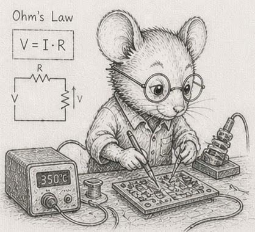

# 4 - Cost is layout - and you have a budget

> *Concept node: see the [DAG](../../concepts/dag.md) and [glossary entry 4](../../concepts/glossary.md#4--cost-is-layout--and-you-have-a-budget).*

A system is not handed a target rate; it chooses one. Work arrives as a stream - frames to draw, packets to route, sensor samples to fold in, requests to answer - and the only real decision is how finely to cut that stream into batches. Each batch is one *tick*, and the rate is the grain of the cut. Cut at one operation per tick and nothing batches: every operation carries its fixed overhead alone, and at a 1 GHz tick the budget is a few nanoseconds, too little to work in. Cut at one tick for all pending work and efficiency is maximal but nothing is answered until everything is: a tick a minute has no perceptible responsiveness. Every useful rate sits between those ends, balancing responsiveness against the efficiency of batching.

Two different things bound that band. Whether you can keep up at all is fixed by the per-item cost against the arrival rate: if work lands at rate λ and each item costs `c`, you survive only when `λ · c ≤ 1`, and `c` is a layout fact ([§3](03_the_vec_is_a_table.md)), not a scheduling one. The rate itself is the second, separate choice: a faster tick means smaller batches and lower latency with less to amortise each fixed cost over; a slower tick means larger batches, better amortisation, and more latency. Batching only ever pays because there are fixed costs to spread - a dispatch, a cache warmup, a syscall, a kernel launch - which is the same amortisation [§8](08_where_theres_one_theres_many.md) names over data, here run along time.

The responsiveness floor is set by whoever consumes the output. Roughly 24 to 30 frames a second is where discrete frames read as continuous motion for passive viewing, which is why film sits there; interactive rendering wants 60, and head-mounted VR wants 90 to 120 to stay comfortable. A control loop runs as fast as its plant needs a correction, often 1 kHz; an audio loop is pinned to its 48 kHz sample rate; a web request handler answers as fast as a human is willing to wait. Different consumers, different floors, one calculus. The rate you choose is the coarsest batch its floor will tolerate, and it sets a *budget* - the time available for one tick of work. What you then spend against that budget is governed by layout, which is where the rest of this chapter goes.

|     Target rate | Budget per tick |
|----------------:|----------------:|
|           30 Hz |          33 ms  |
|           60 Hz |          17 ms  |
|         1000 Hz |           1 ms  |
|       1 000 000 |        1 µs     |

Every operation the program does in one tick spends from that budget. Operations have very different costs. From the numbers you measured in [§1](01_the_machine_model.md):

|                   operation | typical cost |
|----------------------------:|-------------:|
|              float multiply |  < 1 ns      |
|                     L1 read |    ~1 ns     |
|                     L3 read |   ~10 ns     |
|     **Python interpreter dispatch** | **~5 ns / element** |
|                    RAM read |  ~100 ns     |
|                  disk read  |  ~100 µs     |
|        network round-trip   |  ~100 ms     |

The bolded row is the one most explanations leave out. Inside a Python `for` loop, every step pays for `PYTHON_NEXT_INSTR`, refcount work, `PyObject` boxing - about 5 ns even when you do nothing. That cost is *higher than an L1 read* and competitive with an L3 read. It is the dominant fact about pure-Python performance, and it does not appear in any C-style cost table.

## Three regimes - and a fourth

A loop is **compute-bound** when its cost is dominated by arithmetic - typically when the data fits in L1 and the inner work is heavy (dot products, transcendentals, integer divides). It is **bandwidth-bound** when its cost is dominated by how fast the memory subsystem can deliver bytes - typically when the working set is bigger than L3 *but* the access pattern is sequential, so the prefetcher can fill lines ahead of demand. It is **latency-bound** when its cost is dominated by individual memory round-trips - typically when the access pattern is random, so the prefetcher cannot help.

Python adds a fourth: **interpreter-bound**. From the §1 cache-cliffs exhibit, summing 100 million `int64` values cost 4.59 ns per element in a Python list and 0.15 ns per element in a numpy array. The Python list run was not bandwidth-bound, nor latency-bound - the bytes were the same bytes. It was *interpreter-bound*. The CPU spent most of its cycles inside the bytecode dispatcher and the `PyLong` arithmetic path, not on the data. The fix is not "buy faster RAM"; the fix is *leave pure Python for the inner loop*.

The four regimes have very different time budgets:

|                regime |       cost per element |        budget at 30 Hz |
|----------------------:|-----------------------:|-----------------------:|
|         compute-bound |       ~1 ns (L1 + ALU) |  33 million ops / tick |
|       bandwidth-bound |  ~0.2 ns (numpy seq)   | 165 million ops / tick |
|       latency-bound   |   ~12 ns (numpy gather)|   2.7 million ops / tick |
|     interpreter-bound |    ~5 ns (Python loop) |    6.6 million ops / tick |

A loop processing 1,000,000 entities in a 30 Hz tick costs 0.6% of the budget if it is bandwidth-bound, 36% if it is latency-bound, and 14% if it is interpreter-bound. *The same algorithm, the same data, four ways of running it, four orders of magnitude apart.* Complexity-class reasoning cannot tell these regimes apart.

## Cost is layout, not just complexity

The same algorithm that costs 0.2 ms on a sequential numpy column may cost 27 ms on a list-of-tuples carrying the same data, because every row read is a pointer chase to a separately allocated tuple, and every column read inside the row is another pointer chase to a `PyLong`. From the §3 exhibit, summing column 0 of one million ten-int rows took 30 ms as a list of tuples and 0.4 ms as a numpy SoA - a **75× spread on the same payload**. Two programs with the same big-O, same input data, and the same machine differ by almost two orders of magnitude on the inner loop, just because of where their data sits.

This gives you a design rule. *Decide your target rate before you decide anything else.* That sets the budget. Then when you choose data structures, ask whether the resulting working set fits in cache; ask how many memory loads per row your inner loop does; ask whether any single operation in the loop dominates the budget; **ask whether you are running inside the interpreter or outside it.** Most decisions become forced once the budget is named.

The reverse direction is also useful. If you find yourself wanting to *add* something to the inner loop - a dictionary lookup, a `getattr` against a class, a Python-level callback, an exception handler - count its cost in microseconds against the budget. Often the answer is "this single addition uses 80% of my tick", and the right move is not to optimise it but to lift it out of the inner loop entirely.

## The engineering analogy

<p align="center"></p>

The shape of this thinking is familiar to engineers in other domains. An electrical engineer designs a circuit by counting milliamps against a current budget. A structural engineer counts kilonewtons against a load budget. The data-oriented programmer counts microseconds against a tick budget. *Good design is measured in millivolts and microamps* - and in nanoseconds and microseconds. Pick the unit, write the budget down, count against it. Programming has no special exemption from accounting.

> [!NOTE]
> *Time is one budget. Power is another.* Cache hits are energetically nearly free - the data is already next to the arithmetic units. Cache misses fire up the memory controller, the bus drivers, sometimes a DRAM refresh; that is where the watts go. A loop that fits in L2 spends most of its time on cheap arithmetic; a loop that pointer-chases through RAM spends most of its time *waiting*, and during the waiting the CPU drops clocks and the chip stays cool. The same SoA-and-sequential-access discipline that fits the time budget also fits a power budget. For embedded, mobile, control, and battery-powered work, power is the *primary* budget; time is downstream of it. The "millivolts and microamps" line above is literal, not metaphor.
>
> One Python-specific addendum: an interpreter-bound loop is also relatively *power-hungry* per useful operation, because the CPU is running flat-out doing dispatch work instead of arithmetic. Moving to numpy improves time *and* energy at the same time. There is no trade-off here - the disciplined choice is also the cheap one.

## The budget is a curve, not a cliff

So far the budget has been a single number: name the rate, get the time per tick. But the work in a tick is rarely fixed. It grows with the problem - more entities to step, more rows to fold - and if the per-item cost holds, the tick time grows with it. So the rate you can actually sustain is not a constant either; it falls as the work rises, roughly as one over the size for a loop that costs O(N). Thirty hertz is not a wall you meet at some population and shatter against. It is one point on a slope that reads thirty, twenty-five, twenty, fifteen as the work climbs.

That moves the engineering question. It is seldom "does it hit thirty hertz" and almost always "where does the curve fall, and is that fall tolerable". A control loop specified at thirty may be well served by twenty under a heavier load; a visualisation at fifteen is still watchable. So the useful design conversation names two numbers, not one: the target rate, and the *tolerance* - the slowest rate the consumer will accept - then reads off the scale at which the curve crosses the tolerance. You characterise the budget around the target instead of slamming into it.

In Python the slope is the same shape but it crosses *sooner*. An interpreter-bound tick pays its ~5 ns per element before it does any useful work, so the same O(N) loop reaches the budget at a population a compiled or vectorised version would shrug off. The cure is the one this chapter keeps naming - leave the interpreter for the inner loop - which does not change the *shape* of the curve; it slides the crossing rightward to a larger N. The simulator puts numbers on this slope once it runs at scale.

## Exercises

1. **Pick your rates.** For each of these systems, name a plausible target rate and the resulting per-tick budget: a card game; a real-time strategy game; a market data feed; an embedded sensor controller; a web API endpoint a user is waiting for; an offline batch job that processes a billion rows.
2. **Count an operation.** Time a single `dict[k]` lookup on a dict of 1,000,000 entries (use `timeit` for a million repeats and divide). Note its cost in microseconds. How many can you fit in a 30 Hz tick (33 ms)? In a 1 kHz tick (1 ms)?
3. **The layout difference.** Sum 1,000,000 `int64` values in a numpy array. Sum 1,000,000 ints in a Python `dict` with integer keys (use `sum(d.values())`). What is the per-element time difference (in nanoseconds)? Where did it go? Map the answer back to the regime table above.
4. **The cliff.** With your numbers from [§1 exercise 2](01_the_machine_model.md#exercises), pick a numpy array size that just fits in L2 and one that just doesn't. Time a `arr.sum()` at each size. The cliff is real.
5. **Working backwards from the budget.** You target 60 Hz; your inner loop runs over 100,000 entities; each entity touches one cache line of state. Estimate the cost of the loop in microseconds in each of the four regimes (compute, bandwidth, latency, interpreter). Compare to your 60 Hz budget (16,666 µs). Note which regime gives you headroom and which blows the budget.
6. **A bad design.** Construct a Python design that is "obviously fast" by big-O reasoning but blows the 30 Hz budget on a million entities. (Hint: list of `dataclass` instances with a per-tick `for entity in entities: entity.update()` is the canonical example. Estimate its cost from the interpreter-bound row of the regime table.)
7. **Find your CPU's TDP.** Look up your CPU's rated thermal design power on the manufacturer's spec sheet, or read it locally on Linux with `sudo dmidecode -t processor | grep -i 'power\|TDP'`. Note the value. TDP is what the chip can dissipate sustained without thermal throttling - burst can be 1.5-2× higher for tens of seconds; sustained settles back to TDP.
8. **Battery budget.** A typical laptop battery holds about 50 Wh. Your simulator runs at 30 Hz and draws an average of 8 W (mostly memory bandwidth on the inner loop). How many hours of simulation does a full charge buy? If a layout change pushes more loads to RAM and raises the average draw to 14 W, how many hours then? Express the cost of the layout change as a percentage of battery life.
9. **Measure delta power.** In one terminal, run a sustained sequential numpy sum loop:
   ```python
   import numpy as np
   arr = np.arange(10_000_000, dtype=np.int64)
   while True: _ = int(arr.sum())
   ```
   In another terminal: `sudo perf stat -a -e power/energy-pkg/ -- sleep 30` reads the package-energy counter over 30 seconds. Run the same measurement with a *random gather* version (`arr[idx].sum()` with a shuffled `idx`) and an idle baseline. Convert each to average watts. The random-access run should draw more watts than the sequential one, which should draw more than idle. The gap between them is the energy cost of breaking the prefetcher.
10. *(stretch)* **Joules per access.** Approximate energies per memory read: L1 hit ≈ 0.1 nJ, L2 ≈ 1 nJ, RAM ≈ 30 nJ (rough; published numbers vary by chip and process). Estimate the total energy of summing 10 million `int64`s sequentially (mostly prefetched, near-L1 cost) versus by random indices (mostly RAM misses). Convert both to milliwatt-hours and express as a fraction of a 50 Wh battery. The absolute numbers are tiny; the *ratio* is what your battery life and your data-centre electricity bill care about.

11. **The budget is a curve.** Take the loop from exercise 5 (100,000 entities, one cache line each, 60 Hz). Hold the per-entity cost fixed at the interpreter-bound ~5 ns/element from the regime table and sweep the count: 100,000, 300,000, 1,000,000, 3,000,000. Compute the tick time and the sustainable rate at each. At what size does the rate cross 30 Hz? 15 Hz? Plot rate against size and confirm the one-over-N shape. Then recompute the crossing scales for the bandwidth-bound (numpy) regime, and note how far leaving the interpreter slides the curve rightward.

Reference notes in [04_cost_and_budget_solutions.md](04_cost_and_budget_solutions.md).

## What's next

You now have the machine model (§1), the data widths (§2), the table primitive (§3), and the budget calculus (§4). The next section is the conceptual heart of the book: [§5 - Identity is an integer](05_identity_is_an_integer.md). The card game is waiting.
