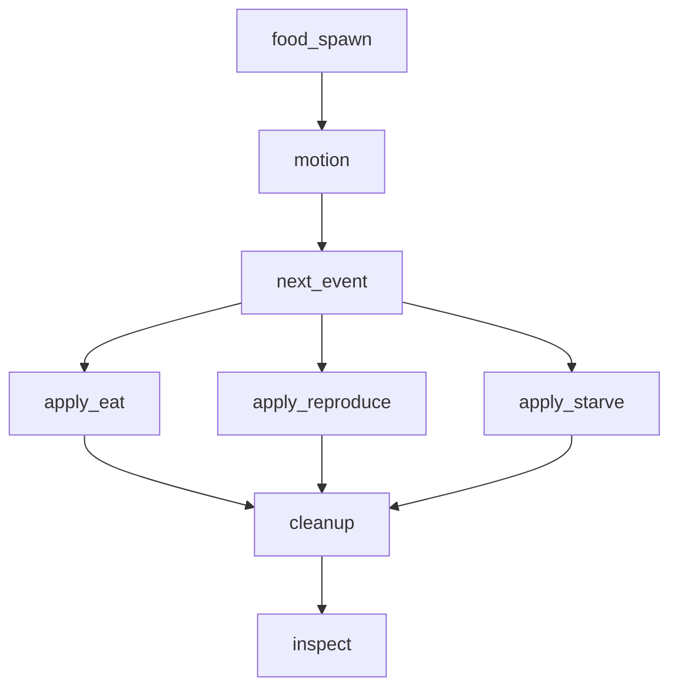

# 14 — Systems compose into a DAG

> *Concept node: see the [DAG](../../concepts/dag.md) and [glossary entry 14](../../concepts/glossary.md#14--systems-compose-into-a-dag).*

A program with one system is uninteresting; a program with many systems must say *what runs in what order*. The order is given by data dependencies: a system that reads a table must run *after* every system that writes that table within the same tick. No ordering is fixed by intuition; everything is given by the read-sets and write-sets [§13](13_system_as_function.md) just made you declare.

<p align="center"></p>

Draw the dependency graph. Each system is a node. For every system that reads table `T` and every system that writes `T`, draw an edge `writer → reader`. The result is a *directed acyclic graph* — the DAG. A topological sort gives a valid execution order: any sort that respects the edges is correct. The program executes one such sort.

The simulator's tick from `code/sim/SPEC.md`:



`food_spawn` runs first because its output is `food`, which `motion` and `next_event` read. `next_event` produces `pending_event`, which the three appliers consume in parallel (their write-sets are disjoint). `cleanup` runs after all of them because its read-set includes their writes. `inspect` runs last because it reads everything and writes nothing.

This is the same shape as a *query plan* in a database. The query optimiser takes a SQL statement, builds a graph of relational operations (each one a system!), and topo-sorts them into an execution plan. A simulator is a query plan running every tick. Students who follow this thread end up writing their own minimal query engine without realising it.

## Not callbacks. Not signals. Not pub/sub.

This is where the Pythonic "loose coupling" idioms come asking, and the right answer is to refuse them. Three patterns to name and exclude:

**Observers / event buses.** A system subscribes to an event ("a creature was born") and runs some handler. The order in which handlers fire is whoever subscribed first, or whatever the framework picks, or — most commonly — *unspecified by design*. This is the opposite of what this chapter is asking for. The DAG fixes order; an event bus deliberately does not.

**Django/Flask-style signals.** Frameworks teach `signal.connect(handler)` so that any module can wire itself into any lifecycle point. The result is a tick whose execution order depends on which modules were imported, in what order, and which `connect` calls ran. The DAG depends on declared data dependencies; signals depend on import order.

**Callbacks.** A system "calls back" to user code at some point in its body. Now the user code is part of the tick, but it has no declared read-set, no declared write-set, and runs at a moment determined by the *implementation* of the calling system. The contract from §13 is gone.

In all three cases the problem is the same: **order is not declared; it is emergent from runtime accidents.** A reader that runs before its writer reads stale data — yesterday's snapshot of a table that was supposed to have been updated. A reader that runs after its consumer reads garbage — a half-written table mid-update. The DAG is the contract that prevents both. Each of the three patterns above replaces the contract with a hope.

A simulator's tick is a topologically-sorted call list:

```python
def tick(world: World, dt: float) -> None:
    food_spawn(world.food, dt)
    motion(world.pos_x, world.pos_y, world.vel_x, world.vel_y, dt)
    next_event(world.pending_event, world.pos_x, world.pos_y, world.food, ...)
    apply_eat(world.energy, world.food, world.pending_event)
    apply_reproduce(world.to_insert, world.energy, world.pending_event)
    apply_starve(world.to_remove, world.energy, world.pending_event)
    cleanup(world.to_remove, world.to_insert, ...)
    inspect(world)  # read-only, write-set empty
```

Eight function calls, in topological order. Adding a system means adding a line and re-deriving the order from the new system's read-set and write-set. There is no `register()`, no `subscribe()`, no `signal.connect()`. The sequence is the program; the program is the sequence.

## Why acyclic

A cycle is a contradiction. Suppose system A writes table T, system B reads T and writes U, system A reads U. Now A both produces T (which B reads) and consumes U (which B writes). A and B cannot both run before each other in the same tick.

A cycle in the system graph is a design bug; it must be broken — usually by buffering one system's write so it is consumed *next* tick instead of *this* tick. That buffering is exactly what [§15 — State changes between ticks](15_state_changes_between_ticks.md) names. Cycles do not disappear when you write a simulation; they get a name and a discipline.

## Parallelism for free

Once the DAG is explicit, parallelism becomes trivial. Any two systems on the same DAG level — neither one a transitive dependency of the other — can run on different processes. In the simulator above, `apply_eat`, `apply_reproduce`, and `apply_starve` all consume `pending_event` and produce *disjoint* output tables (`energy` / `food`, `to_insert`, `to_remove`); they can run in parallel without coordination. The schedule is implied by the graph. [§31](31_disjoint_writes_parallelize.md) picks this up under the GIL.

The observer-pattern alternative cannot offer this. Without an explicit DAG, the framework cannot tell which handlers are independent and which are not — so it either runs everything serially or relies on the user to add manual synchronisation. The DAG-first design gets parallelism *for free* the moment the read-sets and write-sets are accurate; the observer-first design has to invent it back.

## Exercises

1. **Draw the DAG.** Take the eight simulator systems (motion, food_spawn, next_event, apply_eat, apply_reproduce, apply_starve, cleanup, inspect) and draw the dependency graph yourself, deriving the edges from each system's read-set and write-set in `code/sim/SPEC.md`. Compare with the diagram above.
2. **Spot the cycle.** Suppose `apply_starve` writes to `food` (returning fuel to the world when a creature dies). Now `apply_starve` writes `food`, which `food_spawn` reads. `food_spawn` writes `food`, which `next_event` reads. `next_event` writes `pending_event`, which `apply_starve` reads. Where's the cycle? How would you break it? (Hint: §15.)
3. **Topological sort by hand.** Given:
   - A writes X
   - B reads X, writes Y
   - C reads X, writes Z
   - D reads Y and Z, writes W
   
   Which systems can run in parallel? What's a valid execution order? Are there multiple valid orders?
4. **Topological sort in Python.** Implement `def topo_sort(systems: list[tuple[str, set[str], set[str]]]) -> list[str]` taking `(name, read_set, write_set)` triples and returning a valid execution order. Use Kahn's algorithm. Apply it to your answer to exercise 1 — it should produce the same ordering (or one of the valid alternatives).
5. **Compose two systems.** Write `motion` (operation, writes `pos_x, pos_y`) and `next_event` (operation, writes `pending_event`). Wire them into a `tick(world, dt)` function that calls them in order. Inspect `pending_event` after the tick.
6. **Add `cleanup`.** Add a `cleanup` system that processes `to_remove` and `to_insert` (both initially empty arrays). Wire it after `next_event`. Confirm the call list reads top-to-bottom in dependency order.
7. **The wrong way: an observer.** Implement the same three-system tick using an event-bus pattern: `bus.subscribe("tick", motion); bus.subscribe("tick", next_event); bus.subscribe("tick", cleanup); bus.fire("tick", world)`. Run it. Note that the order is now implicit in registration order, and any new subscriber inserted at runtime can change the order silently. Compare reading the resulting code to reading the function-call form. Which one tells you what runs when?
8. *(stretch)* **A query planner.** Take five hand-written SQL queries (each one a system shape) and draw the relational-algebra plan for each. Compare with how `motion → next_event → apply_*` decomposes the simulator. The shape is the same.

Reference notes in [14_systems_compose_into_a_dag_solutions.md](14_systems_compose_into_a_dag_solutions.md).

<p align="center"></p>

## What's next

[§15 — State changes between ticks](15_state_changes_between_ticks.md) is the rule that makes the DAG actually work: mutations buffer; the world transitions atomically.
