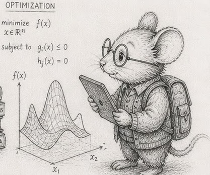

# 28 - Proximity is a property of position

> *Concept node: see the [DAG](../../concepts/dag.md) and [glossary entry 28](../../concepts/glossary.md#28--proximity-is-a-property-of-position).*

<p align="center"></p>

Creatures eat the food they encounter. So `next_event` has to answer, for every creature, *which food is within reach?* At [§1](01_the_machine_model.md)'s ten thousand that is a cheap scan. At [§2](02_numbers_and_how_they_fit.md)'s million it is a wall: comparing every creature to every food is O(C×F). Measured, even twenty thousand all-pairs neighbour tests cost ~2.9 s in numpy on a modern desktop<sup>1</sup> - dozens of frames' budget spent on a fraction of the world.

The reflex is to reach for a *spatial index*: a quadtree, a grid hash, scipy's `cKDTree` - a structure that lives beside the world, that you build, query, and keep up to date as things move. It works. But stop and look at what it is: a second copy of information the world already holds - position - with its own build cost and its own query cost.

Step back and ask what proximity *is*. It is a function of position. And position is already owned and streamed, every tick, by the motion system. The cell a creature falls in is one line - `cell = f(px, py)` - computed in the pass motion is already making, branchless and vectorised. The index was never necessary. The cell is a property you read off position.

## Bin, don't index

Compute each creature's cell, then place the creatures into per-cell buckets with a counting sort: histogram the cells, prefix-sum into offsets, scatter the indices into one dense array (a CSR layout). No dict, no per-cell allocation, no pointer-chasing - three vectorised passes over contiguous memory.

```python
def build_csr(px, py, cell_size):
    ncols = int(WORLD / cell_size) + 2
    cell = (px / cell_size).astype(np.int64) * ncols + (py / cell_size).astype(np.int64)
    order   = np.argsort(cell, kind="stable")                 # point indices grouped by cell
    offsets = np.zeros(ncols * ncols + 1, dtype=np.int64)
    np.cumsum(np.bincount(cell, minlength=ncols * ncols), out=offsets[1:])
    return order, offsets, ncols     # cell c's members are order[offsets[c] : offsets[c+1]]
```

A neighbour query reads the 3x3 block of cells around a point. So far this is the Rust edition's chapter. Here Python adds a catch that is worth more than the whole rest of the chapter.

## The catch: read the buckets as a batch, not in a loop

"Who is near me" is O(1): read my cell's bucket and its eight neighbours. That is true *per query*. The trap is how you run a million of them. Write the obvious loop -

```python
# anti-pattern: bad!  O(1) per query, but a Python loop over a million beasts
for i in range(n):
    for c in neighbour_cells(i):
        for j in order[offsets[c]:offsets[c+1]]:
            if within(px[i], py[i], px[j], py[j], r):
                count[i] += 1
```

- and the algorithm is right but every one of those million O(1) reads pays full interpreter tax. Measured, this naive grid is **5x slower than `cKDTree`**<sup>2</sup>. That single result is what sends people back to the library convinced the grid is no good. It is not the grid that is slow; it is the Python loop.

Run the same million reads as **one vectorised batch** and the grid wins outright. Generate every (beast, candidate-neighbour) pair from the CSR with `np.repeat` and a cumulative-sum range expansion, then do one vectorised distance pass over all the pairs:

```python
# for each of the 9 cell offsets, gather every beast's candidates at once
for dx, dy in OFFSETS:                       # 9 iterations, not a million
    nc = neighbour_cell(cx + dx, cy + dy)    # vectorised over all beasts
    src, j = expand_ranges(offsets[nc], offsets[nc + 1])   # candidate pairs, no Python loop
    hit = (px[src] - px[j])**2 + (py[src] - py[j])**2 <= r * r
    counts += np.bincount(src[hit], minlength=n)
```

The loop now runs **nine** times (the fixed cell offsets), not a million. Everything inside is a whole-array numpy op. At a million creatures the vectorised grid answers the query in ~1.0 s against `cKDTree`'s ~2.3 s - **2.3x faster**<sup>2</sup>, and it is doing genuinely less work: the grid is O(N), the tree is O(N log N). The full implementation is in [`proximity.py`](https://github.com/root-11/intro-book-python/blob/main/code/measurement/proximity.py).

> [!WARNING]
> The grid is O(N) *at constant density* - so many creatures per cell, whatever the total. That holds only when the world grows with the population. It does not hold in a fixed world. Pour more creatures into the same space and each cell's bucket grows with N, so the 3x3 neighbourhood a query scans is itself O(N) and the whole pass is O(N²) again, with the grid still in place. Measured on the reference simulator's `forage`: in a fixed 100x100 world, cost grew ~9-14x for each 3x increase in population (quadratic); with the world scaled to hold density, the same `forage` grew ~3-4x (linear). Binning moves the wall, it does not remove it. The variable the O(N) claim quietly assumes is density, and density is a design choice, not a property of the algorithm.
>
> There are two ways back to O(N), and they are different in kind. The first is to **hold density**: grow the world with the population, so a cell's bucket stays bounded. That is a constraint on the *simulation* - it says a bigger problem is a bigger world, not a denser one - not a change to the code. The second works *even in a fixed world*: ask each cell **once** for a single representative, and let a query match the representatives of its 3x3 rather than every occupant. The bucket collapses to one per cell, so a query sees at most nine candidates however crowded the world gets, and the pass is O(N) again. The price is an approximation - a target matches its cell's chosen neighbour, not provably the nearest of that cell's crowd - but the error is bounded by one cell, which is below the sight resolution the grid already imposes. Measured on `forage`: in a fixed 100x100 world the representative held to ~3.3x per 3x (linear) where the exhaustive scan was ~12x (quadratic), and at the simulator's working density the two fed the herd within 0.5% of each other.

The lesson generalises past this chapter: in numpy a correct O(1)-per-element algorithm can still lose to a worse one if you express it as a Python loop. **Vectorise the batch, or measure the wrong thing and draw the wrong conclusion** - which is exactly the trap the naive grid sets.

## Recompute beats maintain

You might think to *maintain* the structure: when a creature moves to a new cell, patch its bucket - a thousand updates a tick instead of rebuilding from a million. Cheaper to build, certainly (a dict patch is fractions of a millisecond). But it buys nothing, for two reasons the measurements make plain.

First, the build is not where the cost is. Rebuilding the entire CSR from scratch - the `argsort` over a million - is **~6% of the query it serves**<sup>3</sup>. Maintaining incrementally optimises that 6%.

Second, and decisive: the vectorised query *needs* the sorted CSR, and a CSR is not incrementally patchable - inserting into a packed bucket shifts everything after it. The structure you *can* patch cheaply is a dict of lists, and a dict cannot feed the vectorised candidate-generation; its per-beast read is exactly the slow Python loop from the trap above. So you cannot have cheap-maintain and fast-query at once. You rebuild the CSR from the position stream each tick, pay the 6%, and the old question of "how often to re-sort the world" simply evaporates: there is no kept structure to schedule.

## The gather still scatters, and that is §26's job

Binning finds the *candidates* cheaply, but reading their positions still jumps around the columns. Making that gather dense is the compaction from [§24](24_append_only_and_recycling.md)/[§26](26_subscription_tables.md): the same garbage-collection pass that reclaims dead slots can reorder the survivors *by cell* (a Z-order curve keeps neighbouring cells adjacent in memory), so a cell's creatures land on adjacent cache lines. That reorder is the GC's slow-cadence pass, not a separate spatial sort with its own knob. §28 says *which cell*; §26 makes *reading the cell* stream.

> [!NOTE]
> Binning answers *who is near now*, at the sampled positions of this tick. Reusing it for collision smuggles in an assumption: that motion between samples is linear and the step is small. When the step is large, or event-driven with variable length ([§12](12_event_time_vs_tick_time.md)), two fast movers can swap sides inside one step - a long travel vector crossing a short one - and share no cell at any sampled instant. The bin never sees them meet; they tunnel through each other. A finer grid does not fix it; swept (continuous) detection does: solve for the time within the step at which the two linear paths first come within radius. That solve is a quadratic in `t`, and its root is an event time, not a sample. Binning still earns its keep by handing you the candidate pairs cheaply; the closest-approach solve turns a candidate into a dated collision event.

## The same lesson at the global scale: the pack-leader

Swarming beasts look coordinated, but if every beast accounts for every other - cohesion, alignment, separation against all N - the cost is O(N²) (~0.6 s at twenty thousand in numpy). The way the old games did it: put an abstract, invisible leader at the centre of the pack. The leader does the one expensive thing, deciding where the pack goes; each beast subscribes to the leader ([§26](26_subscription_tables.md)) and steers relative to it. One centroid - `px.mean(), py.mean()` - every member reads one value: O(N), some **42000x cheaper** at the same twenty thousand on a modern desktop<sup>4</sup> (thousands of times on every machine), and the gap grows with N. Lifelike swarm behaviour, no all-pairs accounting.

The meta-lesson is the one worth keeping. Twice now the cheap path was to refuse the obvious data structure - the `id_to_slot` hop in [§26](26_subscription_tables.md), the spatial index here - and instead let the system that already owns the data produce the answer in the pass it already makes. Ask what the problem *is* before reaching for a structure to make it fit. Proximity is position; position is already in hand. The Python-specific half of the lesson: having refused the structure, vectorise the batch, or the interpreter will hand the win back to the library you refused.

## Measurements

The prose quotes the modern-desktop figure; the spread across the reference machines is below. Reproduce any column with [`proximity.py`](https://github.com/root-11/intro-book-python/blob/main/code/measurement/proximity.py).

| # | measurement | Ryzen 9 (modern) | i7-3610QM (2012) | i3-5010U (2015) | Pi 4 |
|---|---|---|---|---|---|
| 1 | all-pairs neighbour test, N = 20 000 | 2874 ms | 2048 ms | 3438 ms | 10596 ms |
| 2 | vectorised grid ÷ cKDTree, 1M (grid faster) | 2.28x | 2.17x | 1.76x | 1.32x |
| 3 | grid CSR rebuild ÷ its query, 1M | 6.2 % | 7.4 % | 6.7 % | 4.8 % |
| 4 | pack-leader vs all-pairs cohesion, N = 20 000 | 42024x | 6782x | 10456x | 14668x |

(The naive Python-loop grid, the trap, is ~5x *slower* than cKDTree at 100k on the Ryzen - the measure-the-wrong-thing result, not in the table because it is what you must avoid.)

## Exercises

1. **The all-pairs wall.** For N creatures in a box, count neighbours within radius `r` by testing every pair (chunked so the N×N distances fit memory). Time it at N = 1K, 10K, 20K. Confirm the O(N²) curve, and that 20K alone already exceeds a 30 Hz frame budget.
2. **Cell as a derived column.** Write `cell_of(px, py, cell_size)` as one vectorised expression. Compute the `cell` column for a 1M-creature world. Note that it adds one cheap arithmetic op per creature to the pass motion already makes.
3. **The CSR bin.** Build the counting-sort bucket array (`bincount`, `cumsum`, `argsort`). Read "neighbours in cell C" as `order[offsets[C]:offsets[C+1]]`. Verify the per-cell counts match `bincount`.
4. **The trap, then the fix.** Write the neighbour query as a Python loop over creatures (read each one's 3x3 block). Time it at 100K against `cKDTree`. Confirm the loop *loses*. Now rewrite it as one vectorised batch (candidate pairs via `np.repeat` + a cumsum range-expansion, one distance pass). At 1M, confirm the vectorised grid *beats* `cKDTree` ~2x. The algorithm did not change; the interpreter tax did.
5. **Recompute beats maintain.** Measure the CSR rebuild (`argsort`) as a fraction of the full query. Confirm it is a few percent. Then argue why maintaining a dict-of-buckets incrementally - cheap as the patch is - does not help: the dict cannot feed the vectorised query, and its per-beast read is the slow loop.
6. **The pack-leader.** Steer N agents toward the group two ways: each averaging the other N-1 positions (all-pairs, chunked), and each reading one centroid computed in a single pass. Time both; reproduce the O(N²) vs O(N) gap. Argue why the leader gives swarm-like behaviour without any agent knowing about any other.
7. *(stretch)* **Z-order and the compaction.** Replace the stripe-pack `cell_of` with a Z-order (Morton) hash. Then order the [§24](24_append_only_and_recycling.md) compaction by cell and re-time the query's gather (§26). How much of the remaining query cost was the scattered gather?

Reference notes in [28_proximity_solutions.md](28_proximity_solutions.md).

## What's next

[§29 - The wall at 10K → 1M](29_wall_10k_to_1m.md) is where these techniques start to bind. Code that ran fine at 10K stops running fine at 1M; the chapter is about finding out where and why.
