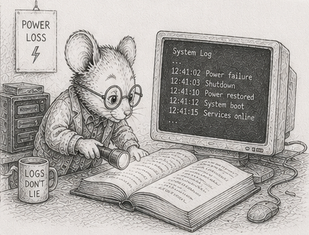

# 46 - The log survives power loss

[§37](37_log_is_world.md) made the load-bearing claim of the persistence story: the log is the world, and the world is the log replayed. [§45](45_living_with_it.md) took away the human who used to be watching. Put those two together and a crack opens that the first act never had to look at. "The log is the world" carries an unstated precondition: *the log is intact*. On a clean shutdown it always is - the program flushes its buffers and exits in its own time. Unattended, the program does not get to choose how it stops. A power loss, an out-of-memory kill, a `kill -9`, a kernel panic: each halts the process between one instruction and the next, buffers half-flushed and the last write half-done. If the log is the world, a torn log is a torn world.

This chapter earns the precondition. The property it builds has a name once it is built: **crash consistency** - the guarantee that after *any* stop, at *any* instant, the system recovers to a world that actually existed, never to a corrupt halfway state.

Three facts about writing to disk. Each is a place the naive version breaks, and none of them is Python-specific - `file.write()` and `numpy.save` sit on top of the same pipeline.

**A write is not atomic.** A single `write()` of N bytes is not one indivisible event. The bytes pass through Python's buffer, the kernel page cache, the drive's own cache, and finally the platters or flash. A crash can land anywhere in that pipeline. The record you appended can reach disk as its first k bytes and nothing more - a *torn write*. Replay a log whose last record is torn and you decode garbage into the world, or raise, or worse, succeed quietly with a corrupt value. The record does not have to exceed a disk sector for this to happen; the cache layers tear at their own granularities. (And `file.write()` in Python does not even reach the kernel until you `flush()`; the buffer is one more layer to lose.)

**`fsync` is a barrier, not a moment.** Until you call `os.fsync(file.fileno())`, "written" means "sitting in a cache that a power loss empties." `os.fsync` forces the file's data through to durable media and does not return until it is there. It is the only thing that converts "wrote" into "will survive." It is also expensive: it is the operation that binds you to IOPS, not bandwidth ([§38](38_storage_systems.md)). And it is a *barrier*, so ordering is part of the contract: the data record must be durable *before* the marker that says the record is complete, or a crash between the two leaves a marker pointing at bytes that never landed.

**`os.replace` is atomic.** `os.replace(tmp, dst)` (POSIX `rename`) is the one filesystem operation that flips atomically: a reader sees either the old file or the new one, never a half-written blend. This is the lever for whole-file updates. To replace a snapshot, write the new one to a temporary file, `os.fsync` it, then `os.replace` it over the old name (and `os.fsync` the directory, so the rename itself survives a crash). At no instant does the snapshot on disk exist in a half-written form. Write-temp-then-replace is how a whole `.npz` changes without a window of corruption.

From these three facts the design follows, and it is one you have already half-built.

**Frame every batch as a transaction.** The [§22](22_mutations_buffer.md) cleanup pass already gathers a tick's mutations into one batch and is the natural commit point ([§37](37_log_is_world.md) logs there). Make each batch a unit that either fully happened or did not. Append its records, then a trailing **commit marker** - a length, a checksum over the batch, a sentinel. `fsync` the records, write the marker, `fsync` again. On replay, scan from the last snapshot; a batch whose marker is missing or whose checksum fails is a torn tail - discard it. The batch never happened. This is a *write-ahead log* built from the three facts, nothing more: the commit marker is the line between "durable" and "did not occur."

**Never acknowledge before the marker.** The commit marker is not only an internal recovery device; it is the line you may make promises across. One instant before it is durable the write *has not happened* - a crash there erases it - so nothing downstream may be told it succeeded until the marker lands. This is the rule a payment processor lives by: an e-commerce site does not tell the customer "paid" until the bank confirms the charge settled, because a crash between "charged" and "confirmed" must resolve to *not charged*, never to a customer holding a receipt for money the system lost. A log obeys the same rule. Data arriving from a remote across the [§35](35_boundary_is_the_queue.md) boundary is not "received" when it lands in a buffer; it is received when it is durable and can be read back. Acknowledge one instant too early and a crash turns the acknowledgement into a lie: the sender believes you hold data you do not. "Logged" has one honest definition - *I can read it back after a crash* - and everything before the marker is hope.

**Recover from a snapshot plus the surviving log.** Snapshots are written temp-then-replace, so a crash mid-snapshot leaves the previous snapshot whole. Recovery loads the most recent intact snapshot and replays the committed log suffix after it ([§37](37_log_is_world.md)'s snapshot-plus-log, now crash-safe). The cost is bounded by the events since the last snapshot.

**Make replay idempotent.** A crash can stop you after a batch is durable but before its effect is folded into a snapshot, so recovery may replay a batch that a previous run had already applied. Replaying must converge: applying a committed batch twice must equal applying it once. The clean way is to always replay from a snapshot that *predates* the batch, so each committed event applies exactly once on the path from that snapshot forward. Determinism ([§16](16_determinism_by_order.md)) does the rest: the same snapshot plus the same committed log produces the same world, every recovery, on every machine.

Then **price it.** What you have built - a checksummed write-ahead log with a commit marker, batch `fsync`, atomic-replace snapshots, idempotent replay - is exactly what a real database's durability layer gives you. And here Python hands you the hardened version *for free*: `sqlite3` is in the standard library, and `PRAGMA journal_mode=WAL` turns on precisely this machinery, hardened by years of edge cases you have not hit yet (group commit, partial-page tears, fsync lies on consumer drives). Build the from-scratch version once so you can read SQLite's and know what you are buying. For a save-game, the hand-rolled log is enough. For a system of record, open a `sqlite3` connection in WAL mode - no dependency to add, no build cost - and now you know precisely which guarantee you are paying for, and why the bare `file.write()` you started with did not have it.

The exclusion, named plainly: crash consistency is *not* backup, and it is *not* replication. It protects against the process stopping, not against the disk dying or the building burning. A single durable log on a single disk survives a `kill -9`; it does not survive the disk. That is a different cost - copies in other places - and the log's shape ([§37](37_log_is_world.md)) is what makes those copies cheap, but the chapter does not buy them for you.

## Measurements

The cost of crash consistency is the cost of `fsync` at the batch boundary, already measured in [§38](38_storage_systems.md): batching the `fsync` across a tick's records instead of paying it per record is the batched-vs-unbatched span on the reference machines, and a durable log widens it further because each unbatched record would pay a real `fsync`, not a buffered write. Crash *correctness* is not a throughput number; it is a pass/fail test, and the specimen ([`crash_consistency.py`](https://github.com/root-11/intro-book-python/blob/main/code/measurement/crash_consistency.py)) runs it: write a hundred committed batches plus a torn one, recover, and the recovered world equals the last committed world with the torn batch discarded - never a halfway state. The same specimen demonstrates the acknowledgement rule: acknowledging before the marker over-acknowledges by exactly the torn batch (the sender holds an "ok" for a record the log lost), while acknowledging after the marker never does.

## Exercises

1. **Tear a log on purpose.** Write 1,000 length-prefixed records to a file with no commit marker and no `fsync`. Truncate the file at a random byte past the last sector boundary to simulate a torn tail. Replay. Observe what decoding the torn record does to the world - a raise, a garbage value, or a silent corruption.
2. **Add the commit marker.** Append a per-batch trailing marker: the batch byte length plus a checksum (`zlib.crc32`) over the batch. On replay, verify the checksum before applying; a batch that fails is discarded as a torn tail. Re-run exercise 1: the recovered world is now the last *committed* world, intact.
3. **Order the barrier.** Make the writer `os.fsync` the records before writing the marker, and `os.fsync` again after. Argue, from the three facts, why a crash at every point between those two `fsync`s recovers to a consistent world. Identify the one ordering that does not.
4. **Atomic snapshot.** Write a snapshot with write-temp-then-`os.replace`-then-`os.fsync`-the-directory. Run a loop that snapshots repeatedly while a second process `kill -9`s it at random. After every kill, confirm a complete snapshot is on disk - never a half-written one.
5. **Idempotent replay.** Take a snapshot at tick S, log committed batches to tick T, then replay the S..T suffix *twice* onto the snapshot. Hash the world after one pass and after two. They must match ([§16](16_determinism_by_order.md)). If they do not, find the event that is not idempotent.
6. **Recover to any tick.** After a `kill -9` mid-run, load the last intact snapshot and replay the committed suffix. Compare the recovered world hash against the live simulator's hash at the same tick. Bit-identical, or trace the first divergent event.
7. **The premature acknowledgement.** Build a tiny ingest loop: receive a record, append it, and return "ok" to the sender *before* the commit marker is durable. `kill -9` between the append and the `fsync`. On recovery, show the sender holds an "ok" for a record the log does not contain. Move the "ok" to *after* the marker and repeat: the sender now retries the un-acknowledged record, and the log and the sender agree. The payment-processor rule, measured.
8. **Measure the barrier.** Time the writer with `fsync` per record, then `fsync` per batch, then no `fsync`. Reproduce the [§38](38_storage_systems.md) batching span on your hardware, and note where durability costs you against where it is free.
9. *(stretch)* **Price the database.** Replace the hand-rolled log with `sqlite3` in WAL mode (`PRAGMA journal_mode=WAL`). Re-run exercises 1 and 4 against it. Note which guarantees you no longer have to write, which edge cases it closes that yours did not, and that the dependency costs nothing - it is in the standard library.

Reference notes in [46_log_survives_power_loss_solutions.md](46_log_survives_power_loss_solutions.md).

## What's next

The log now survives the stop. The next unattended question is the next thing the missing human took with them: knowing what the system is *doing*. [§47](47_observation_is_a_system.md) turns observation into a read-only system - metrics, tracing, and structured logs that hang off the [§35](35_boundary_is_the_queue.md) boundary beside the storage system, so the answer to "what is it doing at 2 AM" is a table you can read, not a `print()` you wish you had added.
