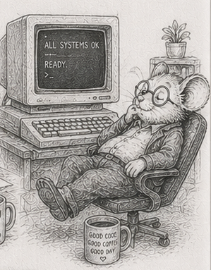

# 50 - It runs without you

[§45](45_living_with_it.md) opened the second act with five questions. The four chapters since answered the first one - *can you run it unattended* - and it is worth stopping to see that they were not four tricks. They were one move, made four times.

[§46](46_log_survives_power_loss.md): the system survives the stop. [§47](47_observation_is_a_system.md): it says what it is doing. [§48](48_reductions_dont_parallelize_freely.md): it gives the same answer on every machine. [§49](49_worst_case_is_the_only_case.md): you know the deadline it can and cannot promise. Listed flat they look unrelated. They are not. Each one removed a dependency on the human who used to stand next to the machine.

The human who restarted it after a crash became the commit marker and the replay ([§46](46_log_survives_power_loss.md)). The human who watched the console became a read-only metrics system ([§47](47_observation_is_a_system.md)). The human who only ever ran it on the one laptop became a deterministic reduction ([§48](48_reductions_dont_parallelize_freely.md)). The human who hit stop in time became a bounded worst case - or the honest admission that CPython cannot promise one ([§49](49_worst_case_is_the_only_case.md)). Act one made the system *work*. These four made it work *without you in the room*.

And the move was the same shape every time: **take a failure that used to be a person's vigilance to catch, and turn it into a property the system holds and a test you can run.** A torn write stopped being "hope the power doesn't go out" and became a commit marker you assert on. "Is it healthy" stopped being a feeling and became a metrics table you query. "Same seed, same world" stopped being true-on-my-machine and became a check across worker counts. A missed deadline stopped being "it felt sluggish" and became a jitter histogram with a tail you can name. Operations is not a toolbox. It is the systematic conversion of *someone is watching* into *something is asserted*.

The same move answers a question the four chapters circled without naming: *will it survive its own success?* A system that holds at today's load meets a different wall at ten times the load, and another at a hundred - the tick that crossed the budget, the workers that stopped helping, the memory that ran out. Left to a human, each is a 3 AM discovery. Converted, it is a **scale sweep**: run every system across the decades of scale you might see, in development, and read where each curve crosses the budget. The walls stop being surprises and become a map - this system binds first, at this size, and here is the lever. Measured on the simulator, the tick holds comfortably above 30 Hz out to roughly a hundred thousand entities and slides toward a single hertz by a few million - the one-over-N curve [§4](04_cost_and_budget.md) named, now with numbers behind it (and they sit further left than a compiled language's, because the tick is interpreter-bound; the slope is the same, the crossing is sooner). "Will it scale" stops being a flinch in a meeting and becomes a curve you read off a chart, which is the vigilance-into-assertion move once more, spent on scale.

The walls are not all the same kind of failure, and that is what makes the map worth drawing. Most degrade *softly* - slower, coarser, fewer entities, but still running and still consistent, the graceful degradation of [§49](49_worst_case_is_the_only_case.md). One does not: run out of memory and the process is killed and the world is gone. So the discipline reduces to a single rule, **never meet the hard wall by surprise**. Map the staircase once, in development, so every step down in production is one you chose with a known margin, not a wall you discovered with nobody in the room. The cheap capital expense of the sweep buys the expensive operating expense of the calm descent - the [§45](45_living_with_it.md) bargain, paid down one more time.

That conversion is the whole economic point from [§45](45_living_with_it.md), paid down. A system that needs a human in the loop costs a salary for as long as it runs; a system that runs without one costs almost nothing to operate. Each chapter in this group retired a recurring cost - not a feature added, a person's standing attention no longer required. That is operating cost falling straight through to margin, and it is why the unattended question was worth four chapters.

It is also the hardest of the second act's five promises to keep, which is why it came first. The system now survives, reports, agrees, respects its deadlines, and knows where its walls are. It is still, though, frozen in the shape you shipped it in, and it has been handed one rule hard: lay the data out flat in numpy columns and stream it. The remaining questions press on exactly that - where the flat-and-stream default stops paying, what to reach for when numpy on one box is not enough, how the schema drifts the moment the world does, and the day someone who is not you comes to own it. Those are the rest of the [horizon](44_closure.md) this book charted. The next part takes up the first two directly - where the flat-and-stream default stops paying, and what to reach for when one box is not enough; the schema-drift and ownership questions wait for a later volume. The book names them rather than pretending the second act is only its first leg.

The operations leg is done. The machine in the next room is running, nobody is watching it, and that is precisely the point.

## What's next

[§51](51_knowing_the_limits.md) opens the last part: five small projects, each built on purpose to reach a place where the flat-and-stream default stops paying, and to measure exactly where. It is how you come to own the advice instead of merely repeating it - and [§57](57_what_cannot_happen.md) closes the book by naming what all of it was for.
