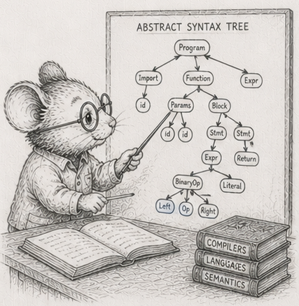

<!-- DRAFT, §52, first project chapter of the "Knowing the limits" arc (§52-§56), Python edition,
built on code/exprtree/exprtree.py. Concept-node line, glossary entry, DAG node are placeholders to be
filled. Numbers are the dev-box (Ryzen 9 270, CPython 3.14.5, numpy 2.4.4) figures; cross-machine
capture (Pi/i7/i3) is pending, so the Measurements table has one column. The mouse art ast.png needs
copying into book/illustrations/ from the arc's source crops. -->

# 52 - Flattening a tree is compiling it

> *Concept node: DAG and glossary entry to be added.*

<p align="center"></p>

[§3](03_the_vec_is_a_table.md) said your columns are a table, and the trunk took it as a default: lay the data out flat in numpy columns and stream it. That earned its place across the simulator's rows of scalars. But the simulator's world is unusually kind to columns, and the honest question this arc asks is where the default stops paying. Start with the structure that looks least like a table: a tree.

Take a small arithmetic expression, `(x + 2) * 3`. It is a tree:

```
        ( * )
       /     \
    ( + )    [ 3 ]
   /     \
 [ x ]   [ 2 ]
```

To evaluate it you work from the bottom up, because every node needs its children's values before it can do its own bit of arithmetic. At `x = 4`: the `x` is 4, the `2` is 2, the `+` makes 6, the `3` is 3, the `*` makes 18.

There are three honest ways to store that tree and walk it, and the differences between them are the chapter. Take them one at a time.

**Boxes and arrows.** Each node is a little object sitting wherever the allocator happened to put it, holding *references* to its children.

```python
# a node is [tag, left, right]; a leaf carries its value in place of a child
['*', ['+', ['var'], ['const', 2.0]], ['const', 3.0]]
```

To evaluate the `*`, you recurse into the `+` node - some other object on the heap - evaluate that (which recurses into `x` and `2`), then read `3`. You hop from object to object following references. This is the representation most people reach for, and the one the trunk taught you to be wary of.

**The same shape, in columns.** Put all the nodes in parallel arrays - a tag column, two child-index columns, a value column - and let each node name its children by their *position* instead of by a reference.

```python
tag = [...]; lhs = [...]; rhs = [...]; val = [...]   # children are indices
```

The nodes now live in columns, which is the layout the trunk prefers. But evaluating still hops from a node to its children in tree order, jumping around the arrays by index. The references became indices; the hopping stayed.

**The steps, written in the order you do them.** Here is the different idea. Instead of storing the tree and walking it, write the nodes down in the order you would actually compute them, every child before its parent:

```
x   2   +   3   *
```

Now you do not walk a tree at all. You read that list straight through, left to right, with a scratch pad - a *stack*, which just means you add to the top and take from the top:

```
x  ->  push its value           pad: [4]
2  ->  push                     pad: [4, 2]
+  ->  pop two, add, push        pad: [6]
3  ->  push                     pad: [6, 3]
*  ->  pop two, multiply, push   pad: [18]
```

The answer is what is left on the pad. No hopping: you touched the list once, front to back. If you have ever used a calculator with an "Enter" key, you have run a list like this; it has a name, but the mechanic is the point.

All three compute 18 - and so does a fourth form, coming shortly. That they agree, bit for bit, on every input is the floor this whole chapter stands on.<sup>1</sup>

## The columns on their own buy nothing - and in Python, neither does the layout

In the Rust edition this is where the flat post-order walk pulls away from the pointer tree: once the tree outgrows cache, reading the program front to back beats hopping between scattered nodes, and the win widens with size. The index-arena buys nothing there, because its walk still hops in tree order - it just hops by index.

In Python that cache crossover never appears, because the thing you are paying for is not the memory hop. It is the interpreter. Every node, in every form, is a handful of Python bytecodes - a tag check, two dispatches, one arithmetic op - on the order of a hundred nanoseconds of work that has nothing to do with where the node sits. That tax swamps the cache effect entirely.

Measured across tree sizes, the three scalar forms stay within about a factor of two of each other, and there is no band where the layout picks the winner:<sup>2</sup>

| nodes | boxed (ns/eval) | arena (ns/eval) | flat (ns/eval) |
|---:|---:|---:|---:|
| 255 | 11,200 | 12,200 | 10,900 |
| 4,095 | 187,000 | 215,000 | 175,000 |
| 65,535 | 4,150,000 | 4,160,000 | 3,210,000 |
| 262,143 | 26,700,000 | 20,100,000 | 12,900,000 |

The flat form is consistently the fastest, but not for the cache reason: it is the only one that drops the per-node *function call*, running one `for` loop over a list instead of recursing once per node. Its lead grows with size - about 2x at the largest tree - as the boxed tree's scattered objects finally start costing real cache misses on top of the interpreter. The index-arena is no better than the pointer tree, and often slightly worse, because its evaluator still recurses in tree order and now indexes four columns to read each node. Putting the nodes in arrays bought nothing. The trunk's lesson about access patterns is still true underneath, but in Python it is hidden behind a larger, flatter cost: the interpreter charges per node whatever the layout.

## The win is to stop paying per node at all

Here is the move the trunk has made in every chapter, applied to the tree. The flat form is a *program* - a list of operations run over a value stack. Run that program scalar and you pay the interpreter per op, per evaluation. Run it once over a whole numpy array of inputs - the stack holds arrays, each op is one whole-array operation - and you pay the interpreter per op *once*, amortised across the entire batch.

```python
def eval_vec(code, xs):              # xs is a numpy array of inputs
    stack = []
    for tag, val in code:
        if tag == CONST:  stack.append(val)              # numpy broadcasts the scalar
        elif tag == VAR:  stack.append(xs)
        elif tag == ADD:  b = stack.pop(); a = stack.pop(); stack.append(a + b)
        elif tag == SUB:  b = stack.pop(); a = stack.pop(); stack.append(a - b)
        else:             b = stack.pop(); a = stack.pop(); stack.append(a * b)
    return stack[-1]
```

The op count is unchanged; what changed is that each op now does the arithmetic for a hundred thousand inputs in one numpy call instead of for one input in one Python statement. Measured, the vectorised stack machine evaluates the expression **about 90 to 180 times faster per input** than the fastest scalar form, across every tree size.<sup>3</sup>

That is the chapter's real result, and it is the trunk's lesson wearing the tree's clothes. Flattening the tree into a run-straight program was step one; the win came from running that program over a batch, so the per-op interpreter cost is paid once for a whole column of inputs rather than once per input. The Rust edition takes its speed-up from the memory layout; the Python edition takes a larger one from leaving per-element Python behind. Same structural move - compile the tree into a linear program - cashed out through the bottleneck that actually binds.

## That flat form is compiled code

Look again at the run-in-order form. Nodes in compute order, run straight through with a scratch stack: that is a *stack machine*, and the list is its program. Writing a tree out as a run-it-straight list is **compiling** it, turning something you walk into something you run - and the vectorised version above is that same compiled program fed a column at a time.

Compiled code has a famous weakness: you cannot edit it in place. Change the tree and the boxes-and-arrows form swings a single child reference, in time set by how deep the changed node sits plus the size of the graft - about 800 nanoseconds here. The arena repoints one index for about the same. The run-in-order form has no cheap edit: any change to the shape breaks the linear order, so you write the whole program out again - O(N), about 11 microseconds at eight thousand nodes, roughly fourteen times the pointer edit, and the gap widens with the tree.<sup>4</sup>

| rep | ns / edit (8,191 nodes) |
|---|---:|
| boxed | 830 |
| arena | 970 |
| flat | 11,500 |

So the choice turns on what you *do* with the tree: **how often do you change its shape, versus how often do you just compute it?**

## The crossover

Put a number on it. Any real workload is some edits and some evaluations. The pointer tree has the cheap edit and the slow walk; the compiled list has the slow edit and the fast walk. They break even where the list's faster walks stop repaying its expensive rebuilds. On this machine, at eight thousand nodes, that break-even sits at an edit fraction of about **0.82**<sup>5</sup> - the compiled form wins unless you are restructuring the tree more than four times for every time you evaluate it. That is the opposite emphasis from the Rust edition, where the compiled form barely edges ahead and only in the compute-many corner. In Python the pointer tree's per-node recursion is so expensive that the compiled loop wins across almost the whole range; pointers only win when you are doing almost nothing but editing.

And the vectorised form removes the last doubt. Its O(N) re-linearisation is paid once per shape-change and then amortised over the whole column of inputs the next evaluation processes. A spreadsheet column recomputed over thousands of rows, a query plan run over a million records, a feature transform applied to a dataset: all sit far out at the compute-many end, and "many" in Python means many values per call, not just many calls. That is exactly where compiling pays, and exactly why those systems compile.

That is the first place the column default does not simply carry over. The flat arrays on their own buy nothing - the interpreter charges per node whatever the layout - but compiling the tree into a linear program and running it over a batch buys a lot, as long as you recompile only when the shape changes. The reference module is [`code/exprtree/exprtree.py`](https://github.com/root-11/intro-book-python/blob/main/code/exprtree/exprtree.py); the prose here is the shape of its output, and the exercises are how you make it yours.

The catch is the word "recompile." It assumes the shape changes rarely, and all at once. The next chapter is what happens when it changes a little, and constantly.

## Measurements

Dev box: Ryzen 9 270, CPython 3.14.5, numpy 2.4.4, median of 3. Cross-machine capture (the Pi 4 / i7 / i3 columns the rest of `code/` carries) is pending, so treat the shape as the claim, not the digits.

| # | what | measured |
|---|---|---|
| 1 | all four forms agree, bit for bit | contract check passes |
| 2 | three scalar forms across sizes | within ~2x; flat fastest (no per-node call); no cache crossover |
| 2 | index-arena vs pointer tree | no better, often slightly worse |
| 3 | vectorised stack machine vs fastest scalar form, per input | ~90x to ~180x faster |
| 4 | one shape-change: boxed / arena / flat (8,191 nodes) | 830 ns / 970 ns / 11,500 ns |
| 5 | edit-fraction break-even (flat vs boxed, 8,191 nodes) | ~0.82; shifts further toward compile as N grows |

## Exercises

1. **Four forms, one number.** Build the boxes-and-arrows tree, the column-arena, the written-in-order list, and the vectorised evaluator for the same small expression. Check all four return the same value, bit for bit - the three scalar forms at many values of `x`, the vectorised one elementwise against an array of `x`. Every later exercise leans on this agreement; if it ever breaks, you are timing four different sums.
2. **Trace the stack by hand.** For `(x + 2) * 3`, write out the run-in-order list and trace the scratch pad step by step, as in the chapter. Then do it for an expression of your own with at least one subtraction, and convince yourself the list never needs to look back. (Watch the order of the two pops: subtraction is not commutative.)
3. **The size sweep, and the flat interpreter floor.** Evaluate each scalar form in bulk across tree sizes from a few dozen nodes to a few hundred thousand. Plot nanoseconds per evaluation. Confirm the three stay within about a factor of two, with no cache-resident band where the pointer tree wins - and say, in one sentence, what they are all paying for that hides the layout.
4. **The vectorised win.** Take the run-in-order program and evaluate it over a numpy array of a hundred thousand inputs in one pass, the stack holding arrays. Measure nanoseconds per input and compare to the scalar flat form. Reproduce the ~90x-to-180x gap. Explain, in terms of where the interpreter cost is paid, why batching is the win rather than the layout.
5. **The cost of editing compiled code.** Implement the same shape-change - swap out a subtree - on each form, and time it at eight thousand nodes. Reproduce the reference-swing, the index-repoint, and the full rewrite. Explain why the run-in-order form has no cheap edit, and why its cost is O(N) where the others are O(depth).
6. **The break-even.** From your edit and evaluation timings, work out the edit fraction where the run-in-order form stops being worth it. Reproduce the ~0.82 figure, and explain why it is so much higher than the Rust edition's (~0.2): what is so expensive about the pointer tree's evaluation in Python that compiling wins across almost the whole range?
7. *(stretch)* **Find the regime in the wild.** Name three real things made of expression trees (a spreadsheet column, a database query, a vectorised feature transform) and place each on the change-it-versus-compute-it line. For one, compile it once and evaluate it over a million-row column; confirm you are far out at the compute-many end, where the one-time cost of writing the program out - and re-linearising on a shape change - has long since paid for itself.

Reference notes in [52_flattening_is_compiling_solutions.md](52_flattening_is_compiling_solutions.md).

## What's next

The run-in-order form assumes the shape changes rarely and all at once. [§53](53_dirty_propagation.md) is what happens when it changes a little and often: a hierarchy where one node moves and only the nodes beneath it go stale. Recomputing everything is the compiled form's only move; recomputing *just the stale part* is the next discipline - and it has a break-even of its own.
