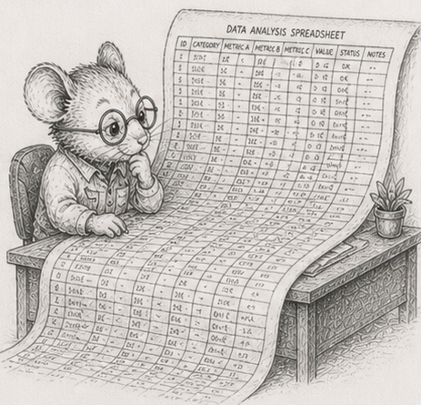

<!-- DRAFT, §54, third chapter of the "Knowing the limits" arc (§52-§56), Python edition,
built on code/spreadsheet/spreadsheet.py. Concept-node line, glossary node, DAG node are placeholders.
Numbers are dev-box (Ryzen 9 270, CPython 3.14.5, numpy 2.4.4); the >RAM disk-seconds pivot is
deferred (needs a file larger than RAM to measure honestly), so it is given as the Rust-measured
shape. The mouse art oom_spreadsheet.png needs copying into book/illustrations/. -->

# 54 - A spreadsheet is a dependency graph

> *Concept node: DAG and glossary entry to be added.*

<p align="center"></p>

[§53](53_dirty_propagation.md) ended where the tree did: in a hierarchy, "everything beneath a node" is one packed slice, because each thing has exactly one parent. Take that away - let one thing feed *many* - and you have a spreadsheet.

Here is a tiny one. Two inputs and three formulas:

```
A1 = 2            (an input you type)
A2 = 3            (an input you type)
B1 = A1 * A2      = 6
B2 = B1 + A1      = 8
T  = B1 + B2      = 14
```

Draw who-reads-whom and it is not a tree: `A1` feeds *both* `B1` and `B2`, `B1` feeds both `B2` and `T`. It is a graph - a *dependency graph*. Now edit `A1` from 2 to 10. What has to be recomputed?

```
A1  changed
B1  uses A1   -> stale
B2  uses B1 and A1   -> stale
T   uses B1 and B2   -> stale
A2  uses nothing that changed   -> still correct
```

Three of the four formulas go stale. Not because they sit "below" `A1` in some layout - there is no below in a graph - but because the change *reaches* them along the feeds-into edges. That reachable set is the **cone** of the edit. And you must recompute it in the right order: `B1` before `B2` before `T`, because each needs the fresh value of the ones it reads. Recomputing a spreadsheet is exactly that - sorting the cells so every cell comes after the ones it depends on, then computing them in that order. ([§14](14_systems_compose_into_a_dag.md) called this a topological sort and said the program *is* one; a recalc engine is that sentence made literal.)

So the move from [§53](53_dirty_propagation.md) survives: recompute only the stale part. But "the stale part" is no longer a slice you point at. It is a cone you compute.

## The change has a shape the UI gives you

[§53](53_dirty_propagation.md) could scatter dirt anywhere across the tree. A spreadsheet cannot. The only edits a person can make are a single cell, or a *fill-down* - drag a formula down a contiguous run of cells. So the dirty set is never random; it is the cone of one of those edits, and its size is set by how the formulas are wired, not by chance.

That is what to sweep: a fill-down of `k` cells, a real action, growing the cone. The result is the familiar shape - recomputing the cone wins big when `k` is small and shrinks as the fill-down covers more of the sheet, until near "most of it" the plain full recompute takes over. Measured on a 200,000 by 50 sheet, recomputing the cone runs about **1680x** faster than a full recompute at a ten-cell fill-down, **50x** at twenty thousand, and converges to the full recompute (1.08x) once the fill-down covers the whole sheet.<sup>1</sup> Same crossover as the scenegraph, driven this time by how much you actually edited. (A uniform fill-down vectorises per column, so both sides are numpy here - the win is doing less work, not leaving the interpreter.)

## "Incremental" does not make a sum incremental

The cone hides a twist, and it is the most useful thing in the chapter. Add one ordinary feature, a column total `=SUM(B1:B1000000)`, and edit *one* cell in that column.

The cone is tiny: the one cell, the total, and whatever reads the total. Recomputing it should be almost free, but recomputing the total means reading the **entire** column again, because a sum keeps no memory of its old value - one changed cell forces a million additions. Measured, recomputing the sum after editing one cell costs the same as recomputing it after editing a hundred thousand: about 0.16 ms either way, because both re-read the whole column.<sup>2</sup> The cone was small in *count* and fixed in *work*.

This is why "just recompute what changed" is not the end of the story for aggregates. A real engine either keeps the sum up to date by hand as cells change (add the new value, subtract the old - and watch [§55](55_floating_point_fragility.md) for why that is dangerous), or it accepts the re-scan and makes the re-scan cheap (the streaming patch at the end of this chapter). Either way: **an aggregate is not incremental just because you only touched one input.** A cone can be cheap to find and expensive to pay.

## Early cutoff: do not push a change that did not happen

The sharpest version replaces the sum with a `MAX`. Suppose the formula downstream is a `MAX` over a column, feeding a dashboard of a hundred thousand cells that each read that maximum, and you edit a cell that is *not* the maximum, to a value still below it.

Walk the cone the obvious way and you recompute the `MAX`, find it feeds the dashboard, and recompute all hundred thousand dashboard cells. But the `MAX` *did not change* - you edited a number below it. None of the dashboard needed touching. So add one check: when you recompute a cell, if its new value equals its old value, **stop** - do not mark its dependents stale, because nothing reached them.

Measured on exactly that sheet, recomputing the dashboard cell by cell - as a recalc engine must, since each is its own formula - the obvious cone takes about 11 ms; with the cutoff it takes 3 microseconds, about **4000x faster**.<sup>3</sup> The gap is far larger than the Rust edition's 54x, and for a Python-specific reason: the saved work is a hundred thousand *per-cell* recomputes, which is exactly the interpreter-bound loop the trunk warns about, so not doing it saves the most expensive thing in the language. The principle has a name worth keeping: **validation is cheaper than recomputation.** Checking "did this actually change?" costs almost nothing; recomputing everything downstream on the assumption that it did costs everything.

## At a billion cells, the program goes flat

A million cells is small. A billion is where this gets honest, and it forces a change that is itself the lesson.

The natural way to hold a formula is as a little object of its own (it is a [§52](52_flattening_is_compiling.md) expression, after all), one per cell. A representative per-cell formula object in Python - a tuple naming an operator and two cell references - is about 172 bytes. At a billion cells that is roughly **170 GB** of formula objects before a single value, more than the Rust edition's 160 GB because Python objects carry more overhead - it cannot be built. So you do what a real big sheet already is: you notice that a billion cells are not a billion different formulas. They are a *handful of formulas stamped across huge ranges* - a fill-down is one formula, repeated. Store the formula once per column - a *template* - and the cells become plain numpy columns of numbers. A billion-cell sheet's entire "program" is then a few hundred templates, about **50 KB**.<sup>4</sup>

That is the arc's whole thesis turning up one level higher than expected. [§52](52_flattening_is_compiling.md) flattened the *data*; at scale you flatten the *program* too - the formula graph collapses from an object-per-cell into a template-per-column, and the dependency graph from a stored list of edges into an implicit rule ("this column reads that one, row by row"). Columns are the default for the program, not just the data - and in Python that collapse is also what makes the recompute vectorisable, because a template over a column is one numpy expression, not a million interpreted ones.

## Leave the RAM, and peg the memory

A billion `float32` values is four gigabytes; bigger sheets are bigger than RAM. So the data lives on disk, laid out one column after another, and read back with `numpy.memmap`. Now the column total from earlier is the whole game, told in bytes moved.

Recompute every total and you read the **entire file**. After a real edit, only a few columns are dirty - so read only *those* columns back (each is a contiguous stretch of the file) and re-sum them. On a fifty-column sheet that is two columns instead of fifty: about **25x less data moved**, a layout fact independent of the machine.<sup>5</sup> The Rust edition measures the wall-clock at a 36 GB sheet on a 30 GB machine - about sixteen seconds for the whole file versus a tenth of a second for the dirty columns; the Python wall-clock at that scale is deferred, because measuring it honestly needs a file larger than this box's RAM (otherwise the page cache answers instead of the disk).

Few programs are built for the next part. Re-summing a column does not need the whole column in memory at once; read it in fixed-size **tiles** and add as you go. Measured, the tiled sum's peak Python heap does not grow with the column at all - a hundred-million-element column sums with a peak of a fraction of a megabyte, because each tile is a zero-copy view the reduction streams over.<sup>6</sup> The program's memory is *pegged*: it never holds more than a tile, no matter how tall the column or how large the sheet. Running out of memory stops being something you hope to avoid and becomes something that **cannot happen** - the loop has no way to ask for more than a tile. That is the move in its purest form, and you will meet it again as a named idea in the finale: an entire class of failure made structurally impossible, not merely unlikely.

To size such a thing for your own machine, the rule is the arithmetic: each gigabyte of RAM is 250 million `float32` cells, so choose a sheet a little bigger than your RAM and smaller than your free disk. RAM < problem < disk. The reference module is [`code/spreadsheet/spreadsheet.py`](https://github.com/root-11/intro-book-python/blob/main/code/spreadsheet/spreadsheet.py).

The cone, the cutoff, the templates, the pegged tiles - all of it rests on a quiet assumption: that adding the numbers up gives the right answer. The next chapter is where that assumption breaks.

## Measurements

Dev box: Ryzen 9 270 + tmpfs, CPython 3.14.5, numpy 2.4.4, median of 3. Cross-machine and the >RAM disk-seconds pivot are pending; treat the shape as the claim.

| # | what | measured |
|---|---|---|
| 1 | recompute the cone vs full, by fill-down size (200k x 50) | 1680x at 10 cells, 50x at 20k rows, 1.08x at full |
| 2 | one-cell vs 100k-cell edit under a column SUM (1e6) | same cost (~0.16 ms): re-reads the whole column |
| 3 | edit absorbed by a MAX, per-cell dashboard, with vs without cutoff | 11 ms vs 3 µs; ~4000x |
| 4 | the "program" for 1e9 cells: objects vs templates | ~170 GB (cannot allocate) vs ~50 KB |
| 5 | dirty-columns patch vs whole file (50-column sheet) | 25x less data moved; wall-clock at >RAM deferred |
| 6 | tiled streaming sum, peak heap | constant in column height (pegged) |

## Exercises

1. **The cone by hand.** Take the five-cell sheet from the chapter. Edit `A1` and list exactly which cells go stale and in what order they must be recomputed. Then edit `A2` instead and do the same. Explain why the two cones differ.
2. **Recompute in order.** Store cells so every cell comes after the ones it reads, and recompute a whole sheet as one forward pass. Then, given an edited cell, compute its cone (the cells it reaches) and recompute only those, in order. Check the result matches a full recompute.
3. **The fill-down crossover.** Sweep a fill-down from one cell to the whole column and compare cone-recompute against full-recompute. Find where full takes over. Note that you cannot make a *random* dirty set with real edits - the cone's shape comes from the formulas.
4. **The sum that is not incremental.** Put a `SUM` over a million-row column. Edit one cell and measure the cone recompute; then edit a hundred thousand and measure again. Show the cost is the whole column either way, and explain why a sum cannot be patched by touching only what changed - without keeping a running total.
5. **Early cutoff.** Build a `MAX` over a column feeding many downstream cells, recomputed one at a time. Edit a below-maximum cell. Recompute the cone with and without the "stop if the value did not change" check. Reproduce the large gap and state the principle in one line - and say why the gap is so much larger in Python than in Rust.
6. **The program goes flat.** Estimate the memory of one formula-object per cell at a billion cells (use `sys.getsizeof`). Then represent the same sheet as one template per column and report its size. Say what collapsed, and into what - and why the collapse is also what lets the recompute vectorise.
7. *(stretch)* **Peg the memory.** Take a column sum and rewrite it to read the column in fixed-size tiles from a `numpy.memmap`, summing as it goes. Prove the peak memory is a constant you set: feed it ten times the data and watch `tracemalloc`'s peak not move. Then size a sheet for your machine with RAM < problem < disk and confirm the patch reads only the dirty columns.

Reference notes in [54_recompute_the_cone_solutions.md](54_recompute_the_cone_solutions.md).

## What's next

Every total in this chapter trusted that adding the numbers gives the right total. [§55](55_floating_point_fragility.md) is where that trust fails: floating-point addition is not associative, so the order you add in changes the answer, a naive sum of a real column can lose its small terms entirely, and no layout - and no `numpy.sum` - fixes it.
