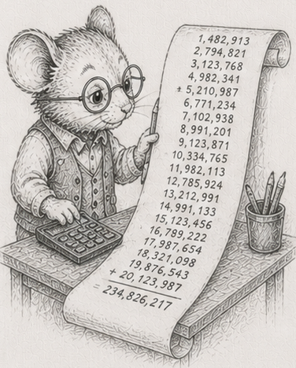

<!-- DRAFT, §55, fourth chapter of the "Knowing the limits" arc (§52-§56), Python edition,
built on code/fpfragility/fpfragility.py. Concept-node line, glossary node, DAG node are placeholders.
The error figures are properties of IEEE-754 and portable; the timings are dev-box (Ryzen 9 270,
CPython 3.14.5, numpy 2.4.4). The mouse art fp_err.png needs copying into book/illustrations/. -->

# 55 - The same numbers, a different total

> *Concept node: DAG and glossary entry to be added.*

<p align="center"></p>

[§54](54_recompute_the_cone.md) made the spreadsheet incremental, took it past RAM, and pegged its memory. Every total along the way trusted one thing: that adding the numbers gives the right answer. This chapter is where that trust breaks, and the unsettling part is that no layout fixes it. A perfectly columnar sum can still be wrong.

Add three numbers by hand, in two different orders.

```
  1e16  +  (-1e16)  +  1
= ( 1e16 + -1e16 ) + 1   =  0 + 1   =  1      (the giants cancel, then the 1 lands)

  1e16  +  1  +  (-1e16)
= ( 1e16 + 1 ) + -1e16   =  1e16 + -1e16  =  0   (the 1 is lost, then the giants cancel)
```

Same three numbers. Two answers. The middle step is the culprit: `1e16 + 1` cannot be stored, because a `float` near ten quadrillion has no room left for a difference of one - the gap between representable numbers there is larger than 1. So the `1` is rounded away, and by the time the `-1e16` arrives there is nothing left of it. **Floating-point addition is not associative: the order you add in changes the sum.** This is not a bug in CPython; it is how every conforming machine works, and it is the same hazard every total in the last chapter was quietly exposed to.

## A real column, added naively, loses everything

Picture a ledger column, the kind any business has: a few million small entries, and one big matching pair, a large credit and the debit that cancels it. The true total is the sum of the small entries; the giants cancel out.

Add it left to right with a hand-written accumulator - `acc = 0.0; for x in col: acc += x` - and the running total climbs to the big number, sits there while every small entry is added and *lost* under it, then the big debit cancels the big credit back to zero. The naive loop reports **0** where the true answer was about a million.<sup>1</sup> Reverse the column and you get a wrong answer again, because a different set of small entries is swallowed. The order decided the result, and the hand-written loop got nothing.

Here Python is kinder than the bare machine, and it is worth knowing exactly how. Three of the obvious ways to add a column are already better than that hand loop:

| method | result | note |
|---|---|---|
| `acc = 0.0; for x in col: acc += x` | 0 (lost it) | the only one that loses everything |
| builtin `sum(col)` | correct to ~1e-8 | CPython 3.12+ sums floats with Neumaier compensation |
| `numpy.sum` / `arr.sum()` | off by ~2 | pairwise summation: close, not exact |
| `math.fsum(col)` | exact | correctly rounded, any order |

The builtin `sum()` was quietly upgraded to a compensated sum, so it stays accurate where the hand loop does not; `numpy.sum` adds in a *tree* (pairwise), which keeps small entries near each other and recovers almost everything; and `math.fsum` is exact. So in Python you have to work to lose the whole answer - you have to write the naive loop by hand. But "almost everything" is not "everything": `numpy.sum` is still off by about two here, and its tree shape still depends on the array's length, so it is order-dependent in the low bits exactly as [§48](48_reductions_dont_parallelize_freely.md) warned. Accurate-enough is a decision, not a default.

The timings give a bonus. Summing five million values, `numpy.sum` (the pairwise tree) is about **26x faster** than the per-element Python loop,<sup>1</sup> because it runs in C over a contiguous array and adds independent pieces at once rather than one dependent chain. The accurate-and-fast method is the same one the trunk has pointed at all along: do the reduction in numpy, not in a Python loop - and it is the same tree-shaped reduction the next chapter leans on.

## Maintaining a total quietly drifts

Recall [§54](54_recompute_the_cone.md)'s temptation: rather than re-read a whole column to recompute a sum, keep a running total and patch it on each edit - add the new value, subtract the old. It is cheap. It also drifts.

Start a running total from the exact sum and maintain it only by those add-the-new, subtract-the-old steps. After two million edits it no longer matches a fresh `math.fsum` recompute - off in the last few digits, and the gap never closes.<sup>2</sup> The absolute error stays small, but as a *fraction* of the answer it is worst exactly when the true total is itself near zero from cancellation. The maintained total is never quite the recomputed one, and you cannot tell by looking. This is why a real system periodically re-anchors its aggregates with a fresh recompute instead of trusting the running patch forever: the incremental total buys speed by spending correctness, a little at a time.

## Layout cannot make it correct - but Python makes the fix easy

Columns are a default, not a law - and this is the version of that with nothing to do with speed at all.

Ask a simple geometric question: given three points, does the third lie to the left or the right of the line through the first two? It is one subtraction-and-multiply formula (the sign of a cross product), and it is the atom under every triangulation, every convex hull, every "is this point inside" test in CAD and mapping and path planning.

Lay the points out in perfect columns and compute that formula in `float`. For three points that are *nearly* in a straight line - large coordinates, a true answer of only one or two - the two big products that should almost cancel are each rounded first, and the rounded difference is dominated by noise. Measured on a hundred thousand near-collinear triples with coordinates around 2^30, the `float` sign is **wrong 98.6% of the time**.<sup>3</sup> A flawless columnar layout changed nothing: the bug was in the arithmetic, not the storage. **Correctness is orthogonal to layout** - you can lay the data out perfectly and still compute the wrong thing.

And here, for once, Python is the *easy* place to be correct. The exact predicate needs integer arithmetic wide enough not to overflow; the Rust edition reaches for a 128-bit integer to get it. Python's `int` is already arbitrary-precision, so the exact determinant is the same one line with no wide-type juggling and no overflow, ever - and it is right every time, at about the same cost. The reference module is [`code/fpfragility/fpfragility.py`](https://github.com/root-11/intro-book-python/blob/main/code/fpfragility/fpfragility.py).

The fixes are real arithmetic, not real layout: add in a defined order, compensate, use a smarter library reduction, or compute the predicate exactly in `int`. None of them is what this book has been selling, and that is the point of putting them here.

So the totals are correctable, and once corrected and incremental the spreadsheet is honest. It is still, though, adding its numbers on a single core. The last chapter asks the question that finishes the arc: when do you actually need more hardware?

## Measurements

Error figures are IEEE-754 and portable; timings are dev-box (Ryzen 9 270, CPython 3.14.5, numpy 2.4.4). Cross-machine capture is pending.

| # | what | measured |
|---|---|---|
| 1 | ill-conditioned column: hand-loop `acc += x` vs the true total | loses the whole answer (0 vs ~1e6); reversing gives a wrong answer too |
| 1 | builtin `sum()` / `numpy.sum` / `math.fsum` vs naive | sum() accurate (Neumaier 3.12+); numpy pairwise (off ~2); fsum exact |
| 1 | `numpy.sum` vs per-element Python loop (5e6 values) | ~26x faster *and* more accurate |
| 2 | running total maintained by deltas vs fresh recompute | never matches; gap permanent, worst in relative terms near cancellation |
| 3 | left/right-of-line, near-collinear, `float` vs exact `int` | float wrong 98.6%; bignum int correct, ~same cost |

## Exercises

1. **Two orders, two answers.** Add `1e16`, `-1e16`, and `1` in both orders by hand, as in the chapter. Then find a triple of your own where the order changes the result, and explain which addition loses information and why.
2. **Lose a column.** Build a column of many small values with one large offsetting pair. Sum it with a hand-written `acc += x` loop, then reversed. Show both miss the true total (the sum of the small values). Then sum it with builtin `sum()`, `numpy.sum`, and `math.fsum`, and report which recover it - and by how much.
3. **Pairwise is fast and accurate.** Time `numpy.sum` against a per-element Python loop on five million values. Reproduce the ~26x gap, and explain it in terms of dependent versus independent additions and the interpreter - then say why `numpy.sum` is still not a license to stop thinking ([§48](48_reductions_dont_parallelize_freely.md)).
4. **Watch it drift.** Start a running total from `math.fsum` of a column, then maintain it through millions of random edits by adding the new value and subtracting the old. Compare against a fresh `math.fsum` periodically. Show the gap never closes, and that as a fraction it is worst when the true total is near zero.
5. **The wrong side of the line.** Implement "is the third point left or right of the line through the first two" in `float`, and again in Python `int`. Feed both many near-collinear triples with ~2^30 coordinates and count how often they disagree. Confirm the `int` version needs no special wide type and costs about the same.
6. *(stretch)* **A layout cannot save you.** Take any one of the above and store the inputs in perfect numpy columns. Confirm the wrong answer is exactly as wrong as before. Write one sentence on why the arc's usual move - fix the layout - does nothing here, and what does.

Reference notes in [55_floating_point_fragility_solutions.md](55_floating_point_fragility_solutions.md).

## What's next

The numbers are correct now, and the sum is still one core reading memory in order. [§56](56_bandwidth_is_the_ceiling.md) finishes the arc with the question the whole second act has been circling: when the work outgrows one core, what actually helps - and what only looks like it does.
