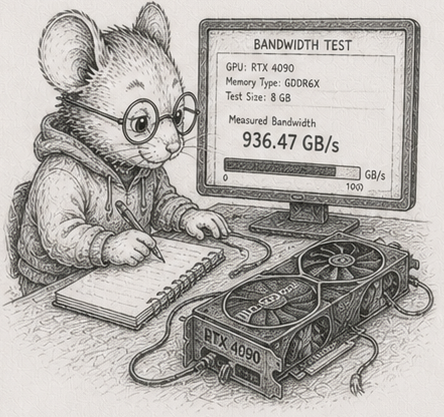

<!-- DRAFT, §56, last chapter of the "Knowing the limits" arc (§52-§56), Python edition,
built on code/heterogeneous/heterogeneous.py. Concept-node line, glossary node, DAG node are
placeholders. CPU numbers are dev-box (Ryzen 9 270, 16 cores, CPython 3.14.5, numpy 2.4.4);
cross-machine capture is pending. The GPU figures are a labelled cost model with assumed constants -
there is no GPU on the dev box; a real GPU run is pending a GPU host. The CAP sidebar is Bjorn's to
write (flagged against framing-overclaim); left as a placeholder. The mouse art bandwidth.png needs
copying into book/illustrations/. -->

# 56 - The ceiling is bandwidth, not cores

> *Concept node: DAG and glossary entry to be added.*

<p align="center"></p>

[§55](55_floating_point_fragility.md) left the work correct and incremental, and still being done by one core reading memory in order. The reviewer's instinct at this point is loud and common: a simulation this size *needs* a GPU. This chapter is the honest answer, and it is mostly "no, and here is exactly why."

Start with the simplest pass there is - advance some particles: each new position is the old position plus the velocity, times a timestep. Two multiply-adds per particle. Almost no arithmetic; the cost is entirely in moving the numbers - read a position and a velocity, write a position back. So the speed of this pass is the speed of *memory*, not the speed of the *core*.

Run it on one core (`px += vx * dt`, vectorised by numpy) across sizes and you can watch the memory hierarchy in the numbers: while the data fits in cache it runs near **80 GB/s**; once it spills to main memory it settles to about **7 GB/s**.<sup>1</sup> That floor - main-memory bandwidth - is the thing that matters, because real working sets do not fit in cache.

(A Python wrinkle worth seeing: `px += vx * dt` quietly allocates a whole temporary array for `vx * dt` before the add, so the idiomatic one-liner moves more memory than the arithmetic strictly needs. Fusing it - `np.multiply(vx, dt, out=tmp); px += tmp`, or a single expression with `out=` - recovers some of that bandwidth. The pass is memory-bound either way; numpy just makes the temporary easy to forget.)

## More cores stop helping

The obvious move is more cores - which in Python means more *processes*, because the GIL rules out using threads for CPU-bound work. Put the four columns in shared memory so no data is copied, split the particles across worker processes, and measure:

```
 1 process    5.4 GB/s    1.0x
 2 processes   9.8 GB/s    1.8x
 4 processes  16.8 GB/s    3.1x
 8 processes  23.9 GB/s    4.4x
16 processes  23.5 GB/s    4.4x
```

Sixteen cores do no better than eight, and the whole machine tops out around **4.4x**, at about 24 GB/s.<sup>2</sup> The reason is the one above: this pass is limited by the memory channel, and a single channel feeds all the cores. Past about eight processes they are not computing in parallel; they are queueing for memory. **The ceiling is bandwidth, not core count.** You cannot out-core a memory-bound pass, and - the next section - you cannot out-accelerator it either. The way to go faster is to *touch less data*, not to add compute, which is exactly what [§53](53_dirty_propagation.md) and [§54](54_recompute_the_cone.md) spent their chapters doing. The whole arc has been pulling this way, and now you can see why it had to.

## How much can one box keep current?

Turn the bandwidth into the number that actually decides things. In a 33-millisecond frame (30 per second), one core can bring about **10 million** particles up to date; all cores together, about **33 million**.<sup>3</sup> That is the budget: how big an *active set* one box keeps current per frame.

Now the GPU argument falls apart on its own terms. The claim is that a billion-node world needs the GPU, but you never recompute a billion nodes: [§53](53_dirty_propagation.md) and [§54](54_recompute_the_cone.md) taught you to recompute only the part that changed, the active cone, and a cone of a few million cells fits one box's frame budget. The GPU answers "how do I recompute *everything*, fast?", a question the incremental discipline already stopped asking. The GPU is not slow; it is solving a problem you arranged not to have.

## When the bus is the bottleneck

And when the active set genuinely is too big for one box - when you really do have more work than one machine's memory can feed in time - is reaching off the box the answer even then? For a pass like this one, often not, and Python lets you measure exactly why, without a GPU at all.

To run the pass somewhere else - another process, another machine, a GPU - you must first ship the data there and read the result back. Shipping ten million particles to a worker process and back, the way a non-shared offload would, takes about **12 times** as long as just doing the pass in place.<sup>4</sup> The transfer moved about the same bytes the computation needs, and moving them cost far more than the two multiply-adds saved. That is the GPU round-trip argument in Python's own terms: offloading a memory-bound pass loses, because the bus is slower than not using it. Offloading pays only when the data already lives on the far side, or when there is enough arithmetic per byte that the compute, not the transfer, dominates. For a memory-bound elementwise pass, neither holds.

(A real GPU adds its own host-to-device bus and launch latency; those figures are a cost model with assumed constants, not a measurement, because there is no GPU on the reference machine - plug your hardware's numbers into the same model. The shared-memory-process result above is the part that is measured, and it already shows the shape. The reference module is [`code/heterogeneous/heterogeneous.py`](https://github.com/root-11/intro-book-python/blob/main/code/heterogeneous/heterogeneous.py).)

<!-- Sidebar (Bjorn to write; flagged against framing-overclaim): fixate on the conditions
under which a problem occurs, not the problem itself. The "you must choose" tradeoffs often
dissolve once you arrange the conditions so the hard case cannot arise - the same move the
active-set budget just made against the GPU. -->

So the answer to "do you need the accelerator" is a measurement, not a reflex: you reach for more hardware only when the *active set itself* outgrows one box, not to brute-force away staleness an incremental design already avoids. Columns were the precondition for numpy's vectorisation, for multiple processes, for a GPU - but they are a default, not a law, and so is the accelerator.

That closes the arc. Five chapters of where the column default does not simply transfer: a recursive structure that makes you choose access pattern over storage; a hierarchy whose stale set has a ceiling and a shape; a graph whose aggregates are not incremental and whose memory you peg; arithmetic a layout cannot make correct; and a memory channel no core or bus can outrun. The honest counterweight to fifty chapters of "lay it out flat and stream it" is that you now know, with numbers, where that stops being the answer.

## Measurements

CPU figures: dev box (Ryzen 9 270, 16 cores, CPython 3.14.5, numpy 2.4.4), median of 5. Cross-machine pending. GPU figures are a labelled cost model, not a measurement.

| # | what | measured |
|---|---|---|
| 1 | one core's pass, in cache vs in main memory | ~80 GB/s vs ~7 GB/s (numpy materialises the temporary) |
| 2 | the same pass across processes (shared memory, RAM-resident) | 1/2/4/8/16 -> 1.0x/1.8x/3.1x/4.4x/4.4x; plateaus at the memory channel |
| 3 | active set kept current per 33 ms frame | ~10 M (one core), ~33 M (all cores) |
| 4 | ship a memory-bound pass to a worker process and back | ~12x slower than the in-place pass; the bus is the tax |

## Exercises

1. **Watch the hierarchy.** Run the advance-the-particles pass on one core across sizes from a few thousand to tens of millions. Plot the bandwidth. Find the step down from cache speed to main-memory speed, and say roughly where your machine's last cache level ends. Then fuse the temporary (`out=`) and note how much bandwidth you get back.
2. **More cores, less help.** Split the same pass across 1, 2, 4, 8, and all your cores using processes and a shared-memory array. Plot the speedup and find where it plateaus. Explain, in one sentence, why a memory-bound pass stops scaling well before you run out of cores - and why you had to use processes, not threads.
3. **The frame budget.** From your single-core and all-core bandwidth, work out how many particles each can bring up to date in a 33 ms frame. This is your box's active-set budget. Compare it to the size of the *active* part of a large simulation (the part that changed this frame), not the whole thing.
4. **The argument against the GPU.** Using the budget from exercise 3, argue whether a million-cell active cone needs an accelerator. Then state precisely the case in which it would: when the active set itself, not the whole world, exceeds what the box can feed in a frame.
5. **The bus is the tax.** Measure the cost of shipping the pass's arrays to a worker process and back (pickle/IPC), versus doing the pass in place. Reproduce the order-of-magnitude gap. Then write the GPU cost model - bytes to the device, bytes back, at an assumed bus speed, versus the CPU time per element - and find the arithmetic intensity at which offload would break even. Confirm two multiply-adds per element is far below it.
6. *(stretch)* **Touch less, not more.** Take any pass from an earlier chapter and make it faster two ways: throw processes at it, and shrink the working set it touches (compute only the active part). Compare. Argue which lever the rest of this arc has been pulling, and why it beats the hardware lever for the workloads here.

Reference notes in [56_bandwidth_is_the_ceiling_solutions.md](56_bandwidth_is_the_ceiling_solutions.md).

## What's next

That is the last technique. What remains is to say what all of it was *for* - and it is not speed. [§57](57_what_cannot_happen.md) collects the whole book into a single claim: that the structure you have been building does not merely run fast, it makes whole categories of failure impossible to write. The arc's pegged memory was the freshest instance; the finale names the rest.
