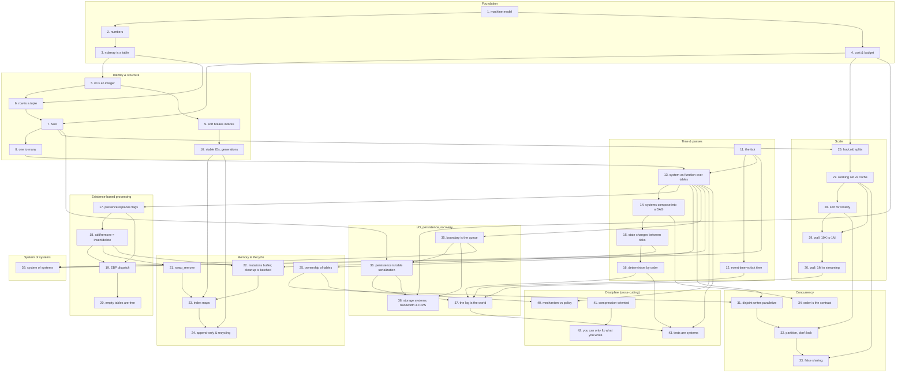

# The Concept DAG

Forty-three concepts the book teaches, with prerequisites drawn explicitly. This is the spine — every section, exercise, and track opening must trace back to a node here. If a candidate piece of content does not, it is either missing from this DAG (amend the DAG) or out of scope (drop the content).

## How to read this

Each numbered node is one concept the student must internalize. The text under each node is the definition we will use; it is not the prose the book will teach with. Edges express prerequisites: B depends on A means B's exercises only make sense once A has been *felt*, not just stated.

The DAG is published in the book's front matter. Students see it. Instructors use it to re-cut the book for shorter or longer courses.

## How to amend

Comment by node number (e.g. "node 17 — definition is too narrow") or edge (e.g. "edge 13 → 35 isn't a real prerequisite"). I'll revise this file before any prose is written.

---

## The diagram

---

## Nodes

### Foundation (1-4)

1. **The machine model.** Memory is one long array of bytes. The CPU does arithmetic on small numbers fast, fetches from cache fast, fetches from main memory roughly 100× slower, and chases pointers blindly. This asymmetry — not the algorithm — sets the speed of most real programs. *In Python, the cost asymmetry is doubled by interpreter dispatch (~5 ns per Python-level iteration), which masks the cache hierarchy from inside pure Python and reveals it the moment numpy bulk ops take over.*

2. **Numbers and how they fit.** `np.int8`, `np.uint8`, `np.int16`, `np.uint16`, `np.int32`, `np.uint32`, `np.int64`, `np.uint64`, `np.float32`, `np.float64`. Width is a budget choice that decides how many things fit in a cache line. Floats are not real numbers; they have a finite set of values and edges where arithmetic stops behaving. *Python ints (PyLong) are 28+ bytes regardless of value; the width budget exists in numpy, not in stdlib.*

3. **The `np.ndarray` is a table.** `np.ndarray` of fixed dtype is a contiguous run of typed values in memory, addressed by index. It is the unit out of which the rest of the book is built. *A Python `list` is a contiguous run of `PyObject*` pointers — different shape, different cost.*

4. **Cost is layout — and you have a budget.** The same algorithm runs at different speeds depending on where its data sits in memory; layout decides the constant factors that dominate at the scales we care about. Every program has a frequency target (a game runs at 30 Hz; a market data system runs at 1 kHz; a control loop at 1 MHz) which sets a per-tick *budget* in milliseconds. Operations are counted against that budget — in microseconds, or nanoseconds for tight inner loops — and design choices set its upper bound. *Python adds a fourth regime to the standard three (compute-bound, bandwidth-bound, latency-bound): interpreter-bound. The fix is the same: keep the inner loop in numpy.*

### Identity & structure (5-10)

5. **Identity is an integer.** An entity is an `int` — typically a small unsigned integer in a `np.uint32` column. It names a slot in the world's tables, not a thing in itself. Pointers, references, and "the object" all dissolve into this. *Even which integer matters: int-tuple dict keys are 2.4× faster than float-tuple keys; choose small unsigned ints for identity.*

6. **A row is a tuple.** A coherent set of values that describe one entity travel together — but only if you keep them together. If you split them across tables, you must keep their indices aligned. *In Python the strongest form is "a row is a tuple you do not have to build" — the row at index `i` exists implicitly across columns; constructing it as a tuple/namedtuple/dataclass instance is real cost the implicit form avoids.*

7. **Structure of arrays (SoA).** Each field of a row gets its own `np.ndarray`, indexed by entity. The opposite layout — `list[Creature]` (AoS), or numpy structured arrays — is a tradeoff to be earned, not the default. *In numpy SoA the columns are physically separate allocations; reading one column does not bring others into cache.*

8. **Where there's one, there's many.** Code is written for the array. The single-instance case is just N=1; it does not need its own abstraction. A card game with 52 cards is three numpy arrays — suit, rank, location (deck/hand/discard) — not 52 objects. *In Python the cost difference is one to two orders of magnitude, because per-element method dispatch is interpreter-bound.*

9. **The sort breaks indices.** Rearranging rows for locality breaks any external reference that pointed at a slot. The student must feel this pain before the next node makes sense. *Tempting Python escape hatch: hold object references instead of indices. This works if you accept AoS — and gives back §3's footprint and §7's access wins.*

10. **Stable IDs and generations.** A separate `id` column gives a name that survives sorting. A `generation` counter on top gives a name that survives recycling, so an old reference cannot be confused with a new occupant. *The id behaves like an auto-incrementing primary key in a database; the generation is the part that isn't there, because databases grow and we recycle.*

> *Milestone after node 10 — the card-game project.* Three numpy uint8 columns of length 52 (suit, rank, location); shuffle and sort by index using `np.random.permutation` and `np.lexsort`. Frequently expected to take hours in OOP and to take minutes here. Students sometimes look at the result like it is cheating; that reaction *is* the conversion. The card game is also the simplest case of one design choice that shapes everything later: the table has a *constant quantity*. There are 52 cards, always; the array never grows or shrinks. *Variable-quantity* tables — creatures that are born and die, packets that arrive — come in Memory & lifecycle, and they are why `swap_remove`, dirty markers, and generational IDs exist. The card game primes the next phase: a turn is a tick, dealing is a system, the deck/hand/discard are tables.

### Time & passes (11-16)

11. **The tick.** Programs run in discrete passes. State at the start of a tick is read; state at the end is written; nothing is half-updated mid-tick. The tick has two natural shapes — *turn-based* (the loop advances when an event arrives, the next-event timestamp drives the schedule; a card game is the canonical example) and *time-driven* (the loop runs at a fixed rate, e.g. 30 Hz, with a per-tick budget around 33 ms). Both are tick loops; the difference is what drives the next pass. *In Python: not asyncio (an I/O scheduler), not threading (the GIL serialises) — a synchronous loop with `time.perf_counter` and `time.sleep`.*

12. **Event time is separate from tick time.** Events carry their own timestamps, independent of when the loop processes them. The tick rate is how often the loop runs; the *event clock* is the simulation's internal time, and it can be arbitrarily fine. A 30 Hz loop can resolve microsecond-precision events because the clock lives on the data, not on the loop. Conflating the two is the most common error in event-driven and physical simulation work — students think their model is limited to the tick's resolution; it is not. *Store time as `np.float64` seconds-since-base, not as `datetime` objects (7× footprint, 17× per-tick query cost).*

13. **A system is a function over tables.** Systems declare their inputs (read-set) and outputs (write-set). They have no hidden state. The signature is the contract. Every system takes one of three shapes: an *operation* (1→1, every input row produces one output row), a *filter* (1→{0,1}, every input row produces zero or one), or an *emission* (1→N, every input row produces zero or more). These are the same shapes as familiar database operations — `sort`, `groupby`, `filter`, `join`, `aggregate` — over component arrays. Even observability is a system: an inspection system holds read-only references to other systems' tables, instantiated only when transparency is needed; in production it is *absent*, not gated. *In Python: a function that takes `self` does not have a declared read-set or write-set; a function that takes columns does.*

14. **Systems compose into a DAG.** The order of systems is given by who reads what who wrote. The program is a topological sort of this graph; choose the sort, and the program runs. Designing the system order is the same problem as designing a database query plan: each system is a stage, the DAG is the plan, and the program executes the plan. Students who follow this thread end up writing their own minimal query engine without realising it. *In Python, observers / signals / `asyncio.gather` are anti-shapes: order is not declared, it is emergent from runtime accidents.*

15. **State changes between ticks.** Mutations buffer; the world transitions atomically at tick boundaries. This is the structural reason systems compose at all. *In Python this rule eliminates two famous footguns: `list.remove` during iteration (silently skips), and `del d[k]` during iteration (raises `RuntimeError`).*

16. **Determinism by order.** Same inputs + same system order = same outputs. Reproducibility is structural, not a quality goal. It is what makes replay, testing, and the simulator's sanity possible. *Python-specific recipe: no raw `set` iteration (`PYTHONHASHSEED` randomises across processes), no `time.perf_counter` inside systems, one `np.random.default_rng(seed)` per simulator.*

### Existence-based processing (17-20)

17. **Presence replaces flags.** "Is hungry" is membership in a `hungry` table, not a `bool` on `Creature`. State is structural, not flagged. *In Python the spectrum is wider: per-instance bool field (worst) → numpy bool column (middle) → numpy presence index (best, when sparse). Crossover is at ~80-90% prevalence.*

18. **Add/remove = insert/delete.** A state transition is a structural move: insert a row in one table, remove a row from another. There is no `setHungry(True)`. Naive structural changes inside a system pass break iteration, which is what node 22 fixes. *No `@property` setters, no `__setattr__` overrides — those bury policy in mechanism.*

19. **Existence-based dispatch.** A system iterates over the table whose presence defines its applicability. There is no per-row branch checking "does this case apply to me". *Three Python anti-shapes that all reduce to filtered iteration: `isinstance` chains, polymorphic method dispatch via inheritance, and `[c for c in cs if c.flag]` list comprehensions. Each consults the predicate per entity.*

20. **Empty tables are free.** No rows means no work. A simulation with 90% inactive entities does no work for the inactive ones — the dispatch never visits them. *The Python `Optional[X]` field on every entity is the failure mode this displaces — at 0% prevalence it costs full population in memory and full population in scan time.*

### Memory & lifecycle (21-25)

21. **`swap_remove`.** Deletion in O(1) by moving the last row into the deleted slot. Order is sacrificed for speed; the next two nodes fix the consequences. This phase only matters for *variable-quantity* tables — those that grow and shrink at runtime (creatures, packets, in-flight tasks). Constant-quantity tables like the 52-card deck need none of it. *In Python the in-place form needs an `n_active` counter beside a fixed-capacity array; for batched cleanup, the bulk-mask filter is even faster.*

22. **Mutations buffer; cleanup is batched.** Adds and removes during a tick are not applied immediately; they are recorded as dirty markers in side tables (`to_insert`, `to_remove`). At the tick boundary, a single sweep applies them all. This is the implementation of node 15: structural changes happen *between* passes, not during them. Without it, naive mutation inside a system causes O(N) reallocations per tick and breaks the iteration the system is in the middle of. *Python edition uses bulk-mask filter at cleanup, not per-element swap_remove — 5× faster at K=100K mutations.*

23. **Index maps.** When external references must survive reordering, an `id_to_slot` map maintains the mapping. It is updated on every move — whether by `swap_remove` or by the buffered-cleanup sweep. *Two right shapes (numpy `uint32` array for dense ids, `dict` for sparse) and one anti-pattern (`scipy.sparse` matrices for point lookups — wrong tool, 108× slower than dict).*

24. **Append-only and recycling.** Two strategies for slot reuse, with opposite tradeoffs in memory and reference stability. The choice is decided by access pattern, not taste. *Python doesn't have GC for numpy column slots; the recycling discipline is a `free_slots: list[int]` LIFO stack plus a generation counter.*

25. **Ownership of tables.** Each table has exactly one writer; many readers are fine. This is the rule that makes parallelism possible without locks, and it is the precondition for the inspection-system pattern (read-only access to all tables, no risk of races). *Python has no borrow checker; the discipline is a convention. The numpy view trap (`arr[2:5]` is a view, not a copy) is the easiest place this discipline silently breaks.*

### Scale (26-30)

26. **Hot and cold splits.** Fields touched in the inner loop go in one table; metadata read rarely goes in another. The inner loop's footprint shrinks; cache works. *In numpy SoA this lesson is gentler than in Rust AoS — columns are already physically separated. The split is largely organisational unless you're using AoS layouts (numpy structured arrays, `list[dataclass]`).*

27. **Working set vs cache.** The size of the data the inner loop touches per pass decides speed more than the algorithm. If it fits in L1/L2, the loop is fast; if it does not, no algorithm saves you. *In Python the cliff is invisible from inside pure-Python loops because interpreter dispatch dominates; it surfaces in numpy.*

28. **Sort for locality.** Reordering rows so that frequently co-accessed entities sit together turns random access into sequential access. This is the technique that node 9 was the prerequisite pain for. *In numpy: `order = np.argsort(spatial_cell); for col in cols: col[:] = col[order]`. The `id_to_slot` rebuild is one bulk numpy assignment.*

29. **The wall at 10K → 1M.** What changes when allocations cannot be casual: pre-sized buffers, no per-frame heap traffic, `swap_remove` instead of `remove`, batched cleanup, consciously chosen layouts. The design budget from node 4 starts to bind. *The pandas wall: a `DataFrame` of 10M × 20 columns occupies 1.6 GB+ before any operation. The migration from pandas → numpy SoA or sqlite is usually a one-day project that gives back days of OOM debugging per quarter.*

30. **The wall at 1M → streaming.** What changes when the table no longer fits: snapshots, sliding windows, log-orientation. The world becomes a window over the log. *Python toolkit: `np.savez` for snapshots, sqlite for queryable archives, the simlog as the canonical streaming logger. Not `np.memmap` (rarely faster than explicit chunked reads in practice).*

### Concurrency (31-34)

31. **Disjoint write-sets parallelize freely.** Two systems that write to disjoint tables can run in parallel without coordination. No locks, no atomics. This is what node 25's ownership rule buys. *In Python: `multiprocessing` + `multiprocessing.shared_memory`, not `threading` (GIL serialises) and not `asyncio` (I/O scheduler). The headline measurement: ~4× speedup memory-bound, ~5.5× compute-bound on 8 physical cores; per-tick dispatch costs IPC overhead that batching amortises.*

32. **Partition, don't lock.** When one system must write a single table from multiple threads, split the table by entity range. You partition the data, not the access. *The disciplined production form is the Beazley ventilator: pre-assigned partitions, signal-only dispatch (system index, not data), shared-array DAG. Coordination throughput: ~1.5M msgs/sec via shared array vs ~90K via `multiprocessing.Queue`.*

33. **False sharing.** Two threads writing to different fields in the same cache line slow each other down through hardware. Discovered, not avoided in advance. *In Python with `multiprocessing.shared_memory`, false sharing applies the same way it does in compiled languages — the GIL does not protect across processes. Detection: `perf stat -e cache-references,cache-misses`.*

34. **Order is the contract.** Parallelism is allowed *inside* a step (between systems with disjoint writes), never *across* steps. Determinism (16) depends on this discipline. *In Python: `asyncio.gather` over the systems is the looks-right-but-isn't anti-shape. The §32 ventilator is both the parallel schedule and the deterministic execution order — one mechanism, two readings.*

### I/O, persistence, recovery (35-38)

35. **The boundary is the queue.** Events flow into the world on one queue, results flow out on another. Inside, the world is pure transformation — no I/O, no time, no environment. Everything that crosses the boundary goes through a storage system (38). *Five Python I/O leaks the boundary forbids inside systems: `print`, `logger.info`, `time.perf_counter`, `requests.get`, `os.environ`. The queue shape: numpy parallel columns for high-throughput events, list-of-dicts for low-volume mixed-schema, sqlite for durable. NOT `multiprocessing.Queue` (which is for §32's ventilator, not the simulator's external boundary).*

36. **Persistence is serialization of tables.** A snapshot is the world's tables written as a stream of (entity, key, value) triples — the same shape the world has in memory. Recovery is reading them back. There is no separate "domain model" to map. *In Python: `np.savez` for portable, `pickle` of dict-of-numpy for speed (but version-fragile), AoS pickle for the chapter's first row of "never". Headline: pickling `list[dataclass]` is 778× slower and 2.5× larger than `np.savez` of the same data.*

37. **The log is the world.** An append-only log of events is the canonical state; the world's tables are the log decoded into SoA. The log's structure is *literally the same* as the world's: rows with field codes, values, and presence — the same `(rid, key, val)` triples either way. Replay reconstructs the tables; serialise the tables and you produce a log. They are two views of one thing, not two related things. *Worked specimen: `.archive/simlog/logger.py` — 700 lines of the triple-store + codebook + double-buffered-revolver pattern in Python.*

38. **Storage systems: bandwidth and IOPS.** A storage system is the part of the program that crosses I/O — to disk (HDD/SSD/NVMe), to network, to a service. Its limits are *bandwidth* (bytes per second) and *IOPS* (operations per second), and both must be counted against the tick budget from node 4. SQLite is one specimen; a TCP socket is another; a network filesystem is a third. The pattern — single owner, batched writes, asynchronous flush — is the same. *Once warm, on-disk SQLite is ~10% slower than `:memory:` (906K vs 826K random lookups/sec on this machine). The "disk is slow" intuition holds for cold reads only.*

### System of systems (39)

39. **System of systems.** Not all systems run every tick to completion. Some computations exceed the tick budget, run on their own cadence, or live entirely outside the simulator. Three patterns handle this. *Anytime algorithms* return their best current answer when the deadline arrives; quality scales with time available (CP-SAT, Monte Carlo Tree Search). *Time-sliced computation* divides work across ticks with progress as part of the system's state (a spatial search that scans cells across many ticks). *Out-of-loop computation* runs on a separate thread, process, or machine, and delivers results into the input queue when ready (game AI, optimisation services). The unifying principle: a system has a *cadence*, and the cadence does not have to be one tick. *Scale up before scaling out: a network hop costs ~5 ms per tick (data centre) to ~100 ms (internet) — 15-300% of a 30 Hz budget per hop. Modern boxes are large.*

### Discipline (cross-cutting, 40-43)

40. **Mechanism vs policy.** The kernel of a system exposes raw verbs. Rules — what is allowed, what triggers what — live at the edges, not in the kernel. Confusing the two is how systems calcify. *Three Python anti-shapes that bury policy in mechanism: `@property` setters that validate-and-commit; decorators that hide control flow (`@cache_for`, `@require_role`); `__getattr__`/`__setattr__` overrides.*

41. **Compression-oriented programming.** Write the concrete case three times before extracting. Don't pre-architect. The from-scratch version is also the dependency-pricing test: most crates lose the comparison. *In Python the premature-abstraction shapes are inheritance hierarchies, `Protocol` interfaces, `*args, **kwargs` "for flexibility", generic helpers parameterised over `Callable`, plugin systems with no plugins.*

42. **You can only fix what you wrote.** Foreign libraries are allowed; this is not a prohibition. But every dependency is a bet that someone else will keep it working. If the bet loses, you cannot fix it — you can only replace or fork it. The discipline is to take the bet *consciously*, knowing that the from-scratch version (node 41) is the cheapest way to find out whether the dependency is worth it. *Python escalation order when single-process numpy isn't fast enough: multiprocessing (§31) → maturin (Rust + PyO3) → leave Python entirely. Not rayon, not GPU-from-Python — both keep the orchestration tax.*

43. **Tests are systems; TDD from day one.** From the first exercise onward, every concept is approached test-first. Tests are not a separate framework — they are systems that read tables and assert. A test rig is structurally identical to an inspection system. Property tests over component arrays and integration tests by replay log fall out of the structure, rather than being a separate effort. *In Python: pytest is fine; `unittest.mock` is the wrong tool (the §35 boundary eliminates what mocks fake); `hypothesis` for property tests; `pytest-xdist` as a determinism-leak detector.*

---

## Track delivery

Each of the five M5 track openings (multicore, data, multiplayer, twitter, multi-agent) must deliver the student to **at least nodes 1-16** (foundation through determinism by order) in domain-native language, without naming the concepts. From there the trunk takes over.

Each track touches different downstream nodes in passing — those are previewed, not taught. The trunk is where they get named and connected.

| track       | naturally previews                  |
|-------------|-------------------------------------|
| multicore   | 25, 27, 31, 32, 33, 34              |
| data        | 7, 26, 27, 28, 35, 38               |
| multiplayer | 12, 15, 16, 22, 34, 37              |
| twitter     | 7, 8, 19, 24, 35, 36, 38            |
| multi-agent | 12, 13, 17, 18, 19, 20, 22          |

A node previewed in a track must still be properly taught in the trunk; the preview gives the trunk something to *recognise*, not something to skip.

## What this book covers, and what it does not

In scope and developed in full:
- All 43 nodes above, including event-clock simulation, log-as-world recovery, deterministic parallelism, and storage-system thinking.
- The student finishes the book able to design and implement a real single-node, in-memory ECS application in Python — including persistence, replay, parallel execution via `multiprocessing` + `shared_memory`, and an inspection system for observability.

The book stands alone. The student does not need any prior reading and does not need follow-up reading to use what they have learned.

Adjacent topics deliberately not in scope, with the monograph as natural further reading for those who want them:
- Distributed ECS across multiple machines (state partitioning, ownership transfer, cross-node synchronisation).
- The API-Compiler — compile-time enforcement of system contracts.
- Advanced temporal patterns: rollback, rewind, time-travel debugging, multi-timescale integration.
- Applying the §35+§37 architecture beyond simulators — to request handlers, control loops, agent systems. The architecture ports; the trunk does not.

The afterword names the monograph as a sequel for the curious, not as a continuation the book depends on.

---

## Python edition notes

This DAG mirrors the Rust edition's DAG node-for-node. The structure, the prerequisites, and the milestone shape are the same; what changes is the language at every node — `np.ndarray` instead of `Vec<T>`, `multiprocessing` instead of `std::thread`, the borrow checker replaced by discipline, and so on. The Python edition's [glossary](glossary.md) carries the per-node definitions in their Python form.

The two editions are siblings, not a translation pair. They share structure; they diverge wherever Python's failure modes differ from Rust's, and the divergences are documented per-chapter in the Python edition's prose.
